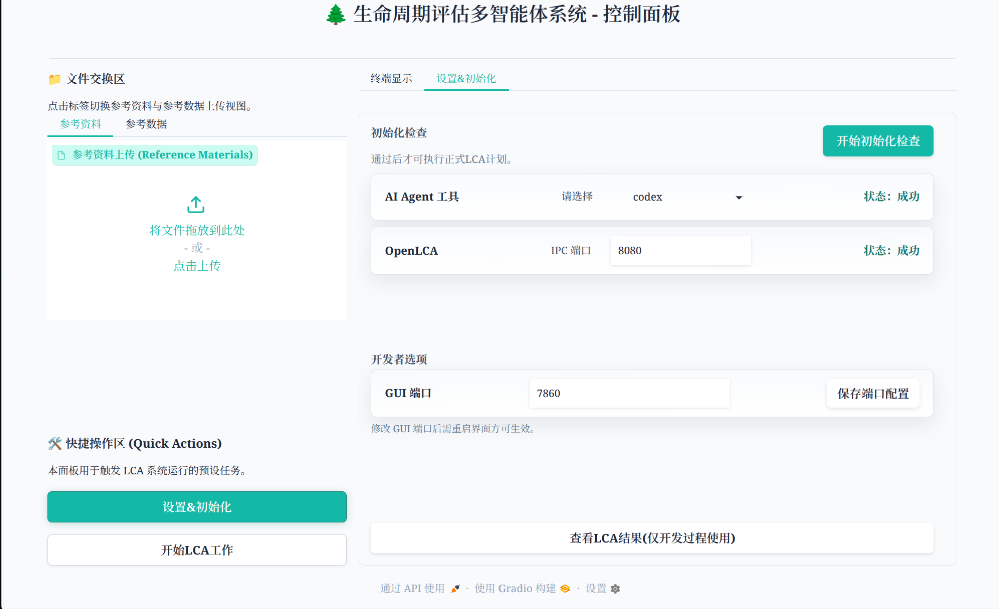
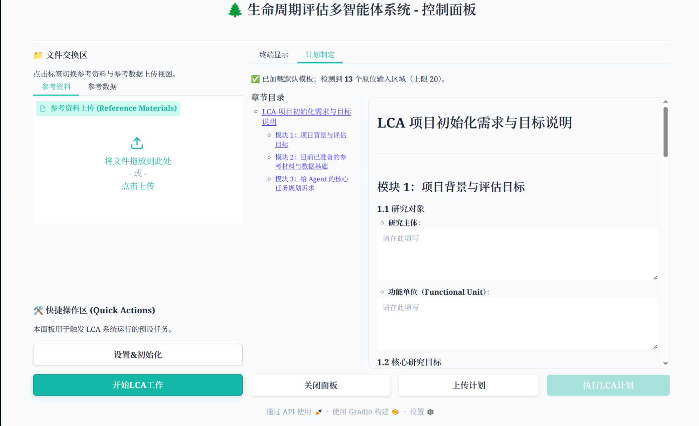

# Harness-driven LCA agents project

这是一个使用多智能体（Multi-agent）在 harness 框架下进行合规化 **LCA（Life Cycle Assessment，生命周期评价）** 输出的项目。

## 前置要求

运行本仓库前请先安装：

1. **uv** - Python 包和项目管理工具（[下载&安装链接](https://docs.astral.sh/uv/getting-started/installation/)）
2. **Codex、Claude Code、OpenCode、DSH 等 agent 工具**
3. **[openLCA](https://www.openlca.org/download/)** 桌面客户端。**每次开始项目前**必须打开 openLCA、打开目标数据库，并启用 IPC Server（默认 `127.0.0.1:8080`），否则后续导入与计算无法进行。

## 环境配置

克隆仓库后，在项目根目录执行：

```bash
uv sync
```

该命令会安装 Python 依赖并创建虚拟环境。

---

## 启动控制面板 GUI (推荐)

项目已提供 **Gradio Web 控制面板**（位于 [src/GUI](src/GUI)），支持可视化所有工作内容。

### 启动方式 (通用)

在项目根目录下，于终端执行以下命令：
```bash
uv run python src/GUI/main.py
```

浏览器访问 [http://127.0.0.1:7860](http://127.0.0.1:7860)。默认端口 `7860` 可在 `.env` 的 `GUI_PORT` 修改。

### 1. 设置并完成初始化检查

左侧点 **设置&初始化**，再点 **开始初始化检查**。两项全部通过后才会解锁 **执行LCA计划**。未通过时按失败项处理，然后重新检查：

| 检查项 | 处理 |
| --- | --- |
| AI Agent 工具 | 点 Agent 名称打开下方配置抽屉，填写该 worker 参数后「保存配置」。再点「开始初始化检查」会对所选 worker 发一条短 ping；失败时看 SDK、凭据或模型配置。 |
| OpenLCA | 打开目标数据库并启用 IPC Server。截图见 [环境准备与配置](docs/lang_CN/env_setup.md)。 |




### 2. 编写或传入计划并执行

1. 左侧点 **开始LCA工作**，打开计划模板。
2. 直接填写输入区，或点 **上传计划** 传入已有 `.md`。
3. 初始化检查已通过、计划非空后，点 **执行LCA计划**。
4. 完成后在 **LCA评估结果** 查看报告。



---

## 无 GUI：在 AI Agent 中直接运行主编排

不使用 GUI 时，先 `clean_dir` 并放入计划与资料（见 `src/scripts/clean_dir/README.md`），再在仓库根目录用 CLI 运行 Python 主编排。不要在 IDE 里用 slash/skill 当启动器。Cursor 不当操作员。

```bash
uv run python src/scripts/lca_orchestrator/main.py --task whole-lca --worker opencode
uv run python src/scripts/lca_orchestrator/main.py --task revise-lca --worker dsh
```

`--worker` 为 `opencode` / `claude` / `codex` / `dsh` / `antigravity`。DSH worker 需要 `DSH_PERMISSION_MODE=danger-full-access`。
