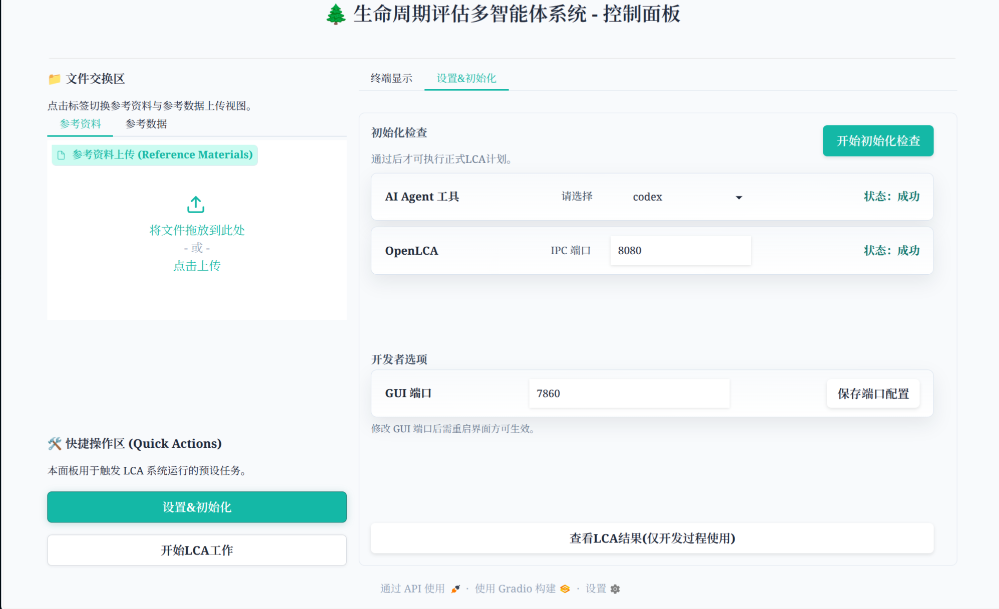
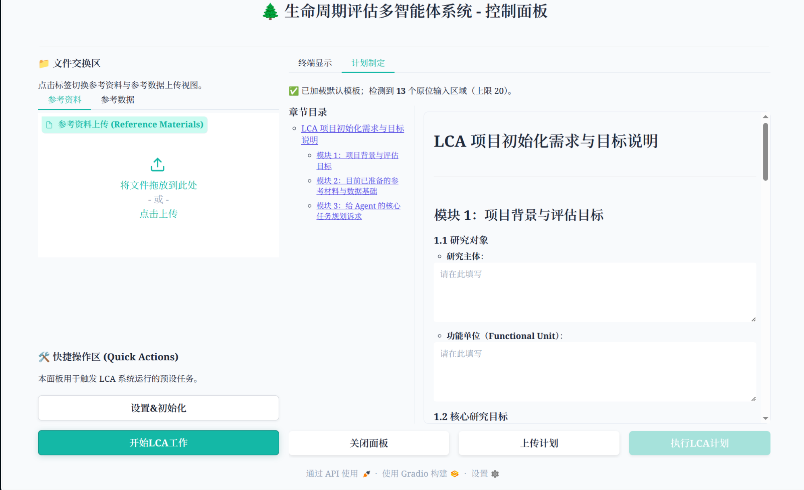

# Harness-driven LCA agents project

这是一个使用多智能体（Multi-agent）在 harness 框架下进行合规化 **LCA（Life Cycle Assessment，生命周期评价）** 输出的项目。

## 前置要求

运行本仓库前请先安装：

1. **uv** - Python 包和项目管理工具（[下载&安装链接](https://docs.astral.sh/uv/getting-started/installation/)）
2. **Node.js 22+**（自带 npm；Pi SDK 运行时与 Next.js GUI）。模型凭证与档案在 Web 设置页或 `.local/credentials/` 配置，不再依赖全局 `codex` / `claude` / `opencode` / `pi` CLI。
3. **[openLCA](https://www.openlca.org/download/)** 桌面客户端。**每次开始项目前**必须打开 openLCA、打开目标数据库，并启用 IPC Server（默认 `127.0.0.1:8080`），否则后续导入与计算无法进行。

## 环境配置

首次运行前，在所用 AI 工具中打开本仓库，输入：

```text
读取并执行 `src/scripts/proj_init/PROMPT.md`
```

或直接：

```bash
uv sync
uv run python src/scripts/proj_init/main.py
```

Agent 会检查 uv、项目依赖、`.env`（缺失则从 `.env.example` 复制）、`control_openlca` MCP，以及 Pi SDK runtime（Node + pi-runtime）是否就绪。没有 uv 时判定不通过，需按 [环境准备与配置](docs/lang_CN/env_setup.md) 手动安装。不要在引导里启动 whole-lca。`.env` 里的 `PI_MODEL` 与 BYOK 凭证说明见 `.env.example` / Web 设置页。

---

## 启动控制面板 GUI (推荐)

项目提供 **Next.js + FastAPI** 控制面板（`src/frontend/web` + `src/backend/api`），由 Python 编排器监管 **Pi SDK** Node 运行时（`src/pi_agents/pi-runtime`）。

```bash
uv sync
npm install
npm run build -w @harness/pi-runtime
npm run dev
```

浏览器访问 [http://127.0.0.1:3000](http://127.0.0.1:3000)。业务 API 在 `127.0.0.1:8000`。

### 1. 设置并完成初始化检查

打开 **设置与初始化**：

| 检查项 | 处理 |
| --- | --- |
| Pi SDK + 模型 | 选择 `model_profiles.json` 中的模型档案并保存（写入 `.env` 的 `PI_MODEL`）。为对应 Provider 填写自有 API Key（BYOK，写入 `.local/credentials/`，不回显）。点「测试连接」经 Pi `ModelRuntime` 验证凭证与模型，不开启业务对话。环境诊断确认 Node / pi-runtime / Python 就绪。 |
| OpenLCA | 打开目标数据库并启用 IPC Server。截图见 [环境准备与配置](docs/lang_CN/env_setup.md)。 |




### 2. 编写或传入计划并执行

1. 左侧点 **开始LCA工作**，打开计划模板。
2. 直接填写输入区，或点 **上传计划** 传入已有 `.md`。
3. 初始化检查已通过、计划非空后，点 **执行LCA计划**。
4. 完成后在 **LCA评估结果** 查看报告。



---

## 用 Python 主编排器运行

不使用 GUI 时，在项目根目录执行。不要把 IDE 会话当成主编排。

### whole-lca

1. 已完成上方环境引导。
2. 手动清理：

```bash
uv run python src/scripts/clean.py -y --preset whole-lca
```

3. 复制参考资料到 `harness/knowledge/inputs/`，编写 `harness/knowledge/plan/main_plan.md`。
4. 启动：

```bash
uv run python src/scripts/workflow.py --workflow harness/LCA-main.yaml
```

Worker 固定为 Pi SDK（`--worker pi`）。模型档案 id 读 `.env` 的 `PI_MODEL`（见 `src/shared/config/model_profiles.json`）；API Key 走 `.local/credentials/pi-auth.json`（BYOK）。恢复已有运行：`--resume <run_id>`（不执行新运行清理）。

### revise-lca

1. 已完成上方环境引导。
2. 手动清理（不清理 workspace）：

```bash
uv run python src/scripts/clean.py -y --preset revise-lca
```

3. 更新 `harness/knowledge/inputs/` 与 `harness/knowledge/plan/revise_plan.md`（保留既有 main_plan / manifest / 报告）。
4. 启动：

```bash
uv run python src/scripts/workflow.py --workflow harness/LCA-revise.yaml
```

revise 走同一套 01–04：01 审查修订门禁，02–04 由 `reviser` 在既有产物上落实 `revise.md`，再由 reviewer 审核（用户意图优先）。

`clean` CLI 见 `src/scripts/clean.py`。Web 控制面板见上文 `npm run dev`。
