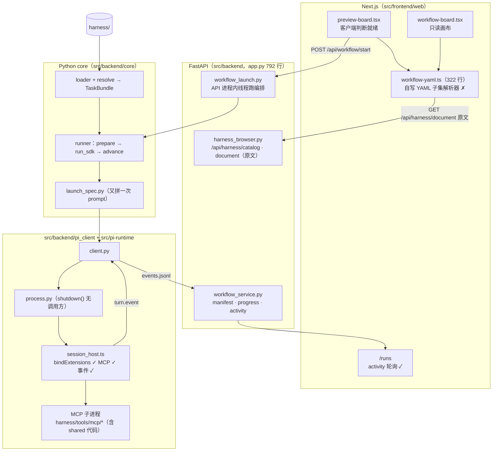
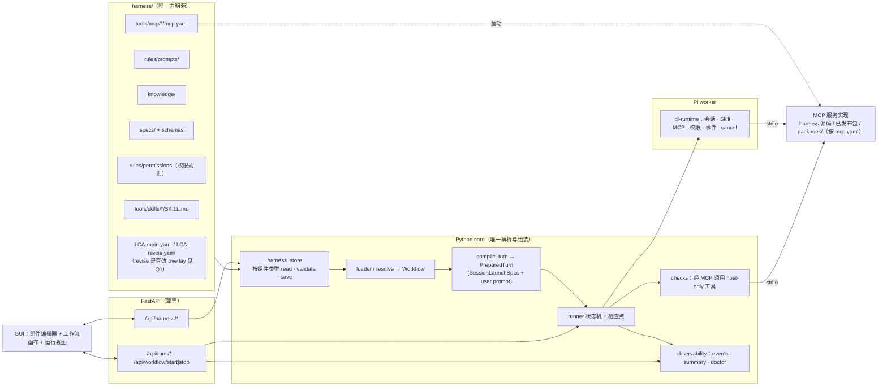
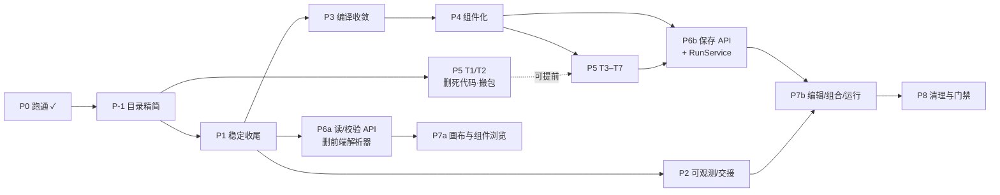

# 202606-harness-agent-LCA 重构方案（v4）

- 编写：Grok Bot，2026-10-09 23:15（UTC+8）
- 依据：`yuandu-LabPC-Linux` 上 `/home/yuandu/Programming/202606-harness-agent-LCA` 的当前工作区（今晚的改动已提交为 6 个本地提交，顶端 `2e42ba4`）、`docs/ISSUES.md`（23:13 版），以及 `.local/runs/3dfd5066…` 的运行记录。本次只读：没有改动任何文件，没有执行任何 git 命令，也没有重启服务。行号以当前工作区为准。
- 基线：今晚的修复已由团队提交为 6 个本地提交（顶端 `2e42ba4`）。
- **路径约定**：本文所有路径都按 **P-1 目录精简之后**的新结构书写：`core/…` 指 `src/backend/core/…`，`pi_client/…` 指 `src/backend/pi_client/…`，`pi-runtime/…` 指 `src/pi-runtime/…`。行号仍指搬家前的文件；搬家只移动文件、不改内容，行号保持不变。
- 历史版本：v3 备份在 `/workspace/lca-refactor-plan.v3.bak.md`，v2 备份在 `/workspace/lca-refactor-plan.v2.bak.md`。

**v4 相对 v3 的变化**
1. 第一节改为“指导原则”，写的是 Du Yuan 的架构思想，后面每个阶段都对照这条原则。
2. 主链路已经跑通：运行 `3dfd5066…` 于 22:14–22:38（UTC+8）通过全部 4 个阶段，P0 标为完成，每一项都附了出处。已经修好的问题从问题清单里删掉了。
3. `docs/ISSUES.md` 里还没修的问题（#13–#18、#22、F1–F6）都归入了阶段。#22 的根因在这次排查中找到了（§3.1）。
4. 已决定的事项写进正文：Q11–Q16，以及已实施或按原则直接定下的旧 Q1、Q2、Q5、Q8、Q9（旧 Q10 已过时，删除）。§10.2 只保留真正还没定的问题（23:27 再次收敛后重新编号为 Q1–Q6）。
5. 原来的 GUI 阶段拆成两个阶段：**P6 Harness 组件 API**（后端，Python core 是唯一真相源）和 **P7 GUI 组件编辑与组合**。前端自己的 YAML 解析器在 P6 第一步就删除。
6. 阶段重新编号为 P1–P8，每个阶段都写明范围、风险和验证方法。
7. **新增 P-1 目录精简，作为第一个阶段**（Du Yuan 已批准）：删除 `src/shared`，`src/backend` 成为唯一的 Python 包，Node runtime 移到 `src/pi-runtime/`。只搬家，不改逻辑。全文路径已按新结构改写。
8. **Du Yuan 23:27 的决定**（见 §10.1）：分工模型暂时只用 GUI 提供的值；服务暂用 setsid 常驻，不做 systemd；组件采用“默认版本（git）/ 用户版本（`harness/.user/`，不进 git）”（§8.5）。待决问题重新编号为 Q1–Q6。
9. **Du Yuan 23:33 的决定**：**不用 mock**，`npm run dev` 默认使用真实模型（接受费用），mock 只作为测试显式开启的基础设施；原定的“MCP 代码放 `packages/lca-tools`”改为**待定**（Q7），§6 改写为 MCP 三种来源类型并存，每个服务都由必需的 `mcp.yaml` 声明。
10. **Du Yuan 23:36 的决定**：`harness/rules/` 拆成 `prompts/` 和 `permissions/`。新增 §7（现状核查，列出所有引用、权限规则格式、YAML 引用方式、core 解析与 Pi 侧拦截、GUI 勾选清单、风险）；原 §7–§10 顺延为 §8–§11；目录搬迁并入 P-1，P4 改写为按权限规则落地；`mcp.yaml` 取消 `role_exposure`；原 Q2“权限执行强度”关闭，待决问题重新编号为 Q1–Q6（`lca_tools` 位置现为 Q6）。

---

## 0. 分支台账（每次新开分支或合并都要更新）

都是本地分支，没有 push。2026-10-10 11:5x（UTC+8），下面这一串已经按顺序快进合进 `master`。

| 分支 | 基于 | 最新提交 | 验证情况 | 合并 |
|---|---|---|---|---|
| `refactor/p-1-layout` | `master` | `bdd2dac` | 真实运行 | 已合并进 `master` |
| `refactor/p1-stabilize` | `p-1-layout` | `3ec2824` | 真实运行通过 | 已合并进 `master` |
| `refactor/p1-single-runtime` | `p1-stabilize` | `751f235` | 真实运行时始终只有一个 pi-runtime | 已合并进 `master` |
| `refactor/p4-path-whitelist` | `p1-single-runtime` | `e244d48` | 真实运行，白名单没有造成卡顿 | 已合并进 `master` |
| `refactor/upstream-rework` | `p4-path-whitelist` | 见 `master` 最新提交 | 运行 `d18bc463` 四个阶段全部通过；04→03 的退回上游在真实运行中自然触发并走通 | 已合并进 `master` |
| `refactor/p5-inject-specs` | `p4-path-whitelist` | `bb1604b` | 早先“把 spec 全文注入提示词”的方案，和 P5 的 `spec_mcp` 设计冲突 | **废弃，不合并**；其中 `contract_files.py` 的文件清单逻辑可参考 |
| `refactor/p5-spec-channels` | `master`（`ee78fc0`） | `5e7a092`（代码）+ 文档提交 | 自动测试：Python 448、pi-runtime 37 全过，`npm run -s build` 通过；**还没在真实 LCA 里跑过** | 未合并；下一步真实运行 + 带 `HARNESS_FAULT_INJECT=lci_unit_missing` 的回归 |
| `refactor/p5-injection` | `refactor/p5-spec-channels`（`2313c1d`） | `c08256b` | 自动测试：Python、pi-runtime 全过，`npm run -s build` 通过；`npm run doctor` 通过（模板渲染、注入自检 level=ok）；**还没在真实 LCA 里跑过** | 已于 2026-10-10 快进合入 `refactor/p5-spec-channels`（`2313c1d..c08256b`）；已带 `HARNESS_FAULT_INJECT=lci_unit_missing` 重启，待回归 |
| `refactor/p5-small-fixes` | `refactor/p5-spec-channels`（`29e772b`） | `f2ae7b1` | `inspect`/`session` 支持短 run id；SSE 每条事件独立 id；自动测试全过 | 未合并（与主仓库未提交的“停止工作流”改动在 `app.py`、`workflow_launch.py`、`runs/page.tsx` 有重叠，待 Du Yuan 提交后再合） |
| `refactor/p5-openlca-timeouts` | `refactor/p5-small-fixes`（`f2ae7b1`） | `a2e1a26` + 文档提交 | openLCA IPC 按请求读超时、超时后 `openlca_unresponsive` 事件与诊断、预清理同步超时；**已去掉 product system 读超时自动重试**（超时立即失败）；自动测试 Python 486、pi-runtime 41 全过，前端 build 通过；未连真实 openLCA 验证 | 未合并，原因同上 |

待办：带 `HARNESS_FAULT_INJECT=lci_unit_missing` 的回归，留到 P5 改完后一起跑。

## 0. 指导原则（Du Yuan 的架构思想）

> **所有规则、工具（只有 Skill 和 MCP）和知识都放在 harness 里，把它们拼起来就是一条工作流。Python core 负责组装工作流要素，把它们注入 Pi agent，让 agent 多步交接、产出结果。GUI 负责展示当前的工作流 YAML 和 harness 里已有的组件，让用户编辑、组合这些组件，并把修改保存回组件本身。GUI 调用 FastAPI，FastAPI 再调用 core 的工作流函数完成校验、注入和运行。**

由此得出 7 条硬约束，后面的每个阶段都以此检验：

| # | 约束 | 推论 |
| --- | --- | --- |
| G1 | **harness 是唯一的声明源** | 工作流拓扑、角色、规则、知识、Skill、MCP 清单、阶段契约、权限规则都写在 `harness/` 下（每个分工用哪个模型暂时由 GUI 设置，见 §10.1）；`src/` 不写任何领域内容 |
| G2 | **`harness/tools` 只有 Skill 和 MCP** | 每个 MCP 服务都由 `mcp.yaml` 声明，来源可以是 harness 内源码、已发布的包或 `packages/` 下的本地包（§6.3）；源码型服务必须自包含、不 import `backend`；没有游离的 shared 代码；验收检查也是 MCP 工具 |
| G3 | **Python core 是唯一的解析器和组装器** | `loader → resolve → compile_turn → SessionLaunchSpec`，全项目只有这一条路径；其他层（后端、GUI、Node）只消费它的输出 |
| G4 | **Pi agent 只是被注入的执行体** | Node pi-runtime 照 spec 创建会话、加载 Skill 和 MCP、执行权限、回传事件；它不读 harness，也不做业务判断 |
| G5 | **FastAPI 只是 core 的薄壳** | 路由只做 HTTP 适配，读、校验、保存、就绪判断、运行全部调用 core 的函数；后端不自己解析 YAML，也不自己拼路径 |
| G6 | **GUI 是组件编辑器加运行视图** | 展示和编辑都基于 API 返回的结构化数据；保存时写入该组件的用户版本（`harness/.user/`，§8.5）；不解析 YAML，不判断能否运行 |
| G7 | **每次运行可追溯** | 运行所用的组件内容哈希（并注明用的是默认版本还是用户版本）、模型、环境都进入运行指纹和 `.local/runs/<run_id>/`；GUI 改了组件之后，旧运行仍能解释清楚 |

---

## 1. 现状（2026-10-09 23:15 UTC+8）

### 1.1 主链路已跑通（P0 完成）

运行 `3dfd506641264e2eaf38a9a72a734be2`，22:14:47–22:38:40（UTC+8）：01 → 04 共 4 个阶段全部通过。`.local/runs/3dfd5066…/events.jsonl` 共 891 条事件：380 次工具调用、380 次工具结果、122 段正文、9 次 turn 结束，涉及 7 个 assignment。

今晚修好的问题（编号对应 `docs/ISSUES.md`；已作为 6 个本地提交提交，顶端 `2e42ba4`）：

| 修复 | 出处 | 原方案编号 |
| --- | --- | --- |
| launch spec 经 `SessionConfig.launch_spec` 显式传入，不再走 attach 旁路 | ISSUES #2；`pi_client/client.py:34` | A2、A3 |
| 会话写入 spec 指定的 `session_file`，并复用 live session | ISSUES #4；`session_host.ts:233` | A5、A6 |
| 补上 `session.bindExtensions()`；之前 MCP 扩展收不到 `session_start`，一个服务都没启动，工具静默缺失 | ISSUES #10；`session_host.ts:239` | §5.2（v2） |
| `createMcpExtension({ loadConfig })` 按会话读取本会话的 `mcp.json` | ISSUES #7；`session_host.ts:78,216-217` | §5.2 |
| 工具白名单改为 `mcp__<server>__*` | ISSUES #8；`core/agents/permissions.py:22-28` | §5.2 |
| MCP 超时单位溢出：写进 `mcp.json` 的是毫秒，Pi 又按秒乘 1000，溢出后变成 1 ms，`control_openlca` 一初始化就超时；现在改写秒 | ISSUES #19；`session_host.ts`；SDK `extensions/mcp/runtime.js:159-160` | 新 |
| 会话启动时最多等 90 秒，确认每个 MCP 服务都已注册工具，否则报“MCP 服务未就绪”；该错误不重试 | ISSUES #20、#21；`session_host.ts:158,179` | 新 |
| 重试分类：只重试网络、超时、429、5xx | ISSUES #5；`pi_client/process.py:28-38` | A7 |
| reviewer 用 `lca_artifacts.submit_handoff` 交卷 | ISSUES #3；两份 YAML | C1 |
| 返工和运行协议提示改为“调用 `submit_handoff`” | ISSUES #9；`prompt_build.py`、`handoff.py`、`runner.py` | §5.2 |
| 日志：pi-runtime stderr 写到 `.local/logs/pi-runtime.log`，后端日志写到 `.local/logs/backend.log` | ISSUES #11、#12；`process.py:77-83` | A8、L3、L5 |
| 运行事件写到 `.local/runs/<run_id>/events.jsonl`（不会被预清理删掉） | `core/agents/activity.py:3,15`；`pi_client/client.py:111`；`pi-runtime/src/activity.ts:123` | O1（部分） |
| 工具调用实时显示在 `/runs`：`/api/workflow/activity` 轮询 | ISSUES F5；`backend/api/app.py:578,587`；`components/runs/activity-summary.tsx` | A9、L1 |
| 删除关闭 TLS 校验的两行 | ISSUES #6；`executor_console.py` | D4 |
| `run_sdk` 中 `assignment` 先用后赋值 | ISSUES #1，已提交 | A1 |

### 1.2 现状调用链（v4）



和指导原则仍不符的地方：GUI 自己解析 YAML（违反 G3、G6）；后端只提供原文浏览，没有结构化的读、校验、保存接口（违反 G5、G6）；`harness/tools` 里有 5000+ 行代码（违反 G2）；角色权限写死在 Python 里（违反 G1）；prompt 构建了两次（违反 G3）。

---

## 2. 目标架构

### 2.1 结构图



### 2.2 关键对象

```text
Workflow（loader 产物，GUI 的画布就是它的 JSON 投影）
  stages[] → assignments[] → {role, rules{prompts[], permissions[]}, knowledge[], skills[], mcp[]}
  registry: rules{prompts, permissions} · knowledge · skills · mcp · checks
  （每个分工的模型不在 Workflow 里，而是取 GUI 设置的值，由 compile_turn 解析）

PreparedTurn（compile_turn 产物，每轮只算一次，存进检查点）
  ├─ launch: SessionLaunchSpec        # 唯一跨语言契约
  │    ├─ session_key / session_storage
  │    ├─ model_profile               # 已解析
  │    ├─ system_sections             # 规则 + 运行协议 + 阶段契约（稳定部分）
  │    ├─ mcp_bindings                # 精确工具名
  │    ├─ skill_bindings              # 新增
  │    ├─ knowledge_bindings / permission_policy / handoff_binding
  └─ user_prompt                      # 本轮动态部分

ComponentRef（harness_store 的统一句柄，GUI 用它编辑任何组件）
  {kind, id, rel, status: default|modified|modified_stale|user_only, source, sha256, etag, referenced_by[]}
```

---
## 3. 剩余问题清单（附证据）

严重度：**S1** 影响运行或会留下残留，**S2** 一定会造成错误行为或难以排查，**S3** 维护负担或违反原则。已修的问题见 §1.1，这里不再列出。

### 3.1 运行时与进程

| # | 级别 | 问题 | 证据 | 阶段 |
| --- | --- | --- | --- | --- |
| R1 | S1 | **MCP 子进程泄漏（ISSUES #22）**，本次核查找到根因，共三层：① 编排器退出时没有关闭 pi-runtime，`PiRuntimeProcess.shutdown()` 在 `src/` 里没有任何调用方；② pi-runtime 读完 stdin 后不退出，`protocol.ts:26` 的 readline 没有处理 `close`；③ 很可能会话结束（`session.release` / `dispose`）也不会关闭该会话的 MCP 连接（待核实：6 个子进程挂在同一个 runtime 下，说明会话被释放后子进程仍在）。实机证据（约 23:10 UTC+8 核查）：编排器的 runtime PID 179507 已经被 `systemd --user` 收养，它名下还挂着 6 个 `workflow_mcp.py`（03、04 阶段的 context），运行结束 45 分钟后仍在 | `pi_client/process.py:170`；`pi-runtime/src/protocol.ts:26`；`session_host.ts:374,390,445`；`ps -o pid,ppid` | P1 |
| R2 | S2 | `session.cancel` 仍是空操作，没有停止运行的接口 | `session_host.ts:450-451`；后端没有 stop 路由 | P1（cancel）/ P6（stop API） |
| R3 | S2 | 编排在 API 进程的 daemon 线程里跑，API 重启会中断运行；后端和前端会随启动它们的 shell 一起退出，今晚是临时用 `setsid` 拉起的（ISSUES #15）。已定：暂时就用 `setsid`，不做 systemd 和实验室长期托管 | `backend/services/workflow_launch.py:65-68` | P1（把 setsid 固化进脚本）/ P6（编排独立进程组） |
| R4 | S2 | `npm run dev` 默认是 mock（`dev.mjs:132` 的 `PI_RUNTIME_MOCK=1`，ISSUES #14）。**已定（23:33）：不用 mock，默认使用真实模型**；mock 只给测试显式开启 | `dev.mjs:132` | P1 |
| R5 | S2 | 沙箱路径 `UV_CACHE_DIR=/tmp/cursor-sandbox-cache/...` 会漏进 worker 的 `mcp.json`，环境变量是整体继承的（ISSUES #16） | `core/agents/uv_env.py` | P1 |
| R6 | S3 | 运行时入口优先用 `dist/main.js`，改了 `src/*.ts` 而没有 build 时，跑的是旧代码 | `pi_client/process.py:71,92` | P2（doctor 检查） |
| R7 | S3 | 新建会话失败时，日志也打印“worker resume failed”，会误导排查 | `runner.py:334` | P3 |

### 3.2 组装重复（违反 G3）

| # | 级别 | 问题 | 证据 | 阶段 |
| --- | --- | --- | --- | --- |
| B1 | S2 | **同一份 prompt 既作为 system 又作为 user 发送，token 翻倍**（ISSUES #17）：`runner.py:233` 的 `assemble_prompt` 生成用户消息，`launch_spec.py:126` 的 `build_prompt` 又把同样内容放进 `system_sections` | 见左 | P3 |
| B2 | S2 | run context 在 prepare 和 run_sdk 各建一次，handoff 路径有 3 种表示 | `runner.py:210-287`；`handoff.py:34-37`；`tool_runtime.py:60-70`；`launch_spec.py:158-160` | P3 |
| B3 | S3 | `SessionConfig` 留有 CLI 时代的字段；`client.py:27` 的 `attach_launch_spec` 已经没人用 | `contracts/session.py`；`pi_client/client.py:25-28` | P3 |
| B4 | S3 | 契约有 3 份定义（Python dataclass、JSON Schema、TS interface），靠手工同步 | `contracts/session_launch_spec.py`；`core/contracts/session_launch_spec.schema.json`；`pi-runtime/src/types.ts` | P3 |
| B5 | S3 | MCP 超时在契约里以 `timeout_ms = 秒 × 1000` 传递，在 Node 端再换算回秒。这正是 #19 的成因；现在 Node 端已修，但契约字段仍然容易误用 | `launch_spec.py:155` | P3（契约统一用 `timeout_sec`） |

### 3.3 Harness 组件（违反 G1、G2）

| # | 级别 | 问题 | 证据 | 阶段 |
| --- | --- | --- | --- | --- |
| C1 | S2 | 角色权限写死在 Python：`role == "reviewer"` | `launch_spec.py:63,82` | P4（由 `rules/permissions/` 取代，§7） |
| C2 | S2 | 权限只写在 spec 里，没人执行：Node 端只用了 `allowed_tools`，globs 和 `deny_shell` 都没用到 | `session_host.ts`；`permissions.py` | P4（`permission_guard` extension，§7.4） |
| C3 | S2 | 规则与权限矛盾：`reviewer-readonly.md` 允许 reviewer 在 `workspace/tmp/` 做复算，但 reviewer 没有 bash 和 write | `rules/project/reviewer-readonly.md:4` | P4（§7.6） |
| C4 | S2 | 分工模型（GUI 写入 `.local/workflow-models.json`，目前它是唯一来源，已定）不在运行指纹里；`IMPLEMENTATION_ROOTS` 不含 `src/backend/pi_client` 和 `src/pi-runtime/src` | `persistence/config_fingerprint.py:23-27` | P4 |
| C5 | S3 | 模型配置分散在 4 处（`.env`、`src/backend/core/runtime/model_profiles.json`、`.local/model_profiles.json`、`.local/workflow-models.json`）；编排页显示的模型与实际生效的不一致（ISSUES F3）。来源收敛属于后续的“分工模型配置”专门功能（§10.3），当前阶段只修 F3 的显示 | `runtime/model_profiles.py`；`agents/assignment_models.py` | P7（F3）/ 后续 |
| C6 | S3 | main 和 revise 两份 YAML 约 95% 相同 | `diff harness/LCA-main.yaml harness/LCA-revise.yaml` | P4（看 Q1） |
| C7 | S3 | `harness/tools` 里有 39 个文件、7262 行，其中 5324 行是 shared 代码；宿主 `services/diagnostics.py:8` 和 `services/workspace_clean.py:9`（P-1 前在 `src/shared/`）直接 import 它 | §6.1 | P5 |
| C8 | S3 | `harness/knowledge/水瓶案例学习.md` 与 `inputs/` 下的同名文件重复 | 文件清单 | P5 |

### 3.4 后端与 GUI（违反 G5、G6）

| # | 级别 | 问题 | 证据 | 阶段 |
| --- | --- | --- | --- | --- |
| E1 | S2 | **GUI 自带 322 行 YAML 子集解析器**，与 Python loader 的语义是两套（patch、工具附带规则、去重都可能不同） | `components/plan/workflow-yaml.ts`；`workflow-board.tsx:11,199`；`preview-board.tsx:6,145` | P6 |
| E2 | S2 | 后端只提供 harness 原文浏览（`/api/harness/catalog`、`/document`），没有结构化的读、校验、保存接口；画布做成了“可编辑”的样子，实际不能保存 | `backend/services/harness_browser.py`；`app.py:672-684` | P6 + P7 |
| E3 | S2 | 能否运行只在浏览器里判断，`/api/workflow/start` 直接开跑 | `preview-board.tsx`；`app.py:630` | P6 |
| E4 | S3 | 任务和 YAML 的对应关系写在 3 处 | `workflow_cli.py:12-15`；`executor_console.py`；`preview-board.tsx` 的 `MODE_FILE` | P6 |
| E5 | S3 | 准备阶段的输出被丢弃；Gradio 时代的接口（`run_pre_workflow_console`、`file_sync` 空操作）；`/api/events` 和 `push_event` 没有调用方；`app.py` 有 792 行 | `workflow_launch.py`；`executor_console.py`；`app.py:649-670` | P6 |
| E6 | S2 | 后端挂了时，页面显示 `Unexpected token 'I'... is not valid JSON`（ISSUES F1） | 前端各处 `fetch().json()` | P1 |
| E7 | S2 | 后端重启后，计划和参考资料丢失（ISSUES F2）；计划表单不自动保存 | `/api/plan`；`workflow_launch.py` | P7 |
| E8 | S2 | 运行失败后预览页没有提示（F4）；失败原因整段原文铺在页面上（F6） | `/runs`、预览页 | P2（诊断卡）+ P7 |
| E9 | S3 | 结果页是占位页 | `app/results/page.tsx` | P7 |

### 3.5 可观测与测试

| # | 级别 | 问题 | 阶段 |
| --- | --- | --- | --- |
| O-a | S2 | `events.jsonl` 里只有 Pi 侧事件（text、tool_call、tool_result、turn_end），编排器侧的阶段切换、handoff 校验、检查、重试都不在里面；没有错误码、`summary`、`LAST_FAILURE` 和保留策略 | P2 |
| O-b | S2 | whole-lca 预清理会删除 `workspace/records/**`，上一轮的检查点、handoff、reviews 全部丢失（ISSUES #13）；事件现在在 `.local/runs` 里，但这些产物没有 | P2 |
| O-c | S2 | 没有 doctor；MCP 是否就绪、工具是否可见、有没有进程残留，只能人工查 | P2 |
| T-a | S2 | 没有测试走“runner → 真实 client → runtime（真会话 + 脚本化假模型）”这条链路；今晚的 #10、#19 都是实跑才发现的 | P2 |
| T-b | S3 | `test_plan_form` 失败（ISSUES #18） | P1 |
| T-c | S3 | 契约三方一致性、前后端图一致性都没有测试（后者在 P6 删掉前端解析器后自然消失） | P3 |
| T-d | S3 | 提交前不跑测试 | P8 |

---
## 4. 分阶段实施

每个阶段单独成 PR，可以单独回滚。**P0 已完成**（§1.1）。**P-1 目录精简排在最前面**（Du Yuan 已批准），后面的阶段都基于新目录结构。

### 阶段总览与依赖

| 阶段 | 名称 | 对应原则 | 依赖 |
| --- | --- | --- | --- |
| P-1 | 目录精简：删除 `src/shared`，`src/backend` 成为唯一的 Python 包（只搬家） | G3、G5 | P0 |
| P1 | 稳定收尾：进程、启动、环境 | G4、G7 | P-1 |
| P2 | 可观测、排错与交接 | G7 | P1 |
| P3 | 编译收敛：`PreparedTurn` 唯一构建 | G3 | P1（可与 P2 并行） |
| P4 | Harness 组件化：权限规则（§7）、模型 | G1 | P3 |
| P5 | 工具区收敛：只剩 Skill 和 MCP | G1、G2 | T1/T2 随时可做；T5/T6 依赖 P3、P4 |
| P6 | Harness 组件 API 与运行服务（后端） | G3、G5 | P6a 在 P1 后即可开始；P6b 依赖 P4、P5 |
| P7 | GUI：组件编辑、组合与运行视图 | G6 | P6 对应的接口 |
| P8 | 清理、文档与门禁 | 全部 | — |



P2 和 P3 可以由代码编写专家分两个分支并行做。P6a 只读不写，越早做，前端那套 YAML 解析器就越早退出。

### P-1 目录精简（第一个阶段；Du Yuan 已批准：只搬家，不改逻辑）

**目标**：删除 `src/shared`。`src/backend/` 成为唯一的 Python 包；Node 版 Pi runtime 独立放在 `src/pi-runtime/`；删除只剩缓存的遗留目录。做完以后，后面所有阶段都使用新路径（本文 §1–§11 已经按新路径改写；行号仍指搬家前的文件，因为内容不变，行号也不变）。

**基线**：团队已把今晚的修复提交为 6 个本地提交，顶端是 `2e42ba4`。P-1 在它之上单独开分支，做成一个提交（或者“搬家”和“改 import”两个提交，方便 review）。

#### 搬家对照表

| 现在 | 搬到 | 说明 |
| --- | --- | --- |
| `src/backend/api/` | `src/backend/api/`（不动） | import 由 `api.x` 改为 `backend.api.x` |
| `src/backend/services/*` | `src/backend/services/*`（不动） | import 由 `services.x` 改为 `backend.services.x` |
| `src/shared/diagnostics.py`（83 行） | `src/backend/services/diagnostics.py` | 和现有的 `diagnostics_service.py` 并存，P8 再考虑合并 |
| `src/shared/workspace_clean.py`（383 行） | `src/backend/services/workspace_clean.py` | |
| `src/shared/core/{workflow,runtime,agents,contracts}/`（58 个 .py） | `src/backend/core/{workflow,runtime,agents,contracts}/` | `core.x` 改为 `backend.core.x` |
| `src/shared/core/__init__.py` | `src/backend/core/__init__.py` | |
| `src/shared/config/model_profiles.json` | `src/backend/core/runtime/model_profiles.json` | 和读取它的 `model_profiles.py` 放在一起；`DEFAULT_PROFILES_PATH`（`model_profiles.py:17`）跟着改 |
| `src/shared/contracts/session_launch_spec.schema.json` | `src/backend/core/contracts/session_launch_spec.schema.json` | 和 `session_launch_spec.py` 放在一起；schema 的 `$id` 和 `types.ts:1` 的注释跟着改 |
| `src/pi_agents/{__init__,client,process}.py` | `src/backend/pi_client/{__init__,client,process}.py` | `pi_agents.x` 改为 `backend.pi_client.x`；`README.md` 一并搬过去 |
| `src/pi_agents/pi-runtime/`（`src/`、`package.json`、`tsconfig.json`；`dist/` 重新 build） | `src/pi-runtime/` | npm 包名 `@harness/pi-runtime` 不变 |
| `src/shared/app_settings.py`（88）+ `src/shared/utils/{env.py 69, filesystem.py 288, workspace_layout.py 11}` | `src/backend/settings.py`（约 450 行，按原文件分节合并） | `app_settings` 和 `utils.{env,filesystem,workspace_layout}` 都改为 `backend.settings` |
| （新建） | `src/backend/__init__.py` | 让 `backend` 成为普通包 |
| `src/shared/README.md`、`src/backend/README.md` | 合并成 `src/backend/README.md` | |
| `src/core/`、`src/utils/`、`src/__pycache__/` | **删除** | 已核实只有 `__pycache__` |
| `src/gui/` | **删除** | 只剩 `log/gui.pid` |
| `src/scripts/*` | 不动 | 只改成调用 backend 的入口（见下文） |

搬完后的结构：

```text
src/
  backend/                 # 唯一的 Python 包
    __init__.py
    settings.py
    api/      app.py
    services/ …, diagnostics.py, workspace_clean.py
    core/     workflow/ runtime/ agents/ contracts/   （规则：不得 import api、services）
    pi_client/ client.py process.py
  pi-runtime/              # Node：Pi SDK 宿主
  frontend/web/
  scripts/                 # 薄入口
  tests/
```

#### 改 import（机械替换，脚本完成）

只读核查的结果如下：
- 有 77 个 .py 文件 import 了要搬的顶层模块（`core`、`utils`、`app_settings`、`pi_agents`、`services`、`api`、`diagnostics`、`workspace_clean`），共 297 行。其中 35 个是测试，42 个是非测试文件（core 内部互相引用占大头）。
- 另有 11 个文件中的 27 处**字符串形式**的模块路径（`mock.patch("core.…")`、`monkeypatch.setattr("services.…")` 等）。这些不在 import 语句里，**容易漏掉**，替换脚本必须一并处理。
- harness 下的 MCP 服务没有 import `core` 或 `utils`，不受影响。

替换规则：

| 旧 | 新 |
| --- | --- |
| `core.` | `backend.core.` |
| `services.` | `backend.services.` |
| `api.` | `backend.api.` |
| `pi_agents.` / `pi_agents` | `backend.pi_client.` / `backend.pi_client` |
| `utils.env`、`utils.filesystem`、`utils.workspace_layout`、`app_settings` | `backend.settings` |
| `import diagnostics` / `from diagnostics` | `backend.services.diagnostics` |
| `import workspace_clean` / `from workspace_clean` | `backend.services.workspace_clean` |

**唯一需要动一行代码的地方**：`app_settings.py:9` 在模块顶层 `from core.agents.providers.registry import WORKERS`。合并进 `settings.py` 后，会形成 `backend.core → backend.settings → backend.core` 的循环 import，因为 core 的 8 个文件会 import `settings`。修法：把这一行改为函数内的延迟 import（`HARNESS_AGENTS` 只被旧的 `HARNESS_AGENT` 兼容逻辑使用），行为不变。

#### 需要同步修改的路径引用（全量清单）

| 文件 | 位置 | 改成 |
| --- | --- | --- |
| `pyproject.toml` | `:27` `pythonpath = ["src/backend","src/shared","src","."]` | `["src", "."]` |
| `pyproject.toml` | `:48-56` isort `known-first-party` 里的 `api`、`core`、`pi_agents`、`services`、`utils` | `backend`、`harness`、`tests` |
| `pyproject.toml` | `:61-62` pyright 的 `include` 和 `extraPaths` | `["src/backend","harness"]`、`["src","."]` |
| `package.json` | `:5` workspaces 里的 `src/pi_agents/pi-runtime` | `src/pi-runtime`；然后执行 `npm install`，刷新 `package-lock.json` 和 `node_modules/@harness/pi-runtime` 链接 |
| `.gitignore` | `:51` `src/pi_agents/pi-runtime/dist/` | `src/pi-runtime/dist/` |
| `src/scripts/dev.mjs` | `:104-109` PYTHONPATH 拼接（含 `src/backend`、`src/shared`） | 只保留 `src` 和项目根 |
| `src/scripts/dev.mjs` | `:131` `uvicorn api.app:app --app-dir src/backend` | `uvicorn backend.api.app:app --app-dir src` |
| `src/scripts/start.mjs` | 只做环境探测，不含 Python 路径 | 不改（核实无引用） |
| `src/scripts/workflow.py:17`、`clean.py:14`、`check_status.py:17`、`proj_init/main.py:23` | `sys.path` 插入 `src/backend`、`src/shared` | 只插入 `src` 和项目根；改为调用 `backend.core.workflow.main:main`、`backend.services.workspace_clean:cli_main`、`backend.services.diagnostics` |
| `src/scripts/check_status.py:21-29` | `from diagnostics`、`from workspace_clean`、`from app_settings` | `backend.services.*`、`backend.settings` |
| `src/backend/services/workflow_cli.py:9`、`executor_console.py:175` | `src/scripts/workflow.py` | 不变（脚本位置不变） |
| `src/backend/pi_client/process.py`（原 `pi_agents/process.py:93`） | `project_root/"src"/"pi_agents"/"pi-runtime"` | `project_root/"src"/"pi-runtime"` |
| `src/backend/core/agents/inspect.py:24,66` | 同上 | 同上 |
| `src/backend/core/runtime/model_profiles.py:3,17` | `src/shared/config/model_profiles.json` | `src/backend/core/runtime/model_profiles.json` |
| `src/backend/core/workflow/persistence/config_fingerprint.py:24-25` | `IMPLEMENTATION_ROOTS` 里的 `src/shared/core`、`src/shared/utils` | `src/backend/core`、`src/backend/settings.py`（指纹会变，旧检查点不能续跑，见风险） |
| `session_launch_spec.schema.json:3` `$id`；`src/pi-runtime/src/types.ts:1` 注释 | `src/shared/contracts/…` | 新路径 |
| `src/tests/conftest.py:11` | `SHARED_ROOT = src/shared` | 删除；改用 `BACKEND_ROOT` |
| `src/tests/t_core/test_architecture.py:23,49-51` | `CORE_ROOT`、子进程的 `PYTHONPATH` | `src/backend/core`、`src`；新增“core 不得 import api、services”的规则 |
| 其余引用路径字符串的测试 | `contracts/test_session_launch_spec.py`、`t_scripts/test_entrypoint_smoke.py`、`t_backend/test_workflow_models.py`、`orchestrator/test_platform_config.py`、`support/minimal_workflow.py`、`t_core/test_pi_runtime_protocol.py`、`orchestrator/test_runner.py`、`orchestrator/test_resume_fingerprint.py` | 新路径 |
| `AGENTS.md` | `:14,15,17,32,45,58` | 新路径；`:58` 的“编排逻辑放在 `src/shared`”改为“放在 `src/backend/core`，api、services 只做适配” |
| `src/README.md:24,27` | uvicorn 命令、PYTHONPATH 说明 | 新命令；PYTHONPATH 为 `src` |
| `src/scripts/README.md:9`、`src/scripts/proj_init/PROMPT.md:41,42,49` | 旧路径 | 新路径 |
| `docs/lang_CN/env_setup.md:13`、`platform-adapter.md:17,28,31`、`harness.md:22`、`docs/refactor/pi-unified-runtime.md:8,17,21,36` | 旧路径 | 新路径 |
| `docs/ISSUES.md` | “位置”列 | 新路径（只改路径，不改状态） |
| `harness/tools/**`（P5 之前） | 没有引用 `src/shared` | 不改 |

`diagnostics_service.py:87` 的 JSON 键 `"pi_agents"` 是 API 字段名，不是路径，P-1 不改（避免前端联动）；`harness_browser.py:23` 的 `"shared"` 是 harness/tools 的分区标签，也不改。

#### 同批进行：`harness/rules/` 拆成 `prompts/` 和 `permissions/`（Du Yuan 已批准，见 §7）

- **搬家**：`git mv harness/rules/{README.md→prompts/README.md, project, lca, tools, stages, assignments} harness/rules/prompts/`，文件内容不变；新建 `harness/rules/README.md`，总述两类规则；新建空目录 `harness/rules/permissions/`（放一个 `README.md`，写明格式，权限规则文件在 P4 落地）。
- **要改的引用**（全量清单见 §7.1）：
  - 两份工作流 YAML 的 50 条规则路径；
  - `harness/knowledge/README.md:8`、`harness/tools/mcp/control_openlca/README.md:17,23,145`；
  - `src/backend/services/harness_browser.py:9,26`；
  - 测试：`minimal_workflow.py`、`test_generic_runtime.py`、`test_platform_config.py`、`test_harness_browser.py`；
  - `docs/lang_CN/harness.md`。
- **这一步只改路径**：YAML 的 `registry.rules` 仍是扁平的“ID → 路径”结构，改成 `rules.prompts` / `rules.permissions` 结构属于逻辑改动，放到 P4。这样 P-1 仍然“只搬家，不改逻辑”。
- **验证**：在 P-1 的验证之外，再加 `rg -n "harness/rules/(project|lca|tools|stages|assignments)" harness src docs` 为空（`docs/dev/` 历史文档除外）；GUI 的 harness 浏览页能打开 `rules/prompts/**`。

**执行顺序（建议）**：
1. 用 `git mv` 搬家；
2. 运行替换脚本（import 和字符串模块路径都改）；
3. 手改路径清单里的配置和文档；
4. 改 `settings.py` 里那一行延迟 import；
5. `npm install`，再 `npm run build -w @harness/pi-runtime`；
6. 执行 `rg` 残留检查。

**风险**：中低。逻辑不变，但涉及面广。
- 漏改的字符串 patch 不一定会报错：它可能静默地 patch 到一个不存在的模块，测试照样通过。所以替换以后要用 `rg` 全量检查。
- 运行指纹的根目录变了，P-1 之前的检查点不能续跑。正在跑或需要续跑的运行，要在 P-1 之前跑完。
- 后端和 Node 的启动命令都变了，团队成员本地要重新执行 `npm install` 和 build。
- `backend` 这个名字在 `src` 下必须唯一（已核实，没有冲突）。

**验证**
- `rg -n 'src/shared|pi_agents|from (core|utils|services|api)\.|import (app_settings|diagnostics|workspace_clean)\b' --glob '!docs/dev/**' .` 无结果（历史文档除外）；`ls src` 只剩 `backend frontend pi-runtime scripts tests README.md`。
- 全量测试：`uv run pytest src/tests -q`、`npm test -w @harness/pi-runtime`、`npm run build`、`npx tsc --noEmit -p src/frontend/web`、`uv run ruff check src`。
- 启动：`npm run dev` 起得来，`/api/health` 正常；`src/scripts/workflow.py` 和 `src/scripts/clean.py` 的入口能正常导入和启动。
- **完整跑一次 LCA**（01→04），结果与 `3dfd5066…` 同样通过；`.local/runs/<id>/events.jsonl` 正常写入。

### P1 稳定收尾：进程、启动、环境（P-1 之后立即做）

**范围**
1. **R1 进程泄漏**，三层都要修：
   - `workflow/main.py` 在 `finally` 里调用 `shared_runtime().shutdown()`，并注册 `atexit`；
   - pi-runtime 在 stdin `close` 时释放所有会话并 `process.exit(0)`，同时处理 SIGTERM；
   - `session.release` / `dispose` 显式关闭该会话的 MCP 连接（先查 SDK 是否有对应的关闭 API；没有的话，在 `createMcpExtension` 返回的句柄上调用 `session_shutdown`）。
2. **R2 cancel**：`session.cancel` 调用 `session.abort()`。
3. **R3 常驻启动（已定只用 setsid）**：`dev.mjs` / `start.mjs` 以独立会话（`detached` + `setsid`）启动后端和前端，PID 写进 `.local/run/*.pid`，日志写进 `.local/logs/`；提供 `npm run stop`，按 pid 文件停掉服务。不做 systemd，也不做实验室长期托管。
4. **R4 默认使用真实模型（已定）**：`dev.mjs:132` 不再设置 `PI_RUNTIME_MOCK`，未设置时 runtime 按真实模式运行；mock 只在测试里显式开启（`PI_RUNTIME_MOCK=1` 表示真会话加脚本化假模型，`=protocol` 表示纯协议），由测试夹具设置。pi-runtime 启动时写一行 `pi-runtime mode=real|mock`（`main.ts:9` 已有类似的一行，保留它并写进 `.local/logs/pi-runtime.log`）。
5. **R5 环境白名单**：编排器传给 pi-runtime 和 MCP 的环境变量改为白名单（`PATH`、`HOME`、`LANG`、`PYTHONPATH`、项目内的 `UV_CACHE_DIR`、`LCA_*`、模型凭证变量）；`UV_CACHE_DIR` 不在项目内时回退到 `.uv-cache/`。
6. **E6（F1）**：前端统一使用 `apiFetch()`，先识别连接失败、非 JSON 响应和 5xx，再显示“后端未连接”或“后端错误（状态码）”。
7. **T-b**：修复 `test_plan_form`（ISSUES #18）。

**风险**：低。R1 改动的是退出路径，需要确认异常退出时（Ctrl-C、`fail_run`）也会触发清理。
**验证**
- 跑完一次 whole-lca 以后：`pgrep -f workflow_mcp.py` 和编排器的 `pi-runtime/dist/main.js` 都为空（后端自己的那个 runtime 除外）；新增测试 `test_runtime_exits_on_stdin_close`、`test_orchestrator_shutdown_kills_runtime`。
- 关掉启动它的终端后，后端和前端仍然存活；`npm run stop` 能停掉它们。
- `npm run dev` 启动后，`pi-runtime.log` 里显示 `mode=real`，GUI 发起的运行调用真实模型；只有测试会设置 `PI_RUNTIME_MOCK`（`rg -n PI_RUNTIME_MOCK src --glob '!src/tests/**'` 只剩 runtime 读取它的那一处）。
- 让后端停掉，前端显示“后端未连接”。
- `uv run pytest src/tests -q` 全部通过。

### P2 可观测、排错与交接

详细设计见 §5。在已有的 `events.jsonl` 和 `.local/logs` 基础上补齐。

| 子项 | 范围 | 风险 | 验证 |
| --- | --- | --- | --- |
| O1 运行记录补全 | 编排器侧事件（stage、handoff、check、retry、run.end）写进同一个 `events.jsonl`；每轮结束后把 handoff、review、session.jsonl、launch spec（脱敏）、`env.json`、`runtime-config.json` 复制进 `.local/runs/<run_id>/`（解决 #13）；`index.jsonl`；保留 30 次或 14 天，以先到者为准，最近一次失败和最近一次成功永久保留 | 低 | 连续跑两次 whole-lca，上一轮的 `.local/runs/<id>/` 完整保留；每行事件都带 `source` 和 `seq` |
| O2 摘要与 last-failure | `summary.json` / `summary.md`、`.local/runs/LAST_FAILURE`、`/api/runs*`、`/runs` 诊断卡；预览页显示上次运行结果（F4）；失败原因按错误码、摘要、详情折叠显示（F6） | 低 | 人为去掉一个 MCP 绑定，诊断卡显示错误码、中文说明、可能位置，并可以复制摘要 |
| O3 错误码 | `core/observability/errors.py` 单表，由它生成 `docs/ERRORS.md`；Node 端回传同样的 code 字符串 | 低 | 表与文档一致性测试；每个 `fail_run` 都带 code |
| O4 doctor | `src/scripts/doctor.py` + `/api/diagnostics/doctor`；包含 runtime 方法 `session.inspect`（列出工具和 Skill）、残留进程检查（R1）、`dist` 新旧检查（R6）、环境检查（R5） | 中 | 在故意制造的坏配置上报红；修好后全绿 |
| O5 交接文档 | 按约定维护（已定，不加强制检查，见 §10.1）：`docs/STATUS.md` 写现状、阻断和决策，链接到 `docs/ISSUES.md`；AGENTS.md 增加“交接与排错纪律”一节（§5.5） | 低 | 评审时检查 |
| O6 集成测试 | **测试专用基础设施**：mock 改为“真会话 + 脚本化假模型”，只由测试显式开启，旧的纯协议 mock 保留为 `PI_RUNTIME_MOCK=protocol`；runner → 真实 client → runtime → 假 stdio MCP；开跑前比较必需工具与可见工具 | 中 | §5.6 的 5 个用例；把 #10、#19 的修复回退后，测试能抓到 |

### P3 编译收敛：`PreparedTurn` 唯一构建

**范围**：B1–B5、R7、T-c。
1. 新增 `core/workflow/execution/compile.py`：`compile_turn(workflow, state, *, roots, model_resolver) -> PreparedTurn`，合并 prepare 里的上下文构建、`build_session_config`、`build_session_launch_spec` 和 `assemble_prompt`。
2. prompt 拆分：稳定部分进 `system_sections`，动态部分（run context、fix_instructions、交卷提醒）进 `user_prompt`，解决 #17。
3. handoff 路径只在 `handoff_binding` 里算一次。
4. 删除 `SessionConfig` 的旧字段和 `attach_launch_spec`；`WorkerPort` 改成 `open / run_turn / close / cancel`。
5. 契约单一来源：JSON Schema 生成 TS 类型，Python 端加 schema 校验测试；MCP 超时字段统一为 `timeout_sec`（B5）。
6. `prepare` 把 `PreparedTurn` 存进检查点，`run_sdk` 直接使用，不再重算。

**风险**：中。改的是核心路径，需要升 `RUNTIME_VERSION`，旧检查点不能续跑。
**验证**：`test_runner.py` 全部通过；`compile_turn` 快照测试；P2-O6 集成测试通过；对比 token 用量（每轮 prompt 约减半）；完整跑一次 whole-lca。

### P4 Harness 组件化：权限规则、模型

**范围**：C1–C6。权限部分按 §7 实施（Du Yuan 已定，取代原来的 `registry.policies` 方案和“权限执行强度”待决问题）。
1. 权限规则：新增 `harness/rules/permissions/{reviewer_readonly,executor_workspace}.yaml`（§7.2）。loader 和 resolve 支持 `registry.rules.{prompts,permissions}`，以及 assignment、stage 的 `rules.{prompts,permissions}`；兼容期内仍接受旧的扁平写法，但会告警。没写权限规则的 assignment 使用角色默认规则（§7.3）。
2. `compile_turn` 生成 `permission_policy`（精确工具名、读写 globs、bash、handoff_via、来源和哈希），并写进运行指纹。删除 `launch_spec.py:55-86` 的 `role == "reviewer"` 分支，以及 `permissions.py:22-28` 的 `mcp__<server>__*` 硬编码。
3. 执行：pi-runtime 新增 `permission_guard.ts` extension，在 `tool_call` 上拦截（SDK 的 `{block, reason}`）。越权时发 `permission.denied` 事件，错误码 `E-PERMISSION-DENIED`。先用 `audit` 模式跑一轮完整 LCA，再切到 `enforce`（§7.4）。
4. 修正 `reviewer-readonly.md`、`write-boundary.md` 与权限规则的矛盾（C3），并加一致性测试（§7.6）。
5. 模型（已定：目前只用 GUI 提供的分工模型）：`compile_turn` 只从 GUI 写入的设置解析每个分工的模型，生效值进入运行指纹（C4）；`IMPLEMENTATION_ROOTS` 加入 `src/backend/pi_client` 和 `src/pi-runtime/src`。YAML 默认值加 `.local` 覆盖的设计，以及 4 处来源的收敛，都**不在当前阶段**，留给后续的专门功能（§10.3）。
6. revise 改为 overlay（见 Q1）。如果不改，就加一个“共同部分一致”的测试。
7. 静态检查：每个 assignment 的白名单里必须有一种交卷途径；白名单引用的 MCP 服务必须已经绑定。

**风险**：中。权限 extension 可能误拦合法操作（先 audit 再 enforce）；只要允许 bash，路径限制就可以被绕过（§7.6）。
**验证**：扩展 `test_architecture.py` 和 `test_platform_config.py`；用一个合成的非 LCA 工作流验证组件可以拼装；`permission_guard` 的单元测试覆盖白名单、通配符、工具组和路径 glob；完整跑一次 whole-lca，`permission.denied` 为 0；再用一个故意越权的脚本化 reviewer 验证确实被拦截并记录。

> 本分支的 P5 是 “Spec 三通道”（§8B，长期关注：harness 核心问题）。下面原定的“工具区收敛”顺延到之后的阶段。

### P5′ 工具区收敛：`harness/tools` 只剩 Skill 和 MCP（顺延）

**范围**：§6 的 T1–T7（已定：删除重复服务、检查走 MCP；**待定：`lca_tools` 代码放在哪里（Q6）**）。
1. T1 删除重复服务和死模块（可以马上做）。
2. T2（等 Q6）把 shared 代码原样搬进一个自包含的源码项目 `lca-tools`（`harness/tools/mcp/lca-tools/` 或 `packages/lca-tools/`）。
3. T3 宿主去耦：`diagnostics.py` 和 `workspace_clean.py` 改为经 MCP 调用。
4. T4 验收检查改为编排器专用的 MCP 工具（`registry.checks`），删除 `record_acceptance` 和 host_action 协议。
5. T5 MCP 清单 `mcp.yaml`（三种来源类型：`harness_source`、`published`、`local_package`），loader 推导启动命令并校验，生成精确的白名单，工具分组供 P4 的权限规则引用 的策略；doctor 检查 TS 构建新旧和 `published` 的版本锁定。
6. T6 Skill 注入：`skill_bindings` → `additionalSkillPaths`。
7. T7 更新指纹和文档。

**风险**：中。T2 的 import 面大，而且被 Q6 阻塞（T1、T3、T4、T6 不受影响，可以先做）；T4 改的是验收门。
**验证**：§6.6 的全部测试；`rg -n "harness\.tools" src` 无结果；`harness/tools` 下只有清单、README、skills，以及清单声明的源码项目；`test_mcp_source_types` 通过；对比 T4 前后的验收结果；完整跑一次 whole-lca。

### P6 Harness 组件 API 与运行服务（后端，core 唯一真相源）

设计见 §8。分两步。

**P6a 读与校验（P1 之后即可开始）**
1. core 新增 `core/harness/store.py`（`harness_store`），提供 `list_components(kind)`、`read_component(kind, id)`、`validate(kind, id, content)`、`workflow_graph(workflow_file)`。全部基于现有的 loader 和 resolve，不另写解析器。
2. 后端新增只读路由 `GET /api/harness/workflows`、`GET /api/harness/workflows/{id}`（返回生效版本的原文、版本状态、解析后的图、诊断、etag）、`GET /api/harness/components/{kind}[/{id}]`、`POST /api/harness/validate`。
3. 前端 `workflow-board`、`preview-board` 改用 `/api/harness/workflows/{id}`，**删除 `workflow-yaml.ts`**（E1）。任务与 YAML 的对应关系只保留在 core（E4）。
4. `POST /api/workflow/readiness`：由服务端判断能否运行，返回 doctor 的结果；`/api/workflow/start` 在未就绪时返回 409（E3）。

**P6b 保存与运行服务（依赖 P4、P5 的组件格式）**
1. 默认版本 / 用户版本（§8.5）：`core/harness/fs.py::resolve` 作为读取 harness 的唯一入口（loader、resolve、compile_turn 全部改用它）；`harness_store.save` 先校验（组件自身、引用完整性、整条工作流的 loader 和 resolve），通过后才原子写入 `harness/.user/<rel>`，**从不改动默认版本**；etag 不匹配时返回 409；YAML 用 `ruamel.yaml` 往返读写，保留注释和顺序；提供 `reset` 恢复默认；`.gitignore` 加入 `harness/.user/`。
2. 写路由：`PUT /api/harness/workflows/{id}`、`PUT|POST /api/harness/components/{kind}/{id}`、`DELETE …/{id}/user`（恢复默认）、`DELETE …/{id}`（只能删“仅用户”组件，被引用时返回 409 并列出引用方）、`GET …/{id}/diff`。
3. `RunService`：合并 `workflow_launch`、`executor_console`、`workflow_service` 和 `process_manager_stub`；编排在独立的进程组里运行（`start_new_session`），写 `run.lock`；提供 `start`、`stop`（向进程组发信号，再由 R2 的 cancel 收尾）、`progress`、`results`。运行开始时把用到的每个组件的来源（默认或用户）和哈希写进运行指纹（G7）。
4. 删除 Gradio 时代的接口、`/api/events` 和 `push_event`，把 `app.py` 按领域拆成多个 router（E5）。

**风险**：中。如果某处读取绕过了 `resolve`，就会出现“GUI 改了但运行没生效”的情况，用架构测试兜住；默认版本被 git 更新后，用户版本会遮住新版本，用 `modified_stale` 状态和 doctor 告警提示；进程管理在 Windows 上需要单独处理。
**验证**：每类组件都有读、校验、保存（只写到 `.user/`，`git status` 干净）、恢复默认、冲突、删除被引用组件的 API 测试；用户版本存在时运行使用用户版本，删除后回到默认版本（由运行指纹的 `source` 字段断言）；`rg -n "parseYamlSubset|workflow-yaml" src/frontend` 无结果；对每份工作流比较 `workflow_graph()` 与 resolve 的结果；未就绪时 start 返回 409；运行中可以停止，停止后没有残留进程。

### P7 GUI：组件编辑、组合与运行视图

**P7a 画布与组件浏览**（接 P6a）：画布渲染 API 返回的图，节点显示 assignment 实际生效的规则、知识、Skill、MCP、模型和权限规则（F3：显示实际生效的模型，也就是 GUI 设置的值经 core 解析后的结果）；组件面板按类型列出 harness 组件，显示版本状态徽标（已修改、默认版本已更新、仅用户），可以查看引用关系。

**P7b 编辑与组合**（接 P6b）：
1. 组件编辑器：规则、知识用 Markdown 编辑器；Skill 编辑 frontmatter 和正文；MCP 清单用结构化表单，权限规则用勾选清单（§7.5）（分工模型沿用现有的模型选择界面）。保存前调用 `validate`，在编辑器里内联显示诊断；保存后显示“已修改”徽标，并提供“恢复默认”和“与默认比较”。
2. 工作流组合：在画布上给 assignment 增删组件引用、调整阶段，保存时写回工作流 YAML。
3. 冲突处理：etag 冲突时显示差异，由用户选择覆盖或重新加载；`modified_stale` 时显示三方差异（原默认版本、新默认版本、用户版本）。
4. 运行：预览页只显示服务端的就绪结果，不再自己计算；提供启动和停止按钮；`/runs` 页显示诊断卡（P2-O2）；结果页列出 outputs、handoffs、reviews 和 manifest（E9）。
5. 计划和参考资料自动保存（防抖 PUT），后端持久化到磁盘，重启后不丢（F2）。

**风险**：中。编辑器的工作量大；需要先把数据结构定下来（P6）再做 UI。
**验证**：`npx tsc --noEmit`；模拟操作员走查 5 个场景：
- 改一条规则，保存后 `git diff` 只出现在这条规则上；
- 给 04 reviewer 加一个 Skill，保存后画布和 `workflow_graph` 都能看到；
- 故意引用一个不存在的组件，保存被拒绝，并且显示诊断；
- 未就绪时启动按钮被服务端拒绝；
- 运行中可以停止，结果页能看到报告。

### P8 清理、文档与门禁

**范围**：§9 的遗留清单；更新 AGENTS.md（已接通 / 未接通）、`docs/refactor/pi-unified-runtime.md`、`src/README.md`、`docs/lang_CN/harness.md`；加 pre-commit（ruff + pytest 快速子集 + tsc）（T-d）。
**风险**：低。
**验证**：全量测试通过；`rg "codex|opencode|LangGraph|gradio"` 只在历史文档里出现。

---
## 5. 可观测、排错与 Agent 交接（P2 的设计）

目标：新接手的 agent 或人，打开项目 5 分钟内能知道三件事：**哪里坏了**、**证据在哪**、**该看哪个文件**。证据不会被下一次运行清掉。

### 5.1 运行记录：`.local/runs/<run_id>/`

`.local/` 已在 `.gitignore` 里，也不在任何清理预设里。现在已有 `events.jsonl`（Pi 事件）、`pi/` 和 `.local/logs/{backend,pi-runtime,web}.log`，下面标 ★ 的是要补的。

```text
.local/
  runs/
    index.jsonl          ★ 每次运行一行：run_id, task, workflow, started_at, ended_at, status, code
    LAST_FAILURE         ★ 最近一次失败的 run_id 和 summary.md 路径
    LAST_RUN             ★
    <run_id>/
      events.jsonl         已有（Pi 侧）；★ 加入编排器侧事件，统一字段
      summary.json / .md ★
      env.json           ★ 启动环境快照（脱敏）：mock、UV_CACHE_DIR、node/uv/SDK 版本、git HEAD 和改动文件、启动者
      runtime-config.json★ 运行指纹（含组件哈希、生效的模型）
      mcp.log            ★ createMcpExtension({logPath})
      launch/<assignment>-a<attempt>.json ★ SessionLaunchSpec（脱敏）+ tools_visible + skills_loaded
      sessions/  handoffs/  reviews/  checks/ ★ 每轮结束后从 workspace 复制（解决 #13）
  logs/  backend.log · pi-runtime.log · web.log（已有；★ 按大小轮转，10 MB × 5）
```

**统一事件字段**：在现有字段（`run_id, stage, role, assignment, attempt, worker, ts, kind, summary, session_key`）基础上加 `v`、`seq`、`source`（`launcher | runner | pi-runtime | mcp | check | backend`）、`level` 和 `code`。新增的 kind 有：
- 运行：`run.start`、`run.env`、`run.end`；
- 阶段与会话：`stage.enter`、`turn.prepare`、`session.create`、`session.resume`（带 `tools_visible`、`skills_loaded`、`mcp_servers`）；
- 交卷与检查：`handoff.missing`、`handoff.invalid`、`handoff.accepted`、`check.result`；
- 重试：`retry`、`protocol_rework`。

`print_orchestrator` 改为“发事件，并按原格式渲染到 progress.txt”，GUI 看到的格式不变。单条事件的 `data` 上限 8 KB，超出部分截断。

**保留策略（已定）**：保留最近 30 次运行或 14 天内的运行，以先到者为准；最近一次失败和最近一次成功永久保留；总量超过 2 GB 时从最旧的开始删。在 `run.start` 和 `doctor --prune` 时执行。`workspace_clean.py` 不得触碰 `.local/`，并加测试保证。

### 5.2 摘要、last-failure 与 GUI

- 写入时机：运行结束时，以及 `fail_run` 内，都写 `summary.json` 和 `summary.md`；失败时同时更新 `LAST_FAILURE`。
- `summary.json` 的字段：
  - `failure{code, title_zh, message, stage, assignment, attempt, likely_files[], last_events[]}`；
  - `assignments[{id, attempts, tools_visible[], skills_loaded[], tools_called{}, tools_not_found[], handoff}]`；
  - `env` 和 `artifacts`。
- `summary.md` 的第一屏要回答：哪里坏了、可能原因、先看哪 3 个文件、怎么复现。
- API：`GET /api/runs`、`/api/runs/{id}/summary`、`/api/runs/{id}/events?after=&level=&assignment=`、`/api/runs/{id}/files/{name}`（只允许白名单内的文件）、`/api/runs/last-failure`。现有的 `/api/workflow/activity` 并入 `/api/runs/{id}/events`。
- GUI：
  - `/runs` 增加运行选择器；
  - 失败时显示**诊断卡**：错误码、中文标题、可能位置、必需工具与可见工具的对照、模型尝试过但不存在的工具，以及“复制摘要”按钮。这一项解决 F6。
  - 预览页显示上次运行的结果（F4）。

### 5.3 错误码 → 可能位置

一张表定义在 `core/observability/errors.py`，由它生成 `docs/ERRORS.md`；Node 端使用相同的 code 字符串；表里只写到“文件 + 符号”，`summary.md` 生成时再补上当前行号。

| code | 含义 | 可重试 | 先看 |
| --- | --- | --- | --- |
| `E-ENV-MISMATCH` | 非测试环境设置了 `PI_RUNTIME_MOCK`、沙箱路径泄漏、PYTHONPATH 缺失 | 否 | `dev.mjs`、`workflow_launch.py`、`agents/uv_env.py` |
| `E-RUNTIME-STALE` | `pi-runtime/dist` 比 `src` 旧 | 否 | `process.py::_runtime_entry` |
| `E-PROCESS-LEAK` | 上次运行残留 runtime 或 MCP 子进程 | 否 | `process.py::shutdown`、`protocol.ts`、`session_host.ts` 的 release |
| `E-WORKFLOW-CONFIG` | YAML、组件、spec 解析或引用失败 | 否 | `core/harness/store.py`、`config/loader.py`、`resolve.py` |
| `E-INPUT-CONTRACT` / `E-OUTPUT-CONTRACT` | 阶段输入缺失 / 产物不合契约 | 否 / 返工 | `workflow/spec/outputs.py`、stage spec |
| `E-SESSION-CREATE` / `E-SESSION-RESUME` | 会话创建或续接失败 | 否 | `session_host.ts`、`pi_client/client.py` |
| `E-MODEL-UNAVAILABLE` / `E-MODEL-AUTH` | 模型不在 catalog / 凭证无效 | 否 | GUI 分工模型设置（`.local/workflow-models.json`）、`session_host.ts::resolveModel`、`.local/credentials/` |
| `E-TRANSPORT` | 网络、429、5xx | 是 | `process.py::runtime_error` |
| `E-MCP-NOT-READY` | 90 秒内 MCP 服务没有注册任何工具（已实现的报错，补上 code） | 否 | `mcp.log`、`session_host.ts:158-179`、`harness/tools/mcp/<id>/mcp.yaml` |
| `E-MCP-MANIFEST-DRIFT` | 服务实际暴露的工具和清单不一致 | 否 | `mcp.yaml`、清单 `source` 指向的服务代码 |
| `E-MCP-STALE-BUILD` | TS 源码型服务的 `dist` 比 `src` 旧，或缺少 build | 否 | 清单的 `launch.build`、`npm run build:mcp` |
| `E-MCP-SOURCE` | `published` 没锁版本或拉取失败；源码目录或包不存在 | 否 | `mcp.yaml` 的 `source` |
| `E-TOOL-NOT-VISIBLE` | 必需工具（如交卷工具）不在可见工具里 | 否 | `compile_permission_policy`、权限规则 |
| `E-PERMISSION-DENIED` | `permission_guard` 拦截了越权的工具调用或路径（告警级，不终止运行） | 否 | 权限规则（§7） |
| `E-TOOL-NOT-FOUND` | 模型调用了不存在的工具（告警，计次数） | — | 同上、`rules/prompts/tools/*.md` |
| `E-SKILL-LOAD` / `E-SKILL-NOT-LOADED` | SKILL.md 无效 / 声明了但没加载（常见原因：白名单里没有 `read`） | 否 | `harness/tools/skills/<id>/SKILL.md`、`session_host.ts` 的 `getSkills()` |
| `E-HANDOFF-MISSING` / `E-HANDOFF-INVALID` | 没交卷 / 字段不合法 | 有限 | `execution/handoff.py`、`submit_handoff` |
| `E-CHECK-FAILED` | 确定性检查未通过 | 返工 | `lca-artifacts-mcp` 的 `check_*` |
| `E-CHECK-UNAVAILABLE` | 检查服务无法启动或调用（不能当成“未通过”） | 否 | `core/runtime/checks.py`、`mcp.log` |
| `E-REVIEW-REJECTED` | 审查次数用尽 | 否 | `runner.py::_retry_or_fail` |
| `E-OPENLCA` | openLCA IPC 不可用 | 是 | `lca_tools/openlca/connection.py`（位置随 Q6） |
| `E-WORKSPACE-BUSY` / `E-CHECKPOINT-INFLIGHT` | 已有运行持有锁 / 上次中断 | 否 | `persistence/checkpoint.py`、`runner.py::run_workflow` |
| `E-HARNESS-SAVE` | GUI 保存组件（用户版本）时校验失败或 etag 冲突 | 否 | `core/harness/store.py::save` |
| `E-INTERNAL` | 未分类（必须附 traceback） | 否 | `events.jsonl` |

### 5.4 doctor

入口：`uv run python src/scripts/doctor.py [--json] [--workflow …] [--assignment …] [--live] [--prune]`。后端 `/api/diagnostics/doctor` 和就绪判断（P6a）复用同一个模块。

| 检查组 | 内容 | 失败码 |
| --- | --- | --- |
| 进程 | 3000 和 8800 端口由谁占用；**有没有残留的 `pi-runtime/dist/main.js` 和 `workflow_mcp.py`**（R1）；锁和 `in_flight` 状态 | `E-PROCESS-LEAK`、`E-WORKSPACE-BUSY`、`E-CHECKPOINT-INFLIGHT` |
| 环境 | 非测试环境设置了 `PI_RUNTIME_MOCK` 时告警；用户版本组件清单、`modified_stale` 和 `orphan` 告警；`UV_CACHE_DIR` 是否在项目内、是否混入沙箱路径、PYTHONPATH、工具版本、是否存在全局 `~/.pi/agent/mcp.json` | `E-ENV-MISMATCH` |
| Runtime | `dist` 与 `src` 的新旧；协议版本；SDK 版本 | `E-RUNTIME-STALE` |
| Harness | `harness_store.validate_all()`：工作流、组件、引用；每个 assignment 都有交卷途径；`harness/tools` 只有 Skill 和 MCP；每个 MCP 清单的 `source`：`published` 已锁定版本，源码型和本地包的目录存在，TS 服务的 `dist` 不比 `src` 旧 | `E-WORKFLOW-CONFIG`、`E-SKILL-LOAD`、`E-MCP-SOURCE`、`E-MCP-STALE-BUILD` |
| 工具与 Skill 可见性 | 对每个 assignment 编译 spec，调用 `session.inspect`（只建资源加载器和 MCP，不发 prompt，不计费），输出“声明 / 可见 / 缺失”三列，Skill 也一样 | `E-MCP-NOT-READY`、`E-MCP-MANIFEST-DRIFT`、`E-TOOL-NOT-VISIBLE`、`E-SKILL-NOT-LOADED` |
| 模型 | 每个分工生效的模型在 catalog 里、有凭证；加 `--live` 时发 1 个 token 测连通 | `E-MODEL-*` |
| 外部依赖 | openLCA IPC（8080） | `E-OPENLCA` |
| 记录 | `.local/runs` 可写、占用空间、`LAST_FAILURE` | — |

输出：终端表格加退出码（0 = 全部通过，1 = 有阻断，2 = 只有告警）；`--json` 给 API 使用。

### 5.5 交接文档（按约定维护，已定）

- `docs/STATUS.md`（新建，受版本管理）：一句话现状、当前阻断（错误码、run_id、file:line）、最近决策（倒序，保留 20 条）、怎么跑、怎么测、怎么查。问题明细继续放在 `docs/ISSUES.md`，STATUS.md 只链接过去，不重复。
- AGENTS.md 增加“交接与排错纪律”：
  - 开工前读 STATUS.md 和 `LAST_FAILURE`，跑一遍 doctor；
  - 收工前更新 STATUS.md 和 ISSUES.md，和代码放在同一个提交里；
  - 提交前跑测试；
  - 有取舍的改动记进“最近决策”；
  - 不要删 `.local/runs` 和 `.local/logs`；
  - 报告问题时附错误码和 run_id；
  - 改了 `pi-runtime/src` 必须重新 build；
  - 不要绕开 `npm run dev` 另起 API。

### 5.6 集成测试：runner → 真实 client → runtime（真会话 + 脚本化假模型）

- 前提（已定，**仅供测试**）：`PI_RUNTIME_MOCK=1`（只由测试夹具设置，`npm run dev` 不会设置）时照常创建资源加载器、Skill、MCP 扩展和 `AgentSession`，只把模型换成脚本化的假模型。假模型从 `PI_RUNTIME_MOCK_SCRIPT` 读取每轮要发出的工具调用。旧的纯协议 mock 保留为 `PI_RUNTIME_MOCK=protocol`。开工第一步先查 SDK 是否支持自定义 provider 或 faux 模型。
- 位置：`src/tests/t_integration/`，CI 必跑；使用 `tests/support/mcp_stdio.py` 起一个假 stdio MCP 服务。
- 用例：
  1. `test_worker_sees_bound_mcp_tools_and_skills`：`tools_visible` 包含 `mcp__fake__submit_handoff`，`skills_loaded` 和 spec 一致；handoff 落盘；运行状态为 completed。回退 #10（去掉 bindExtensions）或 #19（超时单位）后，这个用例必须失败。
  2. `test_missing_tool_fails_fast`：1 轮内以 `E-TOOL-NOT-VISIBLE` 失败，不发生协议返工。
  3. `test_rework_resumes_same_session`：`pi_session_id` 不变。
  4. `test_logs_survive_clean`：执行 whole-lca 清理后，`.local/runs/<id>/` 完整保留。
  5. `test_no_leaked_processes`：运行结束后，没有残留的 runtime 和 MCP 子进程（R1）。
- 运行时拦截：`run_sdk` 在 create 或 resume 之后、发 prompt 之前，比较必需工具、必需 Skill 与实际可见的列表，缺了就立即 `fail_run`。

---
## 6. 工具区收敛：`harness/tools` 只放 Skill 和 MCP（P5 的设计）

> 硬性要求（Du Yuan）：harness 的工具区最后只能有两类东西：**Skill** 和 **MCP 服务**。它们都由编排器经 `SessionLaunchSpec` 注入 Pi 会话。工具区里所有代码和“shared”部分都要清走。
> 已定（Du Yuan，2026-10-09）：删除重复服务和死模块；验收检查改为编排器专用的 MCP 工具；删除 `record_acceptance`。
> **待定**（23:33）：现有 `lca_tools` 代码放在 harness 内作为源码型 MCP，还是放在 `packages/`（Q6）。MCP 支持三种来源类型并存，每个服务都由必需的 `mcp.yaml` 声明（§6.3）。

### 6.1 盘点：`harness/tools` 现有内容（39 个文件，7262 行）

| # | 路径 | 行数 | 分类 | 谁在引用（非测试） | 处置 |
| --- | --- | --- | --- | --- | --- |
| 1 | `mcp/control_openlca/workflow_mcp.py` | 553 | **MCP 服务（在用）**，12 个工具 | `LCA-main.yaml:50`、`LCA-revise.yaml` 同位置；`src/scripts/proj_init/pi_utils/constants.py:10` | 保留为 MCP 服务，入口瘦身（见 6.3）；`77-82` 的 reviewer 守卫改为清单里按角色配置的工具白名单 |
| 2 | `mcp/control_openlca/main.py` | 458 | **重复的“standalone”服务**，同样 12 个工具 | YAML 不引用；只有 README、`test_harness_browser.py`、`test_mcp_decoupling.py` | **删除**（已定） |
| 3 | `mcp/control_openlca/README.md` | 150 | 文档 | — | 并入清单旁的 `README.md`，删掉 standalone 段落 |
| 4 | `mcp/lca_artifacts/main.py` | 182 | **MCP 服务（在用）**：`get_rework_status`、`submit_handoff`、`render_report_tables`、`read_artifact` | `LCA-main.yaml:36` | 保留为 MCP 服务，入口瘦身 |
| 5 | `mcp/lca_artifacts/standalone_main.py` | 118 | **重复的离线服务**：`validate_inventory/mapping`、`render_report_tables`、`read_artifact` | 无 | **删除**（已定） |
| 6 | `host_action/protocol.py`、`__init__.py` | 110 | **代码**：host action 的 JSON stdin/stdout 协议（工具侧那一半） | `host_action/lca_artifacts/main.py:19` | 协议改成 MCP 后**删除**（已定） |
| 7 | `host_action/lca_artifacts/main.py` | 118 | **代码**：`inventory-check / mapping-check / report-check / record-acceptance`（`25-28`） | `LCA-main.yaml:59-91` 4 个 host_action；stage spec 的 `acceptance.checks` | 变成 `lca_artifacts` MCP 服务的 **host-only 工具**，编排器用 MCP 客户端调用（见 6.4）；`record_acceptance` 没有任何 spec 使用，**删除**（已定） |
| 8 | `shared/control_openlca/`：`connection` 381、`readonly` 421、`operations` 341、`workflow` 1718、`guard` 194、`cleanup` 164、`cleanup_service` 124、`health_service` 47、`entity` 35、`protocols` 24 | 3449 | **代码/shared** | 服务 1、2、4；lca_artifacts 的 `store.py:13,18`、`checks.py:9`；**宿主侧** `src/backend/services/diagnostics.py:8`（`health_service`）、`src/backend/services/workspace_clean.py:9`（`cleanup_service`） | 成为 MCP 服务源码（位置见 Q6，§6.2） |
| 9 | `shared/control_openlca/`：`export` 86、`encoding` 33、`validation` 42 | 161 | **死代码**：harness 和 src 里都没有 import | 无 | **删除** |
| 10 | `shared/lca_artifacts/`：`checks` 933、`store` 544、`offline_checks` 113、`offline_report` 150、`report` 53、`snapshot_io` 67、`path_safety` 15 | 1875 | **代码/shared** | 服务 4、5、7；`workflow_mcp.py:55,352,442` | 成为 MCP 服务源码（同上）；`offline_*` 只给 standalone 用，standalone 删了以后再看是否还被 `checks.py:15`、`report.py:3` 需要（目前需要，保留并入包） |
| 11 | `shared/lca_artifacts/templates/lca_report.md`（67）、`revision-report-sections.md`（14） | 81 | **非代码资源**：报告模板 | `rules/stages/04-openlca-reporting.revise.md:13` 写死了路径；`test_lca_rules.py:81,85` | 建议变成 Skill `lca-report-writing` 的 `assets/`（Q2） |
| 12 | 各级 `__init__.py` | — | 包标记 | — | 随代码一起迁移 |

**统计**：在用 MCP 服务 2 个（16 个对 agent 可见的工具）；重复/未引用的服务 2 个（576 行）；host action 代码 2 个文件（228 行，4 个动作，其中 1 个没人用）；shared 代码 20 个模块（5324 行，其中 3 个死模块 161 行）；模板 2 个；**目前一个 Skill 都没有**（`session_host.ts:210` 写死 `noSkills: true`）。

**工具区以外、但属于“工具注册/运行”的代码**（这些不在 harness 里，留在编排器侧，但要跟着改）：

| 位置 | 作用 | 改动 |
| --- | --- | --- |
| `src/backend/core/workflow/config/loader.py:35` `TOOLS_REGISTRY_KEYS={"mcp","host_action"}`、`62` `ASSIGNMENT_TOOLS_KEYS={"mcp"}`、`79-93` `parse_mcp_tools_decl`、`219-290` 解析 mcp/host_action | YAML 注册表 | 加 `skills`；mcp 支持 `manifest:` 引用；`host_action` 改为 `checks`（6.4） |
| `config/resolve.py:48,71-90` `_validate_host_action_refs`、`92-96` `_mcp_decl`、`155-171` 合并 stage/assignment 的 mcp、`241-242` 工具附带的 rules | 解析成 TaskBundle | TaskBundle 增加 `skill_ids`；校验 skill/mcp id 存在 |
| `src/backend/core/runtime/tool_runtime.py`（140）：`ToolRuntimeSpec`、`write_context_file`、`apply_tool_runtime` | 给 MCP 服务注入运行上下文（env + context 文件） | 保留，是编排器的职责 |
| `src/backend/core/runtime/host_action.py`（220）：`run_host_action` 子进程协议 | 跑验收检查 | 换成 `run_check`：MCP 客户端调用（6.4），旧协议删除 |
| `src/backend/core/runtime/launch_spec.py`（206）、`contracts/session_launch_spec.py:98` `mcp_bindings` | 跨语言契约 | 增加 `skill_bindings` |
| `src/backend/core/agents/permissions.py:22-28`（今晚改为 `mcp__<server>__*`） | Pi 工具白名单 | 改为按清单精确展开 `mcp__<server>__<tool>`，按角色过滤 |
| `src/backend/core/agents/mcp.py`（85）、`mcp_render.py`（32） | stdio 校验、渲染 mcp.json | 保留 |
| `src/backend/core/workflow/persistence/config_fingerprint.py:26` `IMPLEMENTATION_ROOTS` 含 `harness/tools` | 运行指纹 | 改为由清单推导：清单哈希 + 源码型、本地包型服务的目录哈希 + `published` 的包名和版本 + skills 目录 |
| `harness/rules/prompts/tools/control_openlca.md`（P-1 后的路径；12）、`lca_artifacts.md`（8） | 工具使用纪律，经 MCP 的 `rules:` 进系统提示 | 硬约束留在 rules（每轮都在提示里）；“怎么用”的细节可以挪进 Skill（Q3） |

### 6.2 每项代码的去向

原则：**`harness/tools` 只有 Skill 和 MCP 服务。** MCP 服务可以有多种来源（§6.3），每个服务都必须有一份 `mcp.yaml` 清单。core 只读清单，从不 import 服务代码；服务代码也不得 import `backend`。原来的“shared”代码要么进某个 MCP 服务的源码（具体放在哪见 Q6，**待定**），要么删除。

| 现有代码 | 去向 | 理由 |
| --- | --- | --- |
| `shared/control_openlca/*`（除死模块）、`shared/lca_artifacts/*` | **成为 MCP 服务源码**，位置待 Q6 决定：harness 内的源码型服务（`harness/tools/mcp/lca-tools/`），或本地包（`packages/lca-tools/`）。两个服务互相 import（`store.py:13,18`、`workflow_mcp.py:55`、`lca_artifacts/main.py:21`），所以无论放哪里，都做成**一个**源码项目，提供两个服务入口 | 宿主那两处 import 改走 MCP 以后，这些代码只属于服务 |
| `workflow_mcp.py`、`lca_artifacts/main.py` 的工具函数体 | 同一个源码项目里的 `servers/openlca.py`、`servers/artifacts.py`，以 console script（`lca-openlca-mcp`、`lca-artifacts-mcp`）暴露；对应的两份 `mcp.yaml` 分别指向它们 | 每个服务一份清单，可以共用一个源码项目 |
| `host_action/lca_artifacts/main.py` 的 3 个检查 | `lca-artifacts-mcp` 增加**编排器专用**工具 `check_inventory / check_mapping / check_report`；编排器经 MCP 客户端调用（已定） | 编排器从此不 import、也不执行任何领域代码 |
| `host_action/protocol.py` | 删除；`core/runtime/host_action.py` 改写为 `checks.py`（已定） | 结果结构沿用 `normalize_host_action_result` 的字段 |
| `health_service`（被 `services/diagnostics.py:8` 使用） | 宿主改为经 MCP 客户端调用 `control_openlca` 的 `health_check` | 去掉 src 对 harness 的 import |
| `cleanup_service`（被 `services/workspace_clean.py:9` 使用） | `control_openlca` 增加编排器专用工具 `admin_clean_database` | 同上；这个工具**永不**进入 agent 白名单 |
| `export`、`encoding`、`validation`；`control_openlca/main.py`、`standalone_main.py` | 删除（已定） | 无引用，或与在用的服务重复 |
| 模板 | Skill `lca-report-writing/assets/`（Q2） | 是给写报告的 agent 看的材料 |

### 6.3 MCP 来源类型、目标目录与清单格式

**三种来源类型可以并存**，每个服务都必须有 `harness/tools/mcp/<id>/mcp.yaml`：

| `source.type` | 代码在哪 | 启动方式 | 要求 | doctor 检查 |
| --- | --- | --- | --- | --- |
| `harness_source` | `harness/tools/mcp/<id>/`（或清单指定的 harness 内目录），Python 或 TypeScript | Python：`uv run --project <dir> <script>`；TS：`node <dir>/dist/<entry>.js` | 自带 `pyproject.toml` 或 `package.json`，依赖与项目隔离；**不得 import `backend`**（也不得 import 其他服务的源码）；TS 必须先 build | Python：项目可解析、入口存在；TS：`dist` 不比 `src` 旧（`E-MCP-STALE-BUILD`）；架构测试检查 import |
| `published` | npm 或 PyPI 上已发布的包 | `npx -y <pkg>@<version>` / `uvx <pkg>==<version>` | **必须锁定精确版本**（不允许 `latest` 或范围版本）；首次运行需要联网，可以预取 | 版本已锁定；本地缓存可用；`--live` 时试启动 |
| `local_package` | `packages/<name>/`（uv 或 npm workspace 成员） | `uv run --package <name> <script>` / `npm exec -w <name> <bin>` | 不得 import `backend` | 包存在、入口存在；TS 包同样检查 build 新旧 |

所有类型共同遵守：
- core 只读 `mcp.yaml`，用它生成 `mcp_bindings`、白名单和检查调用；
- 运行指纹记录清单哈希，`harness_source` 和 `local_package` 再加上源码目录的哈希，`published` 记录包名和版本；
- 服务对外只能通过 MCP 协议交互；
- 用户版本（§8.5）只作用于 `mcp.yaml`；GUI 不编辑服务源码。

**目标目录**（以现有两个服务为例；它们的源码位置见 Q6）：

```text
harness/tools/
  README.md                         # 说明 Skill、MCP 两类组件，以及三种 MCP 来源和清单字段
  mcp/
    control_openlca/
      mcp.yaml                      # 必需
      README.md
    lca_artifacts/
      mcp.yaml
      README.md
    lca-tools/                      # 仅当 Q6 选 harness_source 时存在：两个服务共用的源码项目
      pyproject.toml                # [project.scripts] lca-openlca-mcp / lca-artifacts-mcp
      src/lca_tools/{openlca,artifacts,servers}/
      tests/
    <some-ts-server>/               # 例：TS 源码型服务
      mcp.yaml
      package.json  tsconfig.json  src/  dist/(gitignored)
  skills/
    lca-report-writing/
      SKILL.md
      assets/lca_report.md
      assets/revision-report-sections.md
    openlca-query-playbook/         # 可选，见 Q3
      SKILL.md

packages/lca-tools/                 # 仅当 Q6 选 local_package 时存在（内容同上）
```

**MCP 清单** `harness/tools/mcp/<id>/mcp.yaml`（必需字段：`id`、`source`、`launch`、`tools`）：

```yaml
id: control_openlca
description: openLCA IPC 查询、导入、计算与清理
source:                          # 三选一
  type: harness_source           # harness_source | published | local_package
  path: harness/tools/mcp/lca-tools   # harness_source / local_package：源码项目目录
  language: python               # python | typescript
  # type: published
  # package: "@scope/openlca-mcp"  registry: npm   version: "1.4.2"   # 必须是精确版本
launch:                          # 由 source 推导出的默认值可以省略；显式写出时以这里为准
  transport: stdio
  command: uv
  args: [run, --project, harness/tools/mcp/lca-tools, lca-openlca-mcp]
  # build: [npm, run, build]     # TS 源码型服务：doctor 和 P5 的构建步骤使用
tool_timeout_sec: 7320
runtime:                         # 现有 ToolRuntimeSpec，原样搬来
  run_context_env: true
  context_file: true
  env_prefix: LCA
rules: [openlca_usage]           # 绑定该服务时附带的规则（现在 resolve.py:241-242 的行为）
tools:                           # 显式列出，供白名单、doctor 和测试使用
  agent:
    read_only: [health_check, query_descriptors, query_descriptors_batch,
                validate_providers_batch, get_process_details, get_flow_providers,
                get_model_graph, get_import_operation, preflight_import_lci]
    write: [import_lci, calculate_product_system, cleanup_output]   # = workflow_mcp.py:77-82 现在拦截的集合
  host: [admin_clean_database]   # 只给编排器调用，永不进入 agent 白名单
# 不再有 role_exposure：哪个角色能用哪些工具，由 harness/rules/permissions/*.yaml 决定（§7.2），
# 权限规则可以用 mcp__control_openlca__@read_only 引用上面的分组
```

`use_host_python`（现有 runtime 字段）由 `source` 推导：`harness_source` 和 `local_package` 用各自项目的环境；`published` 用 `uvx` 或 `npx` 的隔离环境。这个字段不再需要手写。

**Skill**：严格按 Pi SDK 支持的 Agent Skills 规范（SDK `docs/skills.md`）：目录 + `SKILL.md`，frontmatter 必须有 `name`（小写字母、数字、连字符，≤64 字符，建议和目录同名）和 `description`（≤1024 字符，写清“做什么 + 什么时候用”）。可选 `disable-model-invocation`、`metadata`。**约定：Skill 不带 `scripts/`**，需要执行的能力一律做成 MCP 工具。理由有两条：reviewer 没有 bash；而且 Skill 里放脚本就等于把代码又带回了工具区。

```markdown
---
name: lca-report-writing
description: 撰写或修订 LCA 报告（lca_report.md）时使用。给出章节模板、修订版追加三节的格式，以及 render_report_tables 生成区域的约束。
metadata:
  harness-stage: "04"
---
# LCA 报告撰写
1. 先读 `assets/lca_report.md`，按章节顺序填写……
2. 修订运行在 §7 之后追加 `assets/revision-report-sections.md` 的三节……
```

**YAML 怎么声明**（`LCA-main.yaml` 和 revise 同样）：

```yaml
registry:
  tools:
    mcp:
      control_openlca: {manifest: harness/tools/mcp/control_openlca/mcp.yaml}
      lca_artifacts:   {manifest: harness/tools/mcp/lca_artifacts/mcp.yaml}
    skills:
      lca_report_writing: {path: harness/tools/skills/lca-report-writing}
  checks:                                   # 取代 tools.host_action
    inventory_check: {mcp: lca_artifacts, tool: check_inventory, timeout_sec: 60}
    mapping_check:   {mcp: lca_artifacts, tool: check_mapping,   timeout_sec: 60}
    report_check:    {mcp: lca_artifacts, tool: check_report,    timeout_sec: 60}
assignments:
  assign_04_executor:
    tools: {mcp: [control_openlca, lca_artifacts], skills: [lca_report_writing]}
```

- loader：`TOOLS_REGISTRY_KEYS` 改为 `{"mcp","skills"}`，新增顶层 `registry.checks`；`ASSIGNMENT_TOOLS_KEYS` 改为 `{"mcp","skills"}`；stage 级 `tools.skills` 与 assignment 级按现有 `resolve_list` 规则合并。
- 校验：清单 `id` 与注册键一致；`source.type` 合法；`published` 必须是精确版本；`harness_source` 和 `local_package` 的目录存在；`SKILL.md` 能解析、`name` 合规、`description` 非空；`checks.*.tool` 必须在该服务的 `tools.host` 或 `tools.agent` 里；agent 白名单里不允许出现 `tools.host` 的工具。
- 兼容期：允许 `mcp.<id>` 内联写法（现状）一个版本，loader 给出弃用警告。

### 6.4 注入 Pi 会话（launch_spec → session_host）

**已核实的 SDK 行为**（`@earendil-works/pi-coding-agent` 1.1.0，只读）：

1. `DefaultResourceLoaderOptions.additionalSkillPaths?: string[]`（`dist/core/resource-loader.d.ts`）。
2. `noSkills: true` 时，**只**加载 `additionalSkillPaths`，并且 `includeDefaults: false`（`resource-loader.js:420-422, 622-633`）。也就是说，`~/.pi/agent/skills`、`.agents/skills` 这些全局目录不会混进来，正好满足“只用 harness 声明的 Skill”。
3. Skill 只把 name、description、路径写进系统提示，正文由模型在需要时用 `read`/`bash` 读取。即使传了自定义 `systemPrompt`，Skill 段仍会追加（`system-prompt.js:78, 101-108`）。**但前提是白名单里有 `read` 或 `bash`**，否则 Skill 段会被静默省略。
4. 还有 `skillsOverride` 钩子和 `getSkills()`，可以拿到实际加载的 Skill 和诊断信息（格式错误、名字冲突）。

**契约改动**：

```python
# contracts/session_launch_spec.py
@dataclass
class SkillBinding:
    id: str            # registry 键
    name: str          # SKILL.md frontmatter name
    path: str          # 绝对路径（目录）
    content_hash: str  # 整个目录的 sha256，进 bundle_hash 和运行指纹
class SessionLaunchSpec:
    ...
    skill_bindings: list[SkillBinding] = field(default_factory=list)
    mcp_bindings: dict[str, dict]   # 不变；值里增加 "tools": [精确工具名]
```

`launch_spec.py` 的 `build_session_launch_spec` 根据 TaskBundle 的 `skill_ids` 生成 `skill_bindings`；`compile_permission_policy`：
- `allowed_tools` 把每个绑定的服务展开成精确的 `mcp__<server>__<tool>`（按 assignment 的权限规则展开通配符和 `@group`，并以清单 `tools.agent` 为准，§7.4），替代今晚临时使用的 `mcp__<server>__*` 通配；
- 只要绑定了 Skill，就确保 `read` 在白名单里；
- `allowed_read_globs` 加入每个 Skill 目录（为 P3 的权限 extension 做准备）。

`session_host.ts`（当前 `207-222`，`noSkills: true` 在 210 行）：

```ts
const resourceLoader = new DefaultResourceLoader({
  cwd, agentDir,
  noSkills: true,                                        // 不读全局目录
  additionalSkillPaths: spec.skill_bindings.map(b => b.path),
  noPromptTemplates: true, noThemes: true, noContextFiles: true,
  systemPrompt: systemPromptFromSpec(spec),
  extensionFactories: [createMcpExtension({ loadConfig: () => loadSessionMcpConfig(agentDir), logPath: mcpLogPath(spec) })],
});
await resourceLoader.reload();
const { skills, diagnostics } = resourceLoader.getSkills();
assertSkillsMatch(spec.skill_bindings, skills, diagnostics);   // 缺失或有诊断 → 抛 E-SKILL-LOAD
```

运行时 `session.inspect`（P2-O4 新增）返回 `tools_visible` 之外，再加 `skills_loaded: [{name, filePath}]` 和 `skill_diagnostics`。

**验收检查走 MCP**（取代 host_action 子进程协议）：编排器新增 `src/backend/core/runtime/checks.py`，用 Python `mcp` 客户端（项目已依赖 `mcp>=2.1.1`）以和 agent 相同的 `apply_tool_runtime` 环境启动服务，调用 `checks.*.tool`，按现有 `HostActionResult` 字段归一化结果。这样有三点好处：
- 编排器不再 import 任何领域代码；
- 检查和 agent 用的是同一个服务进程模型，同一份上下文文件；
- 换一个非 LCA 的工作流时，只换服务就行。

代价是每次检查多一次服务启动（uv 约 1–2 秒）。可以在一个 gate 内复用同一个客户端。

### 6.5 迁移步骤（P5）

| 步骤 | 内容 | 可回退性 |
| --- | --- | --- |
| T1 | 删除死代码：`export/encoding/validation`、`control_openlca/main.py`、`lca_artifacts/standalone_main.py` 及对应测试/README 段落；`constants.py:10` 改指新入口 | 纯删除，测试兜底 |
| T2 | **（等 Q6 决定）** 建一个自包含的源码项目 `lca-tools`：放在 `harness/tools/mcp/lca-tools/`（harness_source）或 `packages/lca-tools/`（local_package），两种做法的步骤相同，只是目录不同。**原样 `git mv`** `shared/*` 进去，import 改为 `lca_tools.*`，两个服务入口改为 console script，自带 `pyproject.toml`，依赖与后端隔离 | 行为不变；只改 import |
| T3 | 宿主去耦：`diagnostics.py`、`workspace_clean.py` 改为经 MCP 客户端调用 `health_check` / `admin_clean_database`；加架构测试：`src/` 不得 import `harness.*` 和 `lca_tools.*`；任何 MCP 源码都不得 import `backend.*` | 中等；清理功能要人工回归 |
| T4 | 检查改走 MCP：`check_*` 工具加进 `lca-artifacts-mcp`，`registry.checks` 替换 `tools.host_action`，`runtime/host_action.py` → `checks.py`；删 `record_acceptance` 和 `host_action/` 目录 | 中等；先让新旧两套并行跑一轮，比较结果一致 |
| T5 | 清单化：每个服务写 `mcp.yaml`（`source`、`launch`、`tools` 分组），loader 支持 `manifest:`，并实现三种 `source.type` 的启动推导与校验（`published` 必须锁版本，TS 源码型服务需要 build）；精确白名单替代通配；删除 `workflow_mcp.py:77-82` 的服务端角色守卫（或保留作纵深防御，见 Q4） | 低 |
| T6 | Skill：建 `skills/lca-report-writing`（迁模板），改 `04-openlca-reporting.revise.md:13` 的路径引用为“使用 lca-report-writing skill”；launch_spec 加 `skill_bindings`；`session_host.ts` 用 `additionalSkillPaths`；`inspect` 返回 `skills_loaded` | 低 |
| T7 | 指纹与文档：运行指纹按清单推导（源码目录哈希或包的版本）、加入 `harness/tools/skills`；更新 `harness/rules/prompts/README.md:22`（P-1 后的路径）、`docs/lang_CN/harness.md:22`、`harness/tools/README.md`、AGENTS.md | 低 |

完成标志：`harness/tools` 下只有 `README.md`、`skills/**`、`mcp/<id>/{mcp.yaml,README.md}`，以及清单声明为 `harness_source` 的源码项目目录（如果 Q6 选了它）；没有游离的“shared”代码；`rg -n "harness\.tools" src` 无结果。

### 6.6 风险

1. **import 迁移面大**：shared 有 5324 行，`workflow.py` 单文件 1718 行。T2 只做机械搬迁，不顺手重构，每步都跑 `src/tests/t_harness/tools/**`。
1a. **多种来源的风险**：`published` 型服务依赖网络和上游，所以必须锁定精确版本、可以预取，doctor 检查缓存；TS 源码型服务忘了 build 就会运行旧代码，doctor 报 `E-MCP-STALE-BUILD`，P5 提供 `npm run build:mcp` 统一构建；源码型服务偷偷 import `backend` 会破坏隔离，由架构测试兜住。
2. **服务端角色守卫**：如果只靠白名单，就是信任 Pi 的 allowlist 实现。建议服务端仍按 `LCA_ROLE` 拒绝写操作（纵深防御），并让守卫读本会话的权限白名单（由上下文环境变量传入，§7.4），不再硬编码（Q4）。
3. **检查改走 MCP 以后，验收门依赖服务能启动**：服务起不来时，检查失败要报 `E-CHECK-UNAVAILABLE`，不能当成“未通过”去触发返工。
4. **Skill 可能不被模型读取**：Skill 是按需加载的，模型可能不读。所以凡是“必须遵守”的约束都留在 rules（每轮都在提示里），Skill 只放操作细节和模板；必要时在 stage 提示里点名“先读 lca-report-writing skill”。
5. **白名单里没有 `read` 时 Skill 会被静默省略**（SDK 行为）：编译期强制补 `read`，doctor 也要检查。
6. **检查点兼容**：TaskBundle 增加字段、bundle_hash 变化，需要升 `RUNTIME_VERSION`。旧检查点不可续跑，和 P2 一样。
7. **与其他阶段的改动冲突**：`permissions.py`、`launch_spec.py`、`session_host.ts` 在 P3、P4 也会改，所以 T5 和 T6 要排在 P3、P4 合并之后。

### 6.7 测试

| 测试 | 断言 |
| --- | --- |
| `test_tools_dir_only_skills_and_mcp`（架构测试） | `harness/tools` 下只有 skills、带 `mcp.yaml` 的服务目录，以及被某个清单声明为 `harness_source` 的源码项目；不存在没有归属的 `.py` 或 `.ts` |
| `test_mcp_source_isolation` | 所有 `harness_source` / `local_package` 源码都不 import `backend` 和其他服务的源码；`published` 都锁定了精确版本 |
| `test_src_does_not_import_harness` | `src/**` 没有 `harness.` 或 `lca_tools.` 的 import（测试目录除外） |
| `test_mcp_source_types` | 三种 `source.type` 各有一个合成样例（Python 源码型、TS 源码型、`published` 用本地假包模拟），都能按清单启动并 `list_tools` |
| `test_mcp_manifest_valid` | 每个 `mcp.yaml` 字段齐全；启动服务后 `list_tools` 与清单 `tools.agent ∪ tools.host` **完全一致** |
| `test_skill_manifest_valid` | 每个 `SKILL.md` 用 SDK 规则解析（Node 侧 `loadSkillsFromDir`，SDK 已导出）无诊断 |
| `test_launch_spec_skills_and_tools` | 04 executor 的 spec 含 `skill_bindings=[lca-report-writing]`、精确的 `mcp__…` 名；reviewer 不含任何写操作工具，也不含 `tools.host` |
| `test_checks_via_mcp_parity` | 同一份 fixture，新 `run_check` 与旧 host_action 结果一致（T4 过渡期，T4 完成后删除） |
| P2-O6 集成测试扩展（§5.6） | mock runtime 的 `inspect` 返回的 `skills_loaded` 与 spec 一致；把一个 Skill 的 frontmatter 改坏 → 运行以 `E-SKILL-LOAD` 失败 |
| 现有 `t_harness/tools/**`、`test_mcp_decoupling.py`、`test_mcp_host_action_split.py`、`test_host_action_contract.py` | 迁到 `lca-tools` 源码项目自己的 `tests/`（位置随 Q6）或改写；`host_action` 相关的改为 checks |

### 6.8 doctor 与可见性

Skill 和 MCP 清单的检查已经并入 §5.3（错误码）、§5.4（doctor）和 §5.6（集成测试和开跑前拦截），这里不再重复。

---

## 7. 规则拆分：提示词规则与权限规则（P-1 搬目录，P4 落地权限）

> 已定（Du Yuan，2026-10-09 23:36）：
> - `harness/rules/` 拆成两个目录：`harness/rules/prompts/`（现有的提示词规则原样搬过去）和 `harness/rules/permissions/<id>.yaml`（新的白名单权限规则）。
> - 工作流 YAML 按 assignment 分别引用提示词规则和权限规则；没有指定权限规则时，使用该角色的默认规则。
> - core 把权限规则解析成白名单注入 Pi 会话，由 Pi 侧的拦截 extension 执行：越权调用直接拒绝并记录。
> - GUI 把权限规则渲染成可编辑的勾选清单，保存时同样走“默认版本 / 用户版本（`harness/.user/`）”方案（§8.5）。
> - 这套方案取代 `permissions.py` 和 `launch_spec.py` 里写死的角色策略（P4），原待决问题“权限执行强度”就此关闭。
> - 目录搬迁和 P-1 一起做。

### 7.1 现状核查（只读，2026-10-09 23:40 UTC+8）

`harness/rules/` 共 34 个 `.md` 文件，全部是提示词规则，没有权限规则：

| 子目录 | 文件 |
| --- | --- |
| `README.md` | 1 个（26 行，描述注入方式和目录分工） |
| `project/` | `README`、`paths`、`reviewer-readonly`、`runtime-loop`、`runtime`、`write-boundary`（6 个） |
| `lca/` | `README`、`interpretation`、`inventory`、`knowledge-files`、`mapping`、`method`（6 个） |
| `tools/` | `README`、`control_openlca`、`lca_artifacts`（3 个） |
| `stages/` | 01–04 各有 `.md` 和 `.revise.md`（8 个） |
| `assignments/` | `01-intake-gate/reviewer`；02、03、04 各有 `executor`、`reviewer`、`reviser`（10 个） |

其中 `project/reviewer-readonly.md` 和 `project/write-boundary.md` 是**用提示词表达的权限**，真正的限制写死在 `launch_spec.py:63,82` 和 `permissions.py:22-28`（C1–C3）。

**所有引用 `harness/rules` 的位置**（不含 `docs/dev/` 历史文档）：

| 位置 | 引用 | 搬迁时改成 |
| --- | --- | --- |
| `harness/LCA-main.yaml:5-27`（`registry.rules`，23 条路径） | `harness/rules/{project,lca,tools,stages,assignments}/…` | `harness/rules/prompts/…`，并改为 `registry.rules.prompts`（见 7.3） |
| `harness/LCA-revise.yaml`（`registry.rules`，27 条路径，多了 4 条 `.revise.md` 和 reviser） | 同上 | 同上 |
| 两份 YAML 中 `stages[].rules`、`assignments.*.rules`（main 约 15 处 `rules:` 块）、MCP 的 `rules: [openlca_usage]` 等 | 规则 ID（不是路径） | 改为 `rules: {prompts: [...], permissions: [...]}`；ID 不变 |
| `harness/rules/README.md:1-26` | 目录说明 | 拆成 `rules/README.md`（两类规则总览）和 `rules/prompts/README.md`；同时修正第 22 行对 `harness/tools/shared` 的描述 |
| `harness/knowledge/README.md:8` | `harness/rules/lca/knowledge-files.md` | `harness/rules/prompts/lca/knowledge-files.md` |
| `harness/tools/mcp/control_openlca/README.md:17,23,145` | `harness/rules/tools/control_openlca.md` | `harness/rules/prompts/tools/control_openlca.md` |
| `src/backend/services/harness_browser.py:9,26`（P-1 后的路径） | 分区 `("rules", …)` 和子目录列表 `["", "project", "lca", "stages", "assignments", "tools"]` | 子目录改为 `prompts/…` 和 `permissions`，后缀增加 `.yaml` |
| `core/workflow/config/loader.py:32,34,42,59,61,142-163,194,255,323,377,402` | `REGISTRY_KEYS`、`DEFAULTS_KEYS`、各级 `rules` 键的解析；`194` 解析 `registry.rules` | 支持 `rules.prompts` 和 `rules.permissions` 两类（兼容期内接受旧的扁平写法并告警）；`_validate_files`（`438-442`）同时校验 `.yaml` 权限规则 |
| `core/workflow/config/resolve.py:135,241-242` | bundle 的 `rules`、MCP 附带的规则 | 分成 `prompt_rule_ids` 和 `permission_rule_ids` |
| `core/workflow/persistence/config_fingerprint.py:106,117` | 指纹里的 `rules` | 两类规则分别记录（ID、来源、哈希） |
| `src/tests/support/minimal_workflow.py:17,232-236,262,282` | `harness/rules/project/*.md` 和规则 ID | `harness/rules/prompts/project/…` |
| `src/tests/t_core/orchestrator/test_generic_runtime.py:107-110,152` | 同上 | 同上 |
| `src/tests/t_core/orchestrator/test_platform_config.py:174,387-393,463` | `rules_root` 和具体路径 | 新路径 |
| `src/tests/t_backend/test_harness_browser.py:25-29,36,41,47,53,66,69` | `rules/README.md`、`rules/project/runtime.md` 等 | `rules/prompts/…` |
| `src/tests/t_core/test_architecture.py:41` | harness 顶层允许的目录 `"rules"` | 不变；新增“`rules/` 下只能有 `prompts/`、`permissions/` 和 `README.md`” |
| `src/tests/t_core/orchestrator/test_task_bundle.py:89` | bundle 键 `"rules"` | 随 bundle 字段调整 |
| `docs/lang_CN/harness.md:10,18,28,30` | 目录树和注入说明 | 更新 |
| `harness/rules/stages/*.md`、`lca/*.md`、`project/runtime-loop.md` | 只引用 `harness/knowledge/…`、`workspace/…`，**不引用其他规则文件** | 不用改 |
| `harness/specs/**` | 不引用规则路径 | 不用改 |

> **P5 更新（2026-10-10）**：权限规则已从 `harness/rules/permissions/` 移到 `harness/specs/shared/permissions/<id>.yaml`，由各阶段的 `harness/specs/<stage>/permissions.yaml` 按角色引用，`default_for_roles` 字段取消。下面 §7.2–§7.5 的格式说明仍然有效，路径以 §8B 为准。

### 7.2 权限规则格式（P5 后在 `harness/specs/shared/permissions/<id>.yaml`）

```yaml
id: reviewer_readonly
description: 审查角色：只读，经 MCP 交卷
default_for_roles: [reviewer]        # 作为这些角色的默认规则（某个角色最多只能有一条默认规则）
applies_to:                          # 可选：限制只能被哪些角色或 assignment 引用（校验用）
  roles: [reviewer]
  assignments: []
builtin_tools: [read, grep, find, ls]
mcp_tools:                           # 支持通配符，也支持引用清单里的工具组
  - mcp__lca_artifacts__*
  - mcp__control_openlca__@read_only  # = mcp.yaml 的 tools.agent.read_only
paths:
  read:  ["harness/**", "workspace/**"]
  write: []                          # 没有写权限；handoff 经 submit_handoff
handoff_via: mcp                     # mcp | file（决定交卷提示文案，见 P0 #9）
```

```yaml
id: executor_workspace
default_for_roles: [executor, reviser]
builtin_tools: [read, grep, find, ls, write, edit, bash]
mcp_tools: [mcp__lca_artifacts__*, mcp__control_openlca__*]
paths:
  read:  ["**"]
  write: ["workspace/**"]            # 只允许写 workspace/ 下
bash:
  allowed: true
  cwd: workspace/
  audit: true                        # bash 无法按路径可靠拦截，见 7.6 风险 1
handoff_via: mcp
```

语义：
- **纯白名单**：没列出的就禁止；
- 一个 assignment 引用多条权限规则时，取**并集**；
- 路径相对项目根，按 glob 匹配，必须落在项目根内；
- `@<group>` 只能引用该服务 `mcp.yaml` 里声明过的工具组；
- `mcp.yaml` 里原定的 `role_exposure` 字段**取消**：哪个角色能用哪些工具，统一由权限规则决定；清单只负责声明工具和分组（`tools.agent.read_only`、`write`、`host`）；`tools.host` 下的工具永远不能出现在任何权限规则里。

### 7.3 工作流 YAML 的引用方式

```yaml
registry:
  rules:
    prompts:
      workspace_boundary: harness/rules/prompts/project/write-boundary.md
      assign_04_reviewer: harness/rules/prompts/assignments/04-openlca-reporting/reviewer.md
      # …其余提示词规则，ID 与现在相同
    permissions:
      reviewer_readonly:  harness/rules/permissions/reviewer_readonly.yaml
      executor_workspace: harness/rules/permissions/executor_workspace.yaml
defaults:
  rules: {prompts: [workspace_boundary, runtime, paths]}
assignments:
  assign_04_reviewer:
    role: reviewer
    rules:
      prompts: [assign_04_reviewer]         # 沿用 add 合并语义
      permissions: [reviewer_readonly]      # 不写时使用 default_for_roles 包含 reviewer 的规则
```

`resolve` 的规则：
- assignment 没写 `permissions` 时，使用默认规则；
- 角色没有默认规则时，加载失败（`E-WORKFLOW-CONFIG`）；
- 静态校验：每个 assignment 的白名单里必须有一种交卷途径（`handoff_via: mcp` 时，`submit_handoff` 可见；`file` 时，handoff 路径可写）；
- 白名单里引用的 MCP 服务必须已经绑定到该 assignment。

### 7.4 core 解析与 Pi 侧执行

1. `compile_turn` 把权限规则展开成 `SessionLaunchSpec.permission_policy`：
   - `allowed_tools`：内置工具，加上把 MCP 通配符和工具组按清单展开后的**精确工具名**；
   - `allowed_read_globs`、`allowed_write_globs`、`bash`、`handoff_via`；
   - `sources`：每条规则的 `{id, source: default|user, sha256}`。

   这些都进入运行指纹。原来写死在 `launch_spec.py:55-86` 的 `role == "reviewer"` 分支和 `permissions.py:22-28` 的 `mcp__<server>__*` 全部删除。
2. Pi 会话：`createAgentSession({tools: allowed_tools})` 作为第一道过滤（看不见就调不到）。
3. Pi 侧拦截 extension `permission-guard`（`src/pi-runtime/src/permission_guard.ts`）是第二道防线，SDK 支持在 `tool_call` 上阻断（`docs/extensions.md:105,169-175`；handler 出错时默认阻断，见 `:260`；`ctx.executeTool` 发起的嵌套调用也会经过它，见 `:148`）：
   - 工具不在白名单：`{block: true, reason}`；
   - `write`、`edit` 的目标路径不匹配 `allowed_write_globs`，或 `read` 的路径不匹配 `allowed_read_globs`：阻断；
   - `bash`：未允许时阻断；允许时记录命令（`audit`）。
   - 每次阻断都发 `permission.denied` 事件（工具、参数摘要、命中的规则、原因），写进 `events.jsonl`，计入 `summary.json`，`/runs` 诊断卡可以看到。错误码为 `E-PERMISSION-DENIED`（告警级，不终止运行）。
4. 上线方式：先用 `mode: audit`（只记录不拦截）跑一轮完整 LCA，确认拦截日志里没有误报，再切到 `enforce`。
5. 纵深防御（与 Q4 相关）：MCP 服务端可以通过上下文环境变量拿到本会话的 MCP 白名单，再自查一遍。

### 7.5 GUI：可编辑的勾选清单

- 组件类型 `permission_rule`：编辑器是勾选清单，不是 YAML 文本框。
  - 内置工具：每个一个复选框；
  - MCP：按服务分组，列出清单里的全部工具，并带上 `read_only`、`write` 分组的快捷勾选；`host` 工具不显示；
  - 路径范围：可增删的 glob 列表，并提供预设（只读全部、只写 `workspace/`）；
  - bash：允许、禁止、审计三档；`handoff_via` 单选；`default_for_roles` 多选。
- 保存时先 `validate`（工具名存在、glob 在项目内、交卷途径可用、一个角色最多一条默认规则），再写入 `harness/.user/rules/permissions/<id>.yaml`（§8.5），并显示“已修改”徽标和“恢复默认”。
- 画布上的 assignment 侧栏分别显示“提示词规则”和“权限规则”，并显示最终的有效白名单（core 计算，只读预览）。

### 7.6 风险

1. **bash 无法按路径拦截**：只要允许 bash，写路径限制就可以被绕过。现在 reviewer 不给 bash；executor 的 bash 只做审计。真要强制，需要 OS 级沙箱，留作后续。
2. **白名单过严导致卡住**：先用 audit 模式跑一轮；静态校验保证每个 assignment 都有交卷途径。
3. **提示词与权限不一致**（C3）：`reviewer-readonly.md` 和 `write-boundary.md` 只保留说明性文字，并在文中写明“实际权限以 `rules/permissions/` 为准”；加测试检查两边不矛盾（例如提示词提到 `workspace/tmp` 可写，权限却不允许，就报错）。
4. **搬目录影响运行指纹**：路径变了，旧检查点不能续跑。这一点和 P-1 一致。

---

## 8. Harness 组件 API 与 GUI 编辑（P6、P7 的设计）

### 8.1 组件类型与存储位置

| kind | 文件 | 主键 | 校验（全部由 core 执行） | 被谁引用 |
| --- | --- | --- | --- | --- |
| `workflow` | `harness/LCA-*.yaml` | 文件名 | loader 和 resolve 全量通过；所有引用都存在；每个 assignment 都有交卷途径 | 任务映射（core） |
| `prompt_rule` | `harness/rules/prompts/**.md` + `registry.rules.prompts` | registry 键 | 文件存在、UTF-8、非空 | stage、assignment、MCP 清单的 `rules` |
| `permission_rule` | `harness/rules/permissions/<id>.yaml` + `registry.rules.permissions` | 文件名 | 白名单语义（§7.2）：工具名、`@group` 存在；globs 在项目内；一个角色最多一条默认规则；交卷途径可用 | assignment 的 `rules.permissions`；角色默认 |
| `knowledge` | `harness/knowledge/**` + `registry.knowledge` | registry 键 | 路径在 harness 内；目录可读 | stage、assignment |
| `spec` | `harness/specs/<stage>/spec.yaml` + schemas | stage id | 用 JSON Schema 校验；输入和输出契约 | stage |
| `skill` | `harness/tools/skills/<id>/SKILL.md` + `assets/`、`references/` | 目录名 | frontmatter `name` 和 `description` 符合 Agent Skills 规范；不允许有 `scripts/`（§6.3） | assignment、stage 的 `tools.skills` |
| `mcp` | `harness/tools/mcp/<id>/mcp.yaml` | 目录名 | 字段齐全；可选“试启动 + list_tools，与清单比对” | assignment、stage 的 `tools.mcp`；`registry.checks` |

每个分工用哪个模型（GUI 写入 `.local/workflow-models.json`）、凭证和端点（`.local/credentials`、`.local/model_profiles.json`）**都不是** harness 组件（已定，分工模型以后做成专门功能），继续由现有的 `/api/credentials*` 和 `/api/models*` 管理，GUI 里也不能编辑成组件。

### 8.2 core 接口（`core/harness/store.py`）

```python
list_components(kind) -> list[ComponentRef]
read_component(kind, id) -> Component            # 生效版本原文 + 结构化内容 + status + etag + referenced_by（§8.5）
validate(kind, id, content) -> list[Diagnostic]  # 组件自身校验 + 把它放进所有引用它的工作流再跑一遍 loader/resolve
save(kind, id, content, etag) -> ComponentRef    # 校验通过 → 原子写入 harness/.user/<rel> → 记 base_sha256 → 返回新 etag
reset(kind, id) -> ComponentRef                   # 删除用户版本，回到默认
diff(kind, id) -> Diff                            # 用户版本 vs 默认版本
create(kind, id, content) / delete(kind, id)     # 新建只写 .user/；只能删除未被引用的“仅用户”组件
workflow_graph(workflow_id) -> WorkflowGraph     # 给画布用：stages、assignments、每个 assignment 生效的组件和模型
validate_all() -> list[Diagnostic]               # doctor 和就绪判断使用
```

- **唯一真相源**：`workflow_graph` 直接由 loader 和 resolve 的结果投影出来，和运行时用的是同一份对象，所以画布显示的就是会被执行的。
- **YAML 写回**：用 `ruamel.yaml` 往返读写，保留注释、键顺序和引号风格；GUI 提交结构化 patch（例如“在 `assign_04_reviewer.tools.skills` 中加入 `lca_report_writing`”），由 core 应用到 YAML 上。高级用户也可以提交整份原文。两种方式最后都要经过 `validate`。
- **版本**：默认版本与用户版本的规则见 §8.5。
- **并发**：etag 等于用户版本内容的 sha256；保存时 etag 不一致就返回 409。运行中允许保存：已经在跑的运行使用开跑时的组件快照（哈希已记入运行指纹）；续跑时如果检测到指纹变化，就按现有规则拒绝续跑并说明原因。
- **安全**：所有路径都必须解析到 `harness/` 内（沿用 `harness_browser._resolve_document` 的限制）；不允许保存可执行文件；MCP 清单里的 `command` 只允许来自白名单（`uv`、`node`、`npx`）。

### 8.3 后端路由（FastAPI 只做适配）

| 方法与路径 | core 函数 | 阶段 |
| --- | --- | --- |
| `GET /api/harness/workflows` · `GET /api/harness/workflows/{id}` | `list_components("workflow")` · `read_component` + `workflow_graph` | P6a |
| `GET /api/harness/components/{kind}` · `GET …/{kind}/{id}` | `list_components` · `read_component` | P6a |
| `POST /api/harness/validate` | `validate` | P6a |
| `POST /api/workflow/readiness` | `validate_all` + doctor | P6a |
| `PUT /api/harness/workflows/{id}` · `PUT /api/harness/components/{kind}/{id}` | `save` | P6b |
| `POST /api/harness/components/{kind}` · `DELETE …/{kind}/{id}` | `create` · `delete` | P6b |
| `POST /api/workflow/start` · `POST /api/workflow/stop` | `RunService` → `core.workflow.main` | P6b |
| `GET /api/runs*` | observability | P2 |

`/api/harness/catalog` 和 `/api/harness/document` 只保留给教程和文档浏览，组件编辑一律走上表中的接口。

### 8.4 GUI 页面

| 页面 | 内容 | 数据来源 |
| --- | --- | --- |
| 编排（画布） | 阶段和 assignment 的图；点击节点打开侧栏，显示生效的规则、知识、Skill、MCP、权限规则（及生效白名单预览）、模型，可以增删引用 | `workflow_graph`；保存时 `PUT workflows/{id}`（patch） |
| 组件库 | 按 kind 分组列出组件，显示版本状态和引用方；新建（仅用户）、编辑、恢复默认、删除（仅用户组件） | `components/{kind}` |
| 组件编辑器 | Markdown（规则、知识、Skill）；表单（MCP 清单）；勾选清单（权限规则，§7.5）；诊断显示在编辑器里；“已修改”徽标，“恢复默认”和“与默认比较” | `validate`、`save`、`reset`、`diff` |
| 分工模型 | 沿用现有的模型选择界面（`/api/workflow/models`），是当前唯一的来源 | `/api/workflow/models` |
| 预览与运行 | 服务端就绪结果；启动和停止；计划和参考资料自动保存 | `readiness`、`start/stop`、`/api/plan` |
| 运行（/runs） | 活动流、诊断卡、历史运行 | `/api/runs*` |
| 结果 | outputs、handoffs、reviews、manifest | `/api/runs/{id}/files` |

### 8.5 组件的“默认版本 / 用户版本”（已定，Du Yuan 2026-10-09）

**规则**：
- 每个组件都有一个**默认版本**，受 git 管理。
- 用户在 GUI 里编辑后，写入的是一份**用户版本**，不受 git 管理。
- 只要用户版本存在，就**只读**用户版本；用户版本删掉后，自动回到默认版本。
- 只有默认版本进 git。

**存放位置：独立的 overlay 目录 `harness/.user/`**，目录结构与 `harness/` 一一对应，并在 `.gitignore` 中加 `harness/.user/`。

```text
harness/
  LCA-main.yaml                         # 默认（git）
  rules/prompts/project/paths.md        # 默认（git）
  rules/permissions/reviewer_readonly.yaml  # 默认（git）
  tools/skills/lca-report-writing/SKILL.md
  .user/                                # 用户版本（gitignored）
    LCA-main.yaml                       # 用户改过的工作流
    rules/prompts/project/paths.md      # 用户改过的规则
    rules/permissions/reviewer_readonly.yaml  # 用户在勾选清单里改过的权限规则
    tools/skills/lca-report-writing/SKILL.md
    rules/prompts/custom/my-rule.md     # GUI 新建的组件（只有用户版本）
    .meta.json                          # {相对路径: {base_sha256, saved_at}}
```

不采用在原文件旁边放 `*.user.*` 文件的方案，理由有三：
- loader 的 `rules/prompts/**.md`、`rules/permissions/*.yaml` 通配、`harness_browser` 的目录列表、Skill 目录扫描，都会误把 `xxx.user.md` 当作独立组件；
- 一个 overlay 目录可以一次性 gitignore，一条命令（删除目录）就能全部恢复默认；
- 由多个文件组成的组件（Skill 的 `assets/`、知识目录）可以按文件覆盖。

**解析顺序**（core 唯一实现：`core/harness/fs.py::resolve(rel) -> ResolvedFile{path, source: "user"|"default", sha256}`）：
1. `harness/.user/<rel>` 存在，就用它；
2. 否则用 `harness/<rel>`。
3. 目录型组件（知识目录、Skill 目录）按文件合并：用户目录里的同名文件覆盖默认文件，新增的文件追加进来。第一版**不支持**用用户版本“删除”默认目录中的文件。

core 里**所有**读取 harness 的地方都必须经过 `resolve`：loader 读工作流、resolve 读规则、知识和 spec、`compile_turn` 读 MCP 清单、注入 Skill。加一条架构测试：core 里不允许直接用 `open()` 或 `read_text()` 读 `harness/` 下的路径。

Skill 和知识目录有用户版本时，`compile_turn` 会把合并结果物化到 `.local/runs/<run_id>/materialized/<kind>/<id>/`，再把这个路径交给 Pi（`additionalSkillPaths`、`knowledge_bindings`）。这样运行时读到的就是开跑那一刻的快照。

**写入**：
- `save(kind, id, content)` 永远只写 `harness/.user/<rel>`，**从不改动默认版本**；写入前照常做完整校验（组件自身、引用、整条工作流）。
- 写入时在 `.meta.json` 记下当时默认版本的 `base_sha256`。
- 用 etag（用户版本内容的 sha256）防止两个标签页同时编辑；**不再**使用 `.local/harness-history/`。
- `reset(kind, id)`：删除用户版本，回到默认版本。
- `create`：新组件只存在于 `.user/`（标记为“仅用户”）。
- `delete`：只能删除“仅用户”的组件，而且没有被引用时才允许。默认组件不能在 GUI 中删除，只能恢复默认。
- 把用户版本变成默认版本（“提升”）不在 GUI 里做：由开发者把文件拷回 `harness/` 并提交 git。以后可以加一个 `doctor --promote` 命令。

**状态**（`read_component` 返回，GUI 显示）：

| 状态 | 条件 | GUI |
| --- | --- | --- |
| `default` | 只有默认版本 | 无标记 |
| `modified` | 有用户版本，且默认版本的哈希等于 `base_sha256` | “已修改”徽标；操作：恢复默认、与默认版本比较 |
| `modified_stale` | 有用户版本，但默认版本在 git 里已经更新（哈希不等于 `base_sha256`） | “已修改 · 默认版本已更新”警告；显示三方差异 |
| `user_only` | 只有用户版本 | “仅用户”徽标；操作：删除 |
| `orphan` | 有用户版本，但默认版本已经被删除，且组件不再被引用 | doctor 告警 |

**可追溯（G7）**：`runtime-config.json`（运行指纹）为本次运行用到的每个组件记录 `{kind, id, rel, source: default|user, sha256, base_sha256}`；`summary.md` 写明“本次使用了 N 个用户版本组件”，`/runs` 诊断卡也显示这一点。用户版本发生变化时，指纹随之变化，续跑会按现有规则被拒绝并说明原因。

**doctor**：列出所有用户版本；对 `modified_stale` 和 `orphan` 告警；检查 `harness/.user/` 已被 gitignore。

**API 变化**：
- `GET …/{kind}/{id}` 返回 `{effective, status, default?, user?, base_sha256?}`；
- `PUT` 写用户版本；
- 新增 `DELETE /api/harness/components/{kind}/{id}/user`（恢复默认）和 `GET …/{id}/diff`（与默认版本的差异）。

---

## 8B. P5 Spec 三通道（长期关注：harness 核心问题；分支 `refactor/p5-spec-channels`）

> 已定（Du Yuan + Grok Bot，2026-10-10）。这一节取代 §7 的“rules 拆 prompts/permissions”方案；§4 里原来叫 P5 的“工具区收敛”顺延，不在本分支。

**边界**
- `harness/rules/`：只放给模型看的自然语言提示词：`project/`、`lca/`、`tools/`、`stages/<stage>.md`、`stages/<stage>.revise.md`、`stages/<stage>.<role>.md`。
- `harness/specs/`：凡是机器注入或机器检查的都在这里，不放 `.md`。`<stage>/spec.yaml`（v2 清单）指向 `deliverables/*.schema.json`、`examples/`、`acceptance.yaml`、`permissions.yaml`；跨阶段默认权限在 `specs/shared/permissions/`；交卷 schema 在 `specs/shared/handoff.schema.json`。
- 冲突时 spec（机器约束）优先于 rules（提示词）。spec、权限缺失或无效一律 fail closed：权限为空，spec_mcp 拒绝执行。
- 用户版本：`harness/.user/<相对路径>`，不进 git，用户版本优先、默认版本兜底（§8.5）。每次建会话都重新编译，改动从下一个会话开始生效，不用重启。

**三条通道**
1. 提示词：运行协议 → 规则 → 阶段规则 → 一行提交说明（`以 spec_mcp 为准，用 submit 交付`）。提示词里不出现 schema 全文，也不出现需要去读的 `harness/specs` 路径。
2. 首段上下文：宿主把 `get_spec()` 的结果作为会话第一个 system section 注入；其哈希进 `bundle_hash`（运行指纹）。
3. spec_mcp（`harness/tools/mcp/spec_mcp/`）：每个会话一个子进程，随会话释放。run_id/stage/role/attempt 由宿主写进环境变量，并用 `.local/run/spec_mcp.key` 做 HMAC 签名；工具不收阶段参数，签名不符就拒绝。四个工具：
   - `get_spec()`：交付物清单、schema、示例、验收要点，每次调用都重新读盘。
   - `submit(name, data)`：`writer=spec_mcp` 的交付物先做 jsonschema 校验，再跑 `acceptance.yaml` 里的检查；通过才写正式路径，失败就回滚，并返回可操作的错误清单。`writer=agent` 的交付物（03 的 LCI 目录、04 报告）在原位验收。
   - `status()`：每个交付物的状态，包括 missing、not_submitted、failed、passed、stale（通过后又被改过）。
   - `submit_handoff(...)`：从 `lca_artifacts` 移过来。写者 `status=ok` 要求全部 required 交付物 passed；`failed/blocked` 随时可交，退回上游的字段照旧。

**权限**：权限从阶段 spec 解析（`permissions.yaml` 按角色挑 `shared/permissions/` 里的规则；assignment 的 `permissions:` 仍可覆盖）。只要绑定了 spec_mcp，就自动把 `mcp__spec_mcp__*` 加进白名单。`writer=spec_mcp` 的正式路径进 `denied_write_globs`，path guard 拒绝 agent 用 write/edit 写这些路径，只有 spec_mcp 能写。

**验收**：03 新增 `exchange_unit_groups`，要求每条有 provider 的输入交换，单位和 provider 参考流属于同一单位组；运输类复用 `control_openlca` 的 `_transport_unit_pass`。如果当前模型上没有 provider 记录，就提示对最终模型重跑 `validate_providers_batch`。编排器交卷后的检查（`host_checks`）保持不变。

**GUI 接口**：`GET /api/specs`、`GET|PUT|DELETE /api/specs/{stage}/part?path=`、`POST /api/specs/{stage}/validate`。保存只写用户版本；保存后整个 spec 校验不过就回滚。diagnostics 新增 `harness_specs` 检查，同时报告旧路径（`rules/prompts`、`rules/permissions`）是否残留。

**审查要点**（分支 `refactor/p5-injection`）：`acceptance.yaml` 新增 `review_points`（审查员逐条核对的要点）和 `host_checks[].summary`；`get_spec()` 返回 `host_checks`、`review_points` 和一行说明，审查员不必再去翻 spec 文件。

**注入清单与会话记录**（分支 `refactor/p5-injection`，设计与文件见 `docs/ARTIFACTS.md`）：
- 每个会话在 `.local/runs/<run>/sessions/<stage>.<role>.<attempt>/` 写 `prompt.md`、`spec.json`、`tools.json`、`permissions.json`、`launch.json`、`transcript.jsonl` 和 `injection/{intended,effective,diff,first_request}.json`，全部脱敏。
- 宿主写计划注入，pi-runtime 从 SDK 真实状态反报实际生效，逐项比对，结果按 ok/warn/mismatch 写进 `events.jsonl` 的 `injection_check`。默认只记录不中断；`HARNESS_INJECTION_STRICT=1` 时关键项（模型、spec_mcp 工具、守卫钩子）不一致才让会话失败。运行结束写 `injection-summary.json`。
- `build_prompt` 直接按段组装并记录每段来源，注入清单用同一份结果（不再有第二份组装逻辑）。
- 暂停期间配置指纹变化：默认记 warn 并继续，严格模式才拒绝恢复。
- 查看：GUI 运行详情的“注入”“会话”标签页；`npm run inspect`、`npm run session`、`npm run doctor`。

**生成式提示词**（分支 `refactor/p5-injection`）：`harness/rules/generated/*.md.tmpl` + `harness/settings.yaml`，每次建会话按本会话生效的 spec 权限和用户偏好现场渲染，计入运行指纹；预览接口只支持 `LCA-main.yaml`。

**目录补充**：`harness/rules/generated/`（模板，只放 `.md.tmpl`）、`harness/settings.yaml`（用户偏好，用户版在 `harness/.user/`）、`.local/runs/<run>/sessions/`（会话快照，按运行保留，不随 workspace 清理）。

**未解决**：见 `docs/ISSUES.md`“P5 Spec 三通道（长期关注）”。

## 8C. openLCA MCP 重构（待用户确认）

> 背景：运行 `6db89e85`（2026-10-10）04 的 `import_lci` 用光 1800 秒总预算卡在 product system，之后 IPC 门禁一直是 uncertain。下面 5 条待 Du Yuan 确认后再动手。

1. **按阶段收窄工具**：由 spec 的 `permissions.yaml` 决定。03 只拿只读的查询/验证/预检（`query_descriptors_batch`、`validate_providers_batch`、`preflight_import_lci`）；04 只拿导入、读回模型图、计算。
2. **`import_lci` 改为后台任务**：立即返回 `job_id`；逐实体提交并记录状态；`job_status` 查进度；失败后从失败实体续做；uncertain 时先核对数据库实际实体再决定如何续。
3. **确定性重活交给宿主**：导入、读回、计算由 `spec_mcp` 的 `submit` 在宿主端触发，或做成编排好的批量工具；agent 只准备计算计划、写报告。
4. **统一带锁 IPC 客户端**：所有 openLCA 调用（含开跑前清理和 doctor 自检）走同一个客户端，超时、探活、uncertain 标记、诊断集中处理；标记按 endpoint 区分（如 `openlca.internal:9090` 这类测试残留不影响 `127.0.0.1:8080`）。
5. **openLCA 健康状态**：doctor 和 GUI 显示 IPC 是否在线、有无 uncertain 标记、最后一次操作；GUI 可查看并手动清除 uncertain 标记。

**顺序**：1、4、5 改动小，先做；2、3 改动大，等当前验证完成后另开新分支。

## 8A. 上游返工（#25 类问题，分支 `refactor/upstream-rework`，Du Yuan 2026-10-10 同意）

问题：`runner.py` 不读 handoff 的 `rework_scope`，执行者交 failed 后一律在本阶段 `_retry_or_fail` 重排，04 发现 02/03 产物错（如运输单位 kg·km/t·km）也只能自己重跑；重排原因只打在 `backend.log`。

规则：

1. **请求**：执行者（executor/reviser）以 `status=failed|blocked` 交卷，并带 `rework_scope=model_changed` 或 `rework_target_stage`，即视为请求上游返工。新增可选字段 `rework_target_stage`（建议退回的阶段 id）与 `rework_artifacts`（出问题的上游产物路径列表），写入 `harness/specs/shared/lca-handoff-extension.schema.json`，`submit_handoff` 同步支持；旧 handoff 不受影响。审查者暂不能发起上游返工。
2. **核对**（编排器说了算，执行者只给建议）：必须给出 `rework_artifacts`；目标阶段必须在当前阶段上游；目标阶段 spec 的 `outputs` 必须声明产出每个出问题的文件（路径相等或在声明目录之下）。未给目标时取声明产出这些文件的最早上游阶段。核对不通过：记一条 `rework_upstream`（validated=false，含拒绝原因），然后按普通重排在本阶段重做（占用本阶段次数），并把拒绝原因写进 fix_instructions。
3. **退回**：跳到目标阶段的第一个写者，`fix_instructions` 带上来源阶段、原因、涉及产物和修改说明。目标阶段到当前阶段全部作废（`state.stale_stages`），释放并丢弃这些阶段的会话；写 `workspace/records/rework/upstream-<n>.json`；从 `records/evidence/<run>/manifest.json` 的 `accepted` 里删掉这些阶段记录的验收（如 03 的 `lca.model`），使 04 的 `require_approved_model` / `reuse_status` 不能沿用旧模型。产物文件原地保留，由目标写者修改；之后每个作废阶段都必须重新经过写者、宿主检查和审查才能往后走。
4. **次数**：attempt 编号在每个阶段内单调递增（不复用旧 handoff/raw 路径），`stage_attempt_base` 记录本次进入前已用的次数，`max_attempts` 按本次进入重新计数。上游返工每个 run 上限默认 2（workflow `max_upstream_reworks` 或环境变量 `HARNESS_UPSTREAM_REWORK_LIMIT` 可改），超出即 failed 并写明原因。
5. **事件**：编排器往 `.local/runs/<run>/events.jsonl` 写 `source=orchestrator` 的结构化事件：每次重排/重排耗尽写 `kind=retry`（stage、attempt、next_attempt、outcome、reason、errors）；每次上游返工请求写 `kind=rework_upstream`（from、to、requested_target、artifacts、reason、validated、rejected、invalidated_stages、dropped_acceptances、outcome、upstream_rework/limit）。
6. 提示词：`runtime-loop.md` 写明如何请求，04 阶段规则指向它。

待定：是否在退回时把下游产物挪到 `records/stale/`（现在原地保留）；审查者是否也可以发起上游返工；`reuse_status` 只看 attempt≥2，退回后 04 的 attempt 继续递增，目前依赖模型指纹变化让复用失效。

## 9. 遗留清理清单（P8，部分可提前）

- （`src/core/`、`src/gui/`、`src/utils/` 已在 P-1 删除。）
- `agents/run.py`；`agents/archive.py:44-171`（CLI 时代的归档函数）；`agents/mcp_render.py`（只有测试引用）；`providers/store.py` 的 `write_stdio_mcp_snippet`；`agents/turn_transport.py:41-191`（只保留 `WorkerTransportError`）。
- `agents/config.py` 的 `LEGACY_WORKER_ENV_KEYS`；`workflow/main.py` 里 LangGraph 和 `HARNESS_AGENT` 的兼容提示。
- `execution/assemble.py:12-25`；`launch_spec.py` 的 `launch_spec_from_session_config`；`pi_client/client.py:25-28` 的 `attach_launch_spec`（P3 一起删）。
- `executor_console.py` 里重复的任务映射、`run_clean_workspace_console`、Gradio 时代的接口；`file_sync.py`；`process_manager_stub.py`（P6b 一起删）。
- `components/plan/workflow-yaml.ts`（P6a 删除）。
- 文档：`docs/refactor/pi-unified-runtime.md` 的“旧运行时已移除”与实际不符；`docs/TODO.md` 里有失效的链接。

---

## 10. 决策与待决问题

### 10.1 已定（写入 STATUS.md 的“最近决策”）

| 决策 | 来源 |
| --- | --- |
| reviewer 用 `lca_artifacts.submit_handoff` 交卷 | 已实施（ISSUES #3）；原 Q1 |
| 会话粒度：每个 assignment 在整个 run 内一个会话，返工时续接 | 已实施（ISSUES #4）；原 Q2 |
| GUI 可以编辑组件，并写回 harness 组件文件 | Du Yuan 的指导原则；原 Q5 |
| 删除关闭 TLS 校验的代码 | 已实施；原 Q8 |
| 编排使用 Python core，Node 只做 Pi 宿主 | 指导原则（Python core 组装和注入）；原 Q9 |
| 运行记录放在 `.local/runs/`，保留 30 次或 14 天，最近一次失败和成功永久保留 | Du Yuan；原 Q11 |
| `docs/STATUS.md` 按约定维护，不加强制检查 | Du Yuan；原 Q12 |
| mock 改为“真会话 + 脚本化假模型”，**仅作为测试基础设施**；旧 mock 保留为 `PI_RUNTIME_MOCK=protocol` | Du Yuan；原 Q13，23:33 限定为测试专用 |
| 删除两个重复的 standalone 服务和 3 个死模块 | Du Yuan；原 Q14 |
| ~~MCP 服务代码放进 `packages/lca-tools`~~（23:33 撤回，改为待决 Q6）；MCP 支持三种来源类型，每个服务都必须有 `mcp.yaml` 清单，core 只读清单 | Du Yuan 23:33 |
| 验收检查改为编排器专用的 MCP 工具；删除 `record_acceptance` | Du Yuan；原 Q16 |
| `harness/tools` 只放 Skill 和 MCP；GUI 不解析 YAML；Python core 是唯一真相源 | Du Yuan 的指导原则 |
| **不用 mock**：`npm run dev` 默认使用真实模型（接受费用）；mock 只给测试显式开启；只保留一行模式日志（23:27 的“默认 mock + 醒目显示”已作废） | Du Yuan 23:33；原 Q1 |
| 分工模型目前只用 GUI 提供的值；YAML 默认值加 `.local` 覆盖的设计推迟到后续的专门功能 | Du Yuan 23:27；原 Q3 |
| 服务暂时用 `setsid` 常驻，不做 systemd，也不做实验室长期托管 | Du Yuan 23:27；原 Q5 |
| 组件有默认版本（git）和用户版本（`harness/.user/`，gitignored）；用户版本存在时只读用户版本，删除后回到默认版本；只有默认版本进 git（§8.5） | Du Yuan 23:27；原 Q6 |
| 清理残留的 pi-runtime PID 179507 及其 6 个 MCP 进程 | Du Yuan 23:27 批准，团队执行中 |
| P-1 目录精简排在第一个阶段：删除 `src/shared`，`src/backend` 成为唯一的 Python 包（`api`、`services`、`core`、`pi_client`、`settings.py`），Node runtime 移到 `src/pi-runtime/`；只搬家，不改逻辑 | Du Yuan，2026-10-09 23:17 |
| `harness/rules/` 拆成 `prompts/`（现有规则原样搬入）和 `permissions/<id>.yaml`（白名单权限规则：角色或 assignment、内置工具、MCP 工具通配符、读写路径范围）；assignment 分别引用两类规则，未指定时用角色默认规则；core 解析成白名单注入 Pi 会话，`permission_guard` extension 执行；GUI 用勾选清单编辑，走默认版本 / 用户版本方案；P4 取代 `permissions.py` 和 `launch_spec.py` 里写死的角色策略；搬目录和 P-1 一起做（§7） | Du Yuan 23:36；关闭原“权限执行强度”问题 |

### 10.2 待决（需要 Du Yuan 拍板，2026-10-09 23:36 重新编号）

| # | 问题 | 选项 | 我的建议 | 影响阶段 |
| --- | --- | --- | --- | --- |
| Q1 | revise 工作流（原 Q2） | a) 保留两份完整 YAML，加一致性测试；b) `LCA-revise.yaml` 用 `extends: LCA-main.yaml` 加 overlay | b，减少漂移；GUI 画布要能显示继承来的部分；用户版本仍按文件覆盖（§8.5） | P4、P7 |
| Q2 | 报告模板是否改成 Skill `lca-report-writing`（原 Q7） | a) 改成 Skill（模板放在 `assets/`）；b) 留在规则或知识目录 | a | P5 |
| Q3 | `rules/prompts/tools/*.md` 怎么拆分（原 Q8） | a) 硬约束留在 rules，操作细节放进 Skill；b) 全部留在 rules | a（Skill 是按需加载的，模型可能不读，不能放必须遵守的约束） | P5 |
| Q4 | 服务端的角色守卫 `workflow_mcp.py:77-82`（原 Q9） | a) 删除，只靠白名单；b) 保留作纵深防御，改为读本会话的权限白名单（§7.4） | b | P5 |
| Q5 | 目录名用 `harness/tools` 还是 `harness/tool`（原 Q10） | — | 保留 `tools`，少改一处引用 | P5 |
| **Q6** | **现有 `lca_tools` 代码（约 5100 行，两个服务共用）放在哪里**（23:33 重新开放，**阻塞 P5-T2**） | **a) harness 内源码型**（`harness/tools/mcp/lca-tools/`，`source.type: harness_source`）<br/>优点：一个服务的清单和代码放在一起，拷走 harness 就能用；符合“工具都在 harness”的直觉；GUI 的组件库可以显示源码位置。<br/>缺点：harness 里会有 5000 多行 Python，体积大、评审噪音多；需要额外的架构测试防止它 import `backend`；harness 内容哈希（运行指纹）会被代码改动频繁改变。<br/>**b) 本地包**（`packages/lca-tools/`，`source.type: local_package`）<br/>优点：harness 保持纯声明（清单、规则、知识、Skill）；代码有标准的包结构和测试位置，以后容易发布成 `published` 型；uv workspace 统一管理依赖。<br/>缺点：服务分散在两个地方（清单在 harness，代码在 packages）；拷走 harness 不能单独使用；多一层 workspace 配置 | 倾向 b：现有代码和两个服务深度耦合、体量大，更像一个“库加服务”的包。新写的小型或 TS 服务可以直接用 a。无论选哪个，T2 的步骤都一样，只是目录不同 | P5 |

### 10.3 后续功能（不在当前阶段）

- **分工模型配置专门功能**：考虑 YAML 默认值加用户覆盖、收敛 4 处模型配置来源（C5）、把模型绑定做成 harness 组件（届时也适用 §8.5 的默认版本 / 用户版本规则）。在此之前，GUI 设置的值是唯一来源。
- **实验室长期托管**（systemd 等）：暂不做。
- **用户版本“提升”为默认版本的命令**（`doctor --promote`）：暂时由开发者手动拷贝并提交。

---

## 11. 建议的下一步

0. **最先（P-1 目录精简）**：在 `2e42ba4` 之上开分支，按 §4 P-1 的对照表搬家并替换 import。验证通过（全量测试 + 一次完整 LCA 运行）后合并。搬家前确认没有需要续跑的运行。
1. **紧接着（P1）**：
   - 修 R1 进程泄漏：编排器在 `finally` 和 `atexit` 里调用 `shutdown()`，runtime 在 stdin close 时退出，release 时关闭 MCP；
   - 残留的 PID 179507 及其 6 个 `workflow_mcp.py`：Du Yuan 已批准清理，团队正在执行；清理后用 `pgrep -f 'workflow_mcp.py|pi-runtime/dist/main.js'` 确认只剩后端自己的 runtime；
   - R4：`dev.mjs` 默认改为真实模型，mock 只在测试中使用；
   - 修 F1；
   - 修 `test_plan_form`。
2. **P-1 合并后（P5-T1）**：删除重复服务和死模块（已定，风险最低）。
3. **接着并行**：P2（先做 O1 补全和 O6 集成测试），P3（先做 B1，去掉重复的 prompt）。
4. **P6a**：提供只读的组件和工作流 API，删除前端的 YAML 解析器。这一步不依赖 P4 和 P5，可以尽早给 GUI 一个可靠的数据源。
5. 剩下的 Q1–Q6 都不阻塞 P-1、P1、P2、P3；**Q6 阻塞 P5-T2**，最好在 P5 开工前定下来，其余问题到对应阶段（P4、P5）开工前再定。
