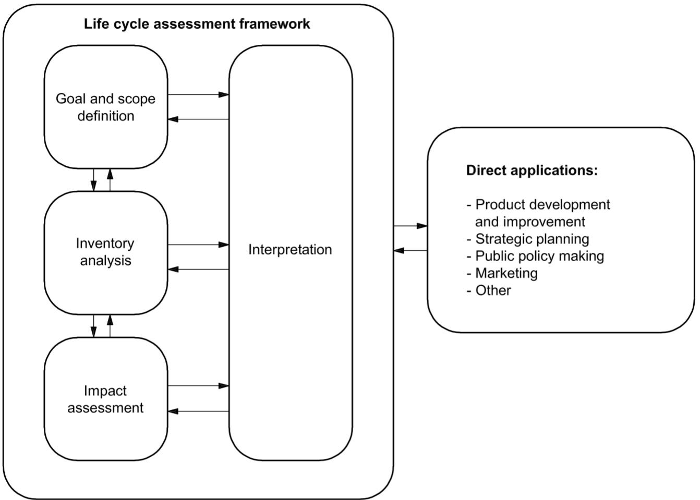
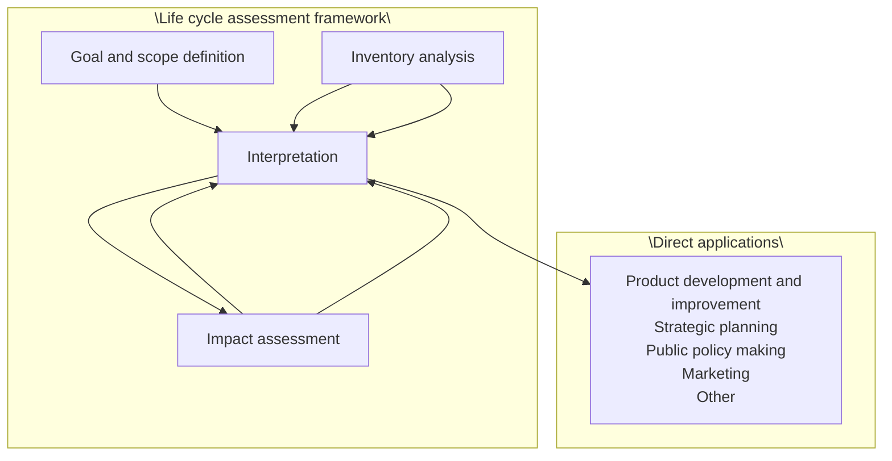
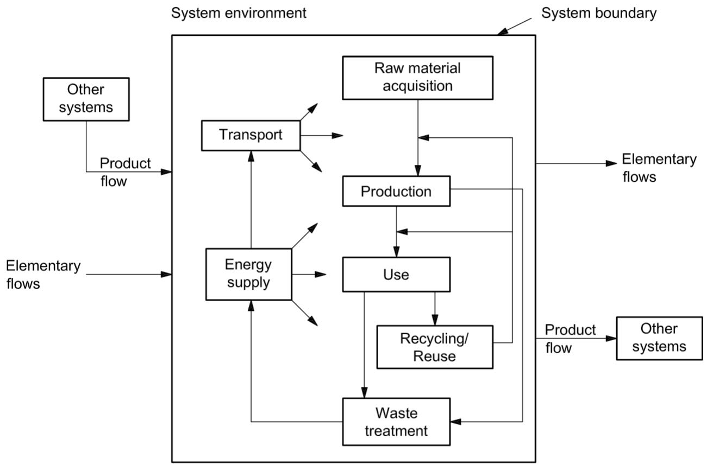
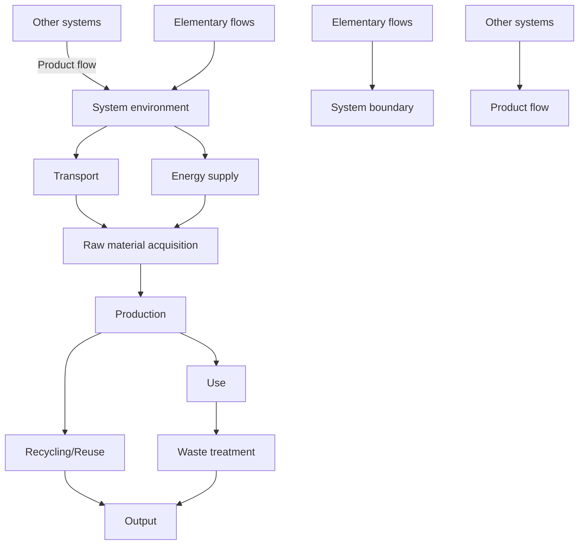
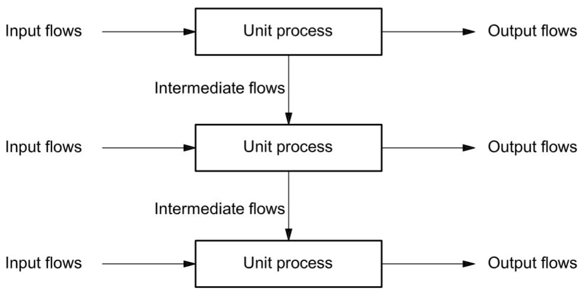
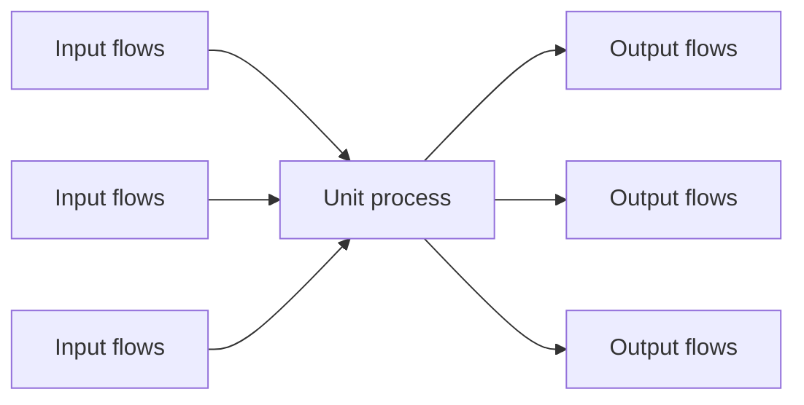
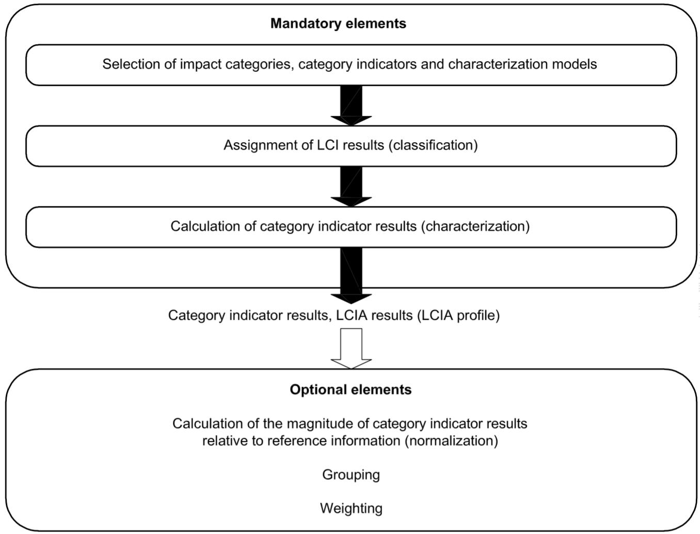
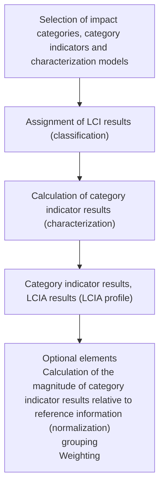

Second edition

2006-07-01

# Environmental management — Life cycle assessment — Principles and framework

Management environnemental — Analyse du cycle de vie — Principes et cadre

## PDF disclaimer

This PDF file may contain embedded typefaces. In accordance with Adobe's licensing policy, this file may be printed or viewed but shall not be edited unless the typefaces which are embedded are licensed to and installed on the computer performing the editing. In downloading this file, parties accept therein the responsibility of not infringing Adobe's licensing policy. The ISO Central Secretariat accepts no liability in this area.

Adobe is a trademark of Adobe Systems Incorporated.

Details of the software products used to create this PDF file can be found in the General Info relative to the file; the PDF-creation parameters were optimized for printing. Every care has been taken to ensure that the file is suitable for use by ISO member bodies. In the unlikely event that a problem relating to it is found, please inform the Central Secretariat at the address given below.

© ISO 2006

All rights reserved. Unless otherwise specified, no part of this publication may be reproduced or utilized in any form or by any means, electronic or mechanical, including photocopying and microfilm, without permission in writing from either ISO at the address below or ISO's member body in the country of the requester.

ISO copyright office

Case postale 56 • CH-1211 Geneva 20

Tel. +41 22 749 01 11

Fax + 41 22 749 09 47

E-mail copyright@iso.org

Web www.iso.org

Published in Switzerland

## Contents

Foreword...... iv

Introduction ...... v

1 Scope 1

2 Normative references 1

3 Terms and definitions....1

4 General description of life cycle assessment (LCA)....6

4.1 Principles of LCA....6

4.2 Phases of an LCA 7

4.3 Key features of an LCA 8

4.4 General concepts of product systems 9

5 Methodological framework 11

5.1 General requirements.... 11

5.2 Goal and scope definition....11

5.3 Life cycle inventory analysis (LCI)....13

5.4 Life cycle impact assessment (LCIA) 14

5.5 Life cycle interpretation 16

6 Reporting....16

7 Critical review....17

7.1 General....17

7.2 Need for critical review....17

7.3 Critical review processes.... 17

Annex A (informative) Application of LCA....18

Bibliography....20

## Foreword

ISO (the International Organization for Standardization) is a worldwide federation of national standards bodies (ISO member bodies). The work of preparing International Standards is normally carried out through ISO technical committees. Each member body interested in a subject for which a technical committee has been established has the right to be represented on that committee. International organizations, governmental and non-governmental, in liaison with ISO, also take part in the work. ISO collaborates closely with the International Electrotechnical Commission (IEC) on all matters of electrotechnical standardization.

International Standards are drafted in accordance with the rules given in the ISO/IEC Directives, Part 2.

The main task of technical committees is to prepare International Standards. Draft International Standards adopted by the technical committees are circulated to the member bodies for voting. Publication as an International Standard requires approval by at least $75\%$ of the member bodies casting a vote.

Attention is drawn to the possibility that some of the elements of this document may be the subject of patent rights. ISO shall not be held responsible for identifying any or all such patent rights.

ISO 14040 was prepared by Technical Committee ISO/TC 207, Environmental management, Subcommittee SC 5, Life cycle assessment.

This second edition of ISO 14040, together with ISO 14044:2006, cancels and replaces ISO 14040:1997, ISO 14041:1998, ISO 14042:2000 and ISO 14043:2000, which have been technically revised.

## Introduction

The increased awareness of the importance of environmental protection, and the possible impacts associated with products ${}^{1)}$ , both manufactured and consumed, has increased interest in the development of methods to better understand and address these impacts. One of the techniques being developed for this purpose is life cycle assessment (LCA).

## LCA can assist in

— identifying opportunities to improve the environmental performance of products at various points in their life cycle,  
— informing decision-makers in industry, government or non-government organizations (e.g. for the purpose of strategic planning, priority setting, product or process design or redesign),  
— the selection of relevant indicators of environmental performance, including measurement techniques, and  
— marketing (e.g. implementing an ecolabelling scheme, making an environmental claim, or producing an environmental product declaration).

For practitioners of LCA, ISO 14044 details the requirements for conducting an LCA.

LCA addresses the environmental aspects and potential environmental impacts ${}^{2)}$ (e.g. use of resources and the environmental consequences of releases) throughout a product's life cycle from raw material acquisition through production, use, end-of-life treatment, recycling and final disposal (i.e. cradle-to-grave).

There are four phases in an LCA study:

a) the goal and scope definition phase,  
b) the inventory analysis phase,  
c) the impact assessment phase, and  
d) the interpretation phase.

The scope, including the system boundary and level of detail, of an LCA depends on the subject and the intended use of the study. The depth and the breadth of LCA can differ considerably depending on the goal of a particular LCA.

The life cycle inventory analysis phase (LCI phase) is the second phase of LCA. It is an inventory of input/output data with regard to the system being studied. It involves collection of the data necessary to meet the goals of the defined study

The life cycle impact assessment phase (LCIA) is the third phase of the LCA. The purpose of LCIA is to provide additional information to help assess a product system's LCI results so as to better understand their environmental significance.

1) In this International Standard, the term "product" includes services.  
2) The “potential environmental impacts” are relative expressions, as they are related to the functional unit of a product system.

Life cycle interpretation is the final phase of the LCA procedure, in which the results of an LCI or an LCIA, or both, are summarized and discussed as a basis for conclusions, recommendations and decision-making in accordance with the goal and scope definition.

There are cases where the goal of an LCA can be satisfied by performing only an inventory analysis and an interpretation. This is usually referred to as an LCI study.

This International Standard covers two types of studies: life cycle assessment studies (LCA studies) and life cycle inventory studies (LCI studies). LCI studies are similar to LCA studies but exclude the LCIA phase. LCI studies are not to be confused with the LCI phase of an LCA study.

Generally, the information developed in an LCA or LCI study can be used as part of a much more comprehensive decision process. Comparing the results of different LCA or LCI studies is only possible if the assumptions and context of each study are equivalent. Therefore this International Standard contains several requirements and recommendations to ensure transparency on these issues.

LCA is one of several environmental management techniques (e.g. risk assessment, environmental performance evaluation, environmental auditing, and environmental impact assessment) and might not be the most appropriate technique to use in all situations. LCA typically does not address the economic or social aspects of a product, but the life cycle approach and methodologies described in this International Standard can be applied to these other aspects.

This International Standard, like other International Standards, is not intended to be used to create non-tariff trade barriers or to increase or change an organization's legal obligations.

# Environmental management — Life cycle assessment — Principles and framework

## 1 Scope

This International Standard describes the principles and framework for life cycle assessment (LCA) including

a) the goal and scope definition of the LCA,  
b) the life cycle inventory analysis (LCI) phase,  
c) the life cycle impact assessment (LCIA) phase,  
d) the life cycle interpretation phase,  
e) reporting and critical review of the LCA,  
f) limitations of the LCA,  
g) relationship between the LCA phases, and  
h) conditions for use of value choices and optional elements.

This International Standard covers life cycle assessment (LCA) studies and life cycle inventory (LCI) studies. It does not describe the LCA technique in detail, nor does it specify methodologies for the individual phases of the LCA.

The intended application of LCA or LCI results is considered during the goal and scope definition, but the application itself is outside the scope of this International Standard.

This International Standard is not intended for contractual or regulatory purposes or registration and certification.

## 2 Normative references

The following referenced documents are indispensable for the application of this document. For dated references, only the edition cited applies. For undated references, the latest edition of the referenced document (including any amendments) applies.

ISO 14044, Environmental management — Life cycle assessment — Requirements and guidelines

## 3 Terms and definitions

For the purposes of this document, the following terms and definitions apply.

## 3.1

## life cycle

consecutive and interlinked stages of a product system, from raw material acquisition or generation from natural resources to final disposal

## 3.2

## life cycle assessment

## LCA

compilation and evaluation of the inputs, outputs and the potential environmental impacts of a product system throughout its life cycle

## 3.3

## life cycle inventory analysis

## LCI

phase of life cycle assessment involving the compilation and quantification of inputs and outputs for a product throughout its life cycle

## 3.4

## life cycle impact assessment

## LCIA

phase of life cycle assessment aimed at understanding and evaluating the magnitude and significance of the potential environmental impacts for a product system throughout the life cycle of the product

## 3.5

## life cycle interpretation

phase of life cycle assessment in which the findings of either the inventory analysis or the impact assessment, or both, are evaluated in relation to the defined goal and scope in order to reach conclusions and recommendations

## 3.6

## comparative assertion

environmental claim regarding the superiority or equivalence of one product versus a competing product that performs the same function

## 3.7

## transparency

open, comprehensive and understandable presentation of information

## 3.8

## environmental aspect

element of an organization's activities, products or services that can interact with the environment

[ISO 14001:2004, definition 3.6]

## 3.9

## product

any goods or service

NOTE 1 The product can be categorized as follows:

— services (e.g. transport);  
— software (e.g. computer program, dictionary);  
— hardware (e.g. engine mechanical part);  
— processed materials (e.g. lubricant).

NOTE 2 Services have tangible and intangible elements. Provision of a service can involve, for example, the following:

— an activity performed on a customer-supplied tangible product (e.g. automobile to be repaired);  
— an activity performed on a customer-supplied intangible product (e.g. the income statement needed to prepare a tax return);  
— the delivery of an intangible product (e.g. the delivery of information in the context of knowledge transmission);  
— the creation of ambience for the customer (e.g. in hotels and restaurants).

Software consists of information and is generally intangible and can be in the form of approaches, transactions or procedures.

Hardware is generally tangible and its amount is a countable characteristic. Processed materials are generally tangible and their amount is a continuous characteristic.

NOTE 3 Adapted from ISO 14021:1999 and ISO 9000:2005.

## 3.10

## co-product

any of two or more products coming from the same unit process or product system

## 3.11

## process

set of interrelated or interacting activities that transforms inputs into outputs

[ISO 9000:2005, definition 3.4.1 (without notes)]

## 3.12

## elementary flow

material or energy entering the system being studied that has been drawn from the environment without previous human transformation, or material or energy leaving the system being studied that is released into the environment without subsequent human transformation

## 3.13

## energy flow

input to or output from a unit process or product system, quantified in energy units

NOTE Energy flow that is an input can be called an energy input; energy flow that is an output can be called an energy output.

## 3.14

## feedstock energy

heat of combustion of a raw material input that is not used as an energy source to a product system, expressed in terms of higher heating value or lower heating value

NOTE Care is necessary to ensure that the energy content of raw materials is not counted twice.

## 3.15

## raw material

primary or secondary material that is used to produce a product

NOTE Secondary material includes recycled material.

## 3.16

## ancillary input

material input that is used by the unit process producing the product, but which does not constitute part of the product

## 3.17

## allocation

partitioning the input or output flows of a process or a product system between the product system under study and one or more other product systems

## 3.18

## cut-off criteria

specification of the amount of material or energy flow or the level of environmental significance associated with unit processes or product system to be excluded from a study

## 3.19

## data quality

characteristics of data that relate to their ability to satisfy stated requirements

## 3.20

## functional unit

quantified performance of a product system for use as a reference unit

## 3.21

## input

product, material or energy flow that enters a unit process

NOTE Products and materials include raw materials, intermediate products and co-products.

## 3.22

## intermediate flow

product, material or energy flow occurring between unit processes of the product system being studied

## 3.23

## intermediate product

output from a unit process that is input to other unit processes that require further transformation within the system

## 3.24

## life cycle inventory analysis result

## LCI result

outcome of a life cycle inventory analysis that catalogues the flows crossing the system boundary and provides the starting point for life cycle impact assessment

## 3.25

## output

product, material or energy flow that leaves a unit process

NOTE Products and materials include raw materials, intermediate products, co-products and releases.

## 3.26

## process energy

energy input required for operating the process or equipment within a unit process, excluding energy inputs for production and delivery of the energy itself

## 3.27

## product flow

products entering from or leaving to another product system

## 3.28

## product system

collection of unit processes with elementary and product flows, performing one or more defined functions, and which models the life cycle of a product

## 3.29

## reference flow

measure of the outputs from processes in a given product system required to fulfil the function expressed by the functional unit

## 3.30

## releases

emissions to air and discharges to water and soil

## 3.31

## sensitivity analysis

systematic procedures for estimating the effects of the choices made regarding methods and data on the outcome of a study

## 3.32

## system boundary

set of criteria specifying which unit processes are part of a product system

NOTE The term "system boundary" is not used in this International Standard in relation to LCIA.

## 3.33

## uncertainty analysis

systematic procedure to quantify the uncertainty introduced in the results of a life cycle inventory analysis due to the cumulative effects of model imprecision, input uncertainty and data variability

NOTE Either ranges or probability distributions are used to determine uncertainty in the results.

## 3.34

## unit process

smallest element considered in the life cycle inventory analysis for which input and output data are quantified

## 3.35

## waste

substances or objects which the holder intends or is required to dispose of

NOTE This definition is taken from the Basel Convention on the Control of Transboundary Movements of Hazardous Wastes and Their Disposal (22 March 1989), but is not confined in this International Standard to hazardous waste.

## 3.36

## category endpoint

attribute or aspect of natural environment, human health, or resources, identifying an environmental issue giving cause for concern

## 3.37

## characterization factor

factor derived from a characterization model which is applied to convert an assigned life cycle inventory analysis result to the common unit of the category indicator

NOTE The common unit allows calculation of the category indicator result.

## 3.38

## environmental mechanism

system of physical, chemical and biological processes for a given impact category, linking the life cycle inventory analysis results to category indicators and to category endpoints

## 3.39

## impact category

class representing environmental issues of concern to which life cycle inventory analysis results may be assigned

## 3.40

## impact category indicator

quantifiable representation of an impact category

NOTE The shorter expression "category indicator" is used in this International Standard for improved readability.

## 3.41

## completeness check

process of verifying whether information from the phases of a life cycle assessment is sufficient for reaching conclusions in accordance with the goal and scope definition

## 3.42

## consistency check

process of verifying that the assumptions, methods and data are consistently applied throughout the study and are in accordance with the goal and scope definition performed before conclusions are reached

## 3.43

## sensitivity check

process of verifying that the information obtained from a sensitivity analysis is relevant for reaching the conclusions and for giving recommendations

## 3.44

## evaluation

element within the life cycle interpretation phase intended to establish confidence in the results of the life cycle assessment

NOTE Evaluation includes completeness check, sensitivity check, consistency check, and any other validation that may be required according to the goal and scope definition of the study

## 3.45

## critical review

process intended to ensure consistency between a life cycle assessment and the principles and requirements of the International Standards on life cycle assessment

NOTE 1 The principles are described in this International Standard (see 4.1).

NOTE 2 The requirements are described in ISO 14044.

## 3.46

## interested party

individual or group concerned with or affected by the environmental performance of a product system, or by the results of the life cycle assessment

## 4 General description of life cycle assessment (LCA)

## 4.1 Principles of LCA

## 4.1.1 General

These principles are fundamental and should be used as guidance for decisions relating to both the planning and the conducting of an LCA.

## 4.1.2 Life cycle perspective

LCA considers the entire life cycle of a product, from raw material extraction and acquisition, through energy and material production and manufacturing, to use and end of life treatment and final disposal. Through such a systematic overview and perspective, the shifting of a potential environmental burden between life cycle stages or individual processes can be identified and possibly avoided.

## 4.1.3 Environmental focus

LCA addresses the environmental aspects and impacts of a product system. Economic and social aspects and impacts are, typically, outside the scope of the LCA. Other tools may be combined with LCA for more extensive assessments.

## 4.1.4 Relative approach and functional unit

LCA is a relative approach, which is structured around a functional unit. This functional unit defines what is being studied. All subsequent analyses are then relative to that functional unit, as all inputs and outputs in the LCI and consequently the LCIA profile are related to the functional unit.

## 4.1.5 Iterative approach

LCA is an iterative technique. The individual phases of an LCA use results of the other phases. The iterative approach within and between the phases contributes to the comprehensiveness and consistency of the study and the reported results.

## 4.1.6 Transparency

Due to the inherent complexity in LCA, transparency is an important guiding principle in executing LCAs, in order to ensure a proper interpretation of the results.

## 4.1.7 Comprehensiveness

LCA considers all attributes or aspects of natural environment, human health and resources. By considering all attributes and aspects within one study in a cross-media perspective, potential trade-offs can be identified and assessed.

## 4.1.8 Priority of scientific approach

Decisions within an LCA are preferably based on natural science. If this is not possible, other scientific approaches (e.g. from social and economic sciences) may be used or international conventions may be referred to. If neither a scientific basis exists nor a justification based on other scientific approaches or international conventions is possible, then, as appropriate, decisions may be based on value choices.

## 4.2 Phases of an LCA

4.2.1 LCA studies comprise four phases. The relationship between the phases is illustrated in Figure 1. These are

— the goal and scope definition,  
— inventory analysis,  
— impact assessment, and  
— interpretation.

4.2.2 LCI studies comprise three phases:

— the goal and scope definition,  
— inventory analysis, and  
— interpretation.

4.2.3 LCA results may be useful inputs to a variety of decision-making processes. Direct applications of the results of LCA or LCI studies, i.e. the applications intended in the goal and scope definition of the LCA or LCI study, are depicted in Figure 1. More information on application areas for LCA can be found in Annex A.

flowchart

Figure 1 — Stages of an LCA

## 4.3 Key features of an LCA

The following list summarizes some of the key features of the LCA methodology:

a) LCA assesses, in a systematic way, the environmental aspects and impacts of product systems, from raw material acquisition to final disposal, in accordance with the stated goal and scope;  
b) the relative nature of LCA is due to the functional unit feature of the methodology;  
c) the depth of detail and time frame of an LCA may vary to a large extent, depending on the goal and scope definition;  
d) provisions are made, depending on the intended application of the LCA, to respect confidentiality and proprietary matters;  
e) LCA methodology is open to the inclusion of new scientific findings and improvements in the state-of-the-art of the technique;  
f) specific requirements are applied to LCA that are intended to be used in comparative assertions intended to be disclosed to the public;

g) there is no single method for conducting LCA. Organizations have the flexibility to implement LCA as established in this International Standard, in accordance with the intended application and the requirements of the organization;

h) LCA is different from many other techniques (such as environmental performance evaluation, environmental impact assessment and risk assessment) as it is a relative approach based on a functional unit; LCA may, however, use information gathered by these other techniques;

i) LCA addresses potential environmental impacts; LCA does not predict absolute or precise environmental impacts due to

— the relative expression of potential environmental impacts to a reference unit,  
— the integration of environmental data over space and time,  
— the inherent uncertainty in modelling of environmental impacts, and  
— the fact that some possible environmental impacts are clearly future impacts;

j) the LCIA phase, in conjunction with other LCA phases, provides a system-wide perspective of environmental and resource issues for one or more product system(s);

k) LCIA assigns LCI results to impact categories; for each impact category, a life cycle impact category indicator is selected and the category indicator result (indicator result) is calculated; the collection of indicator results (LCIA results) or the LCIA profile provides information on the environmental issues associated with the inputs and outputs of the product system;

I) there is no scientific basis for reducing LCA results to a single overall score or number, since weighting requires value choices;

m) life cycle interpretation uses a systematic procedure to identify, qualify, check, evaluate and present the conclusions based on the findings of an LCA, in order to meet the requirements of the application as described in the goal and scope of the study;

n) life cycle interpretation uses an iterative procedure both within the interpretation phase and with the other phases of an LCA;

o) life cycle interpretation makes provisions for links between LCA and other techniques for environmental management by emphasizing the strengths and limits of an LCA in relation to its goal and scope definition.

## 4.4 General concepts of product systems

LCA models the life cycle of a product as its product system, which performs one or more defined functions.

The essential property of a product system is characterized by its function and cannot be defined solely in terms of the final products. Figure 2 shows an example of a product system.

Product systems are subdivided into a set of unit processes (see Figure 3). Unit processes are linked to one another by flows of intermediate products and/or waste for treatment, to other product systems by product flows, and to the environment by elementary flows.

Dividing a product system into its component unit processes facilitates identification of the inputs and outputs of the product system. In many cases, some of the inputs are used as a component of the output product, while others (ancillary inputs) are used within a unit process but are not part of the output product. A unit process also generates other outputs (elementary flows and/or products) as a result of its activities. The level of modelling detail that is required to satisfy the goal of the study determines the boundary of a unit process.

The elementary flows include the use of resources and releases to air, water and land associated with the system. Interpretations may be drawn from these data, depending on the goal and scope of the LCA. These data are the LCI results and constitute the input for LCIA.

## EXAMPLES

Elementary flows entering the unit process:

crude oil from the ground and solar radiation.

Elementary flows leaving the unit process:

emissions to air, discharges to water or soil and radiation.

Intermediate product flows:

basic materials and subassemblies.

Product flows entering or leaving the system:

recycled materials and components for reuse.

flowchart

Figure 2 — Example of a product system for LCA

flowchart

Figure 3 — Example of a set of unit processes within a product system

## 5 Methodological framework

## 5.1 General requirements

When performing an LCA, the requirements of ISO 14044 shall apply.

## 5.2 Goal and scope definition

## 5.2.1 General

## 5.2.1.1 The goal of an LCA states

— the intended application,  
— the reasons for carrying out the study,  
— the intended audience, i.e. to whom the results of the study are intended to be communicated, and  
— whether the results are intended to be used in comparative assertions intended to be disclosed to the public.

The scope should be sufficiently well defined to ensure that the breadth, depth and detail of the study are compatible and sufficient to address the stated goal.

## 5.2.1.2 The scope includes the following items:

— the product system to be studied;  
— the functions of the product system or, in the case of comparative studies, the systems;  
— the functional unit;  
— the system boundary;  
— allocation procedures;  
— impact categories selected and methodology of impact assessment, and subsequent interpretation to be used;  
— data requirements;  
— assumptions;  
— limitations;  
— initial data quality requirements;  
— type of critical review, if any;  
— type and format of the report required for the study.

LCA is an iterative technique, and as data and information are collected, various aspects of the scope may require modification in order to meet the original goal of the study.

## 5.2.2 Function, functional unit and reference flows

A system may have a number of possible functions and the one(s) selected for a study depend(s) on the goal and scope of the LCA.

The functional unit defines the quantification of the identified functions (performance characteristics) of the product. The primary purpose of a functional unit is to provide a reference to which the inputs and outputs are related. This reference is necessary to ensure comparability of LCA results. Comparability of LCA results is particularly critical when different systems are being assessed, to ensure that such comparisons are made on a common basis.

It is important to determine the reference flow in each product system, in order to fulfil the intended function, i.e. the amount of products needed to fulfil the function.

EXAMPLE In the function of drying hands, both a paper towel and an air-dryer system are studied. The selected functional unit may be expressed in terms of the identical number of pairs of hands dried for both systems. For each system, it is possible to determine the reference flow, e.g. the average mass of paper or the average volume of hot air required for one pair of hand-dry, respectively. For both systems, it is possible to compile an inventory of inputs and outputs on the basis of the reference flows. At its simplest level, in the case of paper towel, this would be related to the paper consumed. In the case of the air-dryer, this would be related to the mass of hot air needed to dry the hands.

## 5.2.3 System boundary

LCA is conducted by defining product systems as models that describe the key elements of physical systems. The system boundary defines the unit processes to be included in the system. Ideally, the product system should be modelled in such a manner that inputs and outputs at its boundary are elementary flows. However, resources need not be expended on the quantification of such inputs and outputs that will not significantly change the overall conclusions of the study.

The choice of elements of the physical system to be modelled depends on the goal and scope definition of the study, its intended application and audience, the assumptions made, data and cost constraints, and cut-off criteria. The models used should be described and the assumptions underlying those choices should be identified. The cut-off criteria used within a study should be clearly understood and described.

The criteria used in setting the system boundary are important for the degree of confidence in the results of a study and the possibility of reaching its goal.

When setting the system boundary, several life cycle stages, unit processes and flows should be taken into consideration, for example, the following:

— acquisition of raw materials;  
— inputs and outputs in the main manufacturing/processing sequence;  
— distribution/transportation;  
— production and use of fuels, electricity and heat;  
— use and maintenance of products;  
— disposal of process wastes and products;  
— recovery of used products (including reuse, recycling and energy recovery);  
— manufacture of ancillary materials;  
— manufacture, maintenance and decommissioning of capital equipment;  
— additional operations, such as lighting and heating.

In many instances, the initially defined system boundary defined will subsequently need to be refined.

## 5.2.4 Data quality requirements

Data quality requirements specify in general terms the characteristics of the data needed for the study.

Descriptions of data quality are important to understand the reliability of the study results and properly interpret the outcome of the study.

## 5.3 Life cycle inventory analysis (LCI)

## 5.3.1 General

Inventory analysis involves data collection and calculation procedures to quantify relevant inputs and outputs of a product system.

The process of conducting an inventory analysis is iterative. As data are collected and more is learned about the system, new data requirements or limitations may be identified that require a change in the data collection procedures so that the goals of the study will still be met. Sometimes, issues may be identified that require revisions to the goal or scope of the study.

## 5.3.2 Data collection

Data for each unit process within the systems boundary can be classified under major headings, including

— energy inputs, raw material inputs, ancillary inputs, other physical inputs,  
— products, co-products and waste,  
— emissions to air, discharges to water and soil, and  
— other environmental aspects.

Data collection can be a resource-intensive process. Practical constraints on data collection should be considered in the scope and documented in the study report.

## 5.3.3 Data calculation

Following the data collection, calculation procedures, including

— validation of data collected,  
— the relating of data to unit processes, and  
— the relating of data to the reference flow of the functional unit,

are needed to generate the results of the inventory of the defined system for each unit process and for the defined functional unit of the product system that is to be modelled.

The calculation of energy flows should take into account the different fuels and electricity sources used, the efficiency of conversion and distribution of energy flow, as well as the inputs and outputs associated with the generation and use of that energy flow.

## 5.3.4 Allocation of flows and releases

Few industrial processes yield a single output or are based on a linearity of raw material inputs and outputs. In fact, most industrial processes yield more than one product, and they recycle intermediate or discarded products as raw materials.

Consideration should be given to the need for allocation procedures when dealing with systems involving multiple products and recycling systems.

## 5.4 Life cycle impact assessment (LCIA)

## 5.4.1 General

The impact assessment phase of LCA is aimed at evaluating the significance of potential environmental impacts using the LCI results. In general, this process involves associating inventory data with specific environmental impact categories and category indicators, thereby attempting to understand these impacts. The LCIA phase also provides information for the life cycle interpretation phase.

The impact assessment may include the iterative process of reviewing the goal and scope of the LCA study to determine if the objectives of the study have been met, or to modify the goal and scope if the assessment indicates that they cannot be achieved.

Issues such as choice, modelling and evaluation of impact categories can introduce subjectivity into the LCIA phase. Therefore, transparency is critical to the impact assessment to ensure that assumptions are clearly described and reported.

## 5.4.2 Elements of LCIA

The elements of the LCIA phase are illustrated in Figure 4.

NOTE Further explanation of LCIA terminology can be found in ISO 14044.

Separation of the LCIA phase into different elements is helpful and necessary for several reasons, as follows:

a) each LCIA element is distinct and can be clearly defined;  
b) the goal and scope definition phase of an LCA can consider each LCIA element separately;  
c) a quality assessment of the LCIA methods, assumptions and other decisions can be conducted for each LCIA element;  
d) LCIA procedures, assumptions and other operations within each element can be made transparent for critical review and reporting;  
e) the use of values and subjectivity (hereafter referred to as value-choices), within each element, can be made transparent for critical review and reporting.

The level of detail, choice of impacts evaluated and methodologies used depend on the goal and scope of the study.

LIFE CYCLE IMPACT ASSESSMENT  

flowchart

Figure 4 — Elements of the LCIA phase

## 5.4.3 Limitations of LCIA

The LCIA addresses only the environmental issues that are specified in the goal and scope. Therefore, LCIA is not a complete assessment of all environmental issues of the product system under study.

LCIA cannot always demonstrate significant differences between impact categories and the related indicator results of alternative product systems. This may be due to

— limited development of the characterization models, sensitivity analysis and uncertainty analysis for the LCIA phase,  
— limitations of the LCI phase, such as setting the system boundary, that do not encompass all possible unit processes for a product system or do not include all inputs and outputs of every unit process, since there are cut-offs and data gaps,  
— limitations of the LCI phase, such as inadequate LCI data quality which may, for instance, be caused by uncertainties or differences in allocation and aggregation procedures, and  
— limitations in the collection of inventory data appropriate and representative for each impact category.

The lack of spatial and temporal dimensions in the LCI results introduces uncertainty in the LCIA results. The uncertainty varies with the spatial and temporal characteristics of each impact category.

There are no generally accepted methodologies for consistently and accurately associating inventory data with specific potential environmental impacts. Models for impact categories are in different stages of development.

## 5.5 Life cycle interpretation

Interpretation is the phase of LCA in which the findings from the inventory analysis and the impact assessment are considered together or, in the case of LCI studies, the findings of the inventory analysis only. The interpretation phase should deliver results that are consistent with the defined goal and scope and which reach conclusions, explain limitations and provide recommendations.

The interpretation should reflect the fact that the LCIA results are based on a relative approach, that they indicate potential environmental effects, and that they do not predict actual impacts on category endpoints, the exceeding of thresholds or safety margins or risks.

The findings of this interpretation may take the form of conclusions and recommendations to decision-makers, consistent with the goal and scope of the study.

Life cycle interpretation is also intended to provide a readily understandable, complete and consistent presentation of the results of an LCA, in accordance with the goal and scope definition of the study.

The interpretation phase may involve the iterative process of reviewing and revising the scope of the LCA, as well as the nature and quality of the data collected in a way which is consistent with the defined goal.

The findings of the life cycle interpretation should reflect the results of the evaluation element.

## 6 Reporting

A reporting strategy is an integral part of an LCA. An effective report should address the different phases of the study under consideration.

Report the results and conclusions of the LCA in an adequate form to the intended audience, addressing the data, methods and assumptions applied in the study, and the limitations thereof.

If the study extends to the LCIA phase and is reported to a third-party, the following issues should be reported:

— the relationship with the LCI results;  
— a description of the data quality;  
— the category endpoints to be protected;  
— the selection of impact categories;  
— the characterization models;  
— the factors and environmental mechanisms;  
— the indicator results profile.

The relative nature of the LCIA results and their inadequacy to predict impacts on category endpoints should also be addressed in the report. Include reference and description of value choices used in the LCIA phase of the study in relation to characterization models, normalization, weighting, etc.

Include other requirements given in ISO 14044 whenever the study results are intended to be used in comparative assertions intended to be disclosed to the public. Furthermore, in reporting the interpretation phase, ISO 14044 requires full transparency in terms of value choices, rationales and expert judgements.

## 7 Critical review

## 7.1 General

Critical review is a process to verify whether an LCA has met the requirements for methodology, data, interpretation and reporting and whether it is consistent with the principles.

In general, critical reviews of an LCA may utilize any of the review options outlined in 7.3. A critical review can neither verify nor validate the goals that are chosen for an LCA by the study commissioner, nor the ways in which the LCA results are used.

## 7.2 Need for critical review

A critical review may facilitate understanding and enhance the credibility of LCA, for example by involving interested parties.

The use of LCA results to support comparative assertions raises special concerns and requires critical review, since this application is likely to affect interested parties that are external to the LCA. However, the fact that a critical review has been conducted should in no way imply an endorsement of any comparative assertion that is based on an LCA study.

## 7.3 Critical review processes

## 7.3.1 General

The scope and type of critical review desired is defined in the scope phase of an LCA. The scope should identify why the critical review is being undertaken, what will be covered and to what level of detail, and who needs to be involved in the process.

The review should ensure that the classification, characterization, normalization, grouping and weighting elements are sufficient and are documented in such a way that enables the life cycle interpretation phase of the LCA to be carried out.

Confidentiality agreements regarding the content of the LCA should be entered into as needed.

## 7.3.2 Critical review by internal or external expert

The internal or external expert should be familiar with the requirements of LCA and should have the appropriate scientific and technical expertise.

## 7.3.3 Critical review by a panel of interested parties

An external independent expert should be selected by the original study commissioner to act as chairperson of a review panel of at least three members. Based on the goal, scope and budget available for the review, the chairperson should select other independent qualified reviewers.

This panel may also include other interested parties affected by the conclusions drawn from the LCA, such as government agencies, non-governmental groups, competitors and affected industries.

# Annex A (informative)

# Application of LCA

## A.1 Application areas

A.1.1 The intended applications of LCA are addressed in 4.2 (Figure 1) in a non-exclusive, exemplary manner. The applications of LCA as such are outside the scope of this International Standard.

Further applications in the field of environmental management systems and tools include, among others:

a) environmental management systems and environmental performance evaluation (ISO 14001, ISO 14004, ISO 14031 and ISO/TR 14032), for example, identification of significant environmental aspects of the products and services of an organization;  
b) environmental labels and declarations (ISO 14020, ISO 14021 and ISO 14025);  
c) integration of environmental aspects into product design and development (design for environment) (ISO/TR 14062);  
d) inclusion of environmental aspects in product standards (ISO Guide 64);  
e) environmental communication (ISO 14063);  
f) quantification, monitoring and reporting of entity and project emissions and removals, and validation, verification and certification of greenhouse gas emissions [ISO 14064 (all parts)].

There are a variety of potential further applications in private and public organizations. The list of techniques, methods and tools below does not indicate that they are based on the LCA technique as such, but that the life cycle approach, principles and framework can be beneficially applied. These are, amongst others:

— environmental impact assessment (EIA);  
— environmental management accounting (EMA);  
— assessment of policies (models for recycling, etc.);  
— sustainability assessment; economic and social aspects are not included in LCA, but the procedures and guidelines could be applied by appropriate competent parties;  
— substance and material flow analysis (SFA and MFA);  
— hazard and risk assessment of chemicals;  
— risk analysis and risk management of facilities and plants;  
— product stewardship, supply chain management;  
— life cycle management (LCM);  
— design briefs, life cycle thinking;  
— life cycle costing (LCC).

Clarifications, considerations, practices, simplifications and options for the different applications are also beyond the scope of this International Standard.

A.1.2 There is no single solution as to how LCA can best be applied within the decision-making context. Each organization has to solve and decide that case by case depending (amongst others) on the size and culture of the organization, its products, the strategy, the internal systems, tools and procedures and the external drivers.

LCA may be used for a broad spectrum of applications. The individual use, adaptation and practice of LCA for all potential applications are based on this International Standard and on ISO 14044.

In addition, the LCA technique with proper justification could be applied in studies that are not LCA or LCI studies. Examples are

— cradle-to-gate studies,  
— gate-to-gate studies, and  
— specific parts of the life cycle (e.g. waste management, components of a product).

For those studies most requirements of this International Standard and ISO 14044 are applicable (e.g. data quality, collection and calculation as well as allocation and critical review), but not all the requirements for the system boundary.

A.1.3 For specific applications, it can be appropriate, as part of the LCIA, to determine the indicator results of each unit process or of each stage of a life cycle individually and to calculate the indicator results of the whole product system by adding up the indicator results of the different unit processes or stages.

This procedure is within the framework of this International Standard, provided that

— it has been defined within the goal and scope definition phase, and

— it is shown that the results of such an approach are identical with the results of an LCA which applies the sequence of steps according to the guidance of this International Standard and ISO 14044.

## A.2 Application approach

It is necessary to consider the decision-making context when defining the scope of an LCA; i.e. the product systems studied should adequately address the products and processes affected by the intended application.

The examples of applications relate to decisions that aim for environmental improvements, which is also the overall focus of the ISO 14000 series. Therefore, the products and processes studied in an LCA are those affected by the decision that the LCA intends to support.

Some applications may not appear to immediately address improvements, such as LCA to be used for education or information about the product life cycle. However, as soon as such information is applied in practice, it is used in an improvement context. Therefore, special care is necessary to ensure that the information is applicable to the context in which it is likely to be applied.

Two possible different approaches to LCA have developed during the recent years. These are

a) one which assigns elementary flows and potential environmental impacts to a specific product system typically as an account of the history of the product, and  
b) one which studies the environmental consequences of possible (future) changes between alternative product systems.

## Bibliography

[1] ISO 9000:2005, Quality management systems — Fundamentals and vocabulary  
[2] ISO 14001:2004, Environmental management systems — Requirements with guidance for use  
[3] ISO 14004:2004, Environmental management systems — General guidelines on principles, systems and support techniques  
[4] ISO 14020, Environmental labels and declarations — General principles  
[5] ISO 14021, Environmental labels and declarations — Self-declared environmental claims (Type II environmental labelling)  
[6] ISO 14025, Environmental labels and declarations — Type III environmental declarations — Principles and procedures  
[7] ISO 14031, Environmental management — Environmental performance evaluation — Guidelines  
[8] ISO/TR 14032, Environmental management — Examples of environmental performance evaluation (EPE)  
[9] ISO/TR 14047, Environmental management — Life cycle impact assessment — Examples of application of ISO 14042  
[10] ISO/TS 14048, Environmental management — Life cycle assessment — Data documentation format  
[11] ISO/TR 14049, Environmental management — Life cycle assessment — Examples of application of ISO 14041 to goal and scope definition and inventory analysis  
[12] ISO 14050, Environmental management — Vocabulary  
[13] ISO/TR 14062, Environmental management — Integrating environmental aspects into product design and development  
[14] ISO 14063, Environmental management — Environmental communication — Guidelines and examples  
[15] ISO 14064-1, Greenhouse gases — Part 1: Specification with guidance at the organization level for quantification and reporting of greenhouse gas emissions and removals  
[16] ISO 14064-2, Greenhouse gases — Part 2: Specification with guidance at the project level for quantification, monitoring and reporting of greenhouse gas emission reductions or removal enhancements  
[17] ISO 14064-3, Greenhouse gases — Part 3: Specification with guidance for the validation and verification of greenhouse gas assertions  
[18] ISO Guide 64, Guide for the inclusion of environmental aspects in product standards