Second edition

2006-07-01

AMENDMENT 1

2020-09

# Environmental management — Life cycle assessment — Principles and framework

AMENDMENT 1

Management environnemental — Analyse du cycle de vie — Principes et cadre

AMENDEMENT 1

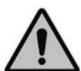

## COPYRIGHT PROTECTED DOCUMENT

© ISO 2020

All rights reserved. Unless otherwise specified, or required in the context of its implementation, no part of this publication may be reproduced or utilized otherwise in any form or by any means, electronic or mechanical, including photocopying, or posting on the internet or an intranet, without prior written permission. Permission can be requested from either ISO at the address below or ISO's member body in the country of the requester.

ISO copyright office

CP 401 • Ch. de Blandonnet 8

CH-1214 Vernier, Geneva

Phone: +41 22 749 01 11

Email: copyright@iso.org

Website: www.iso.org

Published in Switzerland

## Foreword

ISO (the International Organization for Standardization) is a worldwide federation of national standards bodies (ISO member bodies). The work of preparing International Standards is normally carried out through ISO technical committees. Each member body interested in a subject for which a technical committee has been established has the right to be represented on that committee. International organizations, governmental and non-governmental, in liaison with ISO, also take part in the work. ISO collaborates closely with the International Electrotechnical Commission (IEC) on all matters of electrotechnical standardization.

The procedures used to develop this document and those intended for its further maintenance are described in the ISO/IEC Directives, Part 1. In particular, the different approval criteria needed for the different types of ISO documents should be noted. This document was drafted in accordance with the editorial rules of the ISO/IEC Directives, Part 2 (see www.iso.org/directives).

Attention is drawn to the possibility that some of the elements of this document may be the subject of patent rights. ISO shall not be held responsible for identifying any or all such patent rights. Details of any patent rights identified during the development of the document will be in the Introduction and/or on the ISO list of patent declarations received (see www.iso.org/patents).

Any trade name used in this document is information given for the convenience of users and does not constitute an endorsement.

For an explanation of the voluntary nature of standards, the meaning of ISO specific terms and expressions related to conformity assessment, as well as information about ISO's adherence to the World Trade Organization (WTO) principles in the Technical Barriers to Trade (TBT), see www.iso.org/iso/foreword.html.

This document was prepared by Technical Committee ISO/TC 207, Environmental management, Subcommittee SC 5, Life cycle assessment, in collaboration with the European Committee for Standardization (CEN) Technical Committee CEN/SS S26, Environmental management, in accordance with the Agreement on technical cooperation between ISO and CEN (Vienna Agreement).

Any feedback or questions on this document should be directed to the user's national standards body. A complete listing of these bodies can be found at www.iso.org/members.html.

# Environmental management — Life cycle assessment — Principles and framework

AMENDMENT 1

Clause 3, Terms and definitions

Replace the following definitions:

## 3.1

## life cycle

consecutive and interlinked stages of a product system, from raw material acquisition or generation from natural resources to final disposal

## 3.32

## system boundary

set of criteria specifying which unit processes are part of a product system

Note 1 to entry The term “system boundary” is not used in this International Standard in relation to LCIA.

## 3.41

## completeness check

process of verifying whether information from the phases of a life cycle assessment is sufficient for reaching conclusions in accordance with the goal and scope definition

## 3.42

## consistency check

process of verifying that the assumptions, methods and data are consistently applied throughout the study and are in accordance with the goal and scope definition performed before conclusions are reached

## 3.43

## sensitivity check

process of verifying that the information obtained from a sensitivity analysis is relevant for reaching the conclusions and for giving recommendations

With the following definitions:

## 3.1

## life cycle

consecutive and interlinked stages, from raw material acquisition or generation from natural resources to final disposal

## 3.32

## system boundary

boundary based on a set of criteria specifying which unit processes are part of the system under study

Note 1 to entry: In this document, “system under study” refers to product system.

## 3.41

## completeness check

process to determine whether information from the phases of a life cycle assessment is sufficient for reaching conclusions in accordance with the goal and scope definition

## 3.42

## consistency check

process to determine whether the assumptions, methods and data are consistently applied throughout the study and are in accordance with the goal and scope definition

## 3.43

## sensitivity check

process to determine whether the information obtained from a sensitivity analysis is relevant for reaching the conclusions and for giving recommendations

## 4.2, Figure 1

Change the title of the figure to the following:

Figure 1 — Phases of an LCA

Third edition

2017-03

# Technical product documentation — Edges of undefined shape — Indication and dimensioning

Documentation technique de produits — Arêtes de forme non définie — Indication et cotation

## Contents

Page

## Foreword ...... iv

## Introduction......v

1 Scope....1  
2 Normative references....1  
3 Terms and definitions....1  
4 Indications on drawings 4

4.1 Basic indication....4  
4.2 Types of undefined edge 5  
4.3 Size 5  
4.4 Direction of passing or undercut 7

4.4.1 Indication in one direction....7  
4.4.2 Asymmetrical indication....8

4.5 Location of the basic symbol....8

4.5.1 General....8  
4.5.2 Individual indication of edges....9  
4.5.3 Indication of limited areas....10  
4.5.4 General indication of edges 11  
4.5.5 Exceptions from general indications of edges....13

4.6 Reference to this document....15

## Annex A (normative) Proportions and dimensions of graphical symbols....16

## Annex B (informative) Examples of indication of undefined edges....18

## Bibliography 22

## Foreword

ISO (the International Organization for Standardization) is a worldwide federation of national standards bodies (ISO member bodies). The work of preparing International Standards is normally carried out through ISO technical committees. Each member body interested in a subject for which a technical committee has been established has the right to be represented on that committee. International organizations, governmental and non-governmental, in liaison with ISO, also take part in the work. ISO collaborates closely with the International Electrotechnical Commission (IEC) on all matters of electrotechnical standardization.

The procedures used to develop this document and those intended for its further maintenance are described in the ISO/IEC Directives, Part 1. In particular the different approval criteria needed for the different types of ISO documents should be noted. This document was drafted in accordance with the editorial rules of the ISO/IEC Directives, Part 2 (see www.iso.org/directives).

Attention is drawn to the possibility that some of the elements of this document may be the subject of patent rights. ISO shall not be held responsible for identifying any or all such patent rights. Details of any patent rights identified during the development of the document will be in the Introduction and/or on the ISO list of patent declarations received (see www.iso.org/patents).

Any trade name used in this document is information given for the convenience of users and does not constitute an endorsement.

For an explanation on the voluntary nature of standards, the meaning of ISO specific terms and expressions related to conformity assessment, as well as information about ISO's adherence to the World Trade Organization (WTO) principles in the Technical Barriers to Trade (TBT) see the following URL: www.iso.org/iso/foreword.html.

This document was prepared by Technical Committee ISO/TC 10, Technical product documentation, Subcommittee SC 6, Mechanical engineering documentation.

This third edition cancels and replaces the second edition (ISO 13715:2000), which has been technically revised with the following changes:

— title changed from Technical drawings — Edges of undefined shape — Vocabulary and indications to Technical product documentation — Edges of undefined shape — Indication and dimensioning;  
— Normative references updated;  
— text rearranged in Clause 4;  
— figure titles changed;  
— figures added and improved;  
— 4.4.2 "Asymmetrical indications" added;  
— Clause 5 deleted and Table 2 "Examples" is moved to Annex B, explanations have been improved;  
— Annex B "Recommended edge size" has been deleted, definition of sharp edge is deleted.

## Introduction

In technical drawings, the ideal geometric shape is represented without any deviation and, in general, without consideration of the conditions of the edges. Nevertheless, for many purposes (the functioning of a part or out of safety considerations, for example) particular conditions of edges need to be indicated. Such conditions include those of external edges free from burr or those with a burr of limited size, and internal edges with a passing.

This document provides a symbology for the indication of the desired edge.

# Technical product documentation — Edges of undefined shape — Indication and dimensioning

## 1 Scope

This document specifies rules for the indication and dimensioning of undefined edges in technical product and dimensions. The proportions and dimensions of the graphical symbols to be used are also specified.

In cases where the geometrically defined shape of an edge (for example, $1 \times 45^{\circ}$ ) is required, the general dimensioning principles given in ISO 129-1 apply.

## 2 Normative references

There are no normative references cited in this document.

## 3 Terms and definitions

For the purposes of this document, the following terms and definitions apply.

ISO and IEC maintain terminological databases for use in standardization at the following addresses:

— IEC Electropedia: available at http://www.electropedia.org/  
— ISO Online browsing platform: available at http://www.iso.org/obp

## 3.1

## edge of undefined shape

transition line, included in an intersection plane, which is not defined on the nominal model and which exists between two adjacent integral surfaces

## 3.2

## undercut

deviation inside the ideal geometrical shape of an edge defined by two tangent outside straight lines to the adjacent feature of the zone of the undefined edge

Note 1 to entry: The explanation of the definition is given in Figures 1 and 3. In order to simplify the illustration, only the undercut and the two tangents outside straight lines are represented.

Note 2 to entry: Examples are presented in Figures 2 and 4.

## 3.3

## passing

deviation outside the ideal geometrical shape of an edge defined by two tangent outside straight lines to the adjacent feature of the zone of the undefined edge

Note 1 to entry: The explanation of the definition is given in Figures 5 and 7. In order to simplify the illustration, only the passing and the two tangents outside straight lines are represented.

Note 2 to entry: A burr or a flash (see Figure 5) can be considered to be a special case of external passing.

Note 3 to entry: Examples are presented in Figures 6 and 8.

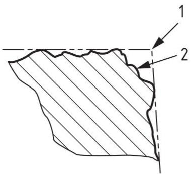

text_image

1
2

## Key

1 ideal sharp edge  
2 undercut

Figure 1 — Undercut on an external edge  
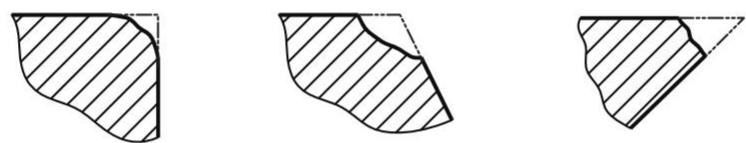

natural_image

Three abstract geometric shapes with diagonal hatching, no text or symbols present

Figure 2 — Examples of undercut on an external edge

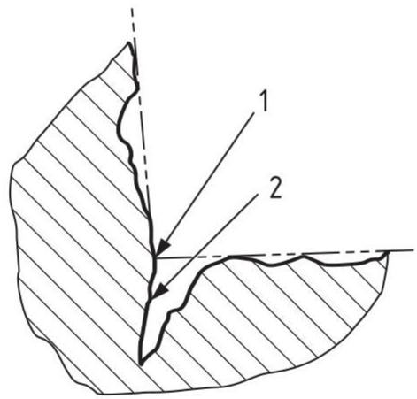

text_image

1
2

## Key

1 ideal sharp edge  
2 undercut

Figure 3 — Undercut on an internal edge  
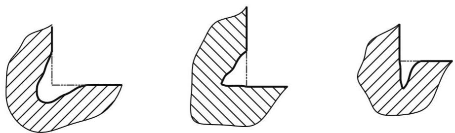

natural_image

Three abstract geometric shapes with diagonal hatching, no text or symbols present

Figure 4 — Examples of undercut on an internal edge

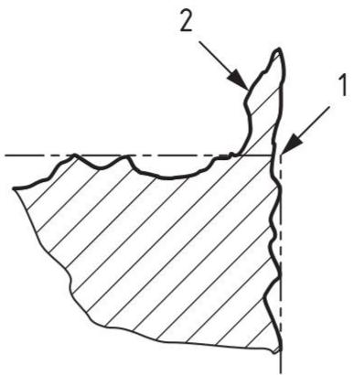

text_image

1
2

## Key

1 ideal sharp edge  
2 passing

Figure 5 — Passing on an external edge (flash or burr)  
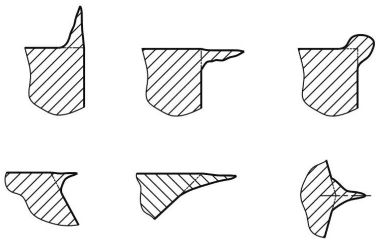

natural_image

Six abstract geometric shapes with diagonal hatching, arranged in two rows (no text or symbols)

Figure 6 — Examples of passing on external edge (burr or flash)

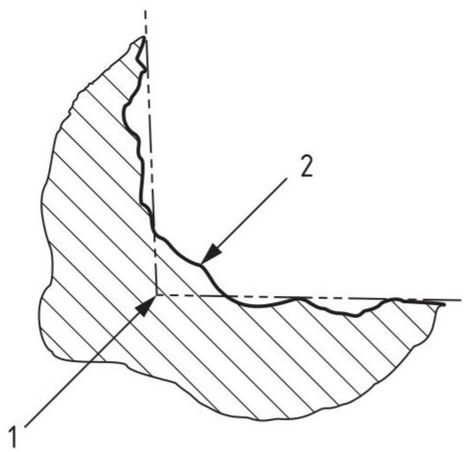

text_image

1
2

## Key

1 ideal sharp edge  
2 passing

Figure 7 — Passing on an internal edge  
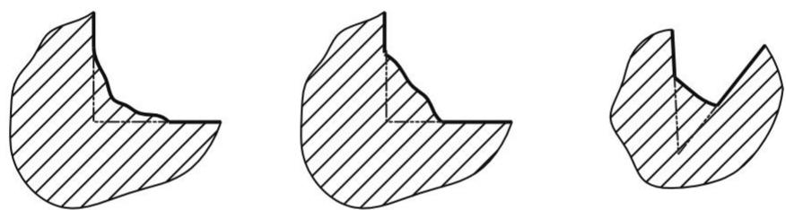

natural_image

Three abstract geometric shapes with diagonal hatching, no text or symbols present

Figure 8 — Examples of passing on an internal edge

## 4 Indications on drawings

## 4.1 Basic indication

The requirements for an edge of a part shall be indicated by the basic graphical indication shown in Figure 9. If all edges of a part are to be specified as undefined, the basic general indication is used (see Figure 10).

The graphical symbol and the specification shall be represented in such a way that they can be read from the bottom of the drawing.

The proportions of this symbol are given in Annex A. Additional indications can be placed in the areas $a_{1}$ , $a_{2}$ or $a_{3}$ , see Figure A.1.

Undefined edges cannot be described by the basic element alone. As a minimum indication, the type of undefined edge shall be specified.

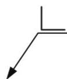  
Figure 9 — Basic indication

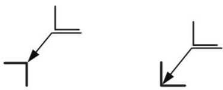

natural_image

Two simple geometric line drawings with arrows indicating directional relationships (no text or symbols)

Figure 10 — Basic general indication

## 4.2 Types of undefined edge

The type of an undefined edge shall be indicated in the area $a_1$ (see Figure A.1), inside the basic symbol. The symbol element + (plus), - (minus) or ± (plus or minus) is used in accordance with Table 1.

The symbol element + (plus) indicates permitted excess material, i.e. passing.

The symbol element - (minus) indicates required material removal, i.e. undercut.

The symbol element $\pm$ (plus or minus) indicates permitted excess material or material removed, i.e. an undercut or a passing. This can only be used with an indication of size (see 4.3).

The deviation from ideal nominal shape can be controlled by indicating the size of passing and undercut (see 4.3) and the direction (see 4.4).

Table 1 — Symbols for the shapes of edges

<table><tr><td rowspan="3">Symbol</td><td colspan="4">Meaning</td></tr><tr><td colspan="2">External edge</td><td colspan="2">Internal edge</td></tr><tr><td>Passing</td><td>Undercut</td><td>Passing</td><td>Undercut</td></tr><tr><td>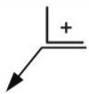</td><td>Permitted</td><td>Not permitted</td><td>Permitted</td><td>Not permitted</td></tr><tr><td>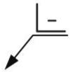</td><td>Not permitted</td><td>Required</td><td>Not permitted</td><td>Required</td></tr><tr><td>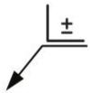Can only be used with an indication of size.</td><td>Permitted</td><td>Permitted</td><td>Permitted</td><td>Permitted</td></tr></table>

## 4.3 Size

The maximum deviation of the undercut or passing shall be controlled by indication of the dimensions (size). The value is placed after the symbol element $+$ , - or $\pm$ in the area $a_1$ (see Figure A.1).

When a single limit for the size of an edge is specified with a positive value, the second limit deviation is the value zero; undercut is not permitted (see Figures 11 and 12).

When a single limit for the size of an edge is specified with a negative value, the second limit deviation is the value zero; passing is not permitted (see Figures 11 and 12).

Whenever the specification of an upper and lower limit deviation for the size of an edge is necessary, both values shall be indicated. The upper limit deviation is placed above the lower limit deviation (see Figure 13). The indicated limit deviations correspond to the maximum and minimum dimensions, respectively.

When a particular direction of passing or undercut is required, the indication shall be positioned accordingly (see 4.4).

NOTE The thickness of passing on external edges and the thickness of undercuts on internal edges cannot be specified according to this document.

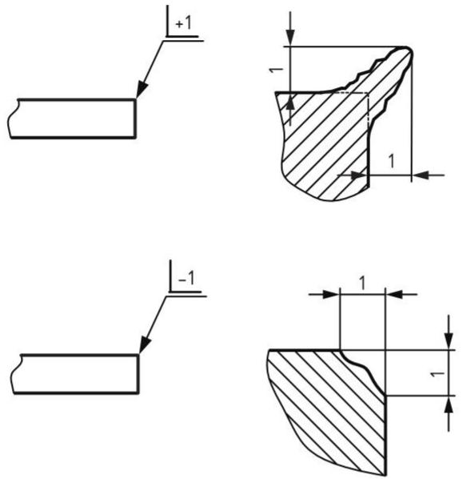

text_image

+1
-1

Figure 11 — Size of an external edges

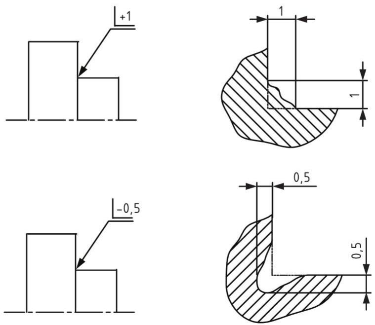

text_image

+1
-0,5
1
1
0,5
0,5

Figure 12 — Size of internal edges

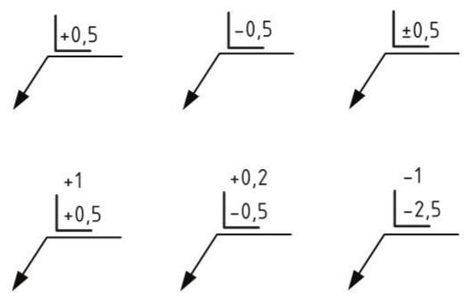

text_image

+0,5
-0,5
±0,5
+1
+0,2
-0,5
-1
-2,5

Figure 13 — Examples of indications of size

## 4.4 Direction of passing or undercut

## 4.4.1 Indication in one direction

Wherever indication of one direction of passing on an external edge or undercut on an internal edge is needed, the indication of size shall be given in the area $a_2$ or $a_3$ (see Figure A.1), accordingly (see Figures 14, 15 and 16).

Indication in one direction cannot be used for undercut on external edges and passing on internal edges. For angles other than $90^{\circ}$ , the direction cannot be specified.

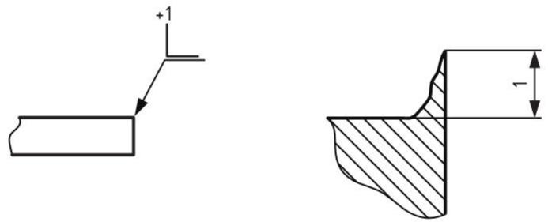

text_image

+1
←

Figure 14 — Direction of the passing on an external edge

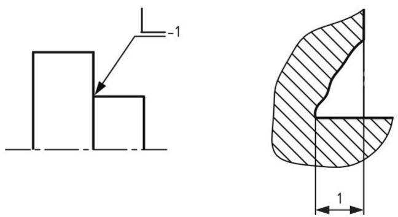

text_image

-1
1

Figure 15 — Direction of the undercut on an internal edge  
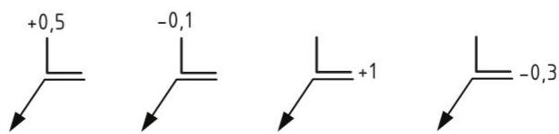

chemical

Four chemical reaction equations showing different L-configuration configurations with numerical values

Figure 16 — Examples of indications of direction

## 4.4.2 Asymmetrical indication

Wherever asymmetrical indication of directions of undercut on an external edge or passing on an internal edge is needed, the indication of size shall be given in the area $a_2$ and $a_3$ (see Figure A.1), accordingly (see Figures 17, 18 and 19).

Asymmetrical indications cannot be used for passing on external edges and undercut on internal edges.

For angles other than $90^{\circ}$ , the direction cannot be specified.

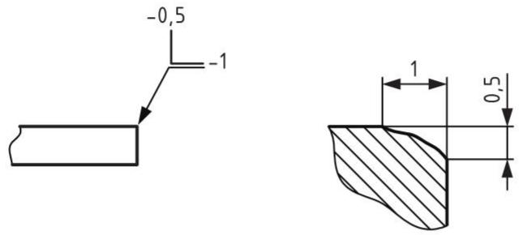  
Figure 17 — Direction of undercut on an external edge

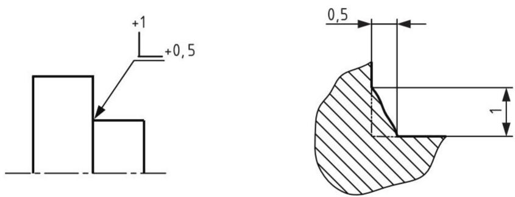

Figure 18 — Direction of the passing on an internal edge  
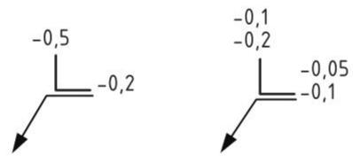  
Figure 19 — Examples of asymmetrical indications of direction

## 4.5 Location of the basic symbol

## 4.5.1 General

Edges of undefined shape shall be indicated by

— an individual indication for a single edge or for all edges around the represented profile of a part,  
— limited areas of the edges of the represented profile of a part, and  
— general indications to not specified edges of a part.

Individual indications shall be assigned to a line (e.g. visible outlines, areas with specific treatment or extension lines), or to a point representing an edge parallel with, or vertical to, the projection plane (see Figures 20, 21 and 22).

General indications shall be indicated only once for all the edges and shall be located near the title block or in a notes area (see Figures 25 to 29 and Annex B).

## 4.5.2 Individual indication of edges

The following features maybe indicated:

— edges vertical to the projection plane (see Figure 20, front view);  
— edges of a feature, such as a hole (see Figure 20, section);  
— edges of the front and the back, if only one view is represented and the outlines of both front and back are the same (see Figure 21). If other edges exist between front and back they will be included, unless otherwise specified. Specify the quantity of edges if there is any doubt (see Figure 22) or make it clear in a separate view.  
— all edges around the profile of a part represented on the drawing, if the symbol “all around” is added to the basic symbol (see Figures 21 and 22). The “all around” symbol shall not be used in sectional representations. For further information concerning the application of this symbol element, see ISO 128-22:1999, Annex B.

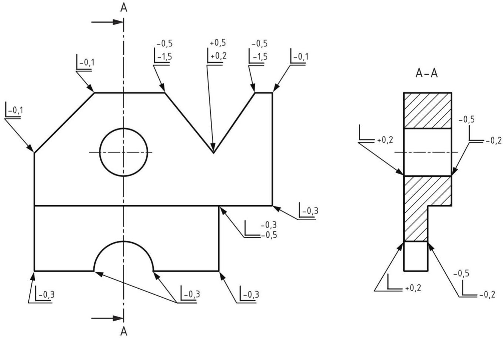  
Figure 20 — Edges vertical to the projection plane

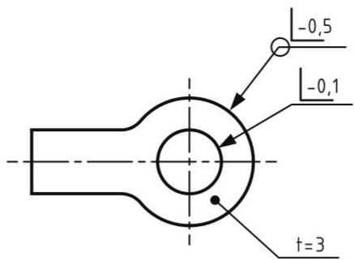

text_image

-0,5
-0,1
t=3

Figure 21 — Edges around the profile of a part, both sides  
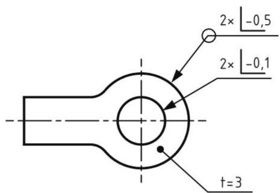

text_image

2× -0,5
2× -0,1
t=3

Figure 22 — Edges around a profile of a part, both sides clearly defined

## 4.5.3 Indication of limited areas

If the specification for the condition of an edge is valid only for a part of the length of that edge, this shall be indicated with the corresponding dimension. The limited area shall be represented by a long-dashed dotted wide line, see ISO 128-24, line type 04,2 (see Figure 23), or with the between symbol according to ISO 1101 (see Figure 24).

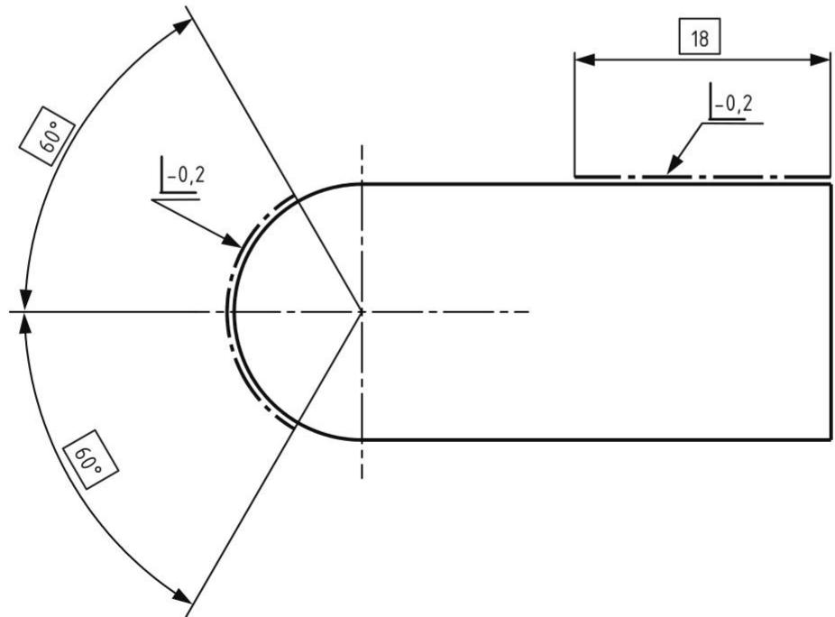

text_image

60°
-0,2
60°
18
-0,2

Figure 23 — Limited areas of an edge represented by long-dashed-dotted lines

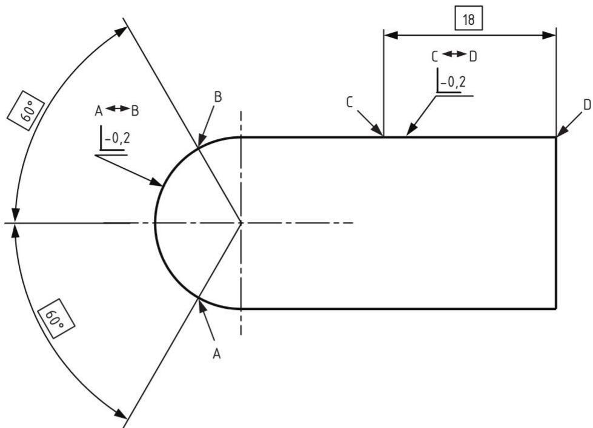

text_image

60°
A←B
-0,2
B
60°
A
C
D
-0,2
18
C←D

Figure 24 — Limited areas of an edge represented by between symbols

## 4.5.4 General indication of edges

If the specification for the condition of edges is referring to all edges of a part, one general indication at the appropriate position on the drawing, near the title block or in a notes area (see Figure 25) will suffice. General indications of conditions common to only external or internal edges shall be indicated in accordance with Figures 26 and 27, respectively.

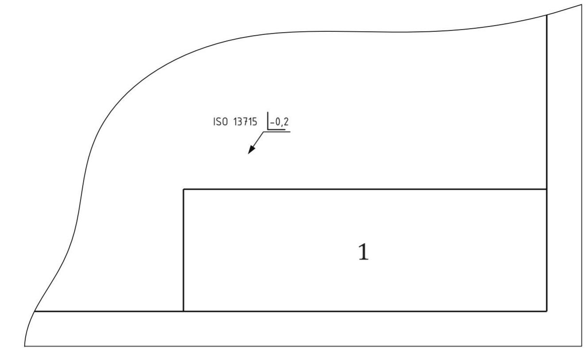

text_image

ISO 13715 -0,2
1

Key  
1 title block

Figure 25 — Condition for all edges  
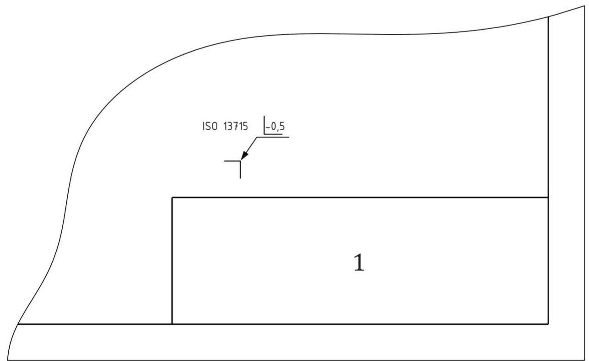

text_image

ISO 13715
-0,5
1

Key  
1 title block

Figure 26 — Condition for all external edges

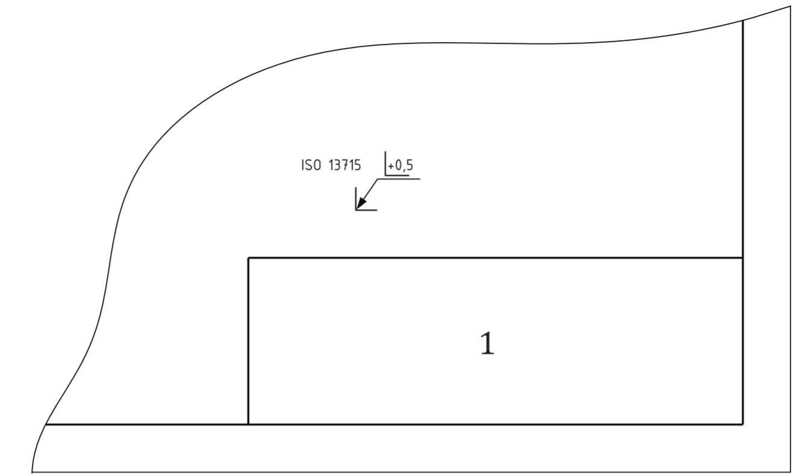

text_image

ISO 13715 +0,5
1

Key  
1 title block

Figure 27 — Condition for all internal edges

## 4.5.5 Exceptions from general indications of edges

To emphasize in a general indication that another condition for some edges is required elsewhere on the drawing, an additional indication in parentheses shall be placed to the right of the general indication (see Figure 28).

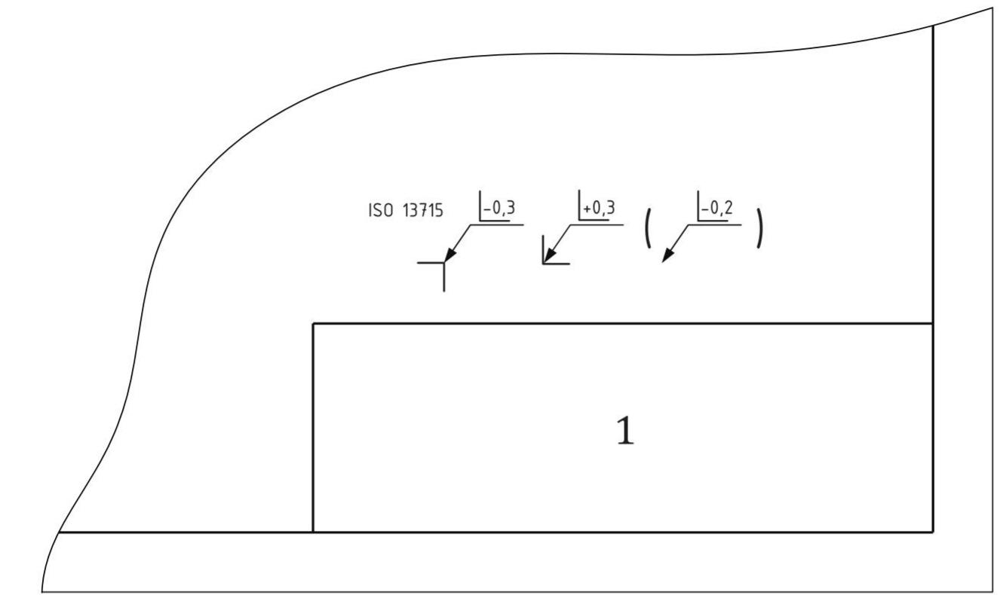

text_image

ISO 13715
-0,3
+0,3
(-0,2)
1

Key  
1 title block

Figure 28 — External and internal edges with exception

If more than one additional requirement, only the basic symbol shall appear in parentheses to the right of the general indication (see Figure 29).

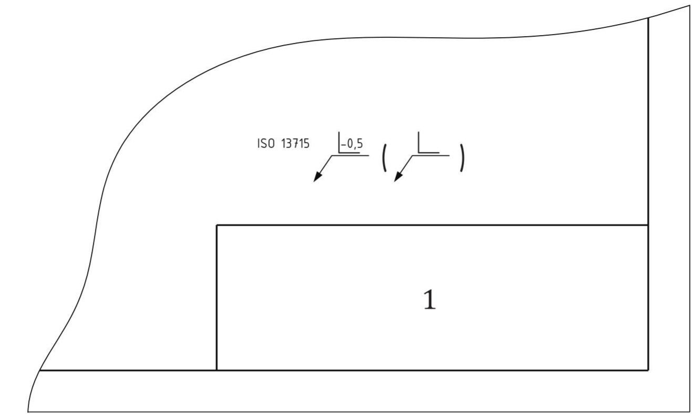

text_image

ISO 13715
-0,5 ( )
1

Key  
1 title block

Figure 29 — Condition for all edges with more than one exception

## 4.6 Reference to this document

This document is to be referenced to on the drawing. The following indication as shown in Figure 30, shall be stated in or near the title block or in a notes area.

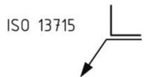  
Figure 30 — Reference to this document

# Annex A

# (normative)

# Proportions and dimensions of graphical symbols

## A.1 General requirements

In order to harmonize the size of the graphical symbols specified in this document with that of the other indications on the drawing (dimensions, tolerances, etc.), observe the rules prescribed in ISO 81714-1.

Lettering shall be of the same height and line width as that used for dimensioning. The distance between lines should be twice the line width.

## A.2 Proportions

The graphical symbols and the additional indications in the areas $a_{1}$ to $a_{3}$ shall be draughted in accordance with Figure A.1.

The use of the all-around symbol element is optional; the angle of the leader line will depend on the case of application. The length of the leader line should be equal to, or greater than $1,5 \times h$ . If appropriate, the reference line may be extended.

## A.3 Dimensions

The dimensional requirements of the graphical symbols and additional indications are specified in Table A.1.

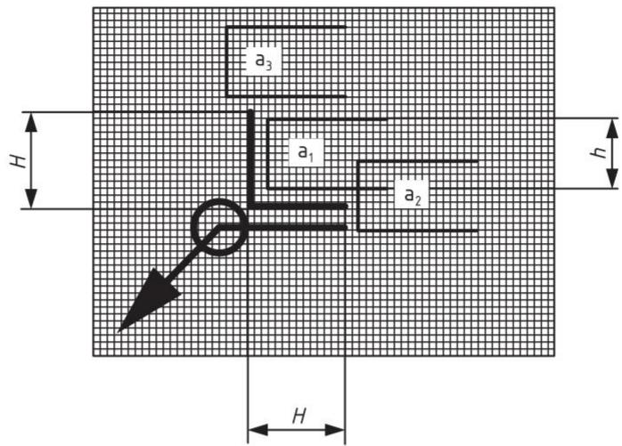

text_image

a₃
H
a₁
a₂
h
H

Figure A.1 — Proportions

Table A.1 — Dimensions  
Dimensions in millimetres

<table><tr><td>Lettering height, h</td><td>3,5</td><td>5</td><td>7</td><td>10</td><td>14</td></tr><tr><td>Line width for symbols and lettering type B ISO 3098-1, d</td><td>0,35</td><td>0,5</td><td>0,7</td><td>1</td><td>1,4</td></tr><tr><td>Symbol height, H</td><td>5</td><td>7</td><td>10</td><td>14</td><td>20</td></tr></table>

## Annex B (informative)

# Examples of indication of undefined edges

For examples of indication of edges, see Table B.1.

Table B.1 — Indication and associated meaning for undefined edges

<table><tr><td>No.</td><td>Indication</td><td colspan="4">Meaning</td><td>Explanation</td></tr><tr><td>B.1</td><td>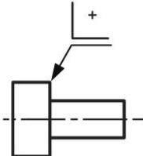</td><td></td><td colspan="3">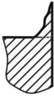 or 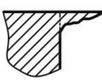 or 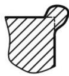</td><td>External edgePassing permittedSize undefinedDirection undefined</td></tr><tr><td>B.2</td><td></td><td></td><td colspan="3">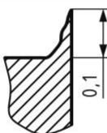 or 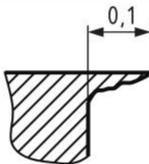 or 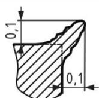</td><td>External edgePassing permittedSize 0 mm to 0,1 mmDirection undefined</td></tr><tr><td>B.3</td><td>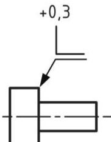</td><td></td><td colspan="3">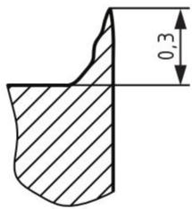</td><td>External edgePassing permittedSize 0 mm to 0,3 mmDirection defined</td></tr><tr><td>B.4</td><td>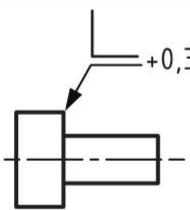</td><td></td><td colspan="3">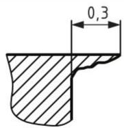</td><td>External edgePassing permittedSize 0 mm to 0,3 mmDirection defined</td></tr><tr><td>B.5</td><td>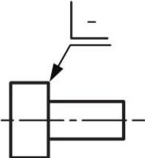</td><td></td><td colspan="3">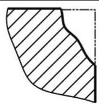 or 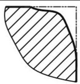</td><td>External edgeUndercut requiredSize undefinedDirection undefined</td></tr><tr><td>B.6</td><td>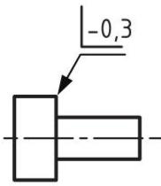</td><td></td><td colspan="3"> or </td><td>External edgeUndercut requiredSize 0 mm to 0,3 mmDirection undefined</td></tr><tr><td>B.7</td><td></td><td></td><td colspan="3"> or </td><td>External edgeUndercut requiredSize 0,1 mm to 0,3 mmDirection undefined</td></tr><tr><td>B.8</td><td></td><td></td><td colspan="3"></td><td>External edgeUndercut requiredSize 0 to 0,5 verticalSize 0 to 1 horizontalDirection defined</td></tr><tr><td rowspan="3">B.9</td><td rowspan="3"></td><td rowspan="3"></td><td colspan="3"> or </td><td rowspan="3">External edgePassing permittedSize 0 to 0,05Undercut permittedSize 0 mm to 0,05 mmDirection undefined</td></tr><tr><td colspan="3"> or </td></tr><tr><td colspan="3"></td></tr><tr><td rowspan="3">B.10</td><td rowspan="3"></td><td rowspan="3"></td><td colspan="3"> or </td><td rowspan="3">External edgePassing permittedSize 0 mm to 0,3 mmUndercut permittedSize 0 mm to 0,1 mmDirection undefined</td></tr><tr><td colspan="3"> or </td></tr><tr><td colspan="3"></td></tr></table>

Table B.1 (continued)

<table><tr><td>No.</td><td>Indication</td><td colspan="5">Meaning</td><td>Explanation</td></tr><tr><td>B.11</td><td></td><td colspan="5"> or  or </td><td>Internal edgeUndercut requiredSize undefinedDirection undefined</td></tr><tr><td>B.12</td><td></td><td colspan="5"> or  or </td><td>Internal edgeUndercut requiredSize 0 mm to 0,3 mmDirection undefined</td></tr><tr><td rowspan="2">B.13</td><td rowspan="2"></td><td colspan="5"> or  or </td><td rowspan="2">Internal edgeUndercut requiredSize 0,1 mm to 0,3 mmDirection undefined</td></tr><tr><td colspan="5"> or  or </td></tr><tr><td>B.14</td><td></td><td colspan="5"></td><td>Internal edgeUndercut requiredSize 0 mm to 0,3 mmDirection defined</td></tr><tr><td>B.15</td><td></td><td colspan="5"></td><td>Internal edgeUndercut requiredSize 0 mm to 0,3 mmDirection defined</td></tr><tr><td>B.16</td><td></td><td colspan="5">or or </td><td>Internal edgePassing permittedSize 0,3 mm to 1 mmDirection undefined</td></tr><tr><td>B.17</td><td></td><td colspan="5"> or   or</td><td>Internal edgePassing permittedSize 0 mm to 0,05 mmUndercut permittedSize 0 mm to 0,05 mmDirection undefined</td></tr><tr><td>B.18</td><td></td><td colspan="5">   or </td><td>Internal edgePassing permittedSize 0 mm to 1 mmUndercut permittedSize 0 mm to 0,3 mmDirection undefined</td></tr></table>

## Bibliography

[1] ISO 128-20, Technical drawings — General principles of presentation — Part 20: Basic conventions for lines  
[2] ISO 128-22:1999, Technical drawings — General principles of presentation — Part 22: Basic conventions and applications for leader lines and reference lines  
[3] ISO 128-24, Technical drawings — General principles of presentation — Part 24: Lines on mechanical engineering drawings  
[4] ISO 129-1, Technical drawings — Indication of dimensions and tolerances — Part 1: General principles  
[5] ISO 1101, Geometrical product specifications (GPS) — Geometrical tolerancing — Tolerances of form, orientation, location and run-out  
[6] ISO 3098-1, Technical product documentation — Lettering — Part 1: General requirements  
[7] ISO 81714-1, Design of graphical symbols for use in the technical documentation of products — Part 1: Basic rules