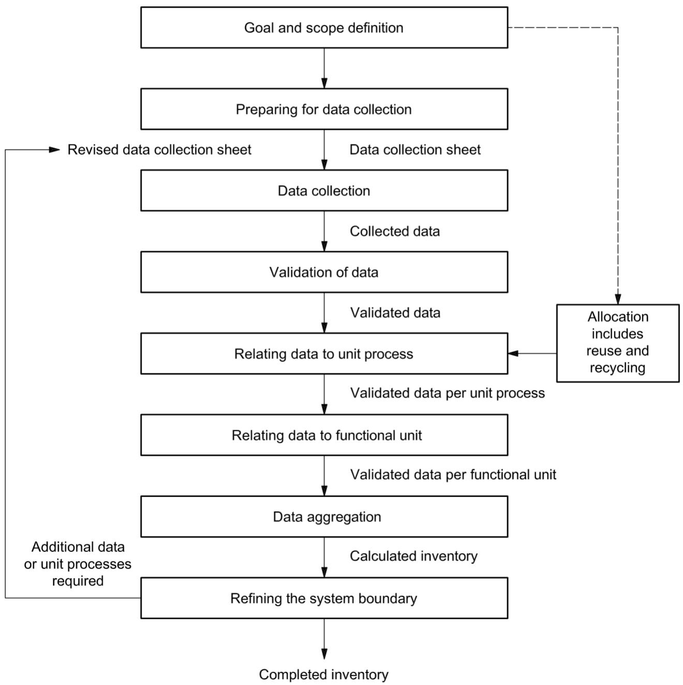
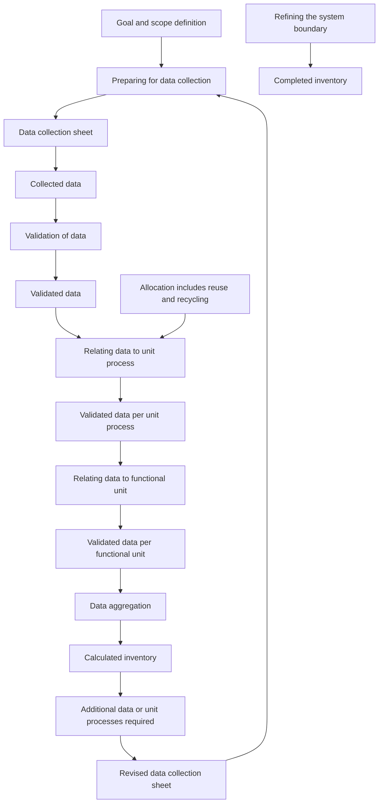
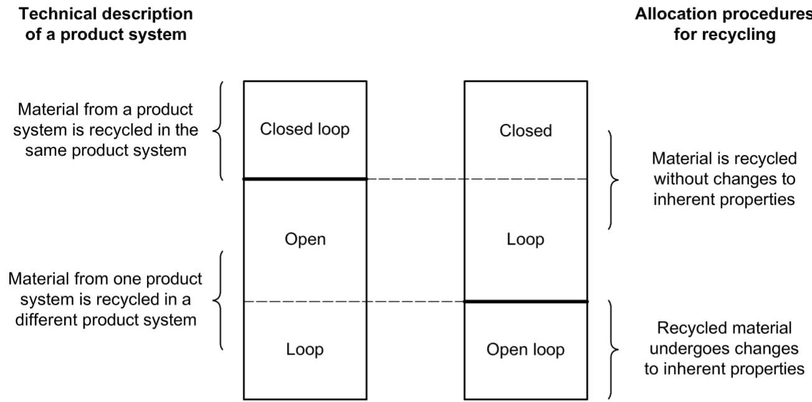
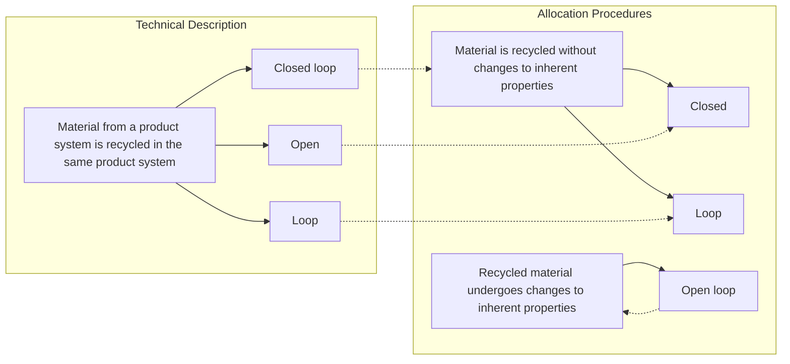
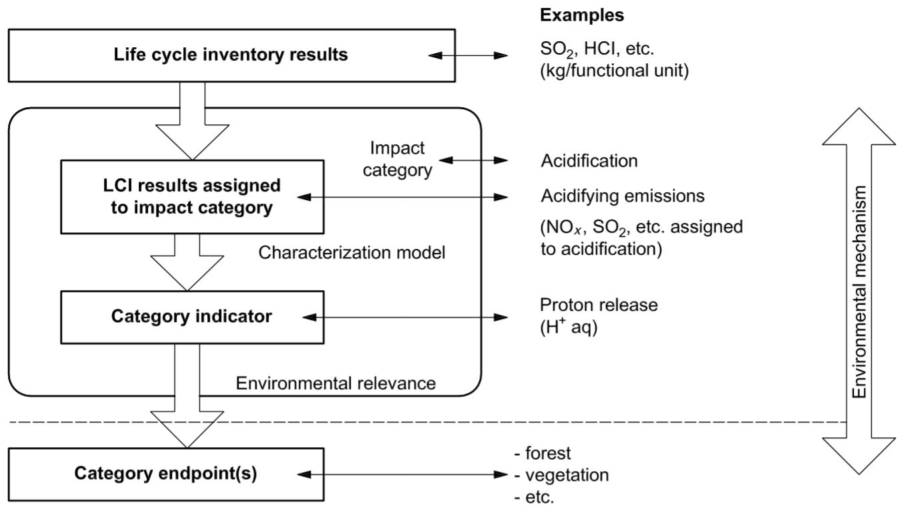
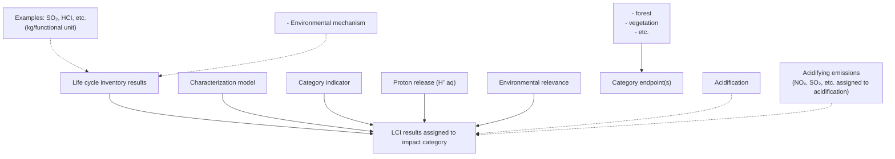
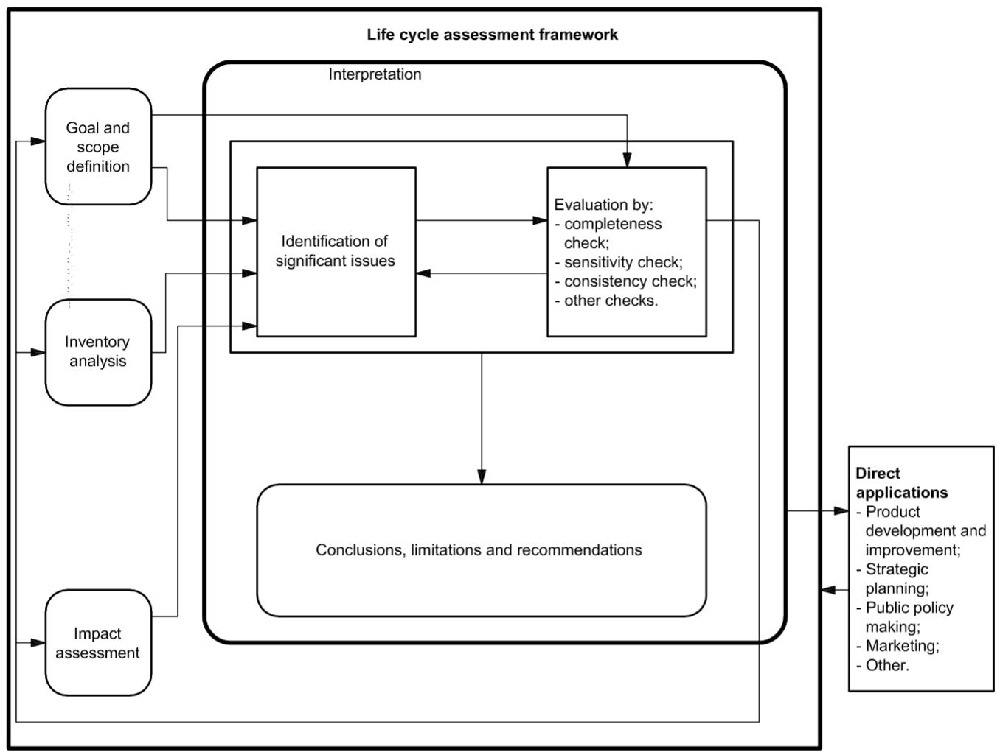

First edition

2006-07-01

# Environmental management — Life cycle assessment — Requirements and guidelines

Management environnemental — Analyse du cycle de vie — Exigences et lignes directrices

## PDF disclaimer

This PDF file may contain embedded typefaces. In accordance with Adobe's licensing policy, this file may be printed or viewed but shall not be edited unless the typefaces which are embedded are licensed to and installed on the computer performing the editing. In downloading this file, parties accept therein the responsibility of not infringing Adobe's licensing policy. The ISO Central Secretariat accepts no liability in this area.

Adobe is a trademark of Adobe Systems Incorporated.

Details of the software products used to create this PDF file can be found in the General Info relative to the file; the PDF-creation parameters were optimized for printing. Every care has been taken to ensure that the file is suitable for use by ISO member bodies. In the unlikely event that a problem relating to it is found, please inform the Central Secretariat at the address given below.

© ISO 2006

All rights reserved. Unless otherwise specified, no part of this publication may be reproduced or utilized in any form or by any means, electronic or mechanical, including photocopying and microfilm, without permission in writing from either ISO at the address below or ISO's member body in the country of the requester.

ISO copyright office

Case postale 56 • CH-1211 Geneva 20

Tel. +41 22 749 01 11

Fax + 41 22 749 09 47

E-mail copyright@iso.org

Web www.iso.org

Published in Switzerland

## Contents

Foreword...... iv

Introduction ...... v

1 Scope 1

2 Normative references 1

3 Terms and definitions....1

4 Methodological framework for LCA....6

4.1 General requirements....6

4.2 Goal and scope definition....7

4.3 Life cycle inventory analysis (LCI).... 11

4.4 Life cycle impact assessment (LCIA) 16

4.5 Life cycle interpretation 23

5 Reporting 27

5.1 General requirements and considerations 27

5.2 Additional requirements and guidance for third-party reports.... 28

5.3 Further reporting requirements for comparative assertion intended to be disclosed to the public....30

6 Critical review....31

6.1 General....31

6.2 Critical review by internal or external expert....31

6.3 Critical review by panel of interested parties 31

Annex A (informative) Examples of data collection sheets 33

Annex B (informative) Examples of life cycle interpretation 36

Bibliography....46

## Foreword

ISO (the International Organization for Standardization) is a worldwide federation of national standards bodies (ISO member bodies). The work of preparing International Standards is normally carried out through ISO technical committees. Each member body interested in a subject for which a technical committee has been established has the right to be represented on that committee. International organizations, governmental and non-governmental, in liaison with ISO, also take part in the work. ISO collaborates closely with the International Electrotechnical Commission (IEC) on all matters of electrotechnical standardization.

International Standards are drafted in accordance with the rules given in the ISO/IEC Directives, Part 2.

The main task of technical committees is to prepare International Standards. Draft International Standards adopted by the technical committees are circulated to the member bodies for voting. Publication as an International Standard requires approval by at least 75 % of the member bodies casting a vote.

Attention is drawn to the possibility that some of the elements of this document may be the subject of patent rights. ISO shall not be held responsible for identifying any or all such patent rights.

ISO 14044 was prepared by Technical Committee ISO/TC 207, Environmental management, Subcommittee SC 5, Life cycle assessment.

This first edition of ISO 14044, together with ISO 14040:2006, cancels and replaces ISO 14040:1997, ISO 14041:1998, ISO 14042:2000 and ISO 14043:2000, which have been technically revised.

## Introduction

The increased awareness of the importance of environmental protection, and the possible impacts associated with products $^{1)}$ , both manufactured and consumed, has increased interest in the development of methods to better understand and address these impacts. One of the techniques being developed for this purpose is life cycle assessment (LCA).

## LCA can assist in

— identifying opportunities to improve the environmental performance of products at various points in their life cycle,  
— informing decision-makers in industry, government or non-government organizations (e.g. for the purpose of strategic planning, priority setting, product or process design or redesign),  
— the selection of relevant indicators of environmental performance, including measurement techniques, and  
— marketing (e.g. implementing an ecolabelling scheme, making an environmental claim, or producing an environmental product declaration).

LCA addresses the environmental aspects and potential environmental impacts $^{2)}$ (e.g. use of resources and environmental consequences of releases) throughout a product's life cycle from raw material acquisition through production, use, end-of-life treatment, recycling and final disposal (i.e. cradle-to-grave).

There are four phases in an LCA study:

a) the goal and scope definition phase,  
b) the inventory analysis phase,  
c) the impact assessment phase, and  
d) the interpretation phase.

The scope, including system boundary and level of detail, of an LCA depends on the subject and the intended use of the study. The depth and the breadth of LCA can differ considerably depending on the goal of a particular LCA.

The life cycle inventory analysis phase (LCI phase) is the second phase of LCA. It is an inventory of input/output data with regard to the system being studied. It involves the collection of the data necessary to meet the goals of the defined study.

The life cycle impact assessment phase (LCIA) is the third phase of the LCA. The purpose of LCIA is to provide additional information to help assess a product system's LCI results so as to better understand their environmental significance.

Life cycle interpretation is the final phase of the LCA procedure, in which the results of an LCI or an LCIA, or both, are summarized and discussed as a basis for conclusions, recommendations and decision-making in accordance with the goal and scope definition.

There are cases where the goal of an LCA may be satisfied by performing only an inventory analysis and an interpretation. This is usually referred to as an LCI study.

This International Standard covers two types of studies: life cycle assessment studies (LCA studies) and life cycle inventory studies (LCI studies). LCI studies are similar to LCA studies but exclude the LCIA phase. LCI are not to be confused with the LCI phase of an LCA study.

Generally, the information developed in an LCA or LCI study can be used as part of a much more comprehensive decision process. Comparing the results of different LCA or LCI studies is only possible if the assumptions and context of each study are equivalent. Therefore this International Standard contains several requirements and recommendations to ensure transparency on these issues.

LCA is one of several environmental management techniques (e.g. risk assessment, environmental performance evaluation, environmental auditing, and environmental impact assessment) and might not be the most appropriate technique to use in all situations. LCA typically does not address the economic or social aspects of a product, but the life cycle approach and methodologies described in this International Standard may be applied to these other aspects.

This International Standard, like other International Standards, is not intended to be used to create non-tariff trade barriers or to increase or change an organization's legal obligations.

# Environmental management — Life cycle assessment — Requirements and guidelines

## 1 Scope

This International Standard specifies requirements and provides guidelines for life cycle assessment (LCA) including

a) the goal and scope definition of the LCA,  
b) the life cycle inventory analysis (LCI) phase,  
c) the life cycle impact assessment (LCIA) phase,  
d) the life cycle interpretation phase,  
e) reporting and critical review of the LCA,  
f) limitations of the LCA,  
g) relationship between the LCA phases, and  
h) conditions for use of value choices and optional elements.

This International Standard covers life cycle assessment (LCA) studies and life cycle inventory (LCI) studies.

The intended application of LCA or LCI results is considered during the goal and scope definition, but the application itself is outside the scope of this International Standard.

This International Standard is not intended for contractual or regulatory purposes or registration and certification.

## 2 Normative references

The following referenced documents are indispensable for the application of this document. For dated references, only the edition cited applies. For undated references, the latest edition of the referenced document (including any amendments) applies.

ISO 14040:2006, Environmental management — Life cycle assessment — Principles and framework

## 3 Terms and definitions

For the purposes of this document, the following terms and definitions apply.

NOTE These terms and definitions are taken from ISO 14040:2006 and are repeated for the convenience of users of this International Standard.

## 3.1

## life cycle

consecutive and interlinked stages of a product system, from raw material acquisition or generation from natural resources to final disposal

## 3.2

## life cycle assessment

## LCA

compilation and evaluation of the inputs, outputs and the potential environmental impacts of a product system throughout its life cycle

## 3.3

## life cycle inventory analysis

## LCI

phase of life cycle assessment involving the compilation and quantification of inputs and outputs for a product throughout its life cycle

## 3.4

## life cycle impact assessment

## LCIA

phase of life cycle assessment aimed at understanding and evaluating the magnitude and significance of the potential environmental impacts for a product system throughout the life cycle of the product

## 3.5

## life cycle interpretation

phase of life cycle assessment in which the findings of either the inventory analysis or the impact assessment, or both, are evaluated in relation to the defined goal and scope in order to reach conclusions and recommendations

## 3.6

## comparative assertion

environmental claim regarding the superiority or equivalence of one product versus a competing product that performs the same function

## 3.7

## transparency

open, comprehensive and understandable presentation of information

## 3.8

## environmental aspect

element of an organization's activities, products or services that can interact with the environment

[ISO 14001:2004; definition 3.6]

## 3.9

## product

any goods or service

NOTE 1 The product can be categorized as follows:

— services (e.g. transport);  
— software (e.g. computer program, dictionary);  
— hardware (e.g. engine mechanical part);  
— processed materials (e.g. lubricant);

NOTE 2 Services have tangible and intangible elements. Provision of a service can involve, for example, the following:

— an activity performed on a customer-supplied tangible product (e.g. automobile to be repaired);  
— an activity performed on a customer-supplied intangible product (e.g. the income statement needed to prepare a tax return);  
— the delivery of an intangible product (e.g. the delivery of information in the context of knowledge transmission);  
— the creation of ambience for the customer (e.g. in hotels and restaurants).

Software consists of information and is generally intangible and can be in the form of approaches, transactions or procedures.

Hardware is generally tangible and its amount is a countable characteristic. Processed materials are generally tangible and their amount is a continuous characteristic.

NOTE 3 Adapted from ISO 14021:1999 and ISO 9000:2005.

## 3.10

## co-product

any of two or more products coming from the same unit process or product system

## 3.11

## process

set of interrelated or interacting activities that transforms inputs into outputs

[ISO 9000:2005, definition 3.4.1 (without notes)]

## 3.12

## elementary flow

material or energy entering the system being studied that has been drawn from the environment without previous human transformation, or material or energy leaving the system being studied that is released into the environment without subsequent human transformation

## 3.13

## energy flow

input to or output from a unit process or product system, quantified in energy units

NOTE Energy flow that is an input may be called an energy input; energy flow that is an output may be called an energy output.

## 3.14

## feedstock energy

heat of combustion of a raw material input that is not used as an energy source to a product system, expressed in terms of higher heating value or lower heating value

NOTE Care is necessary to ensure that the energy content of raw materials is not counted twice.

## 3.15

## raw material

primary or secondary material that is used to produce a product

NOTE Secondary material includes recycled material.

## 3.16

## ancillary input

material input that is used by the unit process producing the product, but does not constitute part of the product

## 3.17

## allocation

partitioning the input or output flows of a process or a product system between the product system under study and one or more other product systems

## 3.18

## cut-off criteria

specification of the amount of material or energy flow or the level of environmental significance associated with unit processes or product system to be excluded from a study

## 3.19

## data quality

characteristics of data that relate to their ability to satisfy stated requirements

## 3.20

## functional unit

quantified performance of a product system for use as a reference unit

## 3.21

## input

product, material or energy flow that enters a unit process

NOTE Products and materials include raw materials, intermediate products and co-products.

## 3.22

## intermediate flow

product, material or energy flow occurring between unit processes of the product system being studied

## 3.23

## intermediate product

output from a unit process that is input to other unit processes that require further transformation within the system

## 3.24

## life cycle inventory analysis result

## LCI result

outcome of a life cycle inventory analysis that catalogues the flows crossing the system boundary and provides the starting point for life cycle impact assessment

## 3.25

## output

product, material or energy flow that leaves a unit process

NOTE Products and materials include raw materials, intermediate products, co-products, and releases.

## 3.26

## process energy

energy input required for operating the process or equipment within a unit process, excluding energy inputs for production and delivery of the energy itself

## 3.27

## product flow

products entering from or leaving to another product system

## 3.28

## product system

collection of unit processes with elementary and product flows, performing one or more defined functions, and which models the life cycle of a product

## 3.29

## reference flow

measure of the outputs from processes in a given product system required to fulfil the function expressed by the functional unit

## 3.30

## releases

emissions to air and discharges to water and soil

## 3.31

## sensitivity analysis

systematic procedures for estimating the effects of the choices made regarding methods and data on the outcome of a study

## 3.32

## system boundary

set of criteria specifying which unit processes are part of a product system

NOTE The term “system boundary” is not used in this International Standard in relation to LCIA.

## 3.33

## uncertainty analysis

systematic procedure to quantify the uncertainty introduced in the results of a life cycle inventory analysis due to the cumulative effects of model imprecision, input uncertainty and data variability

NOTE Either ranges or probability distributions are used to determine uncertainty in the results.

## 3.34

## unit process

smallest element considered in the life cycle inventory analysis for which input and output data are quantified

## 3.35

## waste

substances or objects which the holder intends or is required to dispose of

NOTE The definition is taken from the Basel Convention on the Control of Transboundary Movements of Hazardous Wastes and Their Disposal (22 March 1989) but is not confined in this International Standard to hazardous waste.

## 3.36

## category endpoint

attribute or aspect of natural environment, human health, or resources, identifying an environmental issue giving cause for concern

## 3.37

## characterization factor

factor derived from a characterization model which is applied to convert an assigned life cycle inventory analysis result to the common unit of the category indicator

NOTE The common unit allows calculation of the category indicator result.

## 3.38

## environmental mechanism

system of physical, chemical and biological processes for a given impact category, linking the life cycle inventory analysis results to category indicators and to category endpoints

## 3.39

## impact category

class representing environmental issues of concern to which life cycle inventory analysis results may be assigned

## 3.40

## impact category indicator

quantifiable representation of an impact category

NOTE The shorter expression “category indicator” is used in this International Standard for improved readability.

## 3.41

## completeness check

process of verifying whether information from the phases of a life cycle assessment is sufficient for reaching conclusions in accordance with the goal and scope definition

## 3.42

## consistency check

process of verifying that the assumptions, methods and data are consistently applied throughout the study and are in accordance with the goal and scope definition performed before conclusions are reached

## 3.43

## sensitivity check

process of verifying that the information obtained from a sensitivity analysis is relevant for reaching the conclusions and giving recommendations

## 3.44

## evaluation

element within the life cycle interpretation phase intended to establish confidence in the results of the life cycle assessment

NOTE Evaluation includes completeness check, sensitivity check, consistency check, and any other validation that may be required according to the goal and scope definition of the study

## 3.45

## critical review

process intended to ensure consistency between a life cycle assessment and the principles and requirements of the International Standards on life cycle assessment

NOTE 1 The principles are described in ISO 14040:2006, 4.1.

NOTE 2 The requirements are described in this International Standard.

## 3.46

## interested party

individual or group concerned with or affected by the environmental performance of a product system, or by the results of the life cycle assessment

## 4 Methodological framework for LCA

## 4.1 General requirements

See ISO 14040 for the principles and framework to be used to conduct an LCA.

LCA studies shall include the goal and scope definition, inventory analysis, impact assessment and interpretation of results.

LCI studies shall include definition of the goal and scope, inventory analysis and interpretation of results. The requirements and recommendations of this International Standard, with the exception of those provisions regarding impact assessment, also apply to life cycle inventory studies.

An LCI study alone shall not be used for comparisons intended to be used in comparative assertions intended to be disclosed to the public.

It should be recognized that there is no scientific basis for reducing LCA results to a single overall score or number.

## 4.2 Goal and scope definition

## 4.2.1 General

The goal and scope of an LCA shall be clearly defined and shall be consistent with the intended application. Due to the iterative nature of LCA, the scope may have to be refined during the study.

## 4.2.2 Goal of the study

In defining the goal of an LCA, the following items shall be unambiguously stated:

— the intended application;  
— the reasons for carrying out the study:  
— the intended audience, i.e. to whom the results of the study are intended to be communicated:  
— whether the results are intended to be used in comparative assertions intended to be disclosed to the public.

## 4.2.3 Scope of the study

## 4.2.3.1 General

In defining the scope of an LCA, the following items shall be considered and clearly described:

— the product system to be studied;  
— the functions of the product system or, in the case of comparative studies, the systems;  
— the functional unit;  
— the system boundary;  
— allocation procedures;  
— LCIA methodology and types of impacts;  
— interpretation to be used;  
— data requirements;  
— assumptions;  
— value choices and optional elements;  
— limitations;  
— data quality requirements;  
— type of critical review, if any;  
— type and format of the report required for the study.

In some cases, the goal and scope of the study may be revised due to unforeseen limitations, constraints or as a result of additional information. Such modifications, together with their justification, should be documented.

Some of the items above are specified in detail in 4.2.3.2 to 4.2.3.8.

## 4.2.3.2 Function and functional unit

The scope of an LCA shall clearly specify the functions (performance characteristics) of the system being studied. The functional unit shall be consistent with the goal and scope of the study. One of the primary purposes of a functional unit is to provide a reference to which the input and output data are normalized (in a mathematical sense). Therefore the functional unit shall be clearly defined and measurable.

Having chosen the functional unit, the reference flow shall be defined. Comparisons between systems shall be made on the basis of the same function(s), quantified by the same functional unit(s) in the form of their reference flows. If additional functions of any of the systems are not taken into account in the comparison of functional units, then these omissions shall be explained and documented. As an alternative, systems associated with the delivery of this function may be added to the boundary of the other system to make the systems more comparable. In these cases, the processes selected shall be explained and documented.

## 4.2.3.3 System boundary

4.2.3.3.1 The system boundary determines which unit processes shall be included within the LCA. The selection of the system boundary shall be consistent with the goal of the study. The criteria used in establishing the system boundary shall be identified and explained.

Decisions shall be made regarding which unit processes to include in the study and the level of detail to which these unit processes shall be studied.

The deletion of life cycle stages, processes, inputs or outputs is only permitted if it does not significantly change the overall conclusions of the study. Any decisions to omit life cycle stages, processes, inputs or outputs shall be clearly stated, and the reasons and implications for their omission shall be explained.

Decisions shall also be made regarding which inputs and outputs shall be included and the level of detail of the LCA shall be clearly stated.

4.2.3.3.2 It is helpful to describe the system using a process flow diagram showing the unit processes and their inter-relationships. Each of the unit processes should be initially described to define

— where the unit process begins, in terms of the receipt of raw materials or intermediate products,  
— the nature of the transformations and operations that occur as part of the unit process, and  
— where the unit process ends, in terms of the destination of the intermediate or final products.

Ideally, the product system should be modelled in such a manner that inputs and outputs at its boundary are elementary and product flows. It is an iterative process to identify the inputs and outputs that should be traced to the environment, i.e. to identify which unit processes producing the inputs (or which unit processes receiving the outputs) should be included in the product system under study. The initial identification is made using available data. Inputs and outputs should be more fully identified after additional data are collected during the course of the study, and then subjected to a sensitivity analysis (see 4.3.3.4).

For material inputs, the analysis begins with an initial selection of inputs to be studied. This selection should be based on an identification of the inputs associated with each of the unit processes to be modelled. This effort may be undertaken with data collected from specific sites or from published sources. The goal is to identify the significant inputs associated with each of the unit processes.

Energy inputs and outputs shall be treated as any other input or output to an LCA. The various types of energy inputs and outputs shall include inputs and outputs relevant for the production and delivery of fuels, feedstock energy and process energy used within the system being modelled.

4.2.3.3.3 The cut-off criteria for initial inclusion of inputs and outputs and the assumptions on which the cut-off criteria are established shall be clearly described. The effect on the outcome of the study of the cut-off criteria selected shall also be assessed and described in the final report.

Several cut-off criteria are used in LCA practice to decide which inputs are to be included in the assessment, such as mass, energy and environmental significance. Making the initial identification of inputs based on mass contribution alone may result in important inputs being omitted from the study. Accordingly, energy and environmental significance should also be used as cut-off criteria in this process.

a) Mass: an appropriate decision, when using mass as a criterion, would require the inclusion in the study of all inputs that cumulatively contribute more than a defined percentage to the mass input of the product system being modelled.  
b) Energy: similarly, an appropriate decision, when using energy as a criterion, would require the inclusion in the study of those inputs that cumulatively contribute more than a defined percentage of the product system's energy inputs.  
c) Environmental significance: decisions on cut-off criteria should be made to include inputs that contribute more than an additional defined amount of the estimated quantity of individual data of the product system that are specially selected because of environmental relevance.

Similar cut-off criteria may also be used to identify which outputs should be traced to the environment, e.g. by including final waste treatment processes.

Where the study is intended to be used in comparative assertions intended to be disclosed to the public, the final sensitivity analysis of the inputs and outputs data shall include the mass, energy and environmental significance criteria so that all inputs that cumulatively contribute more than a defined amount (e.g. percentage) to the total are included in the study.

All of the selected inputs identified through this process should be modelled as elementary flows.

It should be decided which inputs and outputs data have to be traced to other product systems, including flows subject to allocation. The system should be described in sufficient detail and clarity to allow another practitioner to duplicate the inventory analysis.

## 4.2.3.4 LCIA methodology and types of impacts

It shall be determined which impact categories, category indicators and characterization models are included within the LCA study. The selection of impact categories, category indicators and characterization models used in the LCIA methodology shall be consistent with the goal of the study and considered as described in 4.4.2.2.

## 4.2.3.5 Types and sources of data

Data selected for an LCA depend on the goal and scope of the study. Such data may be collected from the production sites associated with the unit processes within the system boundary, or they may be obtained or calculated from other sources. In practice, all data may include a mixture of measured, calculated or estimated data.

Inputs may include, but are not limited to, use of mineral resources (e.g. metals from ores or recycling, services like transportation or energy supply, and use of ancillary materials like lubricants or fertilisers).

As part of emissions to air, emissions of carbon monoxide, carbon dioxide, sulfur oxides, nitrogen oxides, etc. may be separately identified.

Emissions to air, and discharges to water and soil, often represent releases from point or diffuse sources, after passing through pollution control devices. These data should also include fugitive emissions, when significant. Indicator parameters may include, but are not limited to,

— biochemical oxygen demand (BOD),  
— chemical oxygen demand (COD),

— absorbable organic halogen compounds (AOX),  
— total halogen content (TOX), and  
— volatile organic chemicals (VOC).

In addition, data representing noise and vibration, land use, radiation, odour and waste heat may be collected.

## 4.2.3.6 Data quality requirements

4.2.3.6.1 Data quality requirements shall be specified to enable the goal and scope of the LCA to be met.

4.2.3.6.2 The data quality requirements should address the following:

a) time-related coverage: age of data and the minimum length of time over which data should be collected;  
b) geographical coverage: geographical area from which data for unit processes should be collected to satisfy the goal of the study;  
c) technology coverage: specific technology or technology mix;  
d) precision: measure of the variability of the data values for each data expressed (e.g. variance);  
e) completeness: percentage of flow that is measured or estimated;  
f) representativeness: qualitative assessment of the degree to which the data set reflects the true population of interest (i.e. geographical coverage, time period and technology coverage);  
g) consistency: qualitative assessment of whether the study methodology is applied uniformly to the various components of the analysis;  
h) reproducibility: qualitative assessment of the extent to which information about the methodology and data values would allow an independent practitioner to reproduce the results reported in the study;  
i) sources of the data;  
j) uncertainty of the information (e.g. data, models and assumptions).

Where a study is intended to be used in comparative assertions intended to be disclosed to the public, the data quality requirements stated in a) to j) above shall be addressed.

4.2.3.6.3 The treatment of missing data shall be documented. For each unit process and for each reporting location where missing data are identified, the treatment of the missing data and data gaps should result in

— a “non-zero” data value that is explained,  
— a "zero" data value if explained, or  
— a calculated value based on the reported values from unit processes employing similar technology.

Data quality should be characterized by both quantitative and qualitative aspects as well as by the methods used to collect and integrate those data.

Data from specific sites or representative averages should be used for those unit processes that contribute the majority of the mass and energy flows in the systems being studied, as determined in the sensitivity analysis performed in 4.3.3.4. Where possible, data from specific sites should also be used for unit processes that are considered to have environmentally relevant inputs and outputs.

## 4.2.3.7 Comparisons between systems

In a comparative study, the equivalence of the systems being compared shall be evaluated before interpreting the results. Consequently, the scope of the study shall be defined in such a way that the systems can be compared. Systems shall be compared using the same functional unit and equivalent methodological considerations, such as performance, system boundary, data quality, allocation procedures, decision rules on evaluating inputs, and outputs and impact assessment. Any differences between systems regarding these parameters shall be identified and reported. If the study is intended to be used for a comparative assertion intended to be disclosed to the public, interested parties shall conduct this evaluation as a critical review.

A life cycle impact assessment shall be performed for studies intended to be used in comparative assertions intended to be disclosed to the public.

## 4.2.3.8 Critical review considerations

The scope of the study shall define

— whether a critical review is necessary and, if so, how to conduct it,  
— the type of critical review needed (see Clause 6), and  
— who would conduct the review, and their level of expertise.

## 4.3 Life cycle inventory analysis (LCI)

## 4.3.1 General

The definition of the goal and scope of a study provides the initial plan for conducting the life cycle inventory phase of an LCA. When executing the plan for the life cycle inventory analysis, the operational steps outlined in Figure 1 should be performed. (It should be noted that some iterative steps are not shown in Figure 1.)

## 4.3.2 Collecting data

4.3.2.1 The qualitative and quantitative data for inclusion in the inventory shall be collected for each unit process that is included within the system boundary. The collected data, whether measured, calculated or estimated, are utilized to quantify the inputs and outputs of a unit process.

When data have been collected from public sources, the source shall be referenced. For those data that may be significant for the conclusions of the study, details about the relevant data collection process, the time when data have been collected, and further information about data quality indicators shall be referenced. If such data do not meet the data quality requirements, this shall be stated.

To decrease the risk of misunderstandings (e.g. resulting in double counting when validating or reusing the data collected), a description of each unit process shall be recorded.

Since data collection may span several reporting locations and published references, measures should be taken to reach uniform and consistent understanding of the product systems to be modelled.

4.3.2.2 These measures should include the following:

— drawing unspecific process flow diagrams that outline all the unit processes to be modelled, including their interrelationships;  
— describing each unit process in detail with respect to factors influencing inputs and outputs;  
— listing of flows and relevant data for operating conditions associated with each unit process;  
— developing a list that specifies the units used;  
— describing the data collection and calculation techniques needed for all data;  
— providing instructions to document clearly any special cases, irregularities or other items associated with the data provided.

Examples of data collection sheets are provided in Annex A.

## 4.3.2.3 The major headings under which data may be classified include

— energy inputs, raw material inputs, ancillary inputs, other physical inputs,  
— products, co-products and waste,  
— releases to air, water and soil, and  
— other environmental aspects.

Within these headings, individual data shall be further detailed to satisfy the goal of the study.



<details>
<summary>flowchart</summary>


</details>

Figure 1 — Simplified procedures for inventory analysis

## 4.3.3 Calculating data

## 4.3.3.1 General

All calculation procedures shall be explicitly documented and the assumptions made shall be clearly stated and explained. The same calculation procedures should be consistently applied throughout the study.

When determining the elementary flows associated with production, the actual production mix should be used whenever possible, in order to reflect the various types of resources that are consumed. As an example, for the production and delivery of electricity, account shall be taken of the electricity mix, the efficiencies of fuel combustion, conversion, transmission and distribution losses.

Inputs and outputs related to a combustible material (e.g. oil, gas or coal) can be transformed into an energy input or output by multiplying them by the relevant heat of combustion. In this case, it shall be reported whether the higher heating value or the lower heating value is used.

Several operational steps are needed for data calculation. These are described in 4.3.3.2 to 4.3.3.4 and 4.3.4.

## 4.3.3.2 Validation of data

A check on data validity shall be conducted during the process of data collection to confirm and provide evidence that the data quality requirements for the intended application have been fulfilled.

Validation may involve establishing, for example, mass balances, energy balances and/or comparative analyses of release factors. As each unit process obeys the laws of conservation of mass and energy, mass and energy balances provide a useful check on the validity of a unit process description. Obvious anomalies in the data resulting from such validation procedures require alternative data that comply with the data selection as established according to 4.2.3.5.

## 4.3.3.3 Relating data to unit process and functional unit

An appropriate flow shall be determined for each unit process. The quantitative input and output data of the unit process shall be calculated in relation to this flow.

Based on the flow chart and the flows between unit processes, the flows of all unit processes are related to the reference flow. The calculation should result in all system input and output data being referenced to the functional unit.

Care should be taken when aggregating the inputs and outputs in the product system. The level of aggregation shall be consistent with the goal of the study. Data should only be aggregated if they are related to equivalent substances and to similar environmental impacts. If more detailed aggregation rules are required, they should be explained in the goal and scope definition phase of the study or should be left to a subsequent impact assessment phase.

## 4.3.3.4 Refining the system boundary

Reflecting the iterative nature of LCA, decisions regarding the data to be included shall be based on a sensitivity analysis to determine their significance, thereby verifying the initial analysis outlined in 4.2.3.3. The initial system boundary shall be revised, as appropriate, in accordance with the cut-off criteria established in the definition of the scope. The results of this refining process and the sensitivity analysis shall be documented.

The sensitivity analysis may result in

— exclusion of life cycle stages or unit processes when lack of significance can be shown by the sensitivity analysis,  
— exclusion of inputs and outputs that lack significance to the results of the study, or  
— inclusion of new unit processes, inputs and outputs that are shown to be significant in the sensitivity analysis.

This analysis serves to limit the subsequent data handling to those input and output data that are determined to be significant to the goal of the LCA.

## 4.3.4 Allocation

## 4.3.4.1 General

The inputs and outputs shall be allocated to the different products according to clearly stated procedures that shall be documented and explained together with the allocation procedure.

The sum of the allocated inputs and outputs of a unit process shall be equal to the inputs and outputs of the unit process before allocation.

Whenever several alternative allocation procedures seem applicable, a sensitivity analysis shall be conducted to illustrate the consequences of the departure from the selected approach.

## 4.3.4.2 Allocation procedure

The study shall identify the processes shared with other product systems and deal with them according to the stepwise procedure ${}^{3)}$ presented below.

a) Step 1: Wherever possible, allocation should be avoided by

1) dividing the unit process to be allocated into two or more sub-processes and collecting the input and output data related to these sub-processes, or  
2) expanding the product system to include the additional functions related to the co-products, taking into account the requirements of 4.2.3.3.

b) Step 2: Where allocation cannot be avoided, the inputs and outputs of the system should be partitioned between its different products or functions in a way that reflects the underlying physical relationships between them; i.e. they should reflect the way in which the inputs and outputs are changed by quantitative changes in the products or functions delivered by the system.

c) Step 3: Where physical relationship alone cannot be established or used as the basis for allocation, the inputs should be allocated between the products and functions in a way that reflects other relationships between them. For example, input and output data might be allocated between co-products in proportion to the economic value of the products.

Some outputs may be partly co-products and partly waste. In such cases, it is necessary to identify the ratio between co-products and waste since the inputs and outputs shall be allocated to the co-products part only.

Allocation procedures shall be uniformly applied to similar inputs and outputs of the system under consideration. For example, if allocation is made to usable products (e.g. intermediate or discarded products) leaving the system, then the allocation procedure shall be similar to the allocation procedure used for such products entering the system.

The inventory is based on material balances between input and output. Allocation procedures should therefore approximate as much as possible such fundamental input/output relationships and characteristics.

## 4.3.4.3 Allocation procedures for reuse and recycling 4)

4.3.4.3.1 The allocation principles and procedures in 4.3.4.1 and 4.3.4.2 also apply to reuse and recycling situations.

3) Formally, Step 1 is not part of the allocation procedure.  
4) In some countries and regions, recycling encompasses re-use, material recovery and energy recovery.

Changes in the inherent properties of materials shall be taken into account. In addition, particularly for the recovery processes between the original and subsequent product system, the system boundary shall be identified and explained, ensuring that the allocation principles are observed as described in 4.3.4.2.

## 4.3.4.3.2 However, in these situations, additional elaboration is needed for the following reasons:

— reuse and recycling (as well as composting, energy recovery and other processes that can be assimilated to reuse/recycling) may imply that the inputs and outputs associated with unit processes for extraction and processing of raw materials and final disposal of products are to be shared by more than one product system;  
— reuse and recycling may change the inherent properties of materials in subsequent use;  
— specific care should be taken when defining system boundary with regard to recovery processes.

## 4.3.4.3.3 Several allocation procedures are applicable for reuse and recycling. The application of some procedures is outlined conceptually in Figure 2 and is distinguished in the following to illustrate how the above constraints can be addressed.

a) A closed-loop allocation procedure applies to closed-loop product systems. It also applies to open-loop product systems where no changes occur in the inherent properties of the recycled material. In such cases, the need for allocation is avoided since the use of secondary material displaces the use of virgin (primary) materials. However, the first use of virgin materials in applicable open-loop product systems may follow an open-loop allocation procedure outlined in b).  
b) An open-loop allocation procedure applies to open-loop product systems where the material is recycled into other product systems and the material undergoes a change to its inherent properties.

## 4.3.4.3.4 The allocation procedures for the shared unit processes mentioned in 4.3.4.3 should use, as the basis for allocation, if feasible, the following order:

— physical properties (e.g. mass);  
— economic value (e.g. market value of the scrap material or recycled material in relation to market value of primary material); or  
— the number of subsequent uses of the recycled material (see ISO/TR 14049).



<details>
<summary>flowchart</summary>


</details>

Figure 2 — Distinction between a technical description of a product system and allocation procedures for recycling

## 4.4 Life cycle impact assessment (LCIA)

## 4.4.1 General

LCIA is different from other techniques, such as environmental performance evaluation, environmental impact assessment and risk assessment, since it is a relative approach based on a functional unit. LCIA may use information gathered by these other techniques.

The LCIA phase shall be carefully planned to achieve the goal and scope of an LCA study. The LCIA phase shall be coordinated with other phases of the LCA to take into account the following possible omissions and sources of uncertainty:

a) whether the quality of the LCI data and results is sufficient to conduct the LCIA in accordance with the study goal and scope definition;  
b) whether the system boundary and data cut-off decisions have been sufficiently reviewed to ensure the availability of LCI results necessary to calculate indicator results for the LCIA;  
c) whether the environmental relevance of the LCIA results is decreased due to the LCI functional unit calculation, system wide averaging, aggregation and allocation.

The LCIA phase includes the collection of indicator results for the different impact categories, which together represent the LCIA profile for the product system.

The LCIA consists of mandatory and optional elements.

## 4.4.2 Mandatory elements of LCIA

## 4.4.2.1 General

The LCIA phase shall include the following mandatory elements:

— selection of impact categories, category indicators and characterization models;  
— assignment of LCI results to the selected impact categories (classification);  
— calculation of category indicator results (characterization).

## 4.4.2.2 Selection of impact categories, category indicators and characterization models

4.4.2.2.1 Whenever impact categories, category indicators and characterization models are selected in an LCA, the related information and sources shall be referenced. This also applies when new impact categories, category indicators or characterization models are defined.

NOTE Examples of impact categories are described in ISO/TR 14047.

Accurate and descriptive names shall be provided for the impact categories and category indicators.

The selection of impact categories, category indicators and characterization models shall be both justified and consistent with the goal and scope of the LCA.

The selection of impact categories shall reflect a comprehensive set of environmental issues related to the product system being studied, taking the goal and scope into consideration.

The environmental mechanism and characterization model that relate the LCI results to the category indicator and provide a basis for characterization factors shall be described.

The appropriateness of the characterization model used for deriving the category indicator in the context of the goal and scope of the study shall be described.

LCI results other than mass and energy flow data included in an LCA (e.g. land use) shall be identified and their relationship to corresponding category indicators shall be determined.

For most LCA studies, existing impact categories, category indicators or characterization models will be selected. However, in some cases existing impact categories, category indicators or characterization models are not sufficient to fulfil the defined goal and scope of the LCA, and new ones have to be defined. When new impact categories, category indicators or characterization models are defined, the recommendations in this sub-clause also apply.

Figure 3 illustrates the concept of category indicators based on an environmental mechanism. The impact category “acidification” is used in Figure 3 as an example. Every impact category has its own environmental mechanism.

Characterization models reflect the environmental mechanism by describing the relationship between the LCI results, category indicators and, in some cases, category endpoint(s). The characterization model is used to derive the characterization factors. The environmental mechanism is the total of environmental processes related to the characterization of the impacts.

## 4.4.2.2.2 For each impact category, the necessary components of the LCIA include

— identification of the category endpoint(s),  
— definition of the category indicator for given category endpoint(s),  
— identification of appropriate LCI results that can be assigned to the impact category, taking into account the chosen category indicator and identified category endpoint(s), and  
— identification of the characterization model and the characterization factors.

This procedure facilitates the collection, assignment and characterization modelling of appropriate LCI results. This also helps to highlight the scientific and technical validity, assumptions, value-choices and degree of accuracy in the characterization model.



<details>
<summary>flowchart</summary>


</details>

Figure 3 — Concept of category indicators

The category indicator can be chosen anywhere along the environmental mechanism between the LCI results and the category endpoint(s) (see Figure 3). Table 1 provides examples of terms used in this International Standard.

NOTE Further examples are provided in ISO/TR 14047.

Environmental relevance encompasses a qualitative assessment of the degree of linkage between category indicator result and category endpoints; for example high, moderate or low linkage.

Table 1 — Examples of terms

<table><tr><td>Term</td><td>Example</td></tr><tr><td>Impact category</td><td>Climate change</td></tr><tr><td>LCI results</td><td>Amount of a greenhouse gas per functional unit</td></tr><tr><td>Characterization model</td><td>Baseline model of 100 years of the Intergovernmental Panel on Climate Change</td></tr><tr><td>Category indicator</td><td>Infrared radiative forcing ( $W/m^{2}$ )</td></tr><tr><td>Characterization factor</td><td>Global warming potential ( $GWP_{100}$ ) for each greenhouse gas ( $kg\ CO_{2}$ -equivalents/kg gas)</td></tr><tr><td>Category indicator result</td><td>Kilograms of  $CO_{2}$ -equivalents per functional unit</td></tr><tr><td>Category endpoints</td><td>Coral reefs, forests, crops</td></tr><tr><td>Environmental relevance</td><td>Infrared radiative forcing is a proxy for potential effects on the climate, depending on the integrated atmospheric heat adsorption caused by emissions and the distribution over time of the heat absorption</td></tr></table>

4.4.2.2.3 In addition to the requirements in 4.4.2.2.1, the following recommendations apply to the selection of impact categories, category indicators and characterization models:

a) the impact categories, category indicators and characterization models should be internationally accepted, i.e. based on an international agreement or approved by a competent international body;  
b) the impact categories should represent the aggregated impacts of inputs and outputs of the product system on the category endpoint(s) through the category indicators;  
c) value-choices and assumptions made during the selection of impact categories, category indicators and characterization models should be minimized;  
d) the impact categories, category indicators and characterization models should avoid double counting unless required by the goal and scope definition, for example when the study includes both human health and carcinogenicity;  
e) the characterization model for each category indicator should be scientifically and technically valid, and based upon a distinct identifiable environmental mechanism and reproducible empirical observation;  
f) the extent to which the characterization model and the characterization factors are scientifically and technically valid should be identified;  
g) the category indicators should be environmentally relevant.

Depending on the environmental mechanism and the goal and scope, spatial and temporal differentiation of the characterization model relating the LCI results to the category indicator should be considered. The fate and transport of the substances should be part of the characterization model.

4.4.2.2.4 The environmental relevance of the category indicator or characterization model should be clearly stated in the following terms:

a) the ability of the category indicator to reflect the consequences of the LCI results on the category endpoint(s), at least qualitatively;

b) the addition of environmental data or information to the characterization model with respect to the category endpoint(s), including

— the condition of the category endpoint(s),  
— the relative magnitude of the assessed change in the category endpoints,  
— the spatial aspects, such as area and scale,  
— the temporal aspects, such as duration, residence time, persistence, timing, etc.,  
— the reversibility of the environmental mechanism, and  
— the uncertainty of the linkages between the category indicators and the category endpoints.

## 4.4.2.3 Assignment of LCI results to the selected impact categories (classification)

Assignment of LCI results to impact categories should consider the following, unless otherwise required by the goal and scope:

a) assignment of LCI results that are exclusive to one impact category;  
b) identification of LCI results that relate to more than one impact category, including

— distinction between parallel mechanisms (e.g. $SO_{2}$ is apportioned between the impact categories of human health and acidification), and  
— assignment to serial mechanisms (e.g. $NO_{x}$ can be classified to contribute to both ground-level ozone formation and acidification).

## 4.4.2.4 Calculation of category indicator results (characterization)

The calculation of indicator results (characterization) involves the conversion of LCI results to common units and the aggregation of the converted results within the same impact category. This conversion uses characterization factors. The outcome of the calculation is a numerical indicator result.

The method of calculating indicator results shall be identified and documented, including the value-choices and assumptions used.

If LCI results are unavailable or if data are of insufficient quality for the LCIA to achieve the goal and scope of the study, either an iterative data collection or an adjustment of the goal and scope is required.

The usefulness of the indicator results for a given goal and scope depends on the accuracy, validity and characteristics of the characterization models and characterization factors. The number and kind of simplifying assumptions and value-choices used in the characterization model for the category indicator also vary between impact categories and can depend on the geographical region. A trade-off often exists between the simplicity and accuracy of the characterization model. Variation in the quality of category indicators among impact categories can influence the overall accuracy of the LCA, because of, for example, differences in

— the complexity of the environmental mechanisms between the system boundary and the category endpoint,  
— the spatial and temporal characteristics, for example the persistence of a substance in the environment, and  
— the dose-response characteristics.

Additional data about the environmental condition can enhance the meaning and usability of the indicator results. This issue may also be dealt with in the data quality analysis.

## 4.4.2.5 Resulting data after characterization

After characterization and before the optional elements described in 4.4.3, the inputs and outputs of the product system are represented, for example, by

— a discrete compilation of the LCIA category indicator results for the different impact categories referred to as an LCIA profile,  
— a set of inventory results that are elementary flows but have not been assigned to impact categories e.g. due to lack of environmental relevance, and  
— a set of data that does not represent elementary flows.

## 4.4.3 Optional elements of LCIA

## 4.4.3.1 General

In addition to the elements of LCIA listed in 4.4.2.2, there could be optional elements and information as listed below which can be used depending on the goal and scope of the LCA:

a) normalization: calculating the magnitude of category indicator results relative to reference information;

b) grouping: sorting and possibly ranking of the impact categories;  
c) weighting: converting and possibly aggregating indicator results across impact categories using numerical factors based on value-choices; data prior to weighting should remain available;  
d) data quality analysis: better understanding the reliability of the collection of indicator results, the LCIA profile.

The optional LCIA elements may use information from outside the LCIA framework. The use of such information should be explained and the explanation should be reported.

The application and use of normalization, grouping and weighting methods shall be consistent with the goal and scope of the LCA and it shall be fully transparent. All methods and calculations used shall be documented to provide transparency.

## 4.4.3.2 Normalization

4.4.3.2.1 Normalization is the calculation of the magnitude of the category indicator results relative to some reference information. The aim of the normalization is to understand better the relative magnitude for each indicator result of the product system under study. It is an optional element that may be helpful in, for example,

— checking for inconsistencies,  
— providing and communicating information on the relative significance of the indicator results, and  
— preparing for additional procedures, such as grouping, weighting or life cycle interpretation.

4.4.3.2.2 Normalization transforms an indicator result by dividing it by a selected reference value. Some examples of reference values are

— the total inputs and outputs for a given area that may be global, regional, national or local,  
— the total inputs and outputs for a given area on a per capita basis or similar measurement, and  
— inputs and outputs in a baseline scenario, such as a given alternative product system.

The selection of the reference system should consider the consistency of the spatial and temporal scales of the environmental mechanism and the reference value.

The normalization of the indicator results can change the conclusions drawn from the LCIA phase. It may be desirable to use several reference systems to show the consequence on the outcome of mandatory elements of the LCIA phase. A sensitivity analysis may provide additional information about the choice of reference data. The collection of normalized category indicator results represents a normalized LCIA profile.

## 4.4.3.3 Grouping

Grouping is the assignment of impact categories into one or more sets as predefined in the goal and scope definition, and it may involve sorting and/or ranking. Grouping is an optional element with two different possible procedures, either

— to sort the impact categories on a nominal basis (e.g. by characteristics such as inputs and outputs or global regional and local spatial scales), or  
— to rank the impact categories in a given hierarchy (e.g. high, medium, and low priority).

Ranking is based on value-choices. Different individuals, organizations and societies may have different preferences; therefore it is possible that different parties will reach different ranking results based on the same indicator results or normalized indicator results.

## 4.4.3.4 Weighting

4.4.3.4.1 Weighting is the process of converting indicator results of different impact categories by using numerical factors based on value-choices. It may include aggregation of the weighted indicator results.

4.4.3.4.2 Weighting is an optional element with two possible procedures, either

— to convert the indicator results or normalized results with selected weighting factors, or  
— to aggregate these converted indicator results or normalized results across impact categories.

Weighting steps are based on value-choices and are not scientifically based. Different individuals, organizations and societies may have different preferences; therefore it is possible that different parties will reach different weighting results based on the same indicator results or normalized indicator results. In an LCA it may be desirable to use several different weighting factors and weighting methods, and to conduct sensitivity analysis to assess the consequences on the LCIA results of different value-choices and weighting methods.

4.4.3.4.3 Data and indicator results or normalized indicator results reached prior to weighting should be made available together with the weighting results. This ensures that

— trade-offs and other information remain available to decision-makers and to others, and  
— users can appreciate the full extent and ramifications of the results.

## 4.4.4 Additional LCIA data quality analysis

4.4.4.1 Additional techniques and information may be needed to understand better the significance, uncertainty and sensitivity of the LCIA results in order

— to help distinguish if significant differences are or are not present,  
— to identify negligible LCI results, or  
— to guide the iterative LCIA process.

The need for and choice of techniques depend upon the accuracy and detail needed to fulfil the goal and scope of the LCA.

4.4.4.2 The specific techniques and their purposes are described below.

a) Gravity analysis (e.g. Pareto analysis) is a statistical procedure that identifies those data having the greatest contribution to the indicator result. These items may then be investigated with increased priority to ensure that sound decisions are made.  
b) Uncertainty analysis is a procedure to determine how uncertainties in data and assumptions progress in the calculations and how they affect the reliability of the results of the LCIA.  
c) Sensitivity analysis is a procedure to determine how changes in data and methodological choices affect the results of the LCIA.

In accordance with the iterative nature of LCA, the result of this LCIA data quality analysis may lead to revision of the LCI phase.

## 4.4.5 LCIA intended to be used in comparative assertions intended to be disclosed to the public

An LCIA that is intended to be used in comparative assertions intended to be disclosed to the public shall employ a sufficiently comprehensive set of category indicators. The comparison shall be conducted category indicator by category indicator.

An LCIA shall not provide the sole basis of comparative assertion intended to be disclosed to the public of overall environmental superiority or equivalence, as additional information will be necessary to overcome some of the inherent limitations in the LCIA. Value-choices, exclusion of spatial and temporal, threshold and dose-response information, relative approach, and the variation in precision among impact categories are examples of such limitations. LCIA results do not predict impacts on category endpoints, exceeding thresholds, safety margins or risks.

Category indicators intended to be used in comparative assertions intended to be disclosed to the public shall, as a minimum, be

— scientifically and technically valid, i.e. using a distinct identifiable environmental mechanism and/or reproducible empirical observation, and  
— environmentally relevant, i.e. have sufficiently clear links to the category endpoint(s) including, but not limited to, spatial and temporal characteristics.

Category indicators intended to be used in comparative assertions intended to be disclosed to the public should be internationally accepted.

Weighting, as described in 4.4.3.4, shall not be used in LCA studies intended to be used in comparative assertions intended to be disclosed to the public.

An analysis of results for sensitivity and uncertainty shall be conducted for studies intended to be used in comparative assertions intended to be disclosed to the public.

## 4.5 Life cycle interpretation

## 4.5.1 General

4.5.1.1 The life cycle interpretation phase of an LCA or an LCI study comprises several elements as depicted in Figure 4, as follows:

— identification of the significant issues based on the results of the LCI and LCIA phases of LCA;  
— an evaluation that considers completeness, sensitivity and consistency checks;  
— conclusions, limitations, and recommendations.

The relationship of the interpretation phase to other phases of LCA is shown in Figure 4.

The goal and scope definition and interpretation phases of life cycle assessment frame the study, whereas the other phases of LCA (LCI and LCIA) produce information on the product system.



<details>
<summary>flowchart</summary>

```mermaid
graph TD
  subgraph Interpretation
    direction TB
    Goal["Goal and scope definition"]
    Inventory["Inventory analysis"]
    Impact["Impact assessment"]
    
    subgraph Interpretation
      Identification["Identification of significant issues"]
      Evaluation["Evaluation by: - completeness check; - sensitivity check; - consistency check; - other checks."]
      Conclusion["Conclusions, limitations and recommendations"]
    end
  end

  subgraph DirectApplications["Direct applications"]
    Product["Product development and improvement; Strategic planning; Public policy making; Marketing; Other."]
  end

  Goal --> Identification
  Inventory --> Identification
  Impact --> Identification
  Evaluation --> Conclusion
  Conclusion --> Evaluation
  Evaluation --> Conclusion
  Conclusion --> DirectApplications
```
</details>

Figure 4 — Relationships between elements within the interpretation phase with the other phases of LCA

The results of the LCI or LCIA phases shall be interpreted according to the goal and scope of the study, and the interpretation shall include an assessment and a sensitivity check of the significant inputs, outputs and methodological choices in order to understand the uncertainty of the results.

4.5.1.2 The interpretation shall also consider the following in relation to the goal of the study:

— the appropriateness of the definitions of the system functions, the functional unit and system boundary;  
— limitations identified by the data quality assessment and the sensitivity analysis.

The documentation of the data quality assessment, sensitivity analyses, conclusions and any recommendations from the LCI and LCIA results shall be checked.

The LCI results should be interpreted with caution because they refer to input and output data and not to environmental impacts. In addition, uncertainty is introduced into the results of an LCI due to the compounded effects of input uncertainties and data variability. One approach is to characterize uncertainty in results by ranges and/or probability distributions. Whenever feasible, such analysis should be performed to better explain and support the LCI conclusions.

Further information and examples on the life cycle interpretation phase can be found in informative Annex B.

## 4.5.2 Identification of significant issues

4.5.2.1 The objective of this element is to structure the results from the LCI or LCIA phases in order to help determine the significant issues, in accordance with the goal and scope definition and interactively with the evaluation element. The purpose of this interaction is to include the implications of the methods used, assumptions made, etc. in the preceding phases, such as allocation rules, cut-off decisions, selection of impact categories, category indicators and models.

## 4.5.2.2 Examples of significant issues are

— inventory data, such as energy, emissions, discharges, waste,  
— impact categories, such as resource use, climate change, and  
— significant contributions from life cycle stages to LCI or LCIA results, such as individual unit processes or groups of processes like transportation and energy production.

A variety of specific approaches, methods and tools are available to identify environmental issues and to determine their significance.

NOTE See B.2 for examples.

4.5.2.3 There are four types of information required from the preceding phases of the LCA:

a) the findings from the preceding phases (LCI, LCIA) that shall be assembled and structured together with information on data quality;  
b) methodological choices, such as allocation rules and system boundary from the LCI and category indicators and models used in LCIA;  
c) the value-choices used in the study as found in the goal and scope definition;  
d) the role and responsibilities of the different interested parties as found in the goal and scope definition in relation to the application, and also the results from a concurrent critical review process, if conducted.

When the results from the preceding phases (LCI, LCIA) have been found to meet the demands of the goal and scope of the study, the significance of these results shall then be determined.

All relevant results available at the time shall be gathered and consolidated for further analysis, including information on data quality.

## 4.5.3 Evaluation

## 4.5.3.1 General

The objectives of the evaluation element are to establish and enhance confidence in, and the reliability of, the results of the LCA or the LCI study, including the significant issues identified in the first element of the interpretation. The results of the evaluation should be presented in a manner that gives the commissioner or any other interested party a clear and understandable view of the outcome of the study.

The evaluation shall be undertaken in accordance with the goal and scope of the study.

During the evaluation, the use of the following three techniques shall be considered:

— completeness check (see 4.5.3.2);  
— sensitivity check (see 4.5.3.3);  
— consistency check (see 4.5.3.4).

The results of uncertainty analysis and data quality analysis should supplement these checks.

The evaluation should take into account the final intended use of the study results.

NOTE See B.3 for examples.

## 4.5.3.2 Completeness check

The objective of the completeness check is to ensure that all relevant information and data needed for the interpretation are available and complete. If any relevant information is missing or incomplete, the necessity of such information for satisfying the goal and scope of the LCA shall be considered. This finding and its justification shall be recorded.

If any relevant information, considered necessary for determining the significant issues, is missing or incomplete, the preceding phases (LCI, LCIA) should be revisited or, alternatively, the goal and scope definition should be adjusted. If the missing information is considered unnecessary, the reason for this should be recorded.

## 4.5.3.3 Sensitivity check

The objective of the sensitivity check is to assess the reliability of the final results and conclusions by determining how they are affected by uncertainties in the data, allocation methods or calculation of category indicator results, etc.

The sensitivity check shall include the results of the sensitivity analysis and uncertainty analysis, if performed in the preceding phases (LCI, LCIA).

In a sensitivity check, consideration shall be given to

— the issues predetermined by the goal and scope of the study,  
— the results from all other phases of the study, and  
— expert judgements and previous experiences.

When an LCA is intended to be used in comparative assertions intended to be disclosed to the public, the evaluation element shall include interpretative statements based on detailed sensitivity analyses.

The level of detail required in the sensitivity check depends mainly upon the findings of the inventory analysis and, if conducted, the impact assessment.

The output of the sensitivity check determines the need for more extensive and/or precise sensitivity analysis as well as shows apparent effects on the study results.

The inability of a sensitivity check to find significant differences between different studied alternatives does not automatically lead to the conclusion that such differences do not exist. The lack of any significant differences may be the end result of the study.

## 4.5.3.4 Consistency check

The objective of the consistency check is to determine whether the assumptions, methods and data are consistent with the goal and scope.

If relevant to the LCA or LCI study the following questions shall be addressed.

a) Are differences in data quality along a product system life cycle and between different product systems consistent with the goal and scope of the study?  
b) Have regional and/or temporal differences, if any, been consistently applied?

c) Have allocation rules and the system boundary been consistently applied to all product systems?  
d) Have the elements of impact assessment been consistently applied?

## 4.5.4 Conclusions, limitations and recommendations

The objective of this part of the life cycle interpretation is to draw conclusions, identify limitations and make recommendations for the intended audience of the LCA.

Conclusions shall be drawn from the study. This should be done iteratively with the other elements in the life cycle interpretation phase. A logical sequence for the process is as follows:

a) identify the significant issues;  
b) evaluate the methodology and results for completeness, sensitivity and consistency;  
c) draw preliminary conclusions and check that these are consistent with the requirements of the goal and scope of the study, including, in particular, data quality requirements, predefined assumptions and values, methodological and study limitations, and application-oriented requirements;  
d) if the conclusions are consistent, report them as full conclusions; otherwise return to previous steps a), b) or c) as appropriate.

Recommendations shall be based on the final conclusions of the study, and shall reflect a logical and reasonable consequence of the conclusions.

Whenever appropriate to the goal and scope of the study, specific recommendations to decision-makers should be explained.

Recommendations should relate to the intended application.

## 5 Reporting

## 5.1 General requirements and considerations

5.1.1 The type and format of the report shall be defined in the scope phase of the study.

The results and conclusions of the LCA shall be completely and accurately reported without bias to the intended audience. The results, data, methods, assumptions and limitations shall be transparent and presented in sufficient detail to allow the reader to comprehend the complexities and trade-offs inherent in the LCA. The report shall also allow the results and interpretation to be used in a manner consistent with the goals of the study.

5.1.2 In addition to the items in 5.1.1 and those listed in 5.2 c), the following items should be considered when preparing third-party reports:

a) modifications to the initial scope together with their justification;  
b) system boundary, including  
— type of inputs and outputs of the system as elementary flows,  
— decision criteria;

c) description of the unit processes, including

— decision about allocation;

d) data, including

— decision about data,  
— details about individual data, and  
— data quality requirements;

e) choice of impact categories and category indicators.

5.1.3 A graphical presentation of LCI results and LCIA results as part of the report may be useful, but it should be considered that this invites implicit comparisons and conclusions.

## 5.2 Additional requirements and guidance for third-party reports

When results of the LCA are to be communicated to any third party (i.e. interested party other than the commissioner or the practitioner of the study), regardless of the form of communication, a third-party report shall be prepared.

The third-party report can be based on study documentation that contains confidential information that may not be included in the third-party report.

The third-party report constitutes a reference document, and shall be made available to any third party to whom the communication is made. The third-party report shall cover the following aspects.

a) General aspects:

1) LCA commissioner, practitioner of LCA (internal or external);  
2) date of report;  
3) statement that the study has been conducted according to the requirements of this International Standard.

b) Goal of the study:

1) reasons for carrying out the study;  
2) its intended applications;  
3) the target audiences;  
4) statement as to whether the study intends to support comparative assertions intended to be disclosed to the public.

c) Scope of the study:

1) function, including  
i) statement of performance characteristics, and  
ii) any omission of additional functions in comparisons;  
2) functional unit, including  
i) consistency with goal and scope,  
ii) definition,  
iii) result of performance measurement;

3) system boundary, including

i) omissions of life cycle stages, processes or data needs,  
ii) quantification of energy and material inputs and outputs, and  
iii) assumptions about electricity production;

4) cut-off criteria for initial inclusion of inputs and output, including

i) description of cut-off criteria and assumptions,  
ii) effect of selection on results,  
iii) inclusion of mass, energy and environmental cut-off criteria.

## d) Life cycle inventory analysis:

1) data collection procedures;  
2) qualitative and quantitative description of unit processes;  
3) sources of published literature;  
4) calculation procedures;  
5) validation of data, including

i) data quality assessment, and  
ii) treatment of missing data;

6) sensitivity analysis for refining the system boundary;

7) allocation principles and procedures, including

i) documentation and justification of allocation procedures, and  
ii) uniform application of allocation procedures.

## e) Life cycle impact assessment, where applicable:

1) the LCIA procedures, calculations and results of the study;  
2) limitations of the LCIA results relative to the defined goal and scope of the LCA;  
3) the relationship of LCIA results to the defined goal and scope, see 4.2;  
4) the relationship of the LCIA results to the LCI results, see 4.4;  
5) impact categories and category indicators considered, including a rationale for their selection and a reference to their source;  
6) descriptions of or reference to all characterization models, characterization factors and methods used, including all assumptions and limitations;  
7) descriptions of or reference to all value-choices used in relation to impact categories, characterization models, characterization factors, normalization, grouping, weighting and, elsewhere in the LCIA, a justification for their use and their influence on the results, conclusions and recommendations;

8) a statement that the LCIA results are relative expressions and do not predict impacts on category endpoints, the exceeding of thresholds, safety margins or risks.

and, when included as a part of the LCA, also

i) a description and justification of the definition and description of any new impact categories, category indicators or characterization models used for the LCIA,  
ii) a statement and justification of any grouping of the impact categories,  
iii) any further procedures that transform the indicator results and a justification of the selected references, weighting factors, etc.,  
iv) any analysis of the indicator results, for example sensitivity and uncertainty analysis or the use of environmental data, including any implication for the results, and  
v) data and indicator results reached prior to any normalization, grouping or weighting shall be made available together with the normalized, grouped or weighted results.

## f) Life cycle interpretation:

1) the results;  
2) assumptions and limitations associated with the interpretation of results, both methodology and data related;  
3) data quality assessment;  
4) full transparency in terms of value-choices, rationales and expert judgements.

## g) Critical review, where applicable:

1) name and affiliation of reviewers;  
2) critical review reports;  
3) responses to recommendations.

## 5.3 Further reporting requirements for comparative assertion intended to be disclosed to the public

5.3.1 For LCA studies supporting comparative assertions intended to be disclosed to the public, the following issues shall also be addressed by the report in addition to those identified in 5.1 and 5.2:

a) analysis of material and energy flows to justify their inclusion or exclusion;  
b) assessment of the precision, completeness and representativeness of data used;  
c) description of the equivalence of the systems being compared in accordance with 4.2.3.7;  
d) description of the critical review process;  
e) an evaluation of the completeness of the LCIA;  
f) a statement as to whether or not international acceptance exists for the selected category indicators and a justification for their use;

g) an explanation for the scientific and technical validity and environmental relevance of the category indicators used in the study;  
h) the results of the uncertainty and sensitivity analyses;  
i) evaluation of the significance of the differences found.

## 5.3.2 If grouping is included in the LCA, add the following:

a) the procedures and results used for grouping;  
b) a statement that conclusions and recommendations derived from grouping are based on value-choices;  
c) a justification of the criteria used for normalization and grouping (these can be personal, organizational or national value-choices);  
d) the statement that “ISO 14044 does not specify any specific methodology or support the underlying value-choices used to group the impact categories”;  
e) the statement that “The value-choices and judgements within the grouping procedures are the sole responsibilities of the commissioner of the study (e.g. government, community, organization, etc.)”.

## 6 Critical review

## 6.1 General

The critical review process shall ensure that

— the methods used to carry out the LCA are consistent with this International Standard,  
— the methods used to carry out the LCA are scientifically and technically valid,  
— the data used are appropriate and reasonable in relation to the goal of the study,  
— the interpretations reflect the limitations identified and the goal of the study, and  
— the study report is transparent and consistent.

The scope and type of critical review desired shall be defined in the scope phase of an LCA, and the decision on the type of critical review shall be recorded.

In order to decrease the likelihood of misunderstandings or negative effects on external interested parties, a panel of interested parties shall conduct critical reviews on LCA studies where the results are intended to be used to support a comparative assertion intended to be disclosed to the public.

## 6.2 Critical review by internal or external expert

A critical review may be carried out by an internal or external expert. In such a case, an expert independent of the LCA shall perform the review. The review statement, comments of the practitioner and any response to recommendations made by the reviewer shall be included in the LCA report.

## 6.3 Critical review by panel of interested parties

A critical review may be carried out as a review by interested parties. In such a case, an external independent expert should be selected by the original study commissioner to act as chairperson of a review panel of at least three members. Based on the goal and scope of the study, the chairperson should select other independent qualified reviewers. This panel may include other interested parties affected by the conclusions drawn from the LCA, such as government agencies, non-governmental groups, competitors and affected industries.

For LCIA, the expertise of reviewers in the scientific disciplines relevant to the important impact categories of the study, in addition to other expertise and interest, shall be considered.

The review statement and review panel report, as well as comments of the expert and any responses to recommendations made by the reviewer or by the panel, shall be included in the LCA report.

# Annex A (informative)

# Examples of data collection sheets

## A.1 General

The data input sheets in this annex are examples that may be used as guidelines. The purpose is to illustrate the nature of the information that can be collected from a reporting location for a unit process.

Care and attention should be given to the selection of data used on the sheets. The data and the level of specification need to be consistent with the goal of the study. As such, the examples of data shown are strictly illustrative. Some studies require highly specific data and, for example, would consider specific compounds to draw up an inventory of the emissions to land, as opposed to the more generic data shown here.

These sample sheets may also be accompanied by specific instructions on collecting the data and completing the input sheets. Questions regarding the inputs may also be included to help further characterize the nature of the inputs as well as the manner in which the amounts reported were derived.

The sample sheets may be modified by adding columns for other factors, such as the quality of the data (uncertainty, measured/calculated/estimated).

## A.2 Example of data sheet for upstream transportation

In this example, the names and tonnages of the intermediate products for which transportation data are required are already recorded in the model of the system to be studied. It is assumed that the transportation mode between the two concerned unit processes is road transport. Equivalent data sheets should be used for rail or water transport.

<table><tr><td rowspan="2">Name of intermediate product</td><td colspan="4">Road transport</td></tr><tr><td>Distancekm</td><td>Truck capacitytonnes</td><td>Actual loadtonnes</td><td>Empty return(Yes/No)</td></tr><tr><td></td><td></td><td></td><td></td><td></td></tr><tr><td></td><td></td><td></td><td></td><td></td></tr><tr><td></td><td></td><td></td><td></td><td></td></tr></table>

The consumption of fuel and the related air emissions are calculated using a transportation model.

## A.3 Example of data sheet for internal transportation

In this example, the inventory is on internal transportation in a plant. The values are collected for a specific period of time and show the actual amounts of fuel used. Additional columns in the data sheet will be required if minimum and maximum values from different time periods are required.

Internal transportation raises allocation issues, as does total electricity consumption for a site, for instance.

Air emissions are calculated using a fuel consumption model.

<table><tr><td></td><td>Total amount of input transported</td><td>Total consumption of fuel</td></tr><tr><td>Diesel oil</td><td></td><td></td></tr><tr><td>Gasoline</td><td></td><td></td></tr><tr><td>LPGa</td><td></td><td></td></tr><tr><td colspan="3">aLiquified Petroleum Gas.</td></tr></table>

A.4 Example of data sheet for unit process

<table><tr><td>Completed by:</td><td colspan="4">Date of completion:</td></tr><tr><td>Unit process identification:</td><td colspan="4">Reporting location:</td></tr><tr><td>Time period: Year</td><td>Starting month:</td><td colspan="3">Ending month:</td></tr><tr><td colspan="5">Description of unit process: (attach additional sheet if required)</td></tr><tr><td>Material inputs</td><td>Units</td><td>Quantity</td><td>Description of sampling procedures</td><td>Origin</td></tr><tr><td></td><td></td><td></td><td></td><td></td></tr><tr><td></td><td></td><td></td><td></td><td></td></tr><tr><td></td><td></td><td></td><td></td><td></td></tr><tr><td>Water consumptiona</td><td>Units</td><td>Quantity</td><td></td><td></td></tr><tr><td></td><td></td><td></td><td></td><td></td></tr><tr><td></td><td></td><td></td><td></td><td></td></tr><tr><td></td><td></td><td></td><td></td><td></td></tr><tr><td>Energy inputsb</td><td>Units</td><td>Quantity</td><td>Description of sampling procedures</td><td>Origin</td></tr><tr><td></td><td></td><td></td><td></td><td></td></tr><tr><td></td><td></td><td></td><td></td><td></td></tr><tr><td></td><td></td><td></td><td></td><td></td></tr><tr><td>Material outputs (including products)</td><td>Units</td><td>Quantity</td><td>Description of sampling procedures</td><td>Destination</td></tr><tr><td></td><td></td><td></td><td></td><td></td></tr><tr><td></td><td></td><td></td><td></td><td></td></tr><tr><td></td><td></td><td></td><td></td><td></td></tr><tr><td colspan="5">NOTE The data in this data collection sheet refer to all unallocated inputs and outputs during the specified time period.</td></tr><tr><td colspan="5">a For example, surface water, drinking water.b For example, heavy fuel oil, medium fuel oil, light fuel oil, kerosene, gasoline, natural gas, propane, coal, biomass, grid electricity.</td></tr></table>

A.5 Example of life cycle inventory analysis data collection sheet

<table><tr><td colspan="3">Unit process identification:</td><td>Reporting location:</td></tr><tr><td>Emissions to aira</td><td>Units</td><td>Quantity</td><td>Description of sampling procedures(attach sheets if necessary)</td></tr><tr><td></td><td></td><td></td><td></td></tr><tr><td></td><td></td><td></td><td></td></tr><tr><td colspan="4"></td></tr><tr><td>Emissions to waterb</td><td>Units</td><td>Quantity</td><td>Description of sampling procedures(attach sheets if necessary)</td></tr><tr><td></td><td></td><td></td><td></td></tr><tr><td></td><td></td><td></td><td></td></tr><tr><td colspan="4"></td></tr><tr><td>Emissions to landc</td><td>Units</td><td>Quantity</td><td>Description of sampling procedures(attach sheets if necessary)</td></tr><tr><td></td><td></td><td></td><td></td></tr><tr><td></td><td></td><td></td><td></td></tr><tr><td colspan="4"></td></tr><tr><td>Other releasesd</td><td>Units</td><td>Quantity</td><td>Description of sampling procedures(attach sheets if necessary)</td></tr><tr><td></td><td></td><td></td><td></td></tr><tr><td></td><td></td><td></td><td></td></tr><tr><td colspan="4">Describe any unique calculations, data collection, sampling, or variation from description of unit process functions (attach additional sheets if necessary).</td></tr><tr><td colspan="4">a For example inorganics:  $Cl_2$ , CO,  $CO_2$ , dust/particulates,  $F_2$ ,  $H_2S$ ,  $H_2SO_4$ , HCI, HF,  $N_2O$ ,  $NH_3$ ,  $NO_x$ ,  $SO_x$ ; and organics: hydrocarbons, PCB, dioxins, phenols; metals&#x27; Hg, Pb, Cr, Fe, Zn, Ni.b For example: BOD, COD, acids,  $Cl_2$ ,  $CN_2^-$ , detergents/oils, dissolved organics,  $F^-$ , Fe ions, Hg ions, hydrocarbons,  $Na^+$ ,  $NH_4^+$ ,  $NO_3^-$ , organochlorides, other metals, other nitrogen compounds, phenols, phosphates,  $SO_4^{2-}$ , suspended solids.c For example: mineral waste, mixed industrial waste, municipal solid waste, toxic wastes (please list compounds included in this data category).d For example: noise, radiation, vibration, odour, waste heat.</td></tr></table>

# Annex B (informative)

# Examples of life cycle interpretation

## B.1 General

This informative annex is intended to provide examples of the elements within the interpretation phase of an LCA or an LCI study, in order to help users understand how life cycle interpretation can be processed.

## B.2 Examples for the identification of significant issues

B.2.1 The identification element (see 4.5.2) is performed in iteration with the evaluation element (see 4.5.3). It consists of the identification and structuring of information and the subsequent determination of any significant issues. The structuring of the available data and information is an iterative process undertaken in conjunction with the LCI and (if performed) LCIA phases, as well as with the goal and scope definition. This structuring of information may have been completed previously in either the LCI or LCIA, and is intended to provide an overview of the results of these earlier phases. This facilitates determination of important and environmentally relevant issues, as well as the drawing of conclusions and recommendations. On the basis of this structuring process, any subsequent determination is performed using analytical techniques.

B.2.2 Depending on the goal and scope of the study, different structuring approaches can be useful. Amongst others, the following possible structuring approaches can be recommended for use:

a) differentiation of individual life cycle stages; e.g. production of materials, manufacturing of the studied product, use, recycling and waste treatment (see Table B.1);  
b) differentiation between groups of processes; e.g. transportation, energy supply (see Table B.4);  
c) differentiation between processes under different degrees of management influence; e.g. own processes where changes and improvements can be controlled, and processes that are determined by external responsibility, such as national energy policy, supplier specific boundary conditions (see Table B.5);  
d) differentiation between the individual unit processes; this is the highest resolution possible.

The output of this structuring process may be presented as a two-dimensional matrix in which, for example, the above-mentioned differentiation criteria form the columns and the inventory inputs and outputs or individual category indicators results form the rows. It may also be possible to undertake this structuring procedure for individual impact categories for a more detailed examination.

The determination of significant issues is based on structured information.

B.2.3 Data on the relevance of individual inventory data can be predetermined in the definition of the goal and scope, or may be available from the inventory analysis or from other sources, such as the environmental management system or the environmental policy of the company. Several possible methods exist. Depending on the goal and scope of the study and the level of detail required, the following methods can be recommended for use:

a) contribution analysis, in which the contribution of life cycle stages (see Tables B.2 and B.8) or groups of processes (see Table B.4) to the total result are examined by, for example, expressing the contribution as a percent of the total;

b) dominance analysis, in which, by means of statistical tools or other techniques such as quantitative or qualitative ranking (e.g. ABC analysis), remarkable or significant contributions are examined (see Table B.3);  
c) influence analysis, in which the possibility of influencing the environmental issues is examined (see Table B.5);  
d) anomaly assessment, in which, based on previous experience, unusual or surprising deviations from expected or normal results are observed. This allows a later check and guides improvement assessments (see Table B.6).

The result of this determination process may also be presented as a matrix, in which the above-mentioned differentiation criteria form the columns, and the inventory inputs and outputs or the category indicator results form the rows.

It is also possible to undertake this procedure for any specific inventory inputs and outputs selected from the definition of the goal and scope, or for any single impact category, as a possibility for a more detailed examination. Within this process of identification, no data are changed or recalculated. The only modification made is the conversion into percentages, etc.

In Tables B.1 to B.8, examples are given as to how a structuring process may be performed. The proposed structuring methods are suitable for both LCI results and possible LCIA results.

The structuring criteria are based either on the specific requirements of the definition of the goal and scope or on the findings of the LCI or LCIA.

B.2.4 Table B.1 gives an example of structuring LCI inputs and outputs by groups of unit processes representing various life cycle stages; these are expressed as percentages in Table B.2.

Table B.1 — Structuring of LCI inputs and outputs to life cycle stages

<table><tr><td>LCI input/output</td><td>Materials productionkg</td><td>Manufacturing processeskg</td><td>Use phaseskg</td><td>Otherskg</td><td>Totalkg</td></tr><tr><td>Hard coal</td><td>1 200</td><td>25</td><td>500</td><td>—</td><td>1 725</td></tr><tr><td> $CO_{2}$ </td><td>4 500</td><td>100</td><td>2 000</td><td>150</td><td>6 750</td></tr><tr><td> $NO_{x}$ </td><td>40</td><td>10</td><td>20</td><td>20</td><td>90</td></tr><tr><td>Phosphates</td><td>2,5</td><td>25</td><td>0,5</td><td>—</td><td>28</td></tr><tr><td> $AOX^{a}$ </td><td>0,05</td><td>0,5</td><td>0,01</td><td>0,05</td><td>0,61</td></tr><tr><td>Municipal waste</td><td>15</td><td>150</td><td>2</td><td>5</td><td>172</td></tr><tr><td>Tailings</td><td>1 500</td><td>—</td><td>—</td><td>250</td><td>1 750</td></tr><tr><td colspan="6"> $^{a}$  AOX = absorbable organic halides.</td></tr></table>

Analysis of the contributions of the LCI results from Table B.1 identifies the processes or life cycle stages that contribute the most to different inputs and outputs. On this basis, later evaluation can reveal and state the meaning and stability of those findings that then are the bases for conclusions and recommendations. This evaluation may either be qualitative or quantitative.

Table B.2 — Percentage contribution of LCI inputs and outputs to life cycle stage

<table><tr><td>LCI input/output</td><td>Materials production %</td><td>Manufacturing processes %</td><td>Use phases %</td><td>Others %</td><td>Total %</td></tr><tr><td>Hard coal</td><td>69,6</td><td>1,5</td><td>28,9</td><td>—</td><td>100</td></tr><tr><td> $CO_2$ </td><td>66,7</td><td>1,5</td><td>29,6</td><td>2,2</td><td>100</td></tr><tr><td> $NO_x$ </td><td>44,5</td><td>11,1</td><td>22,2</td><td>22,2</td><td>100</td></tr><tr><td>Phosphates</td><td>8,9</td><td>89,3</td><td>1,8</td><td>—</td><td>100</td></tr><tr><td>AOX</td><td>8,2</td><td>82,0</td><td>1,6</td><td>8,22</td><td>100</td></tr><tr><td>Municipal waste</td><td>8,7</td><td>87,2</td><td>1,2</td><td>2,9</td><td>100</td></tr><tr><td>Tailings</td><td>85,7</td><td>—</td><td>—</td><td>14,3</td><td>100</td></tr></table>

In addition, these results can be ranked and prioritized, either by specific ranking procedures or by predefined rules from the definition of the goal and scope. Table B.3 shows the results of such a ranking procedure, using the following ranking criteria:

A: most important, significant influence, i.e. contribution > 50 %  
B: very important, relevant influence, i.e. 25 % < contribution < 50 %  
C: fairly important, some influence, i.e. 10 % < contribution < 25 %  
D: little importance, minor influence, i.e. 2,5 % < contribution < 10 %  
E: not important, negligible influence, i.e. contribution < 2,5 %

Table B.3 — Ranking of LCI inputs and outputs to life cycle stages

<table><tr><td>LCI input/output</td><td>Materials production</td><td>Manufacturing processes</td><td>Use phases</td><td>Others</td><td>Total kg</td></tr><tr><td>Hard coal</td><td>A</td><td>E</td><td>B</td><td>—</td><td>1 725</td></tr><tr><td> $CO_2$ </td><td>A</td><td>E</td><td>B</td><td>D</td><td>6 750</td></tr><tr><td> $NO_x$ </td><td>B</td><td>C</td><td>C</td><td>C</td><td>90</td></tr><tr><td>Phosphates</td><td>D</td><td>A</td><td>E</td><td>—</td><td>28</td></tr><tr><td>AOX</td><td>D</td><td>A</td><td>E</td><td>D</td><td>0,61</td></tr><tr><td>Municipal waste</td><td>D</td><td>A</td><td>E</td><td>D</td><td>172</td></tr><tr><td>Tailings</td><td>A</td><td>—</td><td>—</td><td>C</td><td>1 750</td></tr></table>

In Table B.4, the same LCI example is used to demonstrate another possible structuring option. This table shows the example of structuring LCI inputs and outputs into different process groups.

Table B.4 — Structuring matrix sorted into process groups

<table><tr><td>LCI input/output</td><td>Energy supplykg</td><td>Transportkg</td><td>Otherskg</td><td>Totalkg</td></tr><tr><td>Hard coal</td><td>1 500</td><td>75</td><td>150</td><td>1 725</td></tr><tr><td> $CO_2$ </td><td>5 500</td><td>1 000</td><td>250</td><td>6 750</td></tr><tr><td> $NO_x$ </td><td>65</td><td>20</td><td>5</td><td>90</td></tr><tr><td>Phosphates</td><td>5</td><td>10</td><td>13</td><td>28</td></tr><tr><td>AOX</td><td>0,01</td><td>—</td><td>0,6</td><td>0,61</td></tr><tr><td>Municipal waste</td><td>10</td><td>120</td><td>42</td><td>172</td></tr><tr><td>Tailings</td><td>1 000</td><td>250</td><td>500</td><td>1 750</td></tr></table>

The other techniques, such as determining the relative contribution and ranking to selected criteria, follow the same procedure as shown in Tables B.2 and B.3.

B.2.5 Table B.5 shows an example of LCI inputs and outputs ranked as to the degree of influence and structured in groups of unit processes, representing process groups for different LCI inputs and outputs. The degree of influence is indicated here by

A: significant control, large improvement possible,  
B: small control, some improvement possible, and  
C: no control.

Table B.5 — Ranking of the degree of influence on the LCI inputs and outputs sorted into process groups

<table><tr><td>LCI input/output</td><td>Power grid mix</td><td>Site energy supply</td><td>Transport</td><td>Others</td><td>Totalkg</td></tr><tr><td>Hard coal</td><td>C</td><td>A</td><td>B</td><td>B</td><td>1 725</td></tr><tr><td> $CO_2$ </td><td>C</td><td>A</td><td>B</td><td>A</td><td>6 750</td></tr><tr><td> $NO_x$ </td><td>C</td><td>A</td><td>B</td><td>C</td><td>90</td></tr><tr><td>Phosphates</td><td>C</td><td>B</td><td>C</td><td>A</td><td>28</td></tr><tr><td>AOX</td><td>C</td><td>B</td><td>—</td><td>A</td><td>0,61</td></tr><tr><td>Municipal waste</td><td>C</td><td>A</td><td>C</td><td>A</td><td>172</td></tr><tr><td>Tailings</td><td>C</td><td>C</td><td>C</td><td>C</td><td>1 750</td></tr></table>

B.2.6 Table B.6 shows an example of an LCI result, assessed with respect to anomalies and unexpected results and structured in groups of unit processes, representing process groups for different LCI inputs and outputs. The anomalies and unexpected results are marked by

●: unexpected result, i.e. contribution too high or too low,

#: anomaly, i.e. certain emissions where no emissions are supposed to occur, and

O: no comment.

Anomalies can represent errors in calculations or data transfer. Therefore, they should be considered carefully. Checking of LCI results or LCIA results is recommended before making conclusions.

Unexpected results also should be re-examined and checked.

Table B.6 — Marking of anomalies and unexpected results of the LCI inputs and outputs of process groups

<table><tr><td>LCI input/output</td><td>Power grid mix</td><td>Site energy supply</td><td>Transport</td><td>Others</td><td>Total kg</td></tr><tr><td>Hard coal</td><td>○</td><td>○</td><td>●</td><td>○</td><td>1 725</td></tr><tr><td> $CO_2$ </td><td>○</td><td>○</td><td>●</td><td>○</td><td>6 750</td></tr><tr><td> $NO_x$ </td><td>○</td><td>○</td><td>○</td><td>○</td><td>90</td></tr><tr><td>Phosphates</td><td>○</td><td>○</td><td>#</td><td>○</td><td>28</td></tr><tr><td>AOX</td><td>○</td><td>○</td><td>○</td><td>○</td><td>0,61</td></tr><tr><td>Municipal waste</td><td>○</td><td>●</td><td>○</td><td>●</td><td>172</td></tr><tr><td>Tailings</td><td>○</td><td>○</td><td>○</td><td>○</td><td>1 750</td></tr></table>

B.2.7 The example in Table B.7 demonstrates a possible structuring process on the basis of LCIA results. It shows a category indicator result, global warming potential (GWP $_{100}$ ), structured in groups of unit processes.

The analysis of the contributions of specific substances to the category indicator result from Table B.7 identifies the processes or life cycle stages with the highest contributions.

Table B.7 — Structuring of a category indicator result (GWP $_{100}$ ) against life cycle stages

<table><tr><td>Global warming potential (GWP $_{100}$ ) from</td><td>Materials productionkg CO $_2$ -equiv.</td><td>Manufacturing processeskg CO $_2$ -equiv.</td><td>Use phaseskg CO $_2$ -equiv.</td><td>Otherskg CO $_2$ -equiv.</td><td>Total GWPkg CO $_2$ -equiv.</td></tr><tr><td>CO $_2$ </td><td>500</td><td>250</td><td>1 800</td><td>200</td><td>2 750</td></tr><tr><td>CO</td><td>25</td><td>100</td><td>150</td><td>25</td><td>300</td></tr><tr><td>CH $_4$ </td><td>750</td><td>50</td><td>100</td><td>150</td><td>1 050</td></tr><tr><td>N $_2$ O</td><td>1 500</td><td>100</td><td>150</td><td>50</td><td>1 800</td></tr><tr><td>CF $_4$ </td><td>1 900</td><td>250</td><td>—</td><td>—</td><td>2 150</td></tr><tr><td>Others</td><td>200</td><td>150</td><td>120</td><td>80</td><td>550</td></tr><tr><td>Total</td><td>4 875</td><td>900</td><td>2 320</td><td>505</td><td>8 600</td></tr></table>

Table B.8 — Structuring of a category indicator result (GWP $_{100}$ ) against life cycle stages, expressed as a percentage

<table><tr><td>GWP100 from</td><td>Materials production %</td><td>Manufacturing processes %</td><td>Use phases %</td><td>Others %</td><td>Total GWP %</td></tr><tr><td>CO2</td><td>5,8</td><td>2</td><td>20,9</td><td>2,3</td><td>31,9</td></tr><tr><td>CO</td><td>0,3</td><td>1,1</td><td>1,7</td><td>0,3</td><td>3,4</td></tr><tr><td>CH4</td><td>8,7</td><td>0,6</td><td>1,2</td><td>1,8</td><td>12,3</td></tr><tr><td>N2O</td><td>17,4</td><td>1,2</td><td>1,8</td><td>0,6</td><td>21</td></tr><tr><td>CF4</td><td>22,1</td><td>2,9</td><td>—</td><td>—</td><td>25,0</td></tr><tr><td>Others</td><td>2,4</td><td>1,7</td><td>1,4</td><td>0,9</td><td>6,4</td></tr><tr><td>Total</td><td>56,7</td><td>10,4</td><td>27</td><td>5,9</td><td>100</td></tr></table>

In addition, methodological issues can be considered by, for example, running different options as scenarios. The influence of, for example, allocations rules and cut-off choices can easily be examined by either showing the results in parallel with those for other assumptions, or determining which emissions really occur.

In the same way, the influence of characterization factors for the LCIA (e.g. $GWP_{100}$ vs. $GWP_{500}$ ) or data set choices for normalization and weighting, if applied, can be illustrated by demonstrating the differences in effect of the various assumptions on the result.

B.2.8 In summary, the identification elements aim to provide a structured approach for the later evaluation of the study's data, information and findings. Subjects recommended for consideration are, amongst others:

— individual inventory data: emissions, energy and material resources, waste, etc.,  
— individual processes, unit processes or groups thereof,  
— individual life cycle stages, and  
— individual category indicators.

## B.3 Examples of the evaluation element

## B.3.1 General

The evaluation element and the identification element are procedures that are carried out simultaneously. By means of an iterative procedure, several issues and tasks are discussed in more detail, in order to determine the reliability and stability of the results from the identification element.

## B.3.2 Completeness check

The completeness check attempts to ensure that the full required information and data from all phases have been used and are available for interpretation. In addition, data gaps are identified and the need to complete the data acquisition is evaluated. The identification element is a valuable basis for these considerations. Table B.9 shows an example of the completeness check for a study involving a comparison between two options A and B. Nevertheless, completeness can only be an empirical value, ensuring that no major known aspects have been forgotten.

Table B.9 — Summary of a completeness check

<table><tr><td>Unit process</td><td>Option A</td><td>Complete?</td><td>Action required</td><td>Option B</td><td>Complete?</td><td>Action required</td></tr><tr><td>Material production</td><td>X</td><td>Yes</td><td></td><td>X</td><td>Yes</td><td></td></tr><tr><td>Energy supply</td><td>X</td><td>Yes</td><td></td><td>X</td><td>No</td><td>Recalculate</td></tr><tr><td>Transport</td><td>X</td><td>?</td><td>Check inventory</td><td>X</td><td>Yes</td><td></td></tr><tr><td>Processing</td><td>X</td><td>No</td><td>Check inventory</td><td>X</td><td>Yes</td><td></td></tr><tr><td>Packaging</td><td>X</td><td>Yes</td><td></td><td>—</td><td>No</td><td>Compare A</td></tr><tr><td>Use</td><td>X</td><td>?</td><td>Compare B</td><td>X</td><td>Yes</td><td></td></tr><tr><td>End of life</td><td>X</td><td>?</td><td>Compare B</td><td>X</td><td>?</td><td>Compare A</td></tr><tr><td colspan="7">X: data entry available.—: no data entry present.</td></tr></table>

Results from Table B.9 reveal that several tasks need to be done. In the case of recalculation or rechecking of the original inventory, a feedback loop is required.

For example, in the case concerning a product for which the waste management is not known, a comparison between two possible options may be performed. This comparison may lead to an in-depth study of the waste management phase, or to the conclusion that the difference between the two alternatives is not significant or not relevant for the given goal and scope.

The basis for this survey is to use a checklist which includes the required inventory parameters (such as emissions, energy and material resources, waste), required life cycle stages and processes, as well as the required category indicators, etc.

## B.3.3 Sensitivity check

Sensitivity analysis (sensitivity check) tries to determine the influence of variations in assumptions, methods and data on the results. Mainly, the sensitivity of the most significant issues identified is checked. The procedure of sensitivity analysis is a comparison of the results obtained using certain given assumptions, methods or data with the results obtained using altered assumptions, methods or data.

In sensitivity analysis, typically the influence on the results of varying the assumptions and data by some range (e.g. $\pm 25\%$ ) is checked. Both results are then compared. Sensitivity can be expressed as the percentage of change or as the absolute deviation of the results. On this basis, significant changes in the results (e.g. larger than 10%) can be identified.

In addition, carrying out a sensitivity analysis can either be required in the definition of the goal and scope or can be determined during the study based on experience or on assumptions. For the following examples of assumptions, methods or data, sensitivity analysis may be considered valuable:

— rules for allocation;  
— cut-off criteria;  
— boundary setting and system definition;  
— judgements and assumptions concerning data;  
— selection of impact category;  
— assignment of inventory results (classification);

— calculation of category indicator results (characterization);  
— normalized data;  
— weighted data;  
— weighting method;  
— data quality.

Tables B.10, B.11 and B.12 demonstrate how the sensitivity check can be performed on basis of the existing sensitivity analysis results from LCI and LCIA.

Table B.10 — Sensitivity check on allocation rule

<table><tr><td>Hard coal demand</td><td>Option A</td><td>Option B</td><td>Difference</td></tr><tr><td>Allocation by mass, MJ</td><td>1 200</td><td>800</td><td>400</td></tr><tr><td>Allocation by economic value, MJ</td><td>900</td><td>900</td><td>0</td></tr><tr><td>Deviation, MJ</td><td>-300</td><td>+100</td><td>400</td></tr><tr><td>Deviation, %</td><td>-25</td><td>+12,5</td><td>Significant</td></tr><tr><td>Sensitivity, %</td><td>25</td><td>12,5</td><td></td></tr></table>

The conclusions that can be drawn from Table B.10 are that allocation has a significant influence, and that under the circumstances no real difference exists between Options A and B.

Table B.11 — Sensitivity check on data uncertainty

<table><tr><td>Hard coal demand</td><td>Material production</td><td>Manufacturing process</td><td>Use phases</td><td>Total</td></tr><tr><td>Base case, MJ</td><td>200</td><td>250</td><td>350</td><td>800</td></tr><tr><td>Altered assumption, MJ</td><td>200</td><td>150</td><td>350</td><td>700</td></tr><tr><td>Deviation, MJ</td><td>0</td><td>-100</td><td>0</td><td>-100</td></tr><tr><td>Deviation, %</td><td>0</td><td>-40</td><td></td><td>-12,5</td></tr><tr><td>Sensitivity, %</td><td>0</td><td>40</td><td>0</td><td>12,5</td></tr></table>

The conclusions that can be drawn from Table B.11 are that significant changes occur, and that variations alter the result. If the uncertainty here has significant influence, a renewed data collection is indicated.

Table B.12 — Sensitivity check on characterization data

<table><tr><td>GWP data input/effect</td><td>Option A</td><td>Option B</td><td>Difference</td></tr><tr><td>Score for GWP = 100 CO2-equiv.</td><td>2 800</td><td>3 200</td><td>400</td></tr><tr><td>Score for GWP = 500 CO2-equiv.</td><td>3 600</td><td>3 400</td><td>-200</td></tr><tr><td>Deviation</td><td>+800</td><td>+200</td><td>600</td></tr><tr><td>Deviation, %</td><td>+28,6</td><td>+6,25</td><td>Significant</td></tr><tr><td>Sensitivity, %</td><td>28,6</td><td>6,25</td><td></td></tr></table>

The conclusions that can be drawn from Table B.12 are that significant changes occur, that altered assumptions can change or even invert conclusions, and that the difference between Options A and B is smaller than originally expected.

## B.3.4 Consistency check

The consistency check attempts to determine whether the assumptions, methods, models and data are consistent either along a product's life cycle or between several options. Inconsistencies are, for example:

a) differences in data sources; e.g. Option A is based on literature, whereas Option B is based on primary data;  
b) differences in data accuracy; e.g. for Option A a very detailed process tree and process description is available, whereas Option B is described as a cumulated black-box system;  
c) differences in technology coverage; e.g. data for Option A are based on experimental process (e.g. new catalyst with higher process efficiency on a pilot plant level), whereas data for Option B are based on existing large-scale technology;  
d) differences with time-related coverage; e.g. data for Option A describe a recently developed technology, whereas Option B is described by a technology mix, including both recently built and old plants;  
e) differences in data age; e.g. data for Option A are 5-year-old primary data, whereas data for Option B are recently collected;  
f) differences in geographical coverage; e.g. data for Option A describe a representative European technology mix, whereas Option B describes one European Union member country with a high-level environmental protection policy, or one single plant.

Some of these inconsistencies may be accommodated in line with the definition of the goal and scope. In all other cases, significant differences exist and their validity and influence need to be considered before drawing conclusions and making recommendations.

Table B.13 provides an example of the results of a consistency check for an LCI study.

Table B.13 — Result of a consistency check

<table><tr><td>Check</td><td colspan="2">Option A</td><td colspan="2">Option B</td><td>Compare A and B?</td><td>Action</td></tr><tr><td>Data source</td><td>Literature</td><td>OK</td><td>Primary</td><td>OK</td><td>Consistent</td><td>No action</td></tr><tr><td>Data accuracy</td><td>Good</td><td>OK</td><td>Weak</td><td>Goal and scope not met</td><td>Not consistent</td><td>Revisit B</td></tr><tr><td>Data age</td><td>2 years</td><td>OK</td><td>3 years</td><td>OK</td><td>Consistent</td><td>No action</td></tr><tr><td>Technology coverage</td><td>State-of-the-art</td><td>OK</td><td>Pilot plant</td><td>OK</td><td>Not consistent</td><td>Study target = no action</td></tr><tr><td>Time-related coverage</td><td>Recent</td><td>OK</td><td>Actual</td><td>OK</td><td>Consistent</td><td>No action</td></tr><tr><td>Geographical coverage</td><td>Europe</td><td>OK</td><td>USA</td><td>OK</td><td>Consistent</td><td>No action</td></tr></table>

## Bibliography

[1] ISO 9000:2005, Quality management systems — Fundamentals and vocabulary  
[2] ISO 14001:2004, Environmental management systems — Requirements with guidance for use  
[3] ISO 14021, Environmental labels and declarations — Self-declared environmental claims (Type II environmental labelling)  
[4] ISO/TR 14047, Environmental management — Life cycle impact assessment — Examples of application of ISO 14042  
[5] ISO/TS 14048, Environmental management — Life cycle assessment — Data documentation format  
[6] ISO/TR 14049, Environmental management — Life cycle assessment — Examples of application of ISO 14041 to goal and scope definition and inventory analysis  
[7] ISO 14050, Environmental management — Vocabulary