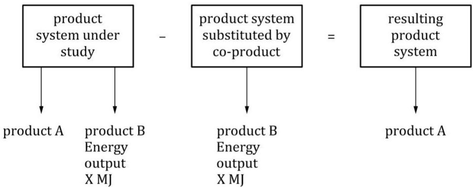
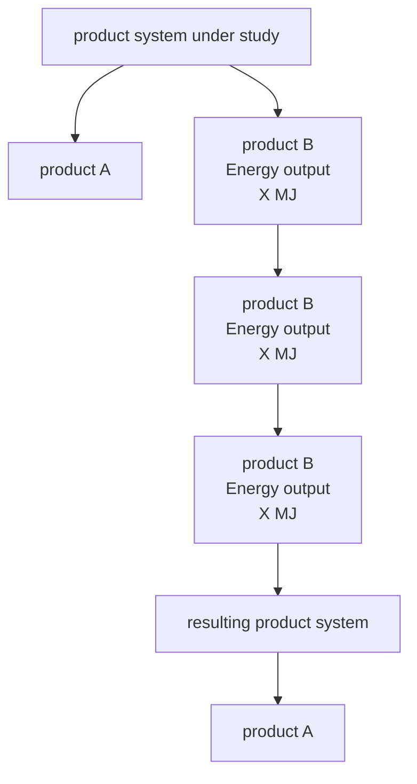

First edition

2006-07-01

AMENDMENT 2

2020-09

# Environmental management — Life cycle assessment — Requirements and guidelines

AMENDMENT 2

Management environnemental — Analyse du cycle de vie — Exigences et lignes directrices

AMENDEMENT 2

## COPYRIGHT PROTECTED DOCUMENT

© ISO 2020

All rights reserved. Unless otherwise specified, or required in the context of its implementation, no part of this publication may be reproduced or utilized otherwise in any form or by any means, electronic or mechanical, including photocopying, or posting on the internet or an intranet, without prior written permission. Permission can be requested from either ISO at the address below or ISO's member body in the country of the requester.

ISO copyright office

CP 401 • Ch. de Blandonnet 8

CH-1214 Vernier, Geneva

Phone: +41 22 749 01 11

Email: copyright@iso.org

Website: www.iso.org

Published in Switzerland

## Foreword

ISO (the International Organization for Standardization) is a worldwide federation of national standards bodies (ISO member bodies). The work of preparing International Standards is normally carried out through ISO technical committees. Each member body interested in a subject for which a technical committee has been established has the right to be represented on that committee. International organizations, governmental and non-governmental, in liaison with ISO, also take part in the work. ISO collaborates closely with the International Electrotechnical Commission (IEC) on all matters of electrotechnical standardization.

The procedures used to develop this document and those intended for its further maintenance are described in the ISO/IEC Directives, Part 1. In particular, the different approval criteria needed for the different types of ISO documents should be noted. This document was drafted in accordance with the editorial rules of the ISO/IEC Directives, Part 2 (see www.iso.org/directives).

Attention is drawn to the possibility that some of the elements of this document may be the subject of patent rights. ISO shall not be held responsible for identifying any or all such patent rights. Details of any patent rights identified during the development of the document will be in the Introduction and/or on the ISO list of patent declarations received (see www.iso.org/patents).

Any trade name used in this document is information given for the convenience of users and does not constitute an endorsement.

For an explanation of the voluntary nature of standards, the meaning of ISO specific terms and expressions related to conformity assessment, as well as information about ISO's adherence to the World Trade Organization (WTO) principles in the Technical Barriers to Trade (TBT), see www.iso.org/iso/foreword.html.

This document was prepared by Technical Committee ISO/TC 207, Environmental management, Subcommittee SC 5, Life cycle assessment, in collaboration with the European Committee for Standardization (CEN) Technical Committee CEN/SS S26, Environmental management, in accordance with the Agreement on technical cooperation between ISO and CEN (Vienna Agreement).

Any feedback or questions on this document should be directed to the user's national standards body. A complete listing of these bodies can be found at www.iso.org/members.html.

# Environmental management — Life cycle assessment — Requirements and guidelines

AMENDMENT 2

Clause 3, Terms and definitions

Replace the following definitions:

## 3.1

## life cycle

consecutive and interlinked stages of a product system, from raw material acquisition or generation from natural resources to final disposal

## 3.32

## system boundary

set of criteria specifying which unit processes are part of a product system

Note 1 to entry The term “system boundary” is not used in this International Standard in relation to LCIA.

## 3.41

## completeness check

process of verifying whether information from the phases of a life cycle assessment is sufficient for reaching conclusions in accordance with the goal and scope definition

## 3.42

## consistency check

process of verifying that the assumptions, methods and data are consistently applied throughout the study and are in accordance with the goal and scope definition performed before conclusions are reached

## 3.43

## sensitivity check

process of verifying that the information obtained from a sensitivity analysis is relevant for reaching the conclusions and for giving recommendations

With the following definitions:

## 3.1

## life cycle

consecutive and interlinked stages, from raw material acquisition or generation from natural resources to final disposal

## 3.32

## system boundary

boundary based on a set of criteria specifying which unit processes are part of the system under study

Note 1 to entry: In this document, “system under study” refers to product system.

## 3.41

## completeness check

process to determine whether information from the phases of a life cycle assessment is sufficient for reaching conclusions in accordance with the goal and scope definition

## 3.42

## consistency check

process to determine whether the assumptions, methods and data are consistently applied throughout the study and are in accordance with the goal and scope definition

## 3.43

## sensitivity check

process to determine whether the information obtained from a sensitivity analysis is relevant for reaching the conclusions and for giving recommendations

## 4.2.3.5, second paragraph

Replace the text with the following:

Inputs can include, but are not limited to, the use of resources (e.g. water, biomass, metals from ores, recycled materials), services such as transportation or energy supply, and ancillary materials such as lubricants or fertilisers.

## 4.3.4.2, last paragraph

Add the following sentence:

Additional information on allocation is given in Annex D.

Annex B, Tables B.1, B.2, B.3, B.7 and B.8

Change the heading of the 4th column in the tables from “Use phases” to “Use stage”.

Annex D

Add the following text as a new Annex D.

# Annex D (informative)

# Allocation procedures

## D.1 General

Allocation refers to the partitioning of the inputs or outputs of a process or product system between the product system under study and one or more other product systems.

A stepwise allocation procedure is described in 4.3.4.2 and several examples of the procedure are presented in ISO/TR 14049:2012, Clauses 6, 7 and 8.

This annex provides additional information to assist understanding of the subject for situations where it is not possible to apply 4.3.4.2, step 1, option 1.

Allocation methods reflect value choices, intentionally or unintentionally. Such value choices can influence LCA results and the conclusions of LCA studies.

In addition, data needs can vary among methods, which can have an influence on the applicability of the method.

## D.2 Expanding the product system

## D.2.1 General

Expanding the product system to include additional functions related to the co-products (see 4.3.4.2, step 1, option 2) can be a means of avoiding allocation.

NOTE 1 The concept of expanding the product system to include additional functions related to the co-products can also be referred to as system expansion or expanding the system boundary.

Therefore, the product system that is substituted by the co-product is integrated in the product system under study. In practice, the co-products are compared to other substitutable products, and the environmental burdens associated with the substituted product(s) are subtracted from the product system under study (see Figure 1). The identification of this substituted system is done in the same way as the identification of the upstream system for intermediate product inputs. See also ISO/TR 14049:2012, 6.4.

The application of system expansion involves an understanding of the market for the co-products. Decisions about system expansion can be improved through understanding the way co-products compete with other products, as well as the effects of any product substitution upon production practices in the industries impacted by the co-products.

Important considerations relating to the identification of product systems substituted by co-products include whether:

— specific markets and technologies are affected;  
— the production volume of the studied product systems fluctuates in time;  
— a specific unit process is affected directly.

If applicable, when the inputs are delivered through a market, it is also important to know:

— whether any of the processes or technologies supplying the market are constrained, in which case their output does not change in spite of changes in demand;  
— which of the unconstrained suppliers/technologies has the highest or lowest production costs and, therefore, is the supplier/technology affected when the demand for the supplementary product is generally decreasing or increasing, respectively.

EXAMPLE A fuel combustion process produces co-products of heat that is used for district heating as well as electricity. The inventory, i.e. inputs and outputs, of the avoided electricity can be subtracted from the inventory of the fuel combustion process to determine the inventory of the heat.

System expansion avoids allocation by integrating a functionally equivalent product system, that is assumed to be substituted by the co-product (product B), within the system boundary. The inputs and outputs associated with the substituted product system are assumed to be avoided by the production of the co-product (product B), as illustrated by the example in Figure D.1.

Since the substituted system has a negative sign, the addition of this system is mathematically the same as a subtraction. There is an additional example of this in ISO/TR 14049:2012, Figures 15 and 16.

flowchart

Figure D.1 — Example of avoiding allocation by expanding the system boundary

NOTE 2 Figure D.1 shows how to avoid allocation when the investigated product system has two products: product A (the product system under study) and product B (here, an energy product).

In the case of recycling, one way to avoid allocation can be by calculating a recycling credit based on the technical substitutability of the secondary material(s), i.e. taking into account any changes to the inherent properties and quality of the secondary material versus the substituted primary material. If the secondary material X from the product system under study substitutes a primary material Y, then the recycling credit corresponds to subtracting the inventory associated with the acquisition of the primary material Y from the inventory calculated for the product system under study. If an input to a product system is a recycled material that has previously implied a credit to the product system that the recycled material comes from, such recycled material carries the credit as a potential environmental impact to the product system that it enters.

## D.2.2 Strengths

System expansion can be based on natural science. The justification of the choice of system expansion can be based on technical considerations. System expansion can often be a straightforward choice for energy products.

System expansion can reflect the physical and economic implications of the production of the co-product(s) and can maintain mass balances of all unit processes and product systems.

## D.2.3 Weaknesses and difficulties

Where system expansion models are complex, the data requirements can be onerous and the different modelling choices can lead to a low level of transparency. Where there are multiple industrial pathways for co-products, the model results can have high variability. If there are different possibilities of system expansion, it can lead to significantly different results.

It is not always straightforward to identify the products that are assumed to be substituted by the co-products of the multifunctional process. If there are no alternative production processes for a co-product, then system expansion is difficult to treat the multifunctional process.

In addition, some substituted products are themselves co-products of other industrial processes meaning that the system expansion is further perpetuated.

Since it is difficult to forecast long-term processes and performances, special limitations can apply to prospective studies.

## D.3 Allocation that reflects the underlying physical relationships

## D.3.1 General

Physical allocation can be applied when a physical, i.e. causal, relationship can be identified between the inputs, outputs and co-products of the multifunctional process. Such a relationship exists when the amounts of the co-products can be independently varied. How the amounts of inputs and outputs (emissions and waste) change following such a variation can be used to allocate the inputs and outputs to the varied co-product.

This allocation procedure (step 2, 4.3.4.2) is applicable when: a) the relative production of co-products can be independently varied through process management, and b) this has causal implications for the inputs required, emissions released or waste produced.

EXAMPLE 1 When aqueous ammonia (NH₃) reacts with ethylene oxide (C₂H₄O), three co-products are produced: monoethanolamine (H₂NCH₂CH₂OH), diethanolamine (HN(CH₂CH₂OH)₂) and triethanolamine (N(CH₂CH₂OH)₃). The relative production volume of the three co-products can be controlled by changing the proportion of the reactants in the solution, which means the amounts of the co-products can be varied independently, and all products are therefore determining products, independently of each other. Therefore, this combined production can be described for each product separately based on the stoichiometric requirements of each product, with the limiting group being hydroxyl (OH). To make 1 kg monoethanolamine, 0,279 kg ammonia and 0,721 kg ethylene oxide are needed. To identify these masses, the following formula is used:

$$
m = n \times M
$$

where

m mass (in kg);

n amount of substance (in mol);

M molar mass (in kg/mol).

EXAMPLE 2 ISO/TR 14049:2012, 7.3.1, provides another example where transportation fuel consumption is allocated between a packaging material and a commodity based on the proportion of payload used.

## D.3.2 Strengths

Physical allocation is based on natural science. Allocation factors are relatively stable.

## D.3.3 Weaknesses and difficulties

In many cases, physical allocation needs a deep insight into the process shared with other product systems. For co-products with significantly different economic values, physical allocation will not always properly reflect the intention to operate the process.

Sometimes results based on physical allocations lead to interpretations that are disconnected from the business reality.

When there is limited capacity to independently vary the production of co-products, the physical allocation procedure can have limitations.

EXAMPLE Almond production results in two co-products, i.e. the nut and the shell (each approximately 50 % by mass). Allocation of the burdens of almond production to nuts and shells on the basis of their relative mass would not be an example of applying physical allocation since this is not describing a causal physical relationship between the co-products and the inputs to and outputs from production and they have significantly different economic values.

Causal physical relationships do not always capture quality aspects of co-products.

## D.4 Allocation methods reflecting other relationships

## D.4.1 General

According to 4.3.4.2, step 3, inputs and outputs can also be allocated between co-products reflecting other relationships between them, e.g. in proportion to the economic value of co-products (economic allocation).

The most common form of economic allocation is based on the revenue obtained from the co-products.

EXAMPLE 1 A dairy cow produces 70 % of its revenue through milk and 30 % through animals sold (calves and dairy cow at the end of life). This ratio can be used to allocate all inputs and outputs that can neither be directly attributed to the milk nor to the animals sold.

EXAMPLE 2 Another example is given in ISO/TR 14049:2012, 7.3.2.

## D.4.2 Strengths

Economic allocation can reflect the intention of operating a process. The relative revenues can in some situations be seen as the ultimate causes for the production to take place. Economic allocation can help to reflect differences between regions and markets for similar products.

It is possible to apply economic allocation to all processes requiring allocation throughout a product system, but still the consistency of the selected economic parameters needs to be carefully checked. It can also be practical to apply economic allocation in situations where processes for allocation yield a large number of co-products.

Economic allocation has the potential to differentiate between similar products having different quality attributes.

## D.4.3 Weaknesses and difficulties

Market prices often vary with time, and between different regions and market actors. The selection of the allocation factors represents a value choice and the allocation factor can show a high uncertainty, especially for future scenarios.

There is also the potential for markets to be affected by, for example, regulations, monopoly powers and subsidies. Economic allocation can be relatively unstable.

Market prices can also be difficult to accurately ascertain in some cases, especially with intermediate products and where products are traded between subsidiaries of the same organization.

The application of economic allocation depends on having market prices for all co-products at the process of co-production. With some products, prices can be volatile and it can be useful to determine an average price over a relevant time interval. In other cases, products are not traded at the process of co-production and are only traded after further co-product-specific processing steps, which are included in the product system. In such cases, it is possible to estimate the economic value, e.g. to estimate the economic value of an intermediate product by subtracting the cost of further processing packaging or transportation from the eventual market price of a final product.

As longer-term prices can be difficult to forecast, economic allocation has limitations for prospective studies. Unless there is complete proportionality between the physical properties and the economic values of the co-products, the resulting systems will not be physically balanced. In general, a cost- or revenue-allocated product system will therefore not reflect the physical causalities of producing or purchasing a specific product.