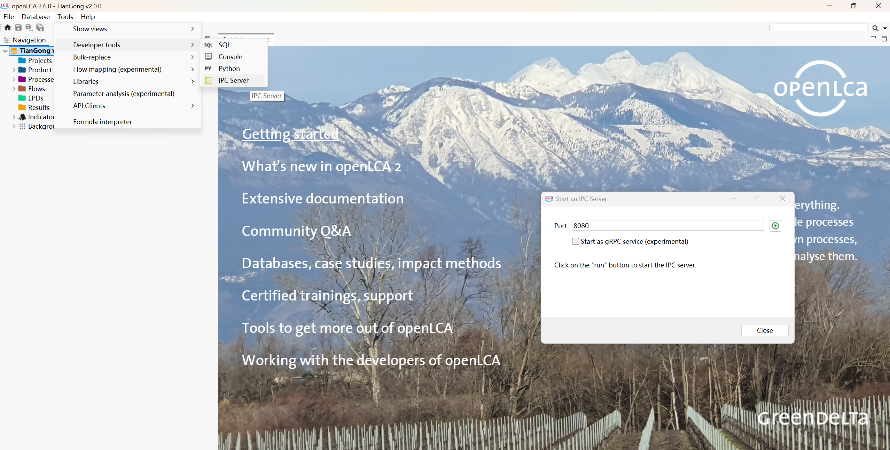

# 环境准备与配置

本文档介绍运行 **Harness-driven LCA Agents** 所需的环境与配置。

首次运行前，在所用 AI 工具（Codex / Claude Code / OpenCode / DSH 的 CLI、IDE 插件或 Desktop）中打开本仓库，输入：

```text
读取并执行 src/scripts/proj_init/PROMPT.md
```

或使用 `/bootstrap-env`、`$bootstrap-env`。步骤正文在 `src/scripts/proj_init/PROMPT.md`。没有 uv 时 agent 会判定不通过，需要你按下面说明手动安装。

Agent CLI（`codex` / `claude` / `opencode` / `dsh`）的安装与登录以各工具自己的文档为准。走 GUI 时，在「设置 AI Agent 工具」中选择 PATH 上已安装的那一个。GUI「初始化检查」只探测所选 CLI `--version` 与 openLCA，不运行 bootstrap-env。

引导结束时，agent 会列出哪些 CLI 可用，并建议将它们分别设为 auto-review（自动批准工具调用）。只按建议自行调整，不要让 agent 改你的全局配置。

## 1. 安装 uv

- **macOS / Linux**

  ```bash
  curl -LsSf https://astral.sh/uv/install.sh | sh
  ```

- **Windows（PowerShell）**

  ```powershell
  powershell -ExecutionPolicy ByPass -c "irm https://astral.sh/uv/install.ps1 | iex"
  ```

- **验证**

  ```bash
  uv --version
  ```

## 2. Python 依赖

项目由 `.python-version` 和 `pyproject.toml` 固定使用 Python `3.14`。在项目根目录
执行：

```bash
uv sync
```

该命令会创建虚拟环境并同步依赖。

## 3. openLCA IPC

运行工作流前：

1. 启动 openLCA Desktop 并打开目标数据库。
2. 启用 IPC Server，默认地址为 `127.0.0.1:8080`。
3. 在项目根目录检查连接：

   ```bash
   uv run python src/scripts/check_status/main.py --only openlca
   ```



连接检查首次失败后会重新创建客户端并重试三次；全部失败时命令返回非零，GUI 的执行
按钮保持禁用。bootstrap-env 也会跑同一条检查，失败时记为「需你动手」。

## 4. 在 AI Agent 中运行 LCA 前的清理

不使用 GUI 时，在所用 AI 工具中输入 whole-lca / revise-lca 之前执行：

```bash
uv run python src/scripts/clean_dir/main.py -y --preset whole-lca
# 或 revise-lca：--preset revise-lca（不清理 workspace）
```

然后手工复制资料到 `harness/knowledge/`，并编写 `workspace/inputs/plan.md`（或 `revise.md`）。详见根目录 `README.md` 与 `src/scripts/clean_dir/README.md`。
