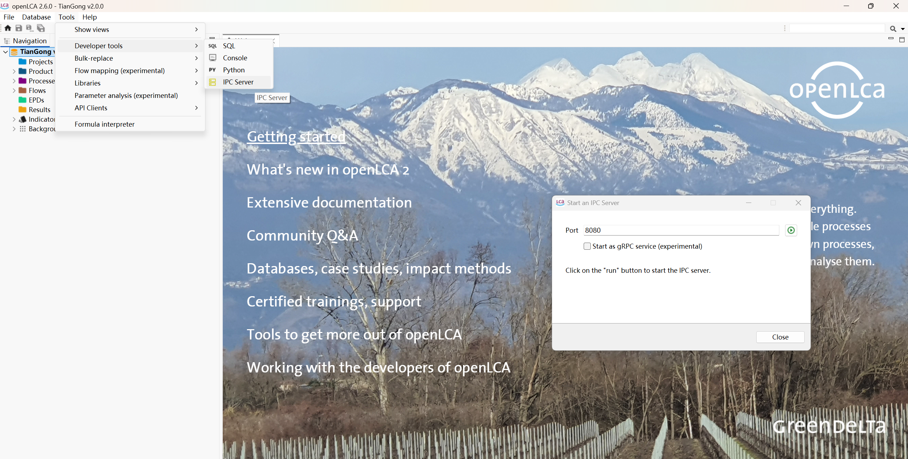

# 环境准备与配置

本文档介绍运行 **Harness-driven LCA Agents** 所需的环境与配置。

首次运行前，在项目根目录执行：

```bash
uv sync
uv run python src/scripts/proj_init/main.py
```

也可以在所用 AI 工具中输入「读取并执行 `src/scripts/proj_init/PROMPT.md`」。步骤正文在该文件。没有 uv 时脚本会判定不通过，需要你按下面说明手动安装。

Worker 固定为 **Pi SDK runtime**（`src/pi_agents/pi-runtime`，依赖 Node.js）。Web「设置与初始化」选择 `model_profiles.json` 中的模型档案，并为对应 Provider 填入自有 API Key（BYOK，写入 `.local/credentials/pi-auth.json`）。初始化检查探测 Node / pi-runtime 协议与 openLCA IPC，不依赖 PATH 上的 `codex` / `claude` / `opencode` / `pi` 可执行文件。主编排经 `src/shared/core/agents` → `pi_agents` 调用 `ModelRuntime`。业务运行只通过控制面板，不提供面向用户的命令行控制。

`.env` 要填的字段见仓库根目录 `.env.example`（`PI_MODEL`、openLCA 端口等）。缺失的 `.env` 会从该模板复制。

## 1. 安装 uv

- **macOS / Linux**

  ```bash
  curl -LsSf https://astral.sh/uv/install.sh | sh
  ```

- **Windows（PowerShell）**

  ```powershell
  powershell -ExecutionPolicy ByPass -c "irm https://astral.sh/uv/install.ps1 | iex"
  ```

- **验证**

  ```bash
  uv --version
  ```

## 2. Python 依赖

项目由 `.python-version` 和 `pyproject.toml` 固定使用 Python `3.12`。在项目根目录
执行：

```bash
uv sync
```

该命令会创建虚拟环境并同步依赖（含开发依赖 `pytest`、`ruff`、`pyright`）。另需 Node.js 22+ 与 `npm install && npm run build -w @harness/pi-runtime`。

uv 包缓存默认写到仓库根 `.uv-cache/`（见 `.env.example` 的 `UV_CACHE_DIR`）。不要放到 `workspace/tmp/`。

开发静态检查与测试：

```bash
uv run ruff format .
uv run ruff check .
uv run pyright
uv run pytest
```

## 3. openLCA IPC

运行工作流前：

1. 启动 openLCA Desktop 并打开目标数据库。
2. 启用 IPC Server，默认地址为 `127.0.0.1:8080`。
3. 在 Web 控制面板的「设置 / 项目状态」中查看 openLCA 连通性（初始化检查失败时执行按钮保持禁用）。



连接检查首次失败后会重新探测；环境引导（`proj_init`）也会做同一类检查，失败时记为「需你动手」。资料放入 `harness/knowledge/inputs/`、计划编写与执行前清理均在控制面板流程中完成，见根目录 `README.md`。
