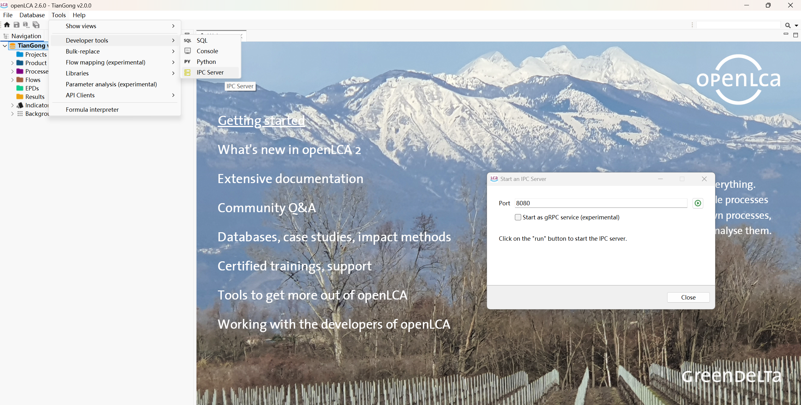

# 🚀 Multi-Agent LCA Orchestrator 项目准备说明文档

本文档详细介绍了运行 **Multi-Agent LCA Orchestrator (202606-harness-agent-lca)** 项目前的准备工作，指引您完成输入文件准备、openLCA IPC 设置以及 RAG 数据库初始化的详细流程。

---

## 🛠️ 项目准备步骤详解


### 1. 准备 input 目录中的文件 (第一步)

在开始 LCA 建模和评估之前，您需要将相关的输入参考资料与您的 LCA 计划需求按以下结构整理并放置到 [input/](../input/) 对应的子目录下：

1. **放置评估原始参考文档**：
   * 将您需要评估的主体项目原始参考文件（如环评报告书的 Word/Markdown/PDF 格式、物料平衡图、物料清单 Excel 等）放置在 [input/files/](../input/files/) 目录下。
   * 如果有其他特定的原始数据表格，可以放置在 [input/data/](../input/data/) 目录中。
   * 如果包含与本项目或行业相关的标准/方法说明，可以放置在 [input/knowledge_base/](../input/knowledge_base/) 目录中。
   * *注意：智能体在第四步构建 RAG 数据库时，会自动读取并分块解析这些目录下的文件。*

2. **编写与完成计划需求文件 (`plan.md`)**：
   * **必须** 复制模板文件 [docs/assets/templates/plan.md](assets/templates/plan.md) 并保存为 [input/plan.md](../input/plan.md)。
   * **重要**：打开 [input/plan.md](../input/plan.md)，在各个 `✍️ 用户填写内容区` 中，根据您的项目实际情况，填入以下关键信息：
     * **研究主体**：例如“利群表面处理产业园提质升级项目 —— 镀金工艺产线”
     * **功能单位**：例如“处理 1 m² 面积的镀金产品”
     * **系统边界**：例如“Gate-to-Gate (大门到大门)”
     * **背景数据库与方法选择**：指定如 `tiangong` 数据库和 `ReCiPe2008` 方法。
   * *该文件是向 `plan-maker` Agent 派发任务的核心输入文档。若该文件未完成，智能体将无法正确制定 LCA 计划。*

---

### 2. 打开 openLCA 并确保 IPC server 开启 (第二步)

最终的 LCI 数据需要通过 IPC 接口导入到 openLCA 的活动数据库中。
1. **启动客户端**：双击并打开您的 openLCA 桌面客户端。
2. **开启 IPC 服务**：在软件菜单栏中启动 IPC Server 服务（默认监听在 `8080` 端口）。这使智能体在后续能通过 `.opencode/skills/control-openlca` 技能自动控制 openLCA 并注入流和过程。



---

### 3. 构建 RAG 数据库 (第三步)

在此步骤中，系统会将您在 `input` 目录中放置的各种原始格式参考文档提取、转换、分块并存入本地的 ChromaDB 向量数据库中。

您可以通过以下两种方式之一下达此指令：
* **命令行方式 (CLI)**：
  在终端中执行以下命令运行初始化 RAG 任务：
  ```bash
  opencode run --command init-rag-database
  ```
* **客户端交互方式 (Desktop/CLI Chat)**：
  在 OpenCode 交互界面（CLI 交互模式或桌面端）的对话框中，直接输入快捷指令并发送以触发：
  ```text
  /init-rag-database
  ```

* **底层执行逻辑**：
  1. 清理 [src/knowledge/](../src/knowledge/) 目录（保留该目录下的 `README.md`）。
  2. 读取 [knowledgebase-mapping](../.opencode/skills/knowledgebase-mapping) 技能中的映射规则。
  3. 通过 `markitdown` 抽取文本并利用指定 Embedding 模型将文档转化为向量写入 ChromaDB 中。
* **更多 RAG 操作细节**：请参阅 [RAG 数据库构建与查询指南](rag_guide.md)。
