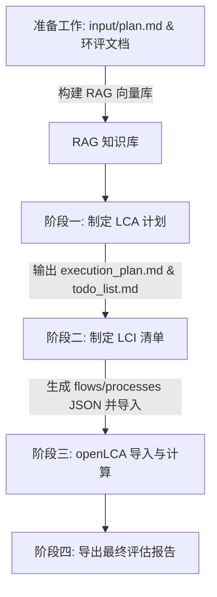

# 📖 Multi-Agent LCA Orchestrator 项目 Wiki 首页

欢迎来到 **Multi-Agent LCA Orchestrator (202606-harness-agent-lca)** 项目的 Wiki 空间！

本项目是一个使用多智能体（Multi-Agent）系统在 Harness 框架下进行合规化 **LCA (生命周期评价, Life Cycle Assessment)** 输出的协同开发与运行环境。我们旨在通过智能体的自动化编排，降低 LCA 建模门槛，提高建模效率与合规性。

---

## 🌟 项目核心优势

* **🤖 多智能体协同 (Multi-Agent Collaboration)**：由主编排智能体（`major-orchestrator`）调度计划制定者（`plan-maker`）、清单设计者（`LCI-designer`）与评估验证者（`eval-executor`）等多角色，实现全链路自动化。
* **🛡️ Harness-driven（安全与受控）**：依托稳定的 Tooling 接口、可靠的沙盒环境以及确定性的状态存储，确保智能体在复杂计算与文件操作中的行为可控。
* **🔍 检索增强生成 (RAG) 赋能**：集成 `markitdown` 与本地向量数据库 ChromaDB，自动提取和检索项目环评报告、物料清单、行业标准等参考文档，确保 LCA 建模依据坚实、可回溯。
* **⚙️ 自动化 openLCA 联动**：利用 IPC API 协议进行数据通信，将智能体生成的 LCI (生命周期清单) flows & processes 自动注入 openLCA 客户端，并进行后续的影响评估（LCIA）计算。

---

## 🗺️ 核心工作流与运行阶段

项目的 LCA 评估任务通过多智能体协同，分为以下几个核心阶段逐步推进：



### 1. 📋 第一阶段：制定 LCA 计划
* **主导智能体**：`plan-maker`
* **输入**：用户填写的目标与范围声明 `input/plan.md` 及 RAG 向量库中的环评报告等原始文档。
* **输出**：
  * `execution_plan.md`（执行计划：确定系统边界、工艺单元划分及分配规则）。
  * `todo_list.md`（待完善清单：识别缺失、模糊或需要专家决策的数据项）。

### 2. 🧪 第二阶段：制定 LCI 清单
* **主导智能体**：`LCI-designer` + `eval-executor`
* **输入**：第一阶段的执行计划、RAG 向量知识库以及 openLCA 背景数据库。
* **输出**：生成符合 openLCA Schema 的 LCI Flows/Processes 配置文件，并在自检评估合格后，通过 IPC 批量导入 openLCA 活动数据库中。

---

## 📂 快速导航

为了帮助您快速熟悉并上手项目，我们准备了详细的引导文档。请查阅以下页面：

* **🛠️ [环境准备与配置](env_setup)**：指导如何安装 `uv`、`opencode`，配置 Agent 运行模型及本地环境变量 (`.env`)。
* **📋 [项目准备工作](project_prep)**：细致介绍 input 目录文件结构、如何编写 `plan.md`，开启 openLCA IPC Server 及构建 RAG 向量库。
* **🔍 [RAG 知识库使用指南](rag_guide)**：详解 RAG 系统的构建、读取与查询机制，支持自然语言检索及 Python 脚本查询。
* **🤖 [智能体技能编写规范](agent_skill_guide)**：详细规范智能体技能的目录结构、系统提示词规则、以及按需加载 Token 优化规范。
* **📖 [用户使用说明](user_guide)**：核心使用手册，包含各阶段的具体运行命令、多角色协同底层逻辑以及人工修正的最佳实践。

---

## ⚡ 常用快捷指令

推荐在 OpenCode 交互界面或系统终端中，通过以下预设命令快速推进工作流：

> [!TIP]
> 推荐在 OpenCode 客户端直接发送 `/` 斜杠命令（例如 `/init-rag-database`），以获得更好的交互体验。

* **初始化 RAG 数据库**：
  ```bash
  opencode run --command init-rag-database
  ```
* **制定 LCA 计划**：
  ```bash
  opencode run --command make-plan "根据计划需求文件，制定新的LCA计划"
  ```
* **设计与构建 LCI 模型**：
  ```bash
  opencode run --command design-lci "根据已制定的执行计划，设计新的LCI"
  ```
* **导入清单至 openLCA**：
  ```bash
  opencode run --command import-lci "导入已构建的 LCI 数据"
  ```