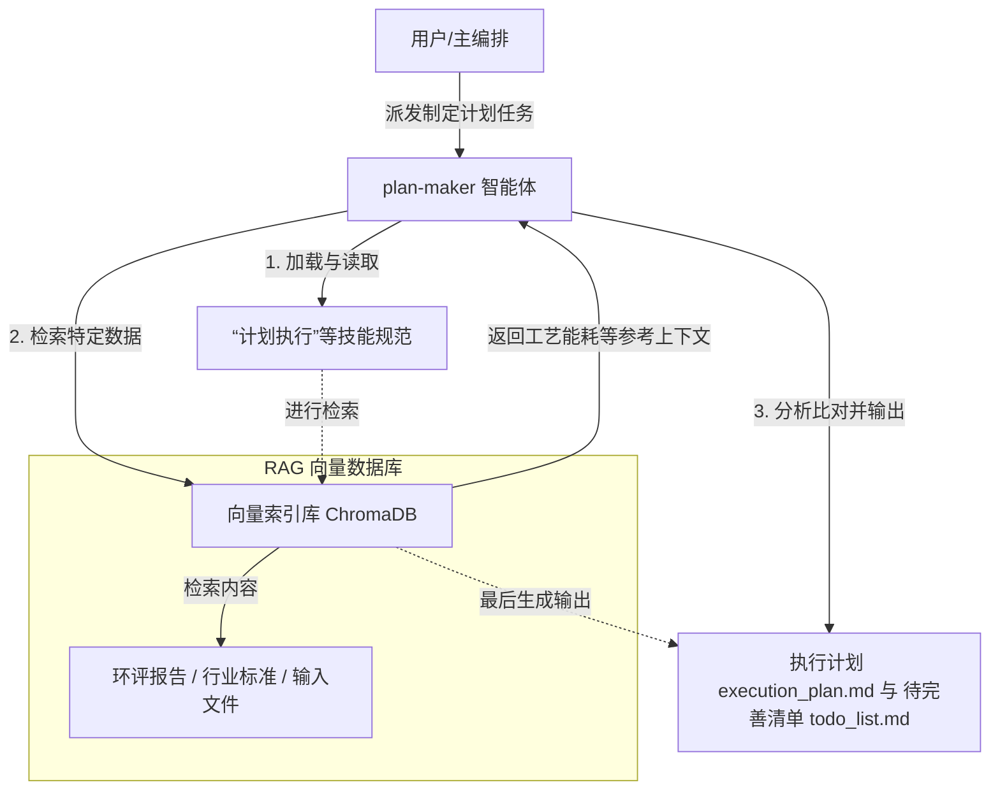
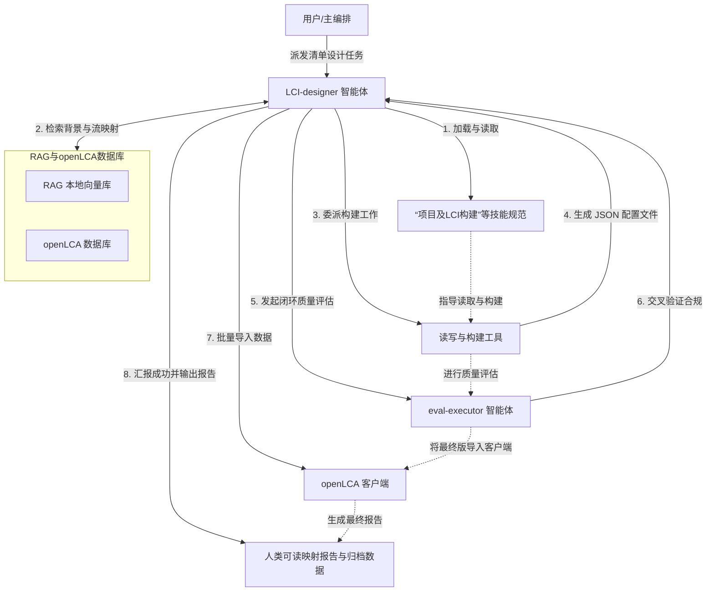

# 📖 Harness-driven LCA dev agents 工具用户指南

本指南旨在向用户详细说明在完成环境配置与项目准备工作（即完成文档检索准备与 openLCA 客户端 IPC 服务开启）之后，如何运行本 **Multi-Agent** 工具开展生命周期评估（LCA）分析，以及如何对输出产物进行校验与调整。

工具的运行整体切分为多个阶段。目前已开发完成的是**制定 LCA 计划**和**制定 LCI 清单**两个阶段；后续还将进一步开发**调用 openLCA 执行 LCIA 计算**、**导出与生成评估报告**等阶段。

---

## 一、 第一阶段：为 Agent 制定 LCA 项目工作计划 

本阶段由计划制定智能体主导，通过分析用户的项目需求和知识库，理清生命周期边界，并形成一份下游智能体可直接阅读和执行的结构化工作计划。

### 1. 准备工作
* **计划需求文件 (`plan.md`)**：用户根据需求模板填写的目标与范围声明。包括研究主体（如“镀金工艺产线”）、功能单位（如“处理 1 m² 面积的镀金产品”）、系统边界（如“大门到大门”）以及背景数据库与评价方法选择。
* **原始参考文档的检索支持**：主体项目的原始环评报告及工艺能耗表，这些在项目准备阶段已自动转存并录入本地的 RAG 向量数据库。

### 2. 执行指令
用户可以通过以下方式激活智能体启动计划制定任务：
* **命令行方式**：
  ```bash
  opencode run --command make-plan "根据计划需求文件，制定新的LCA计划"
  ```
* **交互界面方式**：在对话框中直接发送快捷指令：
  ```text
  /make-plan "根据计划需求文件，制定新的LCA计划"
  ```

### 3. 底层机制
* **角色委派**：主编排智能体接收任务后，会将具体工作委派给专职的计划制定智能体 (`plan-maker`)。
* **按需加载规范**：智能体加载 LCA 专业规范技能。系统启动主路由文件 (`SKILL.md`)，智能体根据路由引导，**仅加载和读取**其中专门规范执行计划编制的子指南文档（如 `plan_guidance` 说明文件），以控制 Token 上下文消耗。
* **检索与分析**：智能体调用外部工具技能连接本地向量数据库，检索已录入的环评报告，将计划需求与环评中的物料、能耗和排污数据进行匹配分析，理清系统边界与分摊原则。



### 4. 输出
* **执行计划文件 (`execution_plan.md`)**：包含生命周期系统边界图、工艺单元划分、物料分配（Allocation）规则、背景数据映射策略以及影响评估方法。
* **待完善清单文件 (`todo_list.md`)**：识别出环评报告中缺失、模糊或需要人工假设的工艺参数，以及供专家进一步决策的数据验证计划。

### 5. 人工介入的审核与修正
* **补全待完善清单以丰富细节**：若查看输出的待完善清单文件 (`todo_list.md`) 后，发现有缺失的工艺参数，用户可在计划需求文件 (`plan.md`) 中补充该参数（或在输入文件目录中补充新的参考文档），然后重新执行制定计划任务命令，即可更新执行计划。

---

## 二、 第二阶段：制定 LCI 清单 

本阶段由清单设计(`LCI-designer`)智能体主导，将第一阶段的执行计划转化为 openLCA 支持的结构化模型，并自动导入数据库。

### 1. 准备工作
* **执行计划文件 (`execution_plan.md`)**：第一阶段生成的执行计划。若用户对系统边界或工艺划分有调整，可直接在此文件中修改。
* **openLCA 通信状态**：确保 openLCA 桌面客户端已处于运行状态，且已开启 IPC Server 服务（默认监听 8080 端口）。

### 2. 执行指令
用户可以通过以下方式激活智能体启动清单设计与导入任务：
* **核心运行命令（设计与导入）**：
  * **命令行方式**：
    ```bash
    opencode run --command design-lci "根据已制定的执行计划，设计新的LCI"
    ```
  * **交互界面方式**：在对话框中发送快捷指令 `/design-lci "根据已制定的执行计划，设计新的LCI"`。


### 3. 底层机制
* **多角色协同**：主编排智能体将任务分发给清单设计智能体 (`LCI-designer`)。清单设计智能体作为调度中心，会进一步调配文件读写工具和代码构建工具开展工作。
* **规范与模板读取**：智能体加载项目规范技能与 LCA 专业规范技能。通过主路由文件 (`SKILL.md`) 动态按需读取清单构建指南（如 `lci_construction` 及 `mapping_specification` 说明文件），获取 JSON 实体的 Schema 标准、参数命名法和 UUID 连接规则。
* **背景数据检索与流映射**：清单设计智能体在设计模型实体前，需要**大量读取和检索 RAG 向量数据库**（以获取特征工艺药剂成分及标准等背景信息）以及 **openLCA 本地数据库**（通过 IPC 协议读取现有流、物质分类及已分配的 UUID 列表）。这使得智能体能准确建立环评原始物料与 openLCA 背景数据集之间的映射关系，避免生成重复或孤立的实体。
* **模型实体设计**：智能体解析执行计划，将物料输入输出表格转化为对应的流（Flows）、过程（Processes）和产品系统（Product Systems）JSON 配置文件，并为实体建立正确的逻辑连接。
* **自检与闭环评估**：在生成最终版本前，调用评估智能体 (`eval-executor`) 对初始生成的 JSON 配置文件进行数据格式、连接关系和数值逻辑的交叉验证与质量自检，确保数据完全合规并锁定最终版。
* **IPC 批量导入**：在评估合格并确定最终版本后，调用外部工具技能，运行底层的 Python 导入脚本，通过 IPC 端口通信将最终版的 JSON 实体批量导入到 openLCA 客户端的活动数据库中。



### 4. 输出
* **Flows 实体 JSON 文件**：定义了所有原辅材料、能源、产品以及排往环境介质的污染物实体。
* **Processes 实体 JSON 文件**：定义了工艺各阶段的具体活动，配置了正确的输入输出配比与 UUID 关联。
* **Product Systems 配置文件**：用于在 openLCA 中构建计算链的网络拓扑配置。
* **人类可读映射报告 (`human_readable_mapping.md`)**：详细记录了环评源数据到 openLCA 实体映射的逻辑，便于审查。
* **openLCA 中的数据流网络**：数据被自动写入 openLCA，在软件中直接生成对应的流、过程拓扑及产品系统数据集。

### 5. 人工介入的审核与修正
* **修改执行计划重新设计**：若发现智能体自动设计的边界或背景数据选用不合理，直接手动修改执行计划文件 (`execution_plan.md`)，保存后重新执行 `design-lci` 任务命令，清单设计智能体会读取您最新的修改并重新生成对应的 JSON 实体文件。
* **直接修改 JSON 实体并重新导入**：对于极细微的数量调整，可直接在对应目录中修改 Flows 或 Processes 的 JSON 配置文件，保存后运行 `import-lci` 命令，即可将修改后的 JSON 直接覆盖导入至 openLCA 中。

---

## 🔮 三、 人类 LCA 专家需要介入的：输入输出格式与介入流程

---

### 1. 当前工作流中，人类专家需要接触的文件一览

在整个工作流程中，LCA 专家需要查看或编辑的文件如下：

#### 1.1 输入文件（智能体运行前需要准备或填写的）

| 文件 | 路径 | 格式 | 当前用途 |
| :--- | :--- | :--- | :--- |
| 计划需求文件 | `input/plan.md` | Markdown（带"✍️ 用户填写内容区"占位符） | 告知智能体研究对象、功能单位、系统边界、背景数据库选择等 |
| 原始参考文档 | `harness/knowledge/inputs/user_file/` | `.pdf` / `.docx` / `.md` | 环评报告等资料，对应 `input` RAG 库 |\n| 原始参考数据 | `harness/knowledge/inputs/user_data/` | `.xlsx` / `.csv` / `.json` | 清单与表格资料，对应 `data` RAG 库 |

#### 1.2 输出文件（智能体生成后需要专家审核的）

| 文件 | 路径 | 格式 | 当前内容 |
| :--- | :--- | :--- | :--- |
| 执行计划 | `src/plan/execution_plan.md` | Markdown | 系统边界、工艺单元划分、分配规则、LCIA 方法选择等 |
| 待完善清单 | `src/plan/todo_list.md` | Markdown（带表格和"用户答复"占位符） | 缺失数据项、需决策事项、背景数据库匹配疑问 |
| 人类可读映射报告 | `src/LCI/human_readable_mapping.md` | Markdown（含 Mermaid 拓扑图和风险项表格） | 过程与流的映射逻辑、数据来源追溯、审核风险提示 |
| Flows / Processes / Product Systems | `src/LCI/flows/`、`processes/`、`product_systems/` | JSON | openLCA 格式的结构化 LCI 实体数据 |

#### 1.3 当前需要专家介入的具体环节

根据实际运行经验，以下环节需要 LCA 专家的判断：

1. **审核执行计划**：智能体制定的系统边界、分配原则、截断规则是否合理。
2. **答复待完善清单中的决策事项**：例如公用工程分摊方式、闭环/开环回收选择、设备折旧是否纳入等——这些是智能体无法自行决定的。
3. **补充缺失的实测数据**：智能体在无法获取实际数据时会给出估算值（如各工序电耗、化学品消耗量等），需要用实际台账或经验数据进行校准。
4. **审核映射报告中的风险项**：检查智能体标记的高/中风险项（如单位 UUID 问题、背景数据 defaultProvider 缺失、估算值置信度等），确认是否需要修正。
5. **背景数据库链接**：智能体生成的 JSON 实体中，外部背景数据（如电网电力、基础化学品上游生产）的 `defaultProvider` 可能为空，需要在 openLCA 中手动链接或指定正确的背景过程。

---

### 2. 工作流的控制机制：技能规范

在深入讨论改进方向之前，有一点值得了解：**智能体每个阶段的工作行为（如何制定计划、如何构建 LCI）并不是写死在代码里的，而是由一组可编辑的"技能规范"文件来定义的。**

这些规范文件位于 `.opencode/skills/lca-specification/` 目录下：

```
.opencode/skills/lca-specification/
├── SKILL.md                          ← 路由入口（决定加载哪个子规范）
└── assets/
    ├── plan-guidelines/              ← 控制"制定计划"阶段的行为
    │   ├── README.md                 ← 引导文件
    │   ├── instructions/             ← 详细指令规范
    │   ├── template/                 ← 输出模板
    │   └── evaluation/               ← 评估标准
    └── lci-construction/             ← 控制"制定 LCI"阶段的行为
        ├── README.md
        ├── instructions/
        ├── template/
        └── evaluation/
```

**这意味着：** 如果你认为智能体在某个环节的做法不合理（比如分配原则的默认假设、输出文件的格式要求、数据精度标准等），可以直接修改对应的规范文件来调整智能体的行为，而不需要改代码。修改后的文件可以直接发给我，也欢迎直接在 GitHub 仓库提 Pull Request。后续的问题也与此相关——你的反馈将帮助我们优化这些规范。

---

### 3. 希望听取你的意见

当前的输入输出格式和交互方式是开发过程中初步定的，**还没经过 LCA 专业人员实际使用**。以下问题希望听取你的看法（以及其他我还没想到的更多问题）：

#### 3.1 关于输入文件

* 当前的计划需求文件 (`plan.md`) 是 Markdown 格式，用"✍️ 用户填写内容区"分界线标注填写位置。**这种格式用起来方便吗？** 还是更习惯用 Word 文档、Excel 表格或者其他格式来提供项目初始信息？（输入格式的约定在技能规范的 `template/` 中定义，可以按需调整。）
* 除了环评报告之外，**还有哪些输入文件对 LCA 建模有较高价值？** 例如排污许可证、工艺 SOP、供应商 SDS/MSDS、环境监测报告、能源审计报告等——你手头通常能拿到哪些？哪些对建模质量影响最大？
* 如果要**补充实测数据或已整理好的台账**来修正智能体的估算值，你更倾向用什么格式提供？直接在 Markdown 表格里填？给一份 Excel/CSV 对照表？还是其他方式？

#### 3.2 关于输出文件

* 当前输出的各类文档（执行计划、待完善清单、映射报告等），**是否能让你有效地看明白智能体的工作流程和推理逻辑，并从中获取到有价值的信息？** 对输出文件的整体结构、详细程度和呈现方式是否满意？有哪些地方觉得多余或缺失？
* 多次对同一项目重复执行同一阶段的任务时（例如反复运行"制定计划"），**输出内容的质量是否存在较大波动？** 比如某次生成的计划非常详尽合理，而另一次却遗漏了关键信息或出现了不一致——如果有这种情况，希望了解波动主要体现在哪些方面。


#### 3.3 关于意见反馈后怎么回传给agent

* 审核完毕、修正了某些数据之后，**希望用什么方式把修正结果告诉系统？** 比如直接在原文件上改完保存？用 Excel 列个"原值 → 修正值"的对照表？还是别的方式？
* 是不是需要一个**单独的"应用专家修正"操作步骤**——提交修正后系统自动解析、定向更新受影响的数据，而不用全量重跑一遍？
* 背景数据链接方面，如果在 openLCA 里找到了正确的背景过程和 UUID，**更愿意填进一份对照表让系统自动更新 JSON，还是直接在 openLCA 里手动完成链接？**


---


