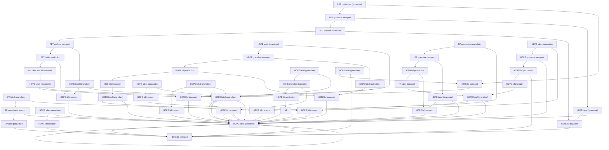
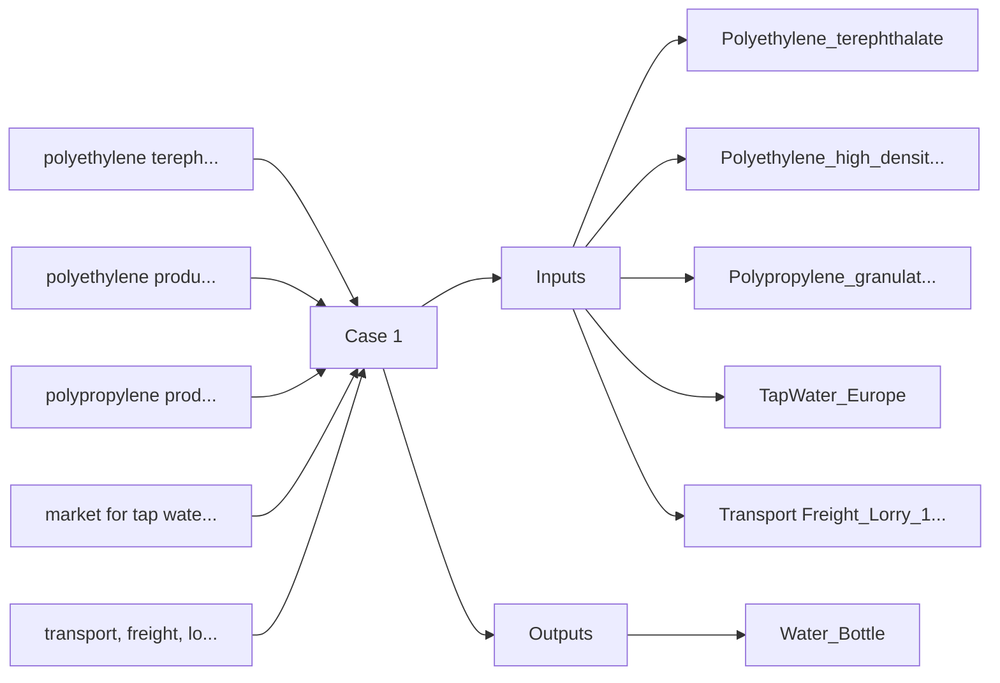
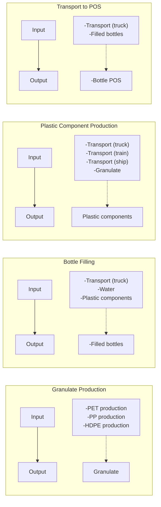
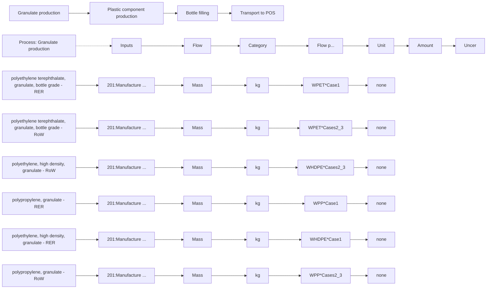
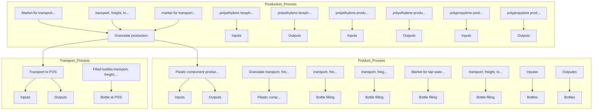

# openLCA 1.4 case study

LCA comparison of PET water bottles sold in Germany deriving from different production locations

Version: 1.4.1 beta6

Date: December 2014

Author: Sarah Winter1

## Content

1 Tutorial Goal 3  
2 Abstract 3  
3 Case study introduction 4  
4 Goal and scope definition. 5

4.1 Goal definition. 5  
4.2 Scope definition. 5

5 Inventory analysis 6

5.1 Modeling in openLCA

5.1.1 Option 1: Modeling three processes, each representing one case  
5.1.2 Option 2: Modeling by splitting the production chain into processes. 12

6 Calculation . 16

6.1 Calculating a Product System 16  
6.2 Calculating a Project 17

7 Impact Assessment. 19  
8 Interpretation 22  
9 Bibliography. . 23

## 1 Tutorial Goal

This tutorial aims at explaining a typical Life Cycle Assessment (LCA) example while giving you the opportunity to practice modeling yourself using the openLCA software. Please consider that this is not a realistic, comprehensive LCA. Though some personal research did go into this study, it is for instructional purposes only and not meant to be comprehensive nor start a debate on the consumption of water from different sources.

This example is based on the ecoinvent 3.1 database. It is not a free database (with the exception of the academic, non-OECD license), however it is much more extensive than many other free databases available.

While describing the study itself, this tutorial is designed to give you an understanding of how to work with openLCA. If you feel that some steps are missing or that instructions are not clear, please refer to user manual available online. Otherwise, consider using the forum to ask your question.

## 2 Abstract

This study presents a life cycle assessment of water bottles from cradle to point of sale (POS). Polyethylene terephthalate (PET) bottles produced and sold in Germany are compared with those filled in Turkey and transported for sale in Germany. For the purpose of this study, the life cycles of 1,000 one liter still water bottles were compared. In the case of the bottles from Turkey, it was assumed that the plastic granulates for the bottle, lid and label were produced in China and transported to Turkey for further manufacturing. Impact assessment categories included climate change, fossil depletion, acidification potential, eutrophication, human toxicity, and ozone layer depletion. PET bottles produced in China/Turkey and consumed in Germany result in the highest values for all impact categories. This was due to the longer transport distance. In both cases, transportation of materials contributes most to environmental impact. In fact, the environmental impact contribution of the manufacturing process is in both cases quite insignificant. This indicates that process efficiency improvements on the production level could not make a very noteworthy contribution to improving the overall environmental impact of the products. In other words, improvements on the transportation level would need to take place in order to improve the environmental impact. It would be interesting to expand the study to complete the end of the PET life cycle by inclusion of the recycling process chain. Under the assumption that the PET water bottles from Germany with 0.25€ deposit are recycled far more often than those from Turkey without deposit, the environmental impacts of the bottles from Turkey would be even higher compare to those produced locally.

## 3 Case study introduction

Water and other products are increasingly transported in plastics, most commonly PET bottles (Ceretti, 2009). Bottled water production has risen continually in the past decade and there is no indication this trend will falter any time soon (PlasticsEurope, 2013). PET bottles are produced from crude oil, which results in a dependency on fossil fuels in a time where our supplies are diminishing. This fossil fuel dependency repeats itself during the transportation process as the transport distances for many plastic products, especially ones consumed on different continents than where they are produced, are considerable. Long transport distances result in high energy consumption and ultimately considerable environmental contamination, as this study will illustrate.

In order to understand the environmental ramifications of products, we need to study their entire life cycle, from material extraction to waste management. Life cycle assessment (LCA) is a standardized technique used internationally for this purpose (ISO, 2006a, 2006b). Life cycle assessment ventures to quantify all elements resulting from the production, use and disposal of products. In other words, a comprehensive LCA encompasses all the inputs and outputs of a product's life cycle, from "cradle to grave". An LCA also assesses products' environmental impacts. Life cycle impact assessment can quantify potential environmental impact, for example in terms of climate change, acidification, resource depletion or human toxicity, depending on the impact assessment method used. Life cycle assessment is organized into four stages: (1) Goal and scope definition, (2) Inventory analysis, (3) Impact assessment, and (4) Interpretation (ISO, 2006a).

The following paper will examine the life cycle of PET water bottles from the production of plastic components to the point of sale in Germany (cradle to gate, Fig. 2). The first case (Case 1) will represent 1,000 one-liter water bottles (non-carbonated) produced and consumed in Germany. Cases 2 and 3 will represent 1,000 one-liter water bottles (non-carbonated) produced and filled in China/Turkey and consumed in Germany. For Case 2, the first stage of production (plastic granulate production) takes place in China and the components are then transported on a train to Turkey for further processing. Case 3 will differ in that the transport between China and Turkey is carried out primarily by ship (Tab. 1). The study will examine the environmental ramifications for the consumption of products transported great distances compared to those produced regionally (Fig 1).

Furthermore, the paper will present the steps for modeling and analyzing the study in the open source software openLCA.

geo

| Feature | Description |
| --- | --- |
| Lorry transport, Case 1 | Blue line |
| Lorry transp., Cases 2/3 | Red line |
| Train transport, Case 2 | Green line |
| Ship transport, Case C3 | Cyan line |
| Production site i | Star marker |
| Production site ii | Square marker |
| Production site iii | Circle marker |
| Point of sale | Plus marker |

Figure 1: Illustration of transport routes for Cases 1, 2 and 3. Not to scale with distances listed in Table 1. Production site i refers to granulate production, site ii refers to preform/lid/label manufacture, and site iii refers to the site where the preforms are made to bottles, lids and labels are attached and the bottle is filled with water.

## 4 Goal and scope definition

## 4.1 Goal definition

How much larger is the environmental impact of PET water bottles produced internationally and sold in Germany than those produced and sold in Germany? The goal of this study is to determine which bottle has a better environmental performance in terms of climate change, fossil depletion, acidification potential, eutrophication, human toxicity, and ozone layer depletion. This study will be used for instructional purposes and will be posted online at openlca.org/learnmore. The study is lacking factory-direct data; however, data from the ecoinvent database will serve the purpose for general comparison of environmental impacts.

## 4.2 Scope definition

The functional unit for this study was set as 1,000 units of one-liter drinking water bottles made of polyethylene terephthalate (PET) with high density polyethylene (HDPE) lids and polypropylene (PP) labels at point of sale in Germany (cradle to gate). All of the steps for PET production from crude oil extraction to refinement to terephthalic acid and ethylene glycol polymerization were taken into account. Likewise, the complete production chains for PP and HDPE were also taken into account. The following figure illustrates the manufacturing process for the described functional unit. The transport processes were categorized because the distances and method of transportation vary.

flowchart

Figure 2: System boundaries, edited from Papong (2014, 541). PET = polyethylene terephthalate, PP = polypropylene, HDPE = high density polyethylene, POS = point of sale

As mentioned above, the environmental performance in terms of climate change, fossi depletion, acidification potential, eutrophication and human toxicity are to be assessed in this study. For this, the life cycle impact assessment method CML 2001 was selected.

## 5 Inventory analysis

openLCA software version 1.4.1 beta6 was used to model the inventory and to carry out the life cycle impact assessment. All of the data used in this study is from the ecoinvent 3.1 allocation default database. Data was selected to represent the average market consumption mix. The background data from the ecoinvent database differs between the different cases in that the input data for case one belongs to the category RER (Europe) and input data from cases two and three to the category RoW (Rest of World). As illustrated in Fig. 2, transport group "A" refers to the transport of the granulates, group "B" to the transport of plastic components and group "C" to the transport of the filled water bottles. The following table illustrates the transport distances assumed for the calculation in the three cases.

Table 1: Transport distances and weight of goods grouped according to which process they take place in (RER: Europe; CN: China; TR: RoW: Rest of World, GLO: Global)

<table><tr><td>Transport</td><td>Process</td><td>Weight</td><td>Case 1</td><td>Case 2</td><td>Case 3</td></tr><tr><td>A</td><td>Plastic component production</td><td>0.065 kg</td><td>200km lorry RER</td><td>5,000km train CN</td><td>300km lorry RoW 13,887km ship GLO</td></tr><tr><td>B</td><td>Bottle filling</td><td>0.065 kg</td><td>200km lorry RER</td><td>200km lorry RER</td><td>200km lorry RER</td></tr><tr><td>C</td><td>Transport to POS</td><td>1.065 kg</td><td>50km lorry RER</td><td>2,600km lorry RER</td><td>2,600km lorry RER</td></tr></table>

It was assumed in Case 2 that the raw PET, PP and HDPE materials produced in China are transported to Turkey via freight train. For Case 3, transport A was carried out primarily by ship (200km lorry/13,887km ship) (searates.com, 2014, retrieved on 15 July 2014). For all other transport, it was assumed that freight transport on a 16-32 metric ton truck in the class EURO5 is used.

For the production of the bottles, lids and labels, it was assumed that 100% of the respective input granulate is utilized in forming the final product, without waste. The weights of the PET bottle, HDPE lid and PP label used were 60g, 4g, and 1g, respectively. Thus, the weight of an empty bottle was 65g, a bottle filled with 1 liter of water 1.065kg.

For the purpose of this study, the process "tap water, at user" was used for the water filled in the bottles. Adequate information on the amount of energy required to run the machines which produce the PET preforms, PP labels, HDPE lids as well as those required to make the final PET bottles and add the lid, label and fill with water was not available. It was assumed that the machines in Turkey and Germany would use approximately the same amount of energy for the production process, so this variable could be neglected for the purpose of a comparison.

## 5.1 Modeling in openLCA

This section of the paper will serve the purpose of illustrating how the above-described system can be modeled using the openLCA software. As mentioned, the ecoinvent 3.1 allocation default database was used for all data, with the exception of the weight of the bottle components (bottle, lid, label).

There are a few options available to set up the three scenarios in openLCA. How it is carried out depends on modeler preference. For example, it is possible to create one process and product system for each scenario and then compare the results of the three different product systems. Another option is to break down the entire supply chain into processes that are connected on the product system level. In the second case parameters can be used to calculate the three different scenarios. The following sections will provide short descriptions on how to model these two different options.

## 5.1.1 Option 1: Modeling three processes, each representing one case

In this simple case study, one modeling possibility is to take all flows involved and add them one process. To do this, all of the flows for one case would be included as input in a single process. For case one (production and consumption in Germany), follow these steps:

First, add a new flow for the production of the water bottle:

text_image

ecoinvent3_1_allocation_default
Projects
Product systems
Impact assessment methods
Processes
Flow
New flow
Flow
Unit
Import...
Export...
Sou
Acto
Add new child category
ecoinv
New database
ecoinv
Import database
ecoinvents 1 cutoff

Figure 3: To create a new flow, right-click on the "Flows" folder and select "New flow"

text_image

New flow
Creates a new flow
Name
Water Bottle
Description
Flow type
Product
Reference flow property
Number of items
Finish
Cancel

Figure 4: Name the flow, select "Product" as flow type and "Number of items" as reference flow property.

Then, create a new process to produce the water bottle product you just created:

text_image

ecoinvent3_1_allocation_default
Projects
Product systems
Impact assessment methods
Processes
New process
Flows
Flow pro
Unit gro
Sources
Actors
ecoinvent3_
ecoinvent3_1 Allocation_default
Import...
Export...
Add new child category
New database
Import database

Figure 4: To create a new process, right-click on the "Processes" folder an select "New process".

text_image

Lca Water Bottle
New process
New process
Name Case 1
Description
Create a new product flow for the process
Filter
Quantitative reference J:Information and communication
L:Real estate activities
M:Professional, scientific and technical activities
N:Administrative and support service activities
Other products
S:Other service activities
Water Bottle
Finish Cancel

Figure 5: Name the process and select the flow created in the previous step as the quantitative reference.

Once a new process has been created, go to the "Inputs/Outputs" tab to add input/output flows. The inputs are going to include the materials required to create one bottle. To add an input flow, click on the green "+" icon on the right hand side of the input window. Then you can browse the database manually or filter the search by typing in the flow in the filter field. Once an input flow has been selected, adjust the amount in the "Amount" column, dependent on the defined output. The amount can be calculated manually, or you can define parameters and type a formula into the "Amount" field (Fig. 6).

It is not possible to have the same product flow as an input more than once so add the input flow once and sum up all of the values for that in the "Amount" column. Change the unit t\*km for the transport to kg\*km as all of the weights used are given in kg. Be sure to check that your default providers are correct.

As described above, the granulate production (PET, PP and HDPE) takes place in Germany in Case 1 and in China in Cases 2 and 3. The ecoinvent 3 database help us take this into account. In ecoinvent 3 flows/processes can be found that represent regional activity. For example, flows/processes with "-RER" at the end of the name represent activities in Europe. Likewise, "GLO" represents global activities and "RoW" (Rest of World) = GLO - RER. So, for Case 1 we can use the RER flows and for Cases 2 and 3 the RoW flows.

The following figure shows all of the inputs/outputs for Case 1 of this study:

text_image

Process: Case 1
Inputs
Flow
Category
Flow property
Unit
Amount
polyethylene terephthalate, granulate, bottle grade - RER
201:Manufacture of basic...
Mass
kg
WPET
polyethylene, high density, granulate - RER
201:Manufacture of basic...
Mass
kg
WHDPE
polypropylene, granulate - RER
201:Manufacture of basic...
Mass
kg
WPP
tap water - Europe without Switzerland
360:Water collection, trea...
Mass
kg
WW
transport, freight, lorry 16-32 metric ton, EURO5 - RER
492:Other land transport/...
Goods transpor...
kg*km
(WEB*D1A)+(WEB*D1B)+(WFB*D1C)
OUTPUTS
Flow
Category
Flow property
Unit
Amount
Uncertainty
Avoided produ
Water Bottle
Number of items
Item(s)
1.0
none

Figure 6: Screen shot of the Process for Case 1 in openLCA. The top three flows represent the production of PET, HDPE and PP, respectively. The distances and weights for transport A, B, and C are all carried out with the same type of freight truck in case 1 so their values are summed in the "Amount" column. The amount is calculated based on parameters set in the "Parameters" tab of the Process editor (Fig. 7).

Using parameters in openLCA makes it easier to calculate and make changes on the process, impact assessment, product system, project, and even database levels. To add parameters, go to the process' "Parameters" tab in the editor and select the green "+" icon on the right hand side. Name the parameter and give it a value. When using this parameter elsewhere, type the name exactly as it appears in the parameters tab and the corresponding value will be automatically used for the calculation. For Case 1, the following parameters were used:

text_image

Case 1 ✗ Case 2 P Case 3
Parameters
▶ Global parameters
▼ Input parameters
Name	Value
D1A	200.0
D1B	200.0
D1C	50.0
WEB	0.065
WFB	1.065
WHDPE	0.004
WPET	0.06
WPP	0.001
WW	1.0

Figure 7: Screen shot of the Parameters for Case 1 in openLCA:

D1A = transport distance A for case 1;  
D1B = transport distance B for case 1;  
D1C = transport distance C for case 1;  
WEB = weight empty bottle;  
WFB = weight full bottle;  
WHDPE = weight HDPE;  
WPET = weight PET;  
WPP = weight PP; and  
WW = weight water.

As we want to compare three different scenarios, it is necessary to create processes for each case. So repeat these steps for cases 2 and 3. Use the same quantitative reference as case 1 when creating cases 2 and 3. The inputs/outputs for cases 2 and 3 should look as shown in Figures 8 and 9.

text_image

Process: Case 2
Inputs
Flow
Category
Flow property
Unit
Amount
polyethylene terephthalate, granulate, bottle grade - RoW
201:Manufacture of basic ...
Mass
kg
WPET
polyethylene, high density, granulate - RoW
201:Manufacture of basic ...
Mass
kg
WHDPE
polypropylene, granulate - RoW
201:Manufacture of basic ...
Mass
kg
WPP
tap water - Europe without Switzerland
360:Water collection, trea...
Mass
kg
WW
transport, freight train - CN
491:Transport via railways...
Goods transport...
kg*km
WEB*D2A
transport, freight, lorry 16-32 metric ton, EURO5 - RER
492:Other land transport/...
Goods transport...
kg*km
(WEB*D2B)+(WFB*D2C)
OUTPUTS
Flow
Category
Flow property
Unit
Amount
Uncertainty
Avoided proc
Water Bottle
Number of items
Item(s)
1.0
none

Figure 8: Screen shot of the Process for Case 2 in openLCA. The RoW granulate production was chosen to reflect production in China.

text_image

Process: Case 3
Inputs
Flow	Category	Flow pro...	Unit	Amount	Uncertainty
* polyethylene terephthalate, granulate, bottle grade - RoW	201:Manufacture of basic ch...	Mass	kg	WPET	none
* polyethylene, high density, granulate - RoW	201:Manufacture of basic ch...	Mass	kg	WHDPE	none
* polypropylene, granulate - RoW	201:Manufacture of basic ch...	Mass	kg	WPP	none
* tap water - Europe without Switzerland	360:Water collection, treatm...	Mass	kg	WW	none
* transport, freight, lorry 16-32 metric ton, EURO5 - RER	492:Other land transport/49...	Goods tr...[kg*km](WEB*D3B)+(WFB*D3C)	none
* transport, freight, lorry 16-32 metric ton, EURO5 - RoW	492:Other land transport/49...	Goods tr...[kg*km]WEB*D3A1	none
* transport, freight, sea, transoceanic ship - GLO	501:Sea and coastal water tr...	Goods tr...[kg*km]WEB*D3A2	none
Outputs
Flow	Category	Flow property	Unit	Amount	Uncertainty
* Water Bottle			Number of items"Item(s)	1.0	none

Figure 9: Screen shot of the Process for Case 3 in openLCA.

Now you can create product systems to calculate the results of these processes. To create a product system for each process, go to the "General Information" tab of the process and click on the button "Create product system". Click "add connected processes" and "connect with system processes if possible":

text_image

Case 1
Process: Case 1
General information
Name Case 1
Description
Version 00.00.005
Last change 2014-12-09T13:36:47+0100
Infrastructure process
Create product system
Quantitative reference
Quantitative reference Water Bottle

Figure 10: Creating a product system in the "General information" tab of a process in openLCA

text_image

New product system
Creates a new product system
Name Case 1
Description
Filter
Reference process
L:Real estate activities
M:Professional, scientific and technical activities
N:Administrative and support service activities
Recycled Content cut-off
S:Other service activities
Case 1
Add connected processes
Connect with system processes if possible
Finish Cancel

Figure 11: Select the created reference process, check off the two boxes to add connected processes and connect with system processes.

To see the model graph go to the "Model graph" tab of the product system. The model graph of this example is of course quite simple (Fig. 12).

flowchart

Figure 12: Screen shot of the model graph for Case 1.

To compare the outcomes of these three processes calculate each of the product systems and compare the values. See Section 6 to see how you can calculate product systems.

## 5.1.2 Option 2: Modeling by splitting the production chain into processes

The second option when modeling this case study is to split the production chain up into different processes. This makes more sense for larger systems. For the this case study, the production chain can be split up as illustrated in Figure 13:

flowchart

Figure 13: The production chain split up into four different processes. The exact names of the input flows from the ecoinvent database can be seen in Figures 14, 15, 16, and 17.

Here there are also a few different options concerning which product flows can be assigned to which processes, though there is not necessarily one right or wrong way to do it. It makes sense to sketch the entire chain as shown in Figure 13 to get a good overview of the project. For each process you need a quantitative reference so create a new flow for each process output. For example, for the first process create the flow "Granulate" with the Flow type "Product" and Reference flow property "Mass". Then create new processes for each of the four processes shown in Figure 13. As described in Section 5.1.1, we can use the flows appropriate for the region in order to take into account the different activity locations. The following figure shows the process Granulate Production as modeled in openLCA:

flowchart

Figure 14: Process created for Granulate Production using ecoinvent 3.1 database. Under the column "Amount" parameters were used. Be sure to select the correct flow under "Default provider".

Figure 14 illustrates the first process for this case study. All of the cases are included in the process, but the set parameters "C1" and "C2\_3" can be used to basically before calculation on the product system level. Under the "Parameter" tab of the Process, the values for C1 and C2\_3 are set at 1.0. These values can be overwritten on the product system and project levels. For example, to calculate Case 1, set the value of the parameter "Cases2\_3" at zero. This way, the three unwanted flows will not contribute to the inventory and the flow for granulate production will stay the same as the value for Case1 = 1.

The situation is similar for the other processes shown in Figure 13. In the process "Plastic Component Production" not all three transport methods for Transport A are used in every case and not all take place in the same region (see Table 1). Therefore, parameters were set so that these inputs could be controlled before calculation (parameters "Ship", "Train", "Lorry\_RER" and "Lorry\_RoW" with value = 1.0). These values can be overwritten on the product system and project levels. For example, for Case 1, Transport A, truck (lorry) transport is used to transport the granulates 200km. To calculate Case 1, the parameters "Ship" and "Train" and "Lorry\_RoW" can be given the value zero and the parameter "Lorry\_RER" the value 200 on either the product system or project levels. This way, the two unwanted flows will not contribute to the inventory and the flow for truck transport will be given the value 0.065\*200 (kg\*km).

For the process "Bottle Filling" all of the transport processes are in the same region and happen to have the same value for the distance (200), so no parameters need to be set for this process. In the process "Transport to POS", the courses traveled for Transport C are in the same region (RER) but not the same distance in every case (see Table 1), so use parameters to control the value.

The four processes you create should look like shown in Figures 14,15, 16 and 17.

text_image

Process: Plastic component production
Inputs
Flow
Category
Flow property
Unit
Amount
Granulate
Mass
kg
0.065
transport, freight, lorry 16-32 metric ton, EURO5 - RER
492:Other land...
Goods transport ...
kg*km
0.065*Lorry_RER
transport, freight, lorry 16-32 metric ton, EURO5 - RoW
492:Other land...
Goods transport ...
kg*km
0.065*Lorry_RoW
transport, freight train - CN
491:Transport ...
Goods transport ...
kg*km
0.065*Train
transport, freight, sea, transoceanic ship - GLO
501:Sea and c...
Goods transport ...
kg*km
0.065*Ship
Outputs
Flow
Category
Flow property
Unit
Amount
Un
Plastic components
Number of items
Item(s)
1.0
no

Figure 15: Process created for Plastic Component Production (only the transportation of the granulate and the granulate itself contribute to this process as the energy required to melt the plastic to form the plastic components lid, label and bottle preform is not included in the scope of this study.

<table><tr><td>Granulate production</td><td>Plastic component production</td><td>Bottle filling</td><td>Transport to POS</td><td></td></tr></table>

## Process: Bottle filling

Inputs

<table><tr><td>Flow</td><td>Categ...</td><td>Flow property</td><td>Unit</td><td>Amount</td><td>Unce</td></tr><tr><td>* Plastic components</td><td></td><td>Number of items</td><td>Item(s)</td><td>1.0</td><td>none</td></tr><tr><td>* transport, freight, lorry 16-32 metric ton, EURO5 - RER</td><td>492:O...</td><td>Goods transport ...</td><td>kg*km</td><td>0.065*200</td><td>none</td></tr><tr><td>* tap water - Europe without Switzerland</td><td>360:...</td><td>Mass</td><td>kg</td><td>1.0</td><td>none</td></tr><tr><td></td><td></td><td></td><td></td><td></td><td></td></tr><tr><td></td><td></td><td></td><td></td><td></td><td></td></tr><tr><td></td><td></td><td></td><td></td><td></td><td></td></tr></table>

Outputs

<table><tr><td>Flow</td><td>Category</td><td>Flow property</td><td>Unit</td><td>Amount</td><td>Un</td></tr><tr><td>* Filled bottles</td><td></td><td>Number of items</td><td>Item(s)</td><td>1.0</td><td>nor</td></tr><tr><td></td><td></td><td></td><td></td><td></td><td></td></tr><tr><td></td><td></td><td></td><td></td><td></td><td></td></tr></table>

Figure 16: Process created for Bottle Filling.

<table><tr><td>Granulate production</td><td>Plastic component production</td><td>Bottle filling</td><td>Transport to POS</td></tr></table>

## Process: Transport to POS

Inputs

<table><tr><td>Flow</td><td>Cate...</td><td>Flow property</td><td>Unit</td><td>Amount</td><td>Uncerta</td></tr><tr><td>*transport, freight, lorry 16-32 metric ton, EURO5 - RER</td><td>492:...</td><td>Goods trans...</td><td>kg*km</td><td>(WFB*TDC1)+(WFB*TDC2_3)</td><td>none</td></tr><tr><td>*Filled bottles</td><td></td><td>Number of it...</td><td>Item(s)</td><td>1.0</td><td>none</td></tr><tr><td></td><td></td><td></td><td></td><td></td><td></td></tr><tr><td></td><td></td><td></td><td></td><td></td><td></td></tr><tr><td></td><td></td><td></td><td></td><td></td><td></td></tr><tr><td></td><td></td><td></td><td></td><td></td><td></td></tr></table>

Outputs

<table><tr><td>Flow</td><td>Category</td><td>Flow property</td><td>Unit</td><td>Amount</td><td>Uncertainty</td></tr><tr><td>* Bottle at POS</td><td></td><td>Number of ite...</td><td>Item(s)</td><td>1.0</td><td>none</td></tr><tr><td></td><td></td><td></td><td></td><td></td><td></td></tr></table>

Figure 17: Process created for Transport to POS (Point of Sale).

Once all four of these processes have been modeled, a product system can be made. Follow the same steps as shown in Figure 11 and use the last process (Transport to POS) as the reference process. The model graph of this product system then looks as shown in figure 18.

flowchart

Figure 18: Model graph for the product system for the functional unit.

## 6 Calculation

## 6.1 Calculating a Product System

Now that you have created a product system, you can calculate the inventory and carry out the impact assessment. Before calculating the three Cases for this study for 'Option 2', determine which Case is being calculated by setting the parameters for the product system in the "Parameters" tab. For example, for Case 1 the parameters should look as shown in Figure 19.

## Product system: Bottle at POS

<table><tr><td>Context</td><td>Parameter</td><td>Amount</td></tr><tr><td>P Granulate production</td><td>Case1</td><td>1.0</td></tr><tr><td>P Granulate production</td><td>Cases2_3</td><td>0.0</td></tr><tr><td>P Granulate production</td><td>WHDPE</td><td>0.004</td></tr><tr><td>P Granulate production</td><td>WPET</td><td>0.06</td></tr><tr><td>P Granulate production</td><td>WPP</td><td>0.001</td></tr><tr><td>P Plastic component production</td><td>Lorry_RER</td><td>200.0</td></tr><tr><td>P Plastic component production</td><td>Lorry_RoW</td><td>0.0</td></tr><tr><td>P Plastic component production</td><td>Ship</td><td>0.0</td></tr><tr><td>P Plastic component production</td><td>Train</td><td>0.0</td></tr><tr><td>P Transport to POS</td><td>TDC1</td><td>50.0</td></tr><tr><td>P Transport to POS</td><td>TDC2_3</td><td>0.0</td></tr><tr><td>P Transport to POS</td><td>WFB</td><td>1.065</td></tr></table>

Figure 19: Parameter values assigned before calculating the product system for Case 1.

Once the parameters have been set, the Product System can be calulated. First of all, select the target amount in the "General information" tab of the product system, then click on the "Calculate" button. Then select the your properties and click "Calculate" (Fig. 20).

text_image

Calculation properties
Please select the properties for the calculation
Allocation method None
Impact assessment method CML, 2001 (baseline)
Normalization/weighting set
Calculation type Quick results
Analysis
Monte Carlo Simulation
Number of iterations: 100
Save as default Reset Calculate Cancel

Figure 20: Selecting properties for the calculation of the life cycle inventory and the impact assessment.

For 'modeling option 1' calculate the three product systems for Case 1, Case 2 and Case 3. For 'modeling option 2' calculate the product system "Bottle at POS " three times, each with changed parameters as described on pages 13-16. For each option you will have three sets of data, each representing one case. Note: you can export analysis data to excel by clicking on the "Export to Excel" button in the "General information" tab.

## 6.2 Calculating a Project

Another way to compare different cases ("variants") is to use openLCA's "Project" feature. On the project level, it is possible to select product systems and compare them with one another. For example, on the project level it is possible to change the amount of each variant, the allocation method and any parameters previously set on the process and product system levels.

For this case study we can create a project to compare cases 1, 2 and 3, either using the three product systems created for modeling option 1 (Section 5.1.1) or by manipulating the parameters set in the product sytem from modeling option 2 (Section 5.1.2) to compare variants. In the following we will work with the product system "Bottle at POS".

To create a new project, right-click on the "Project" icon of the database and select "Create new project". Then give your project a name and select "Finish". Then give your project a name and select "Finish". In the Project you can add "Variants" by clicking on the green "+" icon on the right hand side. Add three variants, each to represent Cases 1, 2 and 3, respectively.

Then, set your parameters for each case by first adding all of the parameters you set at the process level to the parameters list and then filling in the values according to each case:

## Bottle at POS

LCIA Method

CML (baseline)

Normalization and weighting set

<table><tr><td>Impact category</td><td>Display</td><td>Report name</td><td>Descr</td></tr><tr><td>Acidification potential - average Europe</td><td>☑</td><td>Acidification Pot.</td><td></td></tr><tr><td>Climate change - GWP100</td><td>☑</td><td>GWP 100</td><td></td></tr><tr><td>Depletion of abiotic resources - elements, ultimate re...</td><td>☐</td><td>Depletion of abiotic resources - ele...</td><td></td></tr><tr><td>Depletion of abiotic resources - fossil fuels</td><td>☑</td><td>Depletion of fossil fuels</td><td></td></tr><tr><td>Eutrophication - generic</td><td>☑</td><td>Eutrophication</td><td></td></tr><tr><td>Freshwater aquatic ecotoxicity - FAETP inf</td><td>☐</td><td>Freshwater aquatic ecotoxicity - FA...</td><td></td></tr></table>

## Variants

<table><tr><td>Name</td><td>Product system</td><td>Allocation...</td><td>Flow</td><td>Amount</td><td>Unit</td></tr><tr><td>Case 1_Local</td><td>Bottle at POS</td><td>None</td><td>Bottle at POS</td><td>1000.0</td><td>Item(s)</td></tr><tr><td>Case 2_Train</td><td>Bottle at POS</td><td>None</td><td>Bottle at POS</td><td>1000.0</td><td>Item(s)</td></tr><tr><td>Case 3_Ship</td><td>Bottle at POS</td><td>None</td><td>Bottle at POS</td><td>1000.0</td><td>Item(s)</td></tr><tr><td></td><td></td><td></td><td></td><td></td><td></td></tr><tr><td></td><td></td><td></td><td></td><td></td><td></td></tr></table>

## Parameters

<table><tr><td>Parameter</td><td>Context</td><td>Report name</td><td>D...</td><td>Case 1_Local</td><td>Case 2_Train</td><td>Case 3_Ship</td></tr><tr><td>P Case1</td><td>Granulate production</td><td>Case1</td><td></td><td>1.0</td><td>0.0</td><td>0.0</td></tr><tr><td>P Cases2_3</td><td>Granulate production</td><td>Cases2_3</td><td></td><td>0.0</td><td>1.0</td><td>1.0</td></tr><tr><td>P Lorry_RER</td><td>Plastic component produc...</td><td>Lorry_RER</td><td></td><td>200.0</td><td>0.0</td><td>0.0</td></tr><tr><td>P Lorry_RoW</td><td>Plastic component produc...</td><td>Lorry_RoW</td><td></td><td>0.0</td><td>0.0</td><td>300.0</td></tr><tr><td>P Ship</td><td>Plastic component produc...</td><td>Ship</td><td></td><td>0.0</td><td>0.0</td><td>13887.0</td></tr><tr><td>P TDC1</td><td>Transport to POS</td><td>TDC1</td><td></td><td>50.0</td><td>0.0</td><td>0.0</td></tr><tr><td>P TDC2_3</td><td>Transport to POS</td><td>TDC2_3</td><td></td><td>0.0</td><td>2600.0</td><td>2600.0</td></tr><tr><td>P Train</td><td>Plastic component produc...</td><td>Train</td><td></td><td>0.0</td><td>5000.0</td><td>0.0</td></tr><tr><td>P WFB</td><td>Transport to POS</td><td>WFB</td><td></td><td>1.065</td><td>1.065</td><td>1.065</td></tr><tr><td>P WHDPE</td><td>Granulate production</td><td>WHDPE</td><td></td><td>0.004</td><td>0.004</td><td>0.004</td></tr><tr><td>P WPET</td><td>Granulate production</td><td>WPET</td><td></td><td>0.06</td><td>0.06</td><td>0.06</td></tr><tr><td>P WPP</td><td>Granulate production</td><td>WPP</td><td></td><td>0.001</td><td>0.001</td><td>0.001</td></tr></table>

Project setupReport sections

Figure 20: Variants for Cases 1, 2 and 3 with the parameters set for each case.

After adding all the data, select an LCIA method and the categories you are interested in and click on "Report". The results will then be presented as a report that can be exported as a html file.

## 7 Impact Assessment

The life cycle impact assessment (LCIA) was carried out for 1,000 PET water bottles from Germany and Turkey/China, respectively. Case 1 was defined as the 1l water bottles (filled, with labels and lids) produced and shipped within Germany. Case 2 was 1l water bottles for which the PET, PP and HDPE granulates were produced in China, shipped to Turkey by train for the production of bottle, label and lid, and finally shipped to Germany by truck for sale. Case 3 was defined as the same as Case 2, only the plastic granulates were transported from China to Turkey primarily by ship. The impact assessment method selected was CML, 2001 (baseline) and the ecoinvent 3.1 allocation default database was used (with unit processes).

Figure 21 illustrates the impact of the results of the impact assessment relative to one another as a percent of the maximum impact. The figure is a screen shot of the Report Viewer created by calculating a project. The environmental impact is by far greater in all five categories for water bottles produced in China/Turkey and transported to Germany than those produced regionally.

bar

| Category | Case 1_Local | Case 2_Train | Case 3_Ship |
| --- | --- | --- | --- |
| Acidification Pot. | ~34 | ~96 | ~99 |
| Depletion of fossil fuels | ~79 | ~99 | ~99 |
| Eutrophication | ~26 | ~98 | ~99 |
| GWP 100 | ~30 | ~99 | ~98 |
| Human toxicity- HTP inf | ~23 | ~99 | ~97 |
| Ozone layer depl. | ~13 | ~98 | ~99 |

Figure 21: Relative results for the selected impact assessment categories using CML 2001.

After determining the outcome of the life cycle impact assessment, it is interesting to find out which processes are contributing to the results. openLCA provides a few options to look at process contributions. In a project it is possible to select processes under "Process contributions". Figure 22 shows the results when all four of the different transport mediums are selected:

bar_stacked

| Category | Other | Truck, RER | Truck, RoW | Train | Ship |
| --- | --- | --- | --- | --- | --- |
| Case 1_Local | ~195 | ~8 | ~0 | ~0 | ~0 |
| Case 2_Train | ~345 | ~340 | ~0 | ~5 | ~0 |
| Case 3_Ship | ~340 | ~340 | ~0 | ~5 | ~5 |

Figure 22: Direct process contributions for the impact category climate change - GWP 100.

The graph displays the direct process contributions (excluding upstream contributions). If you would like to also the upstream contributions, you need to select these as well.

Another option to look at the process contributions is to carry out an analysis of a product system. In the analysis results you can see the process contributions (plus upstream contributions) in the "Contribution tree" tab. Figure 23 shows the contribution tree for an analysis of Case 3. By adding up all the values for the different types of transportation we can see that transport contributes to approximately 71% of the total contributions for the category Climate change - GWP 100.

text_image

Analysis result of Case 1
Analysis result of Case 2
Analysis result of Case 3
Contribution tree
Flows
Hydrogen-3, Tritium - water/ocean
Impact categories
Climate change - GWP100
Contribution	Process	Amount	Unit
▲ 100.00%				Case 3	686.288... kg CO2 eq.
> 69.12%				transport, freight, lorry 16-32 metric ton, EURO5, alloc. default, U - RER	474.335... kg CO2 eq.
> 27.39%				polyethylene terephthalate production, granulate, bottle grade, alloc. default, U - R...	187.984... kg CO2 eq.
> 01.52%				market for transport, freight, sea, transoceanic ship, alloc. default, U - GLO	10.45444 kg CO2 eq.
> 01.13%				polyethylene production, high density, granulate, alloc. default, U - RoW	7.78514 kg CO2 eq.
> 00.49%				transport, freight, lorry 16-32 metric ton, EURO5, alloc. default, U - RoW	3.34022 kg CO2 eq.
> 00.29%				polypropylene production, granulate, alloc. default, U - RoW	1.98129 kg CO2 eq.
> 00.06%				market for tap water, alloc. default, U - Europe without Switzerland	0.40745 kg CO2 eq.

Figure 23: Contribution tree for the calculation of Case 3. It shows that 71.13% of the impact assessment contribution for the category Eutrophication comes from transport processes (including upstream processes).

bar

| Category | Case 1 (%) | Case 2 (%) | Case 3 (%) |
| --- | --- | --- | --- |
| Acidification pot. | ~5 | ~64 | ~65 |
| Climate change | ~7 | ~71 | ~71 |
| Depl. fossil fuels | ~1 | ~21 | ~21 |
| Eutrophication | ~8 | ~75 | ~75 |
| Human toxicity | ~9 | ~78 | ~78 |
| Ozone layer depletion | ~19 | ~90 | ~90 |

Figure 24: Impact contribution of transport. The figures were calculated by adding the % contribution of all transport process as shown in the Contribution tree (see also Figure 23)

For cases 2 and 3, transportation is the highest contributor to environmental impact, in all categories except the category "Depletion of abiotic resources - fossil fuels". In this category the major impact (73%) comes from the production of PET granulate.

There are a great number of ways to compare the information the analysis displays. The charts shown in this study are examples of possibilities.

## 8 Interpretation

Information on the amount of energy required to run the machines which produce the PET preforms, PP labels, HDPE lids as well as those required to make the final PET bottles and add the lid, label and fill with water was not available. It was assumed that the machines in China, Turkey and Germany would use approximately the same amount of energy for the production process, so this variable could be neglected in the calculation for the purpose of a comparison. However, the inclusion of this information of course would have an impact on the impact contribution figures. The energy mix for the source of electricity would be different in China, Turkey and Germany, so this would have a slight effect on the results. For examplee, Turkish power generation relies greatly on natural gas (around $45 \%$ (EMRA, 2010) while $45 \%$ of the German electricity energy mix comes from coal (AEE, 2014). Burning natural gas for power generation results in, amongst others, nitrogen oxide and carbon dioxide emissions. However, the levels are not as high as when burning coal or oil. Thus, the German electricity mix would have a more negative environmental impact than the Turkish mix. It is assumed that the power used for the manufacturing process would not have a large impact compared to the transport. But the comparison would have been particularly interesting in the Case 1 as the distances traveled in Germany are far less than in Cases 2 and 3.

As illustrated in Fig. 16, transportation is by far the highest contributor to environmental impact, in all categories except depletion of fossil fuels. With the exception of this category, transportation is responsible for $6 4$ to 90% of the impact for the bottles produced in China/Turkey. For case 1 in which the bottles were produced locally, transport processes account for 5 to 19% of the total impact.

Process efficiency improvements on the production level can only make a noteworthy contribution to improving the overall environmental impact if they account for a large portion of the impacts. For this case study it can be concluded that for case 1 improvements in the production of PET granulate could have a very positive effect on the environmental impact of the final product. For cases 2 and 3, improvements on the transportation level would also need to take place in order to improve the overall environmental impact significantly.

## 9 Bibliography

Agentur für Erneubare Energien AEE: Strommix in Deutschland 2013. Web. 21 July 2014. retrieved from http://www.unendlich-viel-energie.de/mediathek/grafiken/strommix-indeutschland-2013  
E. Ceretti, C. Zani, I. Zerbini, L. Guzzella, M. Scaglia, V. Berna, F. Donato, S. Monarca, D. Feretti (2010): Comparative assessment of genotoxicity of mineral water packed in polyethylene terephthalate (PET) and glass bottles. Water Research, 44 (5), pp. 1462–1470  
Energy Market Regulatory Authority EMRA (2011): Electricity Market Report 2010.  
International Organization for Standardization (ISO) (2006a): Environmental management-life cycle assessment-principles and framework. ISO 14040  
International Organization for Standardization (ISO) (2006b): Environmental management-life cycle assessment -requirements and guidelines. ISO 14044  
Papong (2014): Comparative assessment of the environmental profile of PLA and PET drinking water bottles from a life cycle perspective. Journal of Cleaner Production, pp. 539- 550  
PlasticsEurope (2013): Plastics - the Facts 2013 An analysis of European latest plastics production, demand and waste data.  
Searates.com: Distances and time from Shanghai Terminal, China to Alanya, Turkey. Retrieved on 22 July 2014. http://www.searates.com/reference/portdistance/ (retrieved on 15 July 2014)