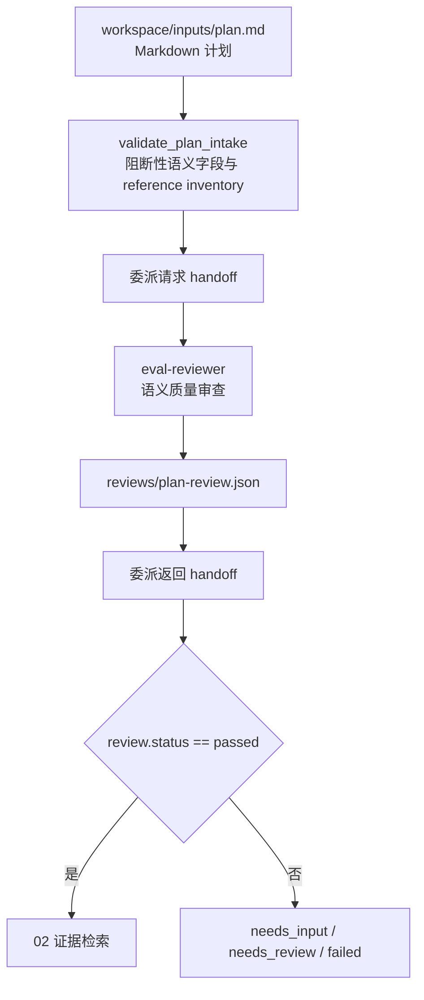

# 01 计划质量门禁 Schema 握手映射

本文是维护索引，不替代本阶段 spec、公共运行契约、JSON Schema 或确定性校验脚本。公共 handoff / stage / manifest 握手机制见 [`../public/references/handshake-common.md`](../public/references/handshake-common.md)。

GUI 默认生成无 YAML front matter 的 Markdown。确定性校验器兼容 GUI 默认模板的 `PLAN_TEXTBOX`/旧“用户填写内容区”、显式 `PLAN_INPUT` 区域和普通 Markdown；上传文件即使包含任意 front matter 也不按 metadata 阻断，只按语义内容实施质量门禁，不依赖固定章节标题。

## 握手流程

## 契约与调用表（阶段特有）

| 类型 | 契约、模板或接口 | 触发时机 | 生产者 → 消费者 | 校验与握手内容 | 失败处理 |
| --- | --- | --- | --- | --- | --- |
| 输入模板 | `src/GUI/ui/assets/template/plan.md` | 用户通过 GUI 建立计划时 | GUI → `plan.md` | 默认不生成 YAML front matter，保留 Markdown 结构并仅替换可编辑区域；上传内容在执行前只暂存，已有任意 front matter 原样保留 | 字段上限或输入标记非法时不进入执行 |
| 确定性脚本 | `harness/specs/01-plan-quality-gate/references/scripts/validation.py` | 计划审查前 | 主编排 Agent → `validate_plan_intake` | 第 2 节阻断性语义字段及不受 Git ignore 影响的用户资料 inventory；不校验 metadata，不要求固定章节标题或 `GAP-*` 字面量 | 返回 `needs_input` issues 与只读 `reference_inventory` |
| 计划审查 | `review.schema.json`（public） | 保存计划审查前 | `eval-reviewer` → 主编排 Agent | `review_type=plan`、`attempt=1`、稳定 issue ID；将自然语言检索任务写入 `retrievable_gaps`（由审查铸造 ID，不要求用户计划含 `GAP-*`）；请求 handoff 须携带完整 validator 结果 | schema 非法时不得通过阶段；缺少 `GAP-*` 字面量不得判 `needs_input` |

## 维护联动

- 计划 front matter 处理、章节或字段序列化变化时，同步更新阶段 spec、计划模板、GUI serializer、`validation.py` 及其正负例测试，并补真实模板序列化后的门禁回归。`GAP-*` 只属于审查/交接追踪，不要加回用户计划字面量门禁。
- review 字段或状态变化时，同时检查 02 的输入握手、平台 pipeline 和质量评价 artifact 覆盖。
- 本阶段只有 review 为 `passed` 才能向 02 交付计划和 review artifact。
