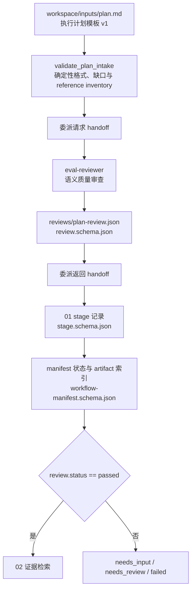

# 01 计划质量门禁 Schema 握手映射

本文是维护索引，不替代本阶段 spec、公共运行契约、JSON Schema 或确定性校验脚本。修改任何列出的资源时，应沿图和表同步核对上下游。

GUI 与阶段 01 共用 `lca_plan_input` v1 元数据契约。确定性校验器兼容 GUI 默认模板的 `PLAN_TEXTBOX`/旧“用户填写内容区”、显式 `PLAN_INPUT` 区域和普通 Markdown，并只按语义内容实施质量门禁，不依赖固定章节标题。

## 握手流程

## 契约与调用表

| 类型 | 契约、模板或接口 | 触发时机 | 生产者 → 消费者 | 校验与握手内容 | 失败处理 |
| --- | --- | --- | --- | --- | --- |
| 输入模板 | `src/GUI/ui/assets/template/plan.md` | 用户通过 GUI 建立计划时 | GUI → `plan.md` | 生成 `template_kind: lca_plan_input`、`template_version: 1`，保留模板结构并仅替换可编辑区域；上传内容在执行前只暂存 | 元数据、字段上限或输入标记非法时不进入执行 |
| 确定性脚本 | `harness/specs/01-plan-quality-gate/references/scripts/validation.py` | 计划审查前 | 主编排 Agent → `validate_plan_intake` | front matter、版本、阻断性语义字段、`GAP-*` 声明及不受 Git ignore 影响的用户资料 inventory；不要求固定章节标题 | 返回 `needs_input` issues 与只读 `reference_inventory` |
| 审查 schema | `harness/specs/public/references/schemas/review.schema.json` | 保存计划审查前 | `eval-reviewer` → 主编排 Agent | `review_type=plan`、`attempt=1`、稳定 issue ID、`retrievable_gaps` | schema 非法时不得通过阶段 |
| 交接 schema | `harness/specs/public/references/schemas/handoff.schema.json` | 委派 reviewer 前后 | 主编排 Agent ↔ `eval-reviewer` | 请求 handoff 携带完整 validator 结果和候选 reference paths；往返均记录输入 artifact/hash、决策、证据、未解决项、issue ID、下一动作 | 缺 inventory 时不得对用户资料作负向结论；保存受控停止证据 |
| 阶段 schema | `harness/specs/public/references/schemas/stage.schema.json` | 阶段开始与结束 | 主编排 Agent → `workspace/memory/stages/` | 阶段序号、Agent、状态、artifact、evidence、issue ID | 状态保持非 `passed` |
| 清单 schema | `harness/specs/public/references/schemas/workflow-manifest.schema.json` | 初始化及阶段状态变更 | 主编排 Agent → `workspace/memory/manifest.json` | 计划 SHA-256、当前阶段、状态、artifact 索引、issue ID | 置为 `needs_input`、`needs_review` 或 `failed` |

## 维护联动

- 计划 front matter、章节、字段序列化或 `GAP-*` 语义变化时，同步更新阶段 spec、计划模板、GUI serializer、`validation.py` 及其正负例测试，并补真实模板序列化后的门禁回归。
- review 字段或状态变化时，同时检查 02 的输入握手、平台 workflow adapter 和质量评价 artifact 覆盖。
- 本阶段只有 review 为 `passed` 才能向 02 交付计划、review artifact 及其 SHA-256。
