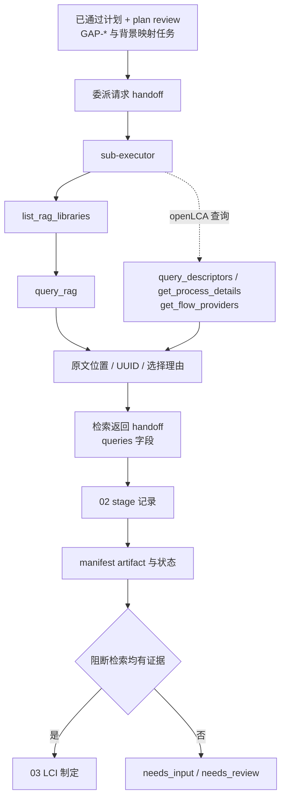

# 02 证据检索 Schema 握手映射

本文是维护索引，不替代本阶段 spec、公共运行契约、知识检索规则或 MCP 运行时 schema。

## 握手流程

## 契约与调用表

| 类型 | 契约、规则或接口 | 触发时机 | 生产者 → 消费者 | 校验与握手内容 | 条件/失败处理 |
| --- | --- | --- | --- | --- | --- |
| 输入审查 | `harness/specs/public/references/schemas/review.schema.json` | 进入阶段前 | 01 → 02 | 只接收 `review_type=plan` 且 `status=passed` 的审查及其中 `retrievable_gaps` | 不满足则不得进入 02 |
| 交接 schema | `harness/specs/public/references/schemas/handoff.schema.json` | 委派检索前后 | 主编排 Agent ↔ `sub-executor` | 输入 artifact/hash、`queries`、候选、选择理由、来源位置、未解决项和 issue ID | 未解决阻断项转受控停止 |
| RAG 规则 | `harness/rules/knowledge-retrieval/README.md` | 查询用户资料、标准或手册时 | 平台/Agent → RAG 调用 | library 白名单、先列库、命中回读原文、记录定位字段 | 配置/数据库错误不得当作无结果 |
| MCP schema | `list_rag_libraries()` | 首次访问目标知识库前 | `query_rag` MCP → `sub-executor` | `available`、`status`、chunks、embedding model、build ID | 目标库不可用时保存错误 |
| MCP schema | `query_rag(query, libraries, n_results, max_distance)` | 每个 RAG 检索任务 | `sub-executor` → `query_rag` MCP | 非空查询、library 白名单、数量/距离范围；结果需回读来源 | 空结果保留为未解决，不编造 |
| openLCA 规则 | `harness/rules/openlca-operation/README.md` | 任务包含数据库候选时 | `sub-executor` → openLCA MCP | 活动数据库、正式 UUID 查询和只读边界 | 条件加载 |
| MCP schema | `health_check()`、`query_descriptors(...)`、`get_process_details(...)`、`get_flow_providers(...)` | 查询 Process/Flow/Product System/Impact Method 候选、Process 定量参考及 Flow 的可用 Provider | `sub-executor` ↔ `control_openlca` MCP | entity type、查询词、分页、名称、UUID、分类、地域、定量参考、Flow-Provider 引用和查询时间 | IPC/数据库错误转未解决项 |
| 阶段 schema | `harness/specs/public/references/schemas/stage.schema.json` | 阶段开始与结束 | 主编排 Agent → stages | 状态、证据 handoff、artifact 和 issue ID | 非通过状态停止推进 |
| 清单 schema | `harness/specs/public/references/schemas/workflow-manifest.schema.json` | 保存检索证据后 | 主编排 Agent → manifest | artifact 索引、当前阶段、状态和 issue ID | `needs_input` 或 `needs_review` |

## 维护联动

- MCP 参数以服务暴露的运行时 schema 为准；工具签名变化时同步更新规则、workflow adapter、本映射和工具测试。
- `handoff.queries` 字段变化会同时影响知识检索规则、03/04 的证据消费和质量评价追踪。
- 只有所有阻断检索均有可追踪证据，才把 handoff artifact 交给 03。
