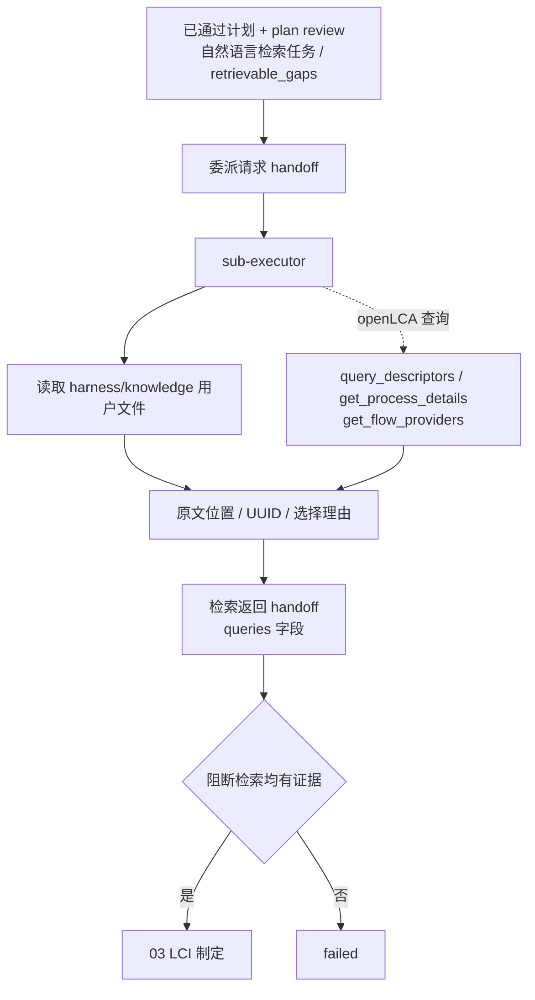

# 02 证据检索 Schema 握手映射

本文是维护索引，不替代本阶段 spec、公共运行契约、LCA 知识规则或 MCP 运行时 schema。公共 handoff / stage / manifest 握手机制见 [`../public/references/handshake-common.md`](../public/references/handshake-common.md)。

## 握手流程

## 契约与调用表（阶段特有）

| 类型 | 契约、规则或接口 | 触发时机 | 生产者 → 消费者 | 校验与握手内容 | 条件/失败处理 |
| --- | --- | --- | --- | --- | --- |
| 输入审查 | `review.schema.json`（public） | 进入阶段前 | 01 → 02 | 只接收 `review_type=plan` 且 `status=passed` 的审查；`retrievable_gaps` 可为空，检索任务还可来自计划自然语言 | review 非通过时不得进入 02 |
| 检索交接 | handoff `queries` 字段 | 委派检索前后 | 主编排 Agent ↔ `sub-executor` | 候选、选择理由、来源位置、未解决项和 issue ID | 未解决阻断项转受控停止 |
| 知识规则 | `harness/rules/lca-knowledge/README.md` | 查询用户资料或方法条款时 | 平台/Agent → 直接读文件 | 只读 `harness/knowledge/`；禁止 `query_rag`；记录路径与章节/行号 | 文件缺失保留为未解决，不编造 |
| openLCA 规则 | `harness/rules/openlca-operation/README.md` | 任务包含数据库候选时 | `sub-executor` → openLCA MCP | 活动数据库、正式 UUID 查询、只读边界；可留档的匹配决定自行选择并留档 | 条件加载；匹配决定不得转为 `failed`；同类活动不存在时 `failed` 并写明原因 |
| MCP schema | `health_check()`、`query_descriptors(...)`、`get_process_details(...)`、`get_flow_providers(...)` | 查询 Process/Flow/Product System/Impact Method 候选 | `sub-executor` ↔ `control_openlca` MCP | 连接门禁后记录 entity type、查询词、UUID、地域、定量参考、Flow-Provider 引用和查询时间 | 连接失败按公共运行契约停止 |

## 维护联动

- MCP 参数以服务暴露的运行时 schema 为准；工具签名变化时同步更新规则、pipeline、本映射和工具测试。
- `handoff.queries` 字段变化会同时影响知识规则、03/04 的证据消费和质量评价追踪。
- 只有所有阻断检索均有可追踪证据，才把 handoff artifact 交给 03。
