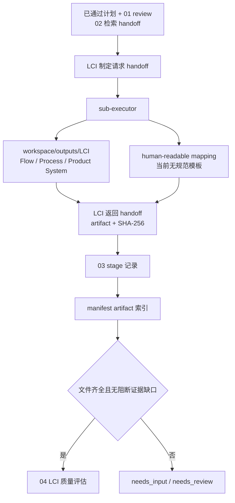

# 03 LCI 制定 Schema 握手映射

本文是维护索引，不替代本阶段 spec 或公共运行契约。

> 当前仓库没有可定位的 LCI Flow、Process、Product System JSON schema，也没有规范所称的映射报告模板。本阶段只能按 spec 约束产物和追踪关系；维护者不得在映射中虚构模板路径。

## 握手流程

## 契约与调用表

| 类型 | 契约或产物 | 触发时机 | 生产者 → 消费者 | 校验与握手内容 | 失败/缺口处理 |
| --- | --- | --- | --- | --- | --- |
| 输入审查 | `harness/specs/public/references/schemas/review.schema.json` | 进入阶段前 | 01 → 03 | 计划已通过、可检索缺口已列明 | review 非通过时不得进入 |
| 输入交接 | `harness/specs/public/references/schemas/handoff.schema.json` | 建立 LCI 前 | 02 → 03 | 查询、原文位置、UUID、选择理由、未解决项和输入 hashes | 阻断证据缺口停止 |
| 请求/返回交接 | `harness/specs/public/references/schemas/handoff.schema.json` | 委派制定前后 | 主编排 Agent ↔ `sub-executor` | 允许写入的 LCI 范围、输入/输出 artifact、来源 artifact ID、SHA-256、证据和下一动作 | 不接受未登记产物 |
| LCI 产物 | `workspace/outputs/LCI/` | 执行 Agent 制定时 | `sub-executor` → 04/05 | `flows/`、`processes/`、`product_systems/` 一文件一实体；exchange 使用布尔 `isInput`，前景输入使用 `defaultProvider`；Product System 使用 auto-link、默认 Provider 和 `expectedProcessIds`；映射报告为 `human_readable_mapping.md` | 聚合容器、错误方向字段、缺失前景 Provider、explicit 拓扑、缺少实体类型或重复 UUID 均失败 |
| 确定性校验 | `references/scripts/validation.py` | 03 完成及每轮 04 审查前 | 执行 Agent / reviewer | 调用共享 `validate_lci_directory`，返回实体计数、hash、exchange 方向、Provider-Flow 一致性、auto-link 契约和错误 | `ok!=true` 不得进入预检 |
| 阶段 schema | `harness/specs/public/references/schemas/stage.schema.json` | 阶段开始与结束 | 主编排 Agent → stages | 状态、LCI artifact IDs、evidence refs、issue IDs | 非通过状态不进入 04 |
| 清单 schema | `harness/specs/public/references/schemas/workflow-manifest.schema.json` | LCI artifact 登记时 | 主编排 Agent → manifest | 每个产物的 kind、路径、hash、来源和 revision 关系 | 无法追踪时停止 |

## 维护联动

- 后续若新增 LCI JSON schema 或映射模板，应放在本阶段 `references/` 下，并同步 04 审查、05 预检、MCP 导入校验、质量 rubric 和本映射。
- 规范 LCI 仍写入 `workspace/outputs/LCI/`；连续改进运行如需转换，只能把完整兼容副本放在 `workspace/tmp/` 的具体子目录。路径门禁变化必须同步 05/06、openLCA 规则和工具测试。
- 本阶段通过仅表示材料可审查，不表示质量审查通过或允许写入 openLCA。
