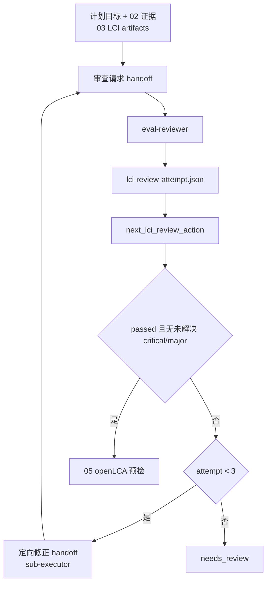

# 04 LCI 质量评估 Schema 握手映射

本文是维护索引，不替代本阶段 spec、review schema 或确定性审查轮次校验器。公共 handoff / stage / manifest 握手机制见 [`../public/references/handshake-common.md`](../public/references/handshake-common.md)。

## 握手流程

## 契约与调用表（阶段特有）

| 类型 | 契约、脚本或产物 | 触发时机 | 生产者 → 消费者 | 校验与握手内容 | 失败处理 |
| --- | --- | --- | --- | --- | --- |
| 输入交接 | 02/03 handoff + LCI artifacts | 每轮审查前 | 02/03/修正 Agent → reviewer | 计划、检索证据、LCI artifacts/hashes、布尔 `isInput`、前景 `defaultProvider`、auto-link 拓扑、历史 issue IDs | 输入不可追踪或连接元数据不完整时不通过 |
| LCI 审查 | `review.schema.json`（public） | 每轮 reviewer 返回后 | `eval-reviewer` → 主编排 Agent | `review_type=lci`、attempt 1–3、稳定 `LCI-*` issue、状态和修正要求 | schema 非法不得进入下一动作 |
| 轮次脚本 | `harness/specs/04-lci-quality-evaluation/references/scripts/validation.py` | 每轮 review 持久化后 | 主编排 Agent → `next_lci_review_action` | passed → 05；attempt 1/2 失败 → 定向修正；attempt 3 失败 → 停止 | 非法 attempt 抛错并保存失败证据 |
| 修正交接 | handoff（定向修正） | attempt 1/2 未通过时 | 主编排 Agent ↔ `sub-executor` | 仅交付未解决 issue ID 与受影响 artifacts；返回 revision/hash | 禁止无关重写或第 4 轮 |

## 维护联动

- review attempt 上限或状态转换变化时，同步阶段 spec、`validation.py`、pipeline 和正负例测试。
- 03 将来新增 LCI schema/template 后，必须纳入本阶段审查依据和映射表。
- 只有 `passed` 且无未解决 `critical`/`major` issue 才能向 05 交付。
