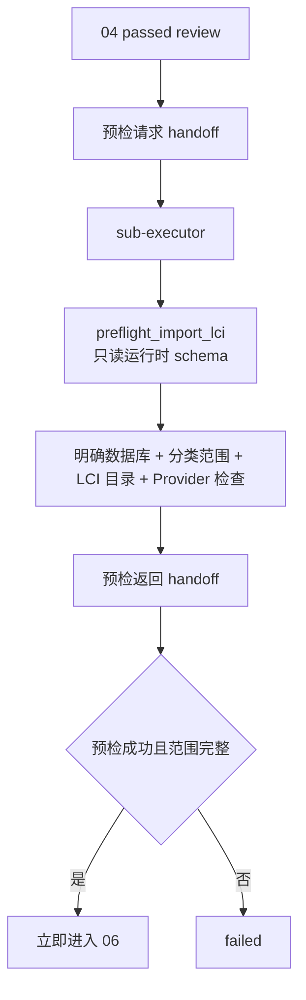

# 05 openLCA 写入预检 Schema 握手映射

本文是维护索引，不替代本阶段 spec、openLCA 操作规则或 MCP 运行时 schema。公共 handoff / stage / manifest 握手机制见 [`../public/references/handshake-common.md`](../public/references/handshake-common.md)。

> 当前预检结果没有独立文件型 JSON Schema。结构以 `preflight_import_lci` 暴露的运行时 schema 和原始返回为准，并通过 handoff、stage、manifest `import_scope` 与 checklist 保存证据。

## 握手流程

## 契约与调用表（阶段特有）

| 类型 | 契约、规则或接口 | 触发时机 | 生产者 → 消费者 | 校验与握手内容 | 失败处理 |
| --- | --- | --- | --- | --- | --- |
| 输入审查 | `review.schema.json`（public） | 进入阶段前 | 04 → 05 | review 为 `passed`，且无未解决 critical/major issue | 不满足则禁止预检 |
| 预检交接 | handoff + `import_scope` | 委派预检前后 | 主编排 Agent ↔ `sub-executor` | LCI artifacts、明确数据库、目标分类、LCI 目录、Provider 检查、完整范围 | 原始返回不完整时失败 |
| 操作规则 | `harness/rules/openlca-operation/README.md` | 调用 MCP 前 | Agent → tool 调用 | 规范 LCI 目录、只读预检和禁止额外确认 | 路径逃逸或规则冲突时停止 |
| MCP schema | `preflight_import_lci(lci_dir, target_category, database_name)` | LCI review 通过后 | `sub-executor` ↔ `control_openlca` MCP | 数据库访问前复核 LCI 连接元数据；返回库名、分类、LCI 目录、计划实体和 Provider 检查 | LCI 连接元数据非法返回 `invalid_lci`；身份缺失、Provider 不存在或不输出 Flow置 `failed` |

## 维护联动

- `preflight_import_lci` 参数或返回结构变化时，同步 openLCA 规则、05/06 spec、workflow、工具测试和本映射。
- 若新增持久化预检报告，应把 schema 放入本阶段 `references/schemas/`，并同步质量评价 artifact 覆盖。
- 05 成功后必须立即把完全相同的 `import_scope` 交给 06；库名、分类或 LCI 目录变化时拒绝写入。
