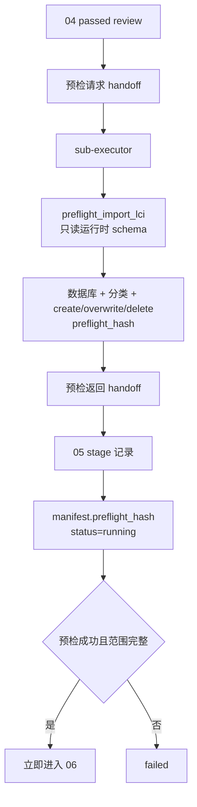

# 05 openLCA 写入预检 Schema 握手映射

本文是维护索引，不替代本阶段 spec、openLCA 操作规则或 MCP 运行时 schema。

> 当前预检结果没有独立文件型 JSON Schema。结构以 `preflight_import_lci` 暴露的运行时 schema 和原始返回为准，并通过 handoff、stage 与 manifest 保存证据和 `preflight_hash`。

## 握手流程

## 契约与调用表

| 类型 | 契约、规则或接口 | 触发时机 | 生产者 → 消费者 | 校验与握手内容 | 失败处理 |
| --- | --- | --- | --- | --- | --- |
| 输入审查 | `harness/specs/public/references/schemas/review.schema.json` | 进入阶段前 | 04 → 05 | review 为 `passed`，且无未解决 critical/major issue | 不满足则禁止预检 |
| 交接 schema | `harness/specs/public/references/schemas/handoff.schema.json` | 委派预检前后 | 主编排 Agent ↔ `sub-executor` | LCI artifacts/hashes、活动数据库、目标分类、完整范围、preflight hash、下一动作 | 原始返回不完整时失败 |
| 操作规则 | `harness/rules/openlca-operation/README.md` | 调用 MCP 前 | Agent → tool 调用 | 固定 LCI 目录、活动 endpoint、只读预检和禁止额外确认 | 规则冲突时停止 |
| MCP schema | `preflight_import_lci(lci_dir, target_category, database_name)` | LCI review 通过后 | `sub-executor` ↔ `control_openlca` MCP | 校验 LCI、数据库和分类，返回 create/overwrite/delete 范围及稳定 hash | 工具错误或范围不完整置 `failed` |
| 阶段 schema | `harness/specs/public/references/schemas/stage.schema.json` | 预检开始与结束 | 主编排 Agent → stages | 原始预检 evidence、artifact、issue 和状态 | 非通过状态停止 |
| 清单 schema | `harness/specs/public/references/schemas/workflow-manifest.schema.json` | 预检成功后 | 主编排 Agent → manifest | 保存当前 64 位小写 SHA-256 `preflight_hash`，状态保持 `running` | 不设置 `awaiting_confirmation` |

## 维护联动

- `preflight_import_lci` 参数或返回结构变化时，同步 openLCA 规则、05/06 spec、workflow adapter、工具测试和本映射。
- 若新增持久化预检报告，应把 schema 放入本阶段 `references/schemas/`，并同步质量评价 artifact 覆盖。
- 05 成功后必须立即把完全相同的范围与 hash 交给 06；任何变化都使旧 hash 失效。
