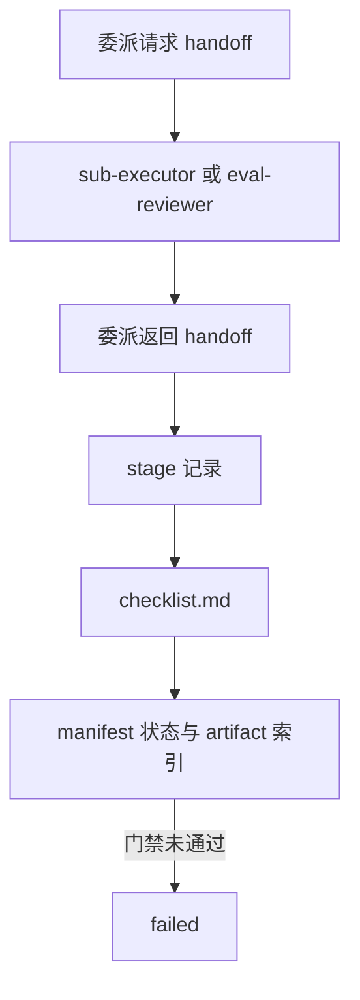

# Whole-LCA 公共握手契约

本文定义所有编号阶段共用的 Agent 交接、阶段记录、清单与审查 schema 模式。各阶段 `schema_mapping.md` 只记录**阶段特有**的输入、产物、工具与门禁；修改公共字段时同步更新本文、`workflow-runtime-spec.md` 与对应 JSON schema。

阶段专属 schema、模板与 `validation.py` 仍保存在各 `harness/specs/01-*`–`08-*` 包中。

## 公共握手流程

每次委派前后在 `workspace/memory/handoffs/` 写入 handoff；阶段开始与结束时写入 `workspace/memory/stages/`；人读清单写入 `workspace/memory/checklist.md`；运行状态与 artifact 索引写入 `workspace/memory/manifest.json`。同一次运行内不得覆盖历史 stage、review 或 handoff 记录。

## 公共契约表

| 类型 | 契约 | 路径 | 生产者 → 消费者 | 核心内容 |
| --- | --- | --- | --- | --- |
| 交接 | handoff | `harness/specs/public/references/schemas/handoff.schema.json` | 主编排 Agent ↔ `sub-executor` / `eval-reviewer` | 输入 artifact 路径、决策、依据、资料/工具、未解决项、状态、下一动作、issue IDs |
| 阶段 | stage | `harness/specs/public/references/schemas/stage.schema.json` | 主编排 Agent → `workspace/memory/stages/` | 阶段 ID、Agent、状态（`running`/`passed`/`failed`）、失败时必填 `summary`、`basis`、`sources`、artifact、evidence、issue IDs |
| 清单 | workflow manifest | `harness/specs/public/references/schemas/workflow-manifest.schema.json` | 主编排 Agent → `workspace/memory/manifest.json` | 计划 artifact、当前阶段、状态（运行中 `not_started`/`running`，终止 `failed`/`completed`）、终止时必填 `status_reason`、`import_scope`、`lci_review_attempt`、`artifact_index` |
| 人读清单 | checklist | `harness/specs/public/references/templates/checklist.md` | 主编排 Agent → `workspace/memory/checklist.md` | 每阶段状态、依据、资料/工具、产物路径 |
| 审查 | review | `harness/specs/public/references/schemas/review.schema.json` | `eval-reviewer` → 主编排 Agent | `review_type`（plan/lci）、attempt、`passed`/`failed`、失败时必填 `summary`、issues、`retrievable_gaps`、reviewed artifacts |

共享 artifact 与 source 字段定义：`harness/specs/public/references/schemas/common.schema.json`。不要在记忆或清单中记录 SHA-256。

## 维护联动

- handoff、stage、manifest、review 或 checklist 字段变化时，同步更新公共 JSON schema、本文件、`workflow-runtime-spec.md`、受影响阶段 mapping 与 `harness/specs/public/references/scripts/tests/`。
- Revise-LCA 使用 `harness/specs/08-lca-revise-workflow/references/schemas/workflow-manifest.schema.json`（含 `feedback`/`baseline`），handoff/stage/review 仍使用上表 public schema。
